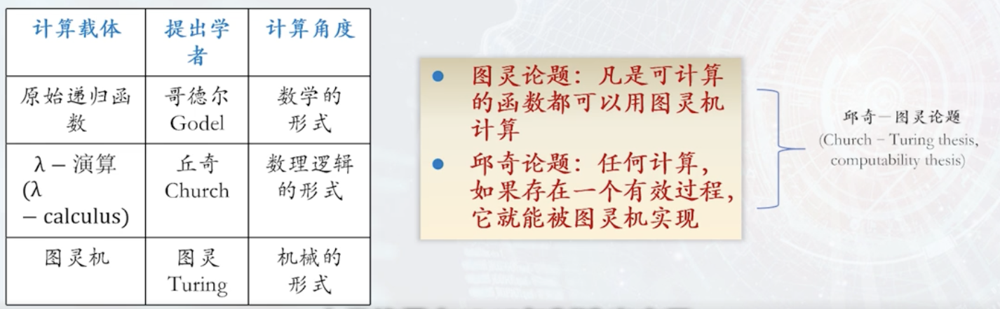

# 人工智能概述
## 可计算思想
哥德尔不完全性定理：任何表达力足够强的（递归可枚举）形式系统都不可能同时具有一致性和完备性。  

图灵机模型  

图灵测试无法作为智能测试的手段。  

!!! note"课后题"
    请给出12+8这一问题在图灵机上的执行步骤

## 智能计算方法
### 人工智能分类
1.领域人工智能：依葫芦画瓢，任务导向，如Deep Blue和AlphaGo  
2.通用人工智能/强人工智能/跨领域人工智能：举一反三、从经验中学习，如“人类”智能  
3、混合增强人工智能：多种智能体的混合形式，如外骨骼机器人，人工智能+机器智能-如达芬奇外科手术机器人，人、机、物、网智能-智慧城市  

### 人工智能发展中的主流方法

* 符号主义人工智能为核心的逻辑推理  
    * IBM“沃森”的推理
* 数据驱动为核心的机器学习
* 探索与利用为核心的强化学习
    * 自监督。机器人、无人驾驶汽车

!!! note"课后思考"
    比较优劣

!!! note"人机a笔记"
    * 符号主义学派（逻辑主义学派）
        人类认知和思维的基本单元是符号，认知过程是建立在符号表示基础上的一种符号运算
    * 行为主义
        * 构建一个类人或机器智能体，并关注智能体在环境中的行为。行为主义学派强调模拟人的行为，与外界环境交互决策行动，研究类人机器或机器人  
        * 1.强化学习（deepseek、alphago）2.Q-learning和策略梯度方法  
        * 游戏ai、机器人控制、自动驾驶  
    * 联结主义学派（仿生学派、生理学派）
        * 理解认知过程的理论框架，目标是实现模拟人脑的结构、人脑的思维，让机器人模拟人脑能够感知、识别、判断  
        * 深度学习。神经元（m-p）模型、神经网络感知器、卷积神经网络、反向传播算法、神经网络  
        * 人脸识别、gpt、sora、机器翻译、图像分类  

## 人工智能的历史进展
* 1956 达特茅斯会议
    * 首次提出人工智能，现代人工智能元年
* 三次低谷
    * 第一次：1973英国发表James Lightthill报告，取消机器人的研究，AI开始了严冬
    * 第二次：日本智能（第五代）计算机研究失败
    * 第三次：知识词典日趋势微、网络百科兴起

