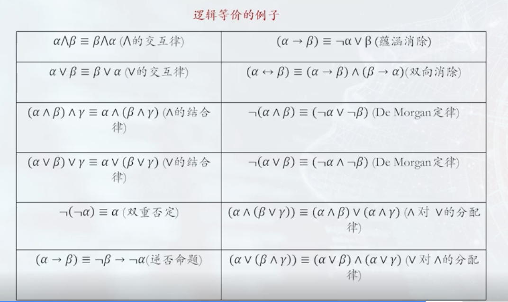
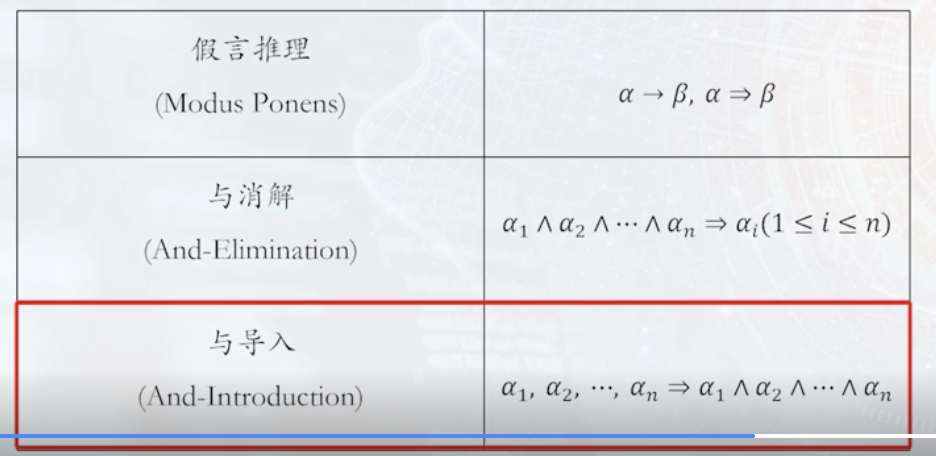
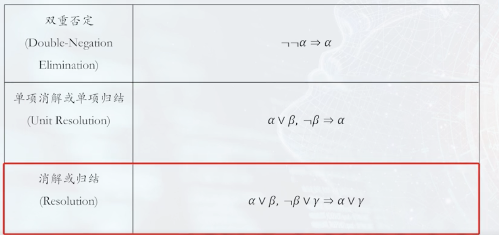
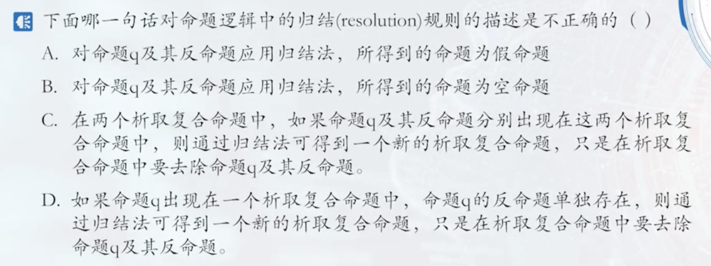
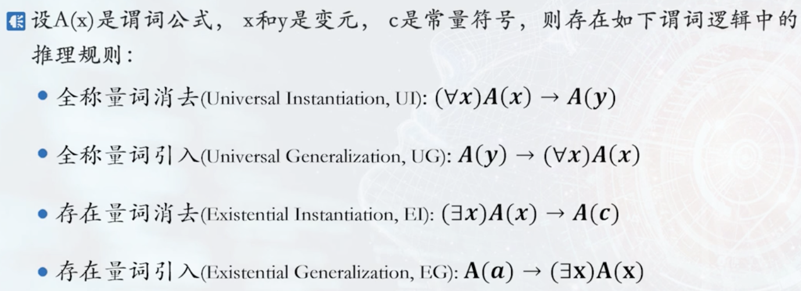
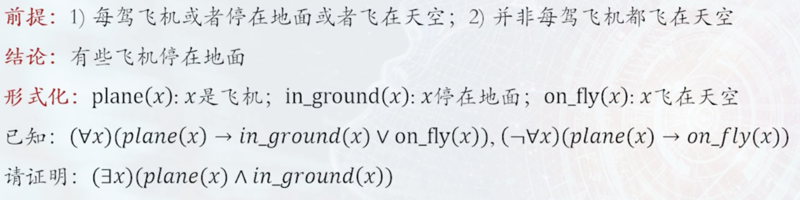

# 逻辑与推理
## 命题逻辑
命题逻辑是应用一套形式化规则对以符号表示的描述性陈诉进行推理的系统。   
原子命题：指不包含其他命题作为其组成部分的命题，又称简单命题。  
复合命题：指包含其他命题作为其组成部分的命题。可通过命题联结词对已有命题进行组合，得到新命题。  
主要的命题连接词：与、或、非、条件、双向条件。  
逻辑等价，用三条横线表示。  

蕴涵消除（implication elimination）是命题逻辑中的一种基本推理规则。它的逻辑形式是：  
$P \rightarrow Q \;\;\equiv\;\; \lnot P \lor Q$
也就是说，一个“如果……那么……”形式的命题，可以转化为“要么前件不成立，要么后件成立”。  
举例：  
命题：如果今天下雨，那么我带伞。  
用符号表示：$R \rightarrow U$  
根据蕴涵消除：    
$R \rightarrow U \equiv \lnot R \lor U$  
含义：要么今天不下雨，要么我带伞。  

命题逻辑中的推理规则  

范式是把命题公式归为一种标准的形式，范式最大的作用是可以进行两个命题的等价判定。  

* 范式
    * 析取范式：有限个简单合取式构成的析取式为析取范式
    * 有限个简单析取式构成的合取式称为合取范式

一个析取范式是不成立的，当且仅当它的每个简单合取式都不成立。  
一个合取范式是成立的，当且仅当它的每个简单析取式都是成立的。  

## 谓词逻辑
命题逻辑不能表达局部与整体、一般与个别的关系。  

核心概念：  
个体：指所研究领域中可以独立存在的具体或抽象的概念。  
谓词：用来刻画个体属性或者描述个体之间关系存在性的元素，其值为真或假。  

!!! note
    函数与谓词的区别  
    函数中个体变元用个体变量代入后结果仍是个体（值域）  
    谓词中个体变元用个体常量带入后就变成了命题，如car(x)(x是车)这个谓词中x用吉普车代替，则car(吉普车)是命题  

量词：  
分为全称量词（$\forall$）和存在量词（$\exists$）  

约束变元：在量词的约束条件下的变元  
自由变元：不在约束下  

项与原子谓词公式  
项是描述对象的逻辑表达式，被递归地定义为：  

* 常量符号和变量符号是项
* 若f(x1,x2,...,xn)是n元函数符号，t1,t2，...，tn是项，则f(t1,t2,,...,tn)是项;
* 有限次地使用上述规则产生的符号串是项

原子谓词公式：  
若P(x1,x2,...,xn)是n元谓词，t1，t2，...，tn是项，则称P(t1,t2,...,tn)是原子谓词公式，简称原子公式。 

合式公式（谓词公式）:  
是由逻辑连词和原子公式构成的用于陈述事实的复杂语句  

推理规则: 

构建专家系统  

## 知识图谱推理
知识图谱可视为包含多种关系的图，每个节点是实体，连线是关系。  

归纳逻辑程序设计（ILP）算法  
ILP使用一节谓词逻辑进行知识表示，通过修改和扩充逻辑表达式对现有知识归纳，完成推理任务。  
作为ILP的代表性方法，FOIL通过序贯覆盖实现规则推理  

