# 逻辑与推理
## 命题逻辑
命题逻辑是应用一套形式化规则对以符号表示的描述性陈诉进行推理的系统。   
原子命题：指不包含其他命题作为其组成部分的命题，又称简单命题。  
复合命题：指包含其他命题作为其组成部分的命题。可通过命题联结词对已有命题进行组合，得到新命题。  
主要的命题连接词：与、或、非、条件、双向条件。  
逻辑等价，用三条横线表示。  

蕴涵消除（implication elimination）是命题逻辑中的一种基本推理规则。它的逻辑形式是：  
$P \rightarrow Q \;\;\equiv\;\; \lnot P \lor Q$
也就是说，一个“如果……那么……”形式的命题，可以转化为“要么前件不成立，要么后件成立”。  
举例：  
命题：如果今天下雨，那么我带伞。  
用符号表示：$R \rightarrow U$  
根据蕴涵消除：    
$R \rightarrow U \equiv \lnot R \lor U$  
含义：要么今天不下雨，要么我带伞。  

命题逻辑中的推理规则  

范式是把命题公式归为一种标准的形式，范式最大的作用是可以进行两个命题的等价判定。  

* 范式
    * 析取范式：有限个简单合取式构成的析取式为析取范式
    * 有限个简单析取式构成的合取式称为合取范式

一个析取范式是不成立的，当且仅当它的每个简单合取式都不成立。  
一个合取范式是成立的，当且仅当它的每个简单析取式都是成立的。  

## 谓词逻辑
命题逻辑不能表达局部与整体、一般与个别的关系。  

核心概念：  
个体：指所研究领域中可以独立存在的具体或抽象的概念。  
谓词：用来刻画个体属性或者描述个体之间关系存在性的元素，其值为真或假。  

!!! note
    函数与谓词的区别  
    函数中个体变元用个体变量代入后结果仍是个体（值域）  
    谓词中个体变元用个体常量带入后就变成了命题，如car(x)(x是车)这个谓词中x用吉普车代替，则car(吉普车)是命题  

量词：  
分为全称量词（$\forall$）和存在量词（$\exists$）  

约束变元：在量词的约束条件下的变元  
自由变元：不在约束下  

项与原子谓词公式  
项是描述对象的逻辑表达式，被递归地定义为：  

* 常量符号和变量符号是项
* 若f(x1,x2,...,xn)是n元函数符号，t1,t2，...，tn是项，则f(t1,t2,,...,tn)是项;
* 有限次地使用上述规则产生的符号串是项

原子谓词公式：  
若P(x1,x2,...,xn)是n元谓词，t1，t2，...，tn是项，则称P(t1,t2,...,tn)是原子谓词公式，简称原子公式。 

合式公式（谓词公式）:  
是由逻辑连词和原子公式构成的用于陈述事实的复杂语句  

推理规则: 

构建专家系统  

## 知识图谱推理
知识图谱可视为包含多种关系的图，每个节点是实体，连线是关系。  

归纳逻辑程序设计（ILP）算法  
ILP使用一节谓词逻辑进行知识表示，通过修改和扩充逻辑表达式对现有知识归纳，完成推理任务。  
作为ILP的代表性方法，FOIL（一阶归纳算子）通过序贯覆盖实现规则推理  

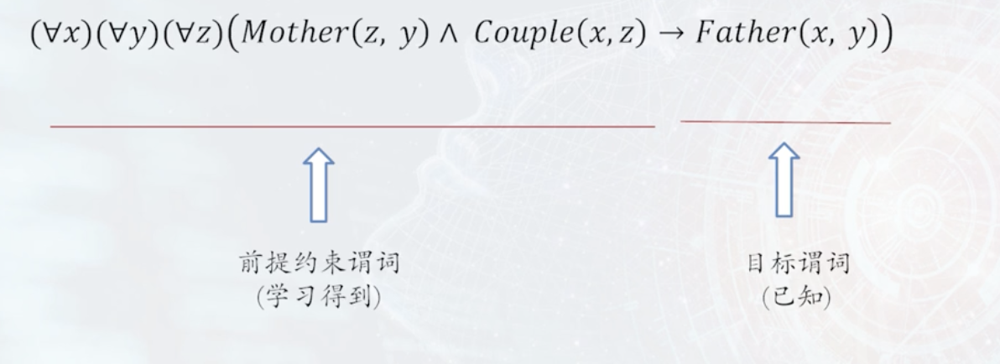
目标谓词是需要推断规则的结论，也称为规则头，在给定推理结论后，FOIL算法学习得到使结论满足的前提条件，即目标谓词作为结论的推理规则。为学习推理规则，需要构造目标谓词的训练样例，训练样例中包括正例集合和反例集合  
推理思路：从一般到特殊，逐步给目标谓词添加前提约束谓词，直到所构成的推理规则不覆盖任何反例。    

FOIL信息增益

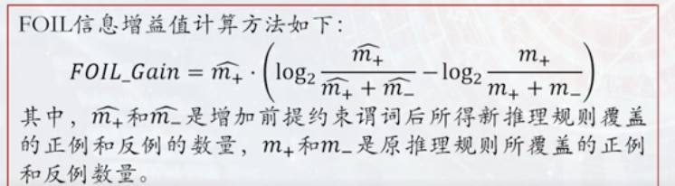

依次将谓词加入到推理规则中作为前提约束谓词，并计算所得到新推理规则的FOIL增益值。基于计算所得FOIL增益值来选择最佳前提约束谓词。  

!!! note
    eg在gn

路径排序算法（PRA）的基本思想是将实体之间的关联路径作为特征，来学习目标关系的分类器，工作流程：

* 特征抽取
* 特征计算
* 分类器训练

## 因果推理
### 因果推理基本概念
因果关系：“引起和被引起”的关系  

辛普森悖论：在总体样本上成立的某种关系在分组样本中恰好相反。  

因果推理的主要模型：  

#### 结构因果模型（SCM）（因果模型，Neyman-Rubin因果模型）
由两组变量集合U和V以及一组函数f组成，其中f是根据模型中其他变量取值而给V中每一个变量赋值的函数  

结构因果模型中的原因：如果变量X出现在给Y赋值的函数中，则称X是Y的直接原因。如果X是Y的直接原因或者其他原因，均称X是Y的原因。  

U中的变量被称为外生变量，V中变量成为外生变量，每个内生变量至少是一个外生变量的后代，而每一个外生变量都不是其他外生变量或内生变量的后代。  

每个结构因果模型M都与一个因果图G相对应。因果图中的节点是结构因果模型中U和V所包括的变量，节点之间的边表示函数f。在M中，若变量X的函数fx包含了变量Y，则在G中有一条从Y到X的有向边。  

#### 因果图-有向无环图
因果图中的原因：若变量Y是另一个变量X的孩子，则X是Y的直接原因，若Y是X的后代，则X是Y的潜在原因。  

因果图中联合概率分布：  

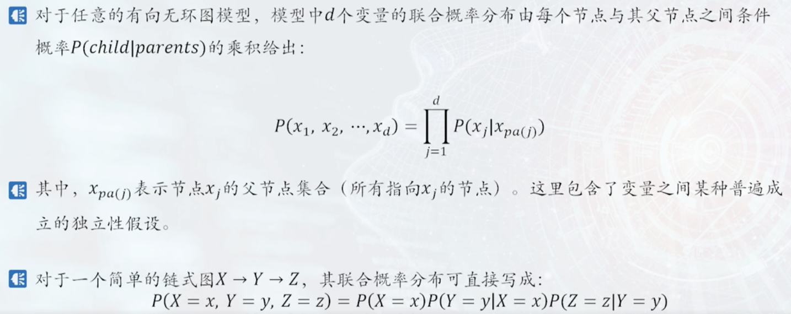  

### 因果图结构 
#### 链结构
基本结构，包含三个节点两条边，其中一条边由第一个节点指向第二个节点，另一条边由第二个节点指向第三个节点。  

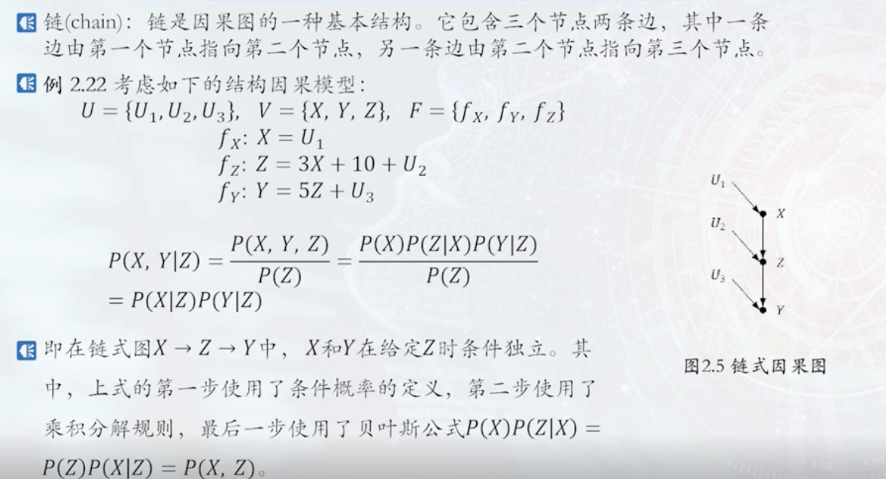

定理（链中的条件独立性）：  
对于变量X和Y，若X和Y之间只有一条单向的路径，变量Z是截断该路径的集合中的任一变量，则在给定Z时，X和Y条件独立。  

#### 分连
包括三个节点两条边，两条边分别由第一个节点指向第二个节点和第三个节点

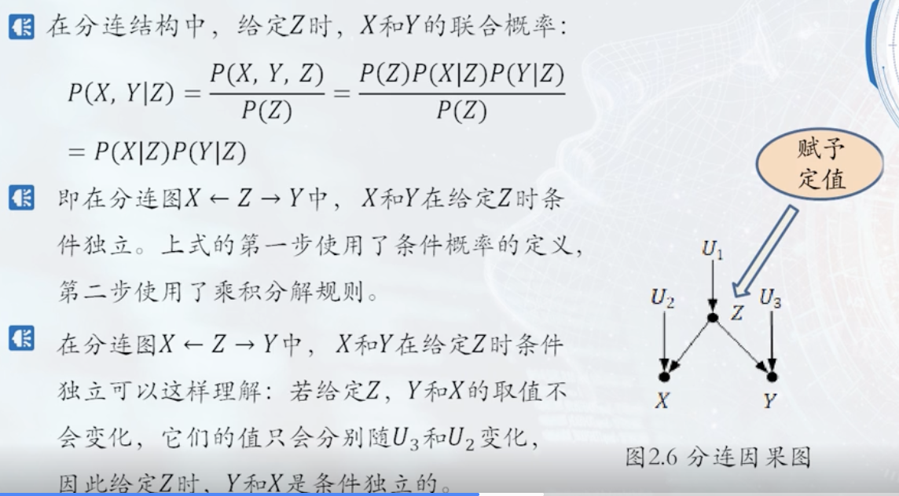

分连中的条件独立性：  
若变量Z是变量X和Y的共同原因，且X到Y只有一条路径，则在给定Z时，X和Y条件独立。  

#### 汇连
又叫碰撞，包含三个节点两条边，两条边分别由第一个节点和第二个节点指向第三个节点  

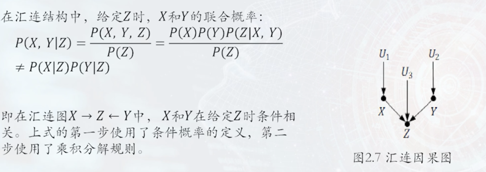  

汇连中的条件独立性:  
若Z时变量X和Y的汇连节点，且X到Y只有一条路径，则X和Y相互独立，但在给定Z或Z的后代时，X和Y是相关的。  

#### D-分离
判断任一两个节点的相关性和独立性。若存在一条路径将这两个节点直接连通，则称这两个节点是有向连接的，即这两个节点是相关的；若不存在这样的路径将这两个节点连通，则这两个节点不是有向连接的，则称这两个节点是有向分离的（d-separated），即这两个节点相互独立。  

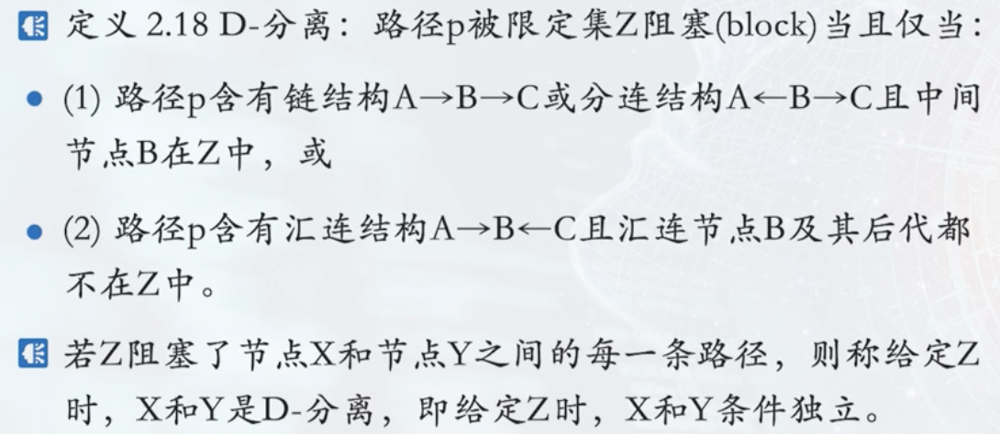  

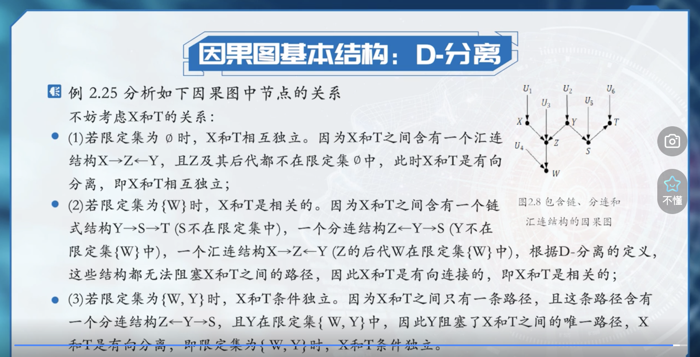

### 因果反事实模型
#### 干预的因果效应
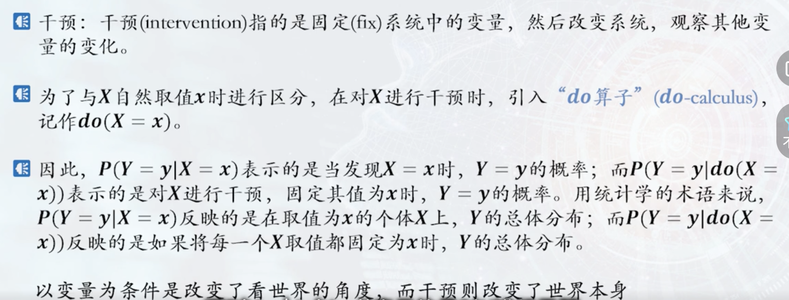

#### 因果效应差
因果效应差/平均因果效应  

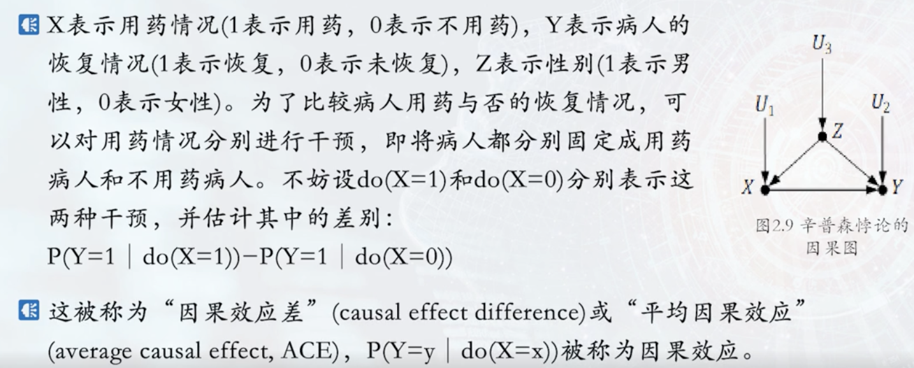

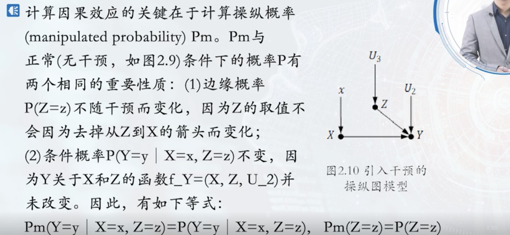

调整公式  

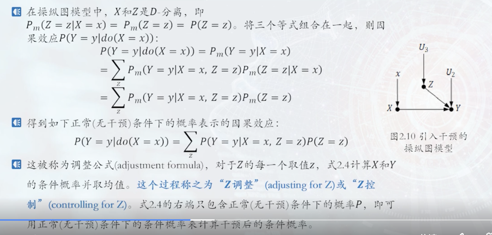
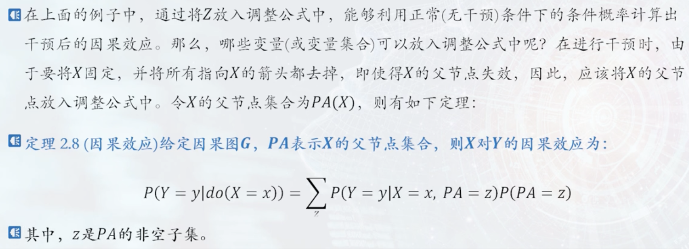

#### 反事实模型
它关注的问题是：“如果当初没有发生某件事（或换一种做法），结果会怎样？”  

笑死，根本听不懂，😄  

干预计算的是概率，反事实记录的是值  

步骤：  
溯因、动作、预测。  

