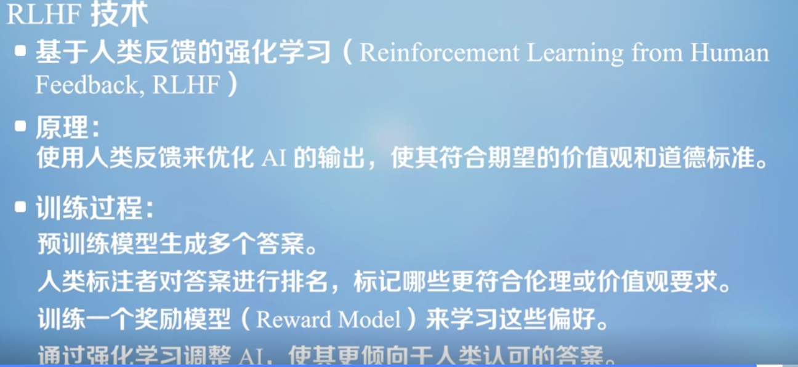
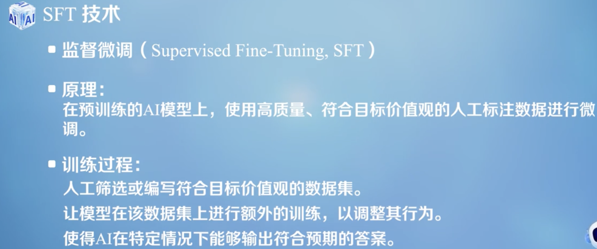
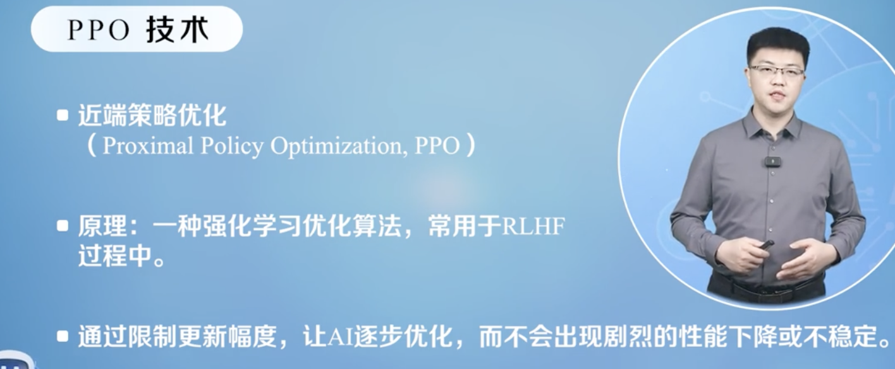
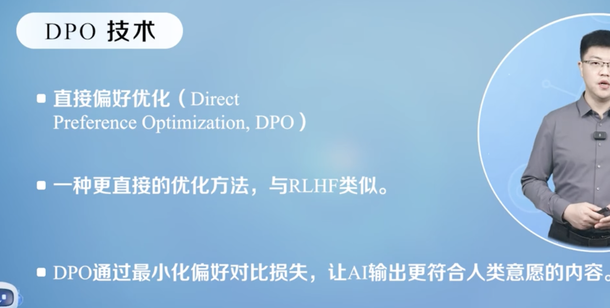

# AI被赋予的“价值观”：是谁在塑造AI的价值准则？
## 生成模型的概念
生成模型和判别模型的区别  

* 生成模型：学习数据的分布，并能够生成与训练数据相似的新样本
    * 基于序列建模-GPT
        * GPT系列模型属于自回归（AR）语言模型  
    * 基于概率分布-扩散模型图像生成
        * 前向扩散
        * 反向去噪
* 判别模型：学习数据的决策边界，在已知数据X时预测其类别Y
    * 支持向量机SVM
## 生成模型的价值观
价值观在AI中的体现  
可能造成负面影响  

价值观对齐：输出结果符合人类道德观念、伦理规范以及社会共识

影响AI价值观的主要因素

* 数据
    * 不仅决定了ai模型的认识和判断，还可能影响到其所学到的价值观
* 标注
    * 人工标注者的主观判断和个人价值观会对最终的结果产生重要作用

为生成模型注入正确价值观
RLHF  

SFT

PPO

DPO

