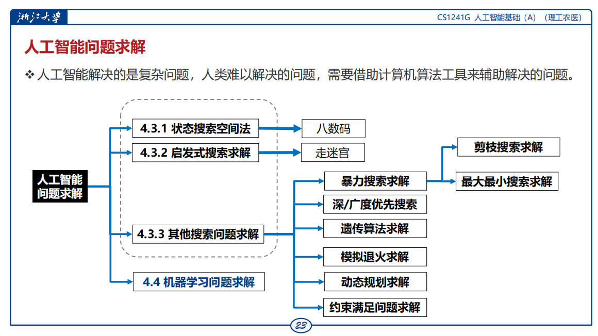
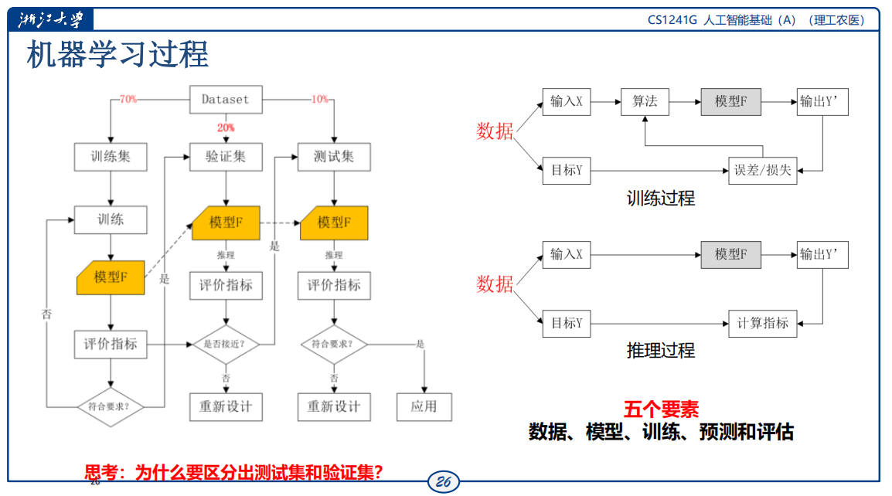
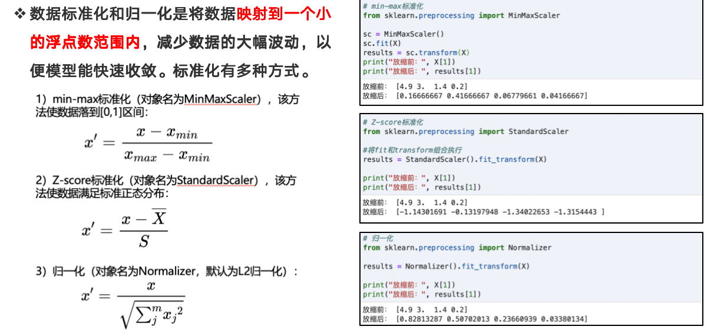
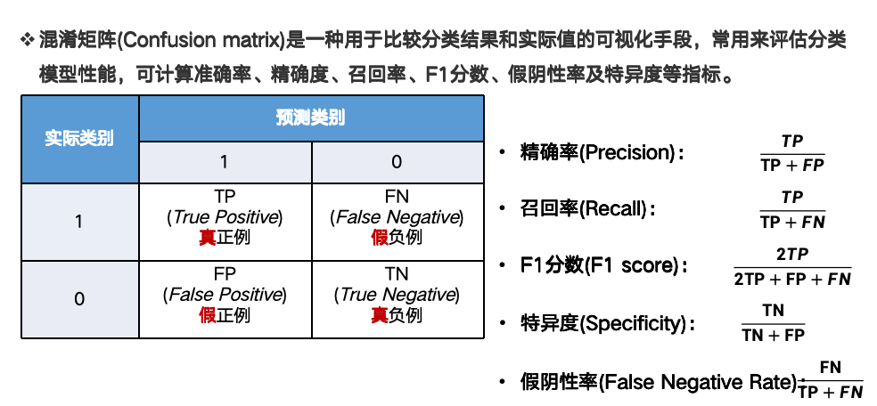

# 第二篇 机器学习篇

## 四、从问题求解到机器学习

>列举装箱、水壶倒水等经典问题求解方法  
>解释人类智能和人工智能问题求解的含义  
>列举通用问题求解常用的算法方法  
>列举早期人工智能问题求解搜索典型方法  
>解释机器学习的概念定义和列举机器学习的类型  
>分析机器学习求解问题的一般工作过程  
>分析机器学习的三个要素及关系  
>列举scikit-learn提供的算法类型  

### 问题求解理论基础
>列举装箱、水壶倒水等经典问题求解方法  

**装箱问题**：已知有N个物品（每个物品重量小于S）和一组箱子（箱子容量是S），要求寻找一种方法用最小个数的箱子把所有物品装完。  

* 首次适应算法（First Fit, FF）
  * 思路：将每个物品按顺序放入第一个能放下它的箱子中；若没有合适的箱子，就新开一个。
  * 时间复杂度：O(n²) 或 O(n log n)（配合优先队列优化）
  * 不保证是最优解

```python
def first_fit(items, bin_capacity):
    bins = []  # 记录每个箱子的剩余容量
    for item in items:
        # 尝试将物品放入已有箱子
        for i in range(len(bins)):
            if bins[i] >= item:
                bins[i] -= item
                break
        else:  # 未找到合适箱子，创建新箱子
            bins.append(bin_capacity - item)
    return len(bins)
# 示例用法
items = [2, 5, 4, 7, 1, 3, 8]
bin_capacity = 10
print("所需箱子数量:", first_fit(items, bin_capacity))  # 输出: 4
```

**水壶倒水问题**：给定两个容量分别为x升和y升的水壶，以及一个目标z升的水量，我们需要找到一系列倒水操作，使得最终其中一个水壶中的水量恰好为z升，或者两个水壶中的水量之和为z升。
>ppt上没有，gpt的一个做法   

* BFS（广度优先搜索）
    * 核心思想：将每种可能的水壶状态看作图中的一个节点，从初始状态开始向所有可达状态扩展，直到找到目标状态。
    * 状态表示：每种水壶的水量，比如 (x, y) 表示两个壶中水量分别是 x 和 y。
    * 状态转移操作：
        * 倒满一个壶
        * 倒空一个壶
        * 一个壶往另一个壶倒水，直到满或倒完
```python
from collections import deque

def bfs(a_cap, b_cap, target):
    visited = set()
    queue = deque()
    queue.append((0, 0))  # 初始状态，两个壶都空
    visited.add((0, 0))

    while queue:
        x, y = queue.popleft()
        if x == target or y == target:
            return True  # 找到解

        # 所有可能的倒水操作
        next_states = [
            (a_cap, y),  # A 倒满
            (x, b_cap),  # B 倒满
            (0, y),      # A 倒空
            (x, 0),      # B 倒空
            # A -> B
            (max(0, x - (b_cap - y)), min(b_cap, x + y)),
            # B -> A
            (min(a_cap, x + y), max(0, y - (a_cap - x)))
        ]

        for nx, ny in next_states:
            if (nx, ny) not in visited:
                visited.add((nx, ny))
                queue.append((nx, ny))

    return False
```

>解释人类智能和人工智能问题求解的含义  

**人类智能的问题求解**：就是设法消除“某个给定智能活动的当前状态与智能主体所要达到的目标状态之间的差距的行为”，是人类日常生活中普遍存在的智能活动，如饿了（问题），找东西吃（求解）；渴了（问题），倒水喝（求解）  

**人工智能的问题求解**：就是计算机或机器实现人类的问题求解的模拟，是研究如何用计算机（机器）“计算”的方法技术去求解人类智能问题的学科。问题求解不仅是人工智能的核心领域之一，并且在人工智能和计算机科学中占据重要位置。  


### 问题求解与算法方法学
>列举通用问题求解常用的算法方法  

问题求解的核心就是寻找解决方案并实现算法设计  

  * 贪心法
    * 从小的方案推广到大的解决方法。分阶段工作，**在每一个阶段选择最好的方案**，而不考虑其后的结果如何。
    * 局部最优，不能确定最后解是最优的
* 分治法
    * 分而治之，将一个较大规模的问题**分解为若干个较小规模的子问题**，找出子问题的解，**然后把各个子问题的解合并成整个问题的解**。
* 回溯法（穷尽搜索法、暴力搜索法）
    * 基本思想：在分步解决问题的过程中，若通过尝试发现现有的分步方向不能得到正确解，就**取消上一步甚至上几步的计算（回溯）**，再通过其他可能的分步方向再次尝试寻找问题的答案。通常使用递归实现。
    * 本质就是**穷举**
* 动态规划
    * 基本思路：如果一个较大问题可以被分解为若干个子问题，且子问题具有重叠，可以**将每个子问题的解存放到一个表中**，这样就可以**通过查表解决问题**。
    * 核心思想是以空间换时间

### 问题求解与搜索算法
>列举早期人工智能问题求解搜索典型方法  

  

* 八数据与状态搜索空间法
    * **状态空间问题**：如果一个问题可以被定义为状态空间中的一个初始状态，通过一系列操作或动作转换直到到达目标状态
    * 状态空间问题四要素：初始状态、目标状态、操作、路径
    * 八数码：在一个3*3的网格中随机放置了1-8八个数码。其中有一个网格是空着的。这个空网格可以跟上下左右四个方向的任何一个临近的数码交换。但不能跟斜方向上的数码交换。
* 走迷宫与启发式搜索
    * 相对于暴力搜索无脑地一个一个方向遍历，**启发式搜索**往往有一个评价函数来决定下一步优先往哪个方向前进。
* 旅行推销员与遗传算法
    * 遗传算法是一种模拟自然选择的优化技术，它们使用生物进化的概念，如变异、交叉和选择来解决问题。
    * 旅行推销员问题（TSP）要求找到最短的路径，访问一系列城市并返回原点。使用遗传算法，可以随机生成多个“种群”，每个种群是一种可能的路径。
    * 通过**交叉和变异产生新的路径**，并使用适应度函数（在这个例子中是总距离）来选择最佳路径，随着时间的推移，这个过程可能会找到一个非常接近最短可能路径的解决方案。
* 拼图与模拟退火
    * 模拟退火是一种概率性的技术，灵感来源于金属退火过程。它在搜**索过程中引入随机性**，允许算法在早期阶段进行“坏”的移动，以**避免陷入局部最优解**。
* 数独与约束满足问题求解
    * 约束满足问题（CSP）是一种问题，其中变量需要满足一定的约束条件。CSP求解器的目的是找到满足所有约束的变量的赋值。

### 机器学习求解方法
>解释机器学习的概念定义和列举机器学习的类型  

**机器学习**是AI的核心领域之一，是一种基于数据统计建模的问题求解方法。机器学习求解问题的方法是利用统计学、数据分析和计算机科学的方法，从数据中发现模式规律，并利用这些模式规律进行推断和决策的方法。  

**类型**：  

* 有监督学习
    所有X都有Y对应
* 无监督学习
    没有Y，学习X内部的知识
* 半监督学习
    一部分X有Y

>分析机器学习求解问题的一般工作过程  


机器学习的一般过程**五个要素：数据、模型、训练、预测和评估**  

机器学习过程的定义：  

* 已知 X 是输入空间，Y 是输出空间，Y与X存在某种对应关系，Y称为X的标签。
* 机器学习的目标是构建一个映射函数 f:X → Y，使得该函数在未知输入上能够尽可能准确地预测输出。
* 举例——已知父母亲的身高，预测子女身高。 X =( x1, x2 )分别表示父亲身高和母亲身高，Y ={ 子女身高,性别 }。学习一个函数Y = f ( X )，预测子女身高。

**机器学习过程**：  

* 训练
* 预测
* 评估
>分析机器学习的三个要素及关系  

* **数据**：结构化的（如表格数据）或非结构化的（如文本、图像、音频）
* **模型**：用于进行预测或分类的数学表示，模型通过从数据中学习并调整其参数来提高性能。
* **算法**：机器学习建模就是个算法

* 机器学习的实现方法
  * 回归分类方法、神经网络方法

### 机器学习算法库scikit-learn
>列举scikit-learn提供的算法类型  

机器学习sklearn库的算法主要有四类：**分类，回归，聚类，降维**  

**数据预处理方法**：  

* 数据标准化
    * 将数据**映射到一个小的浮点数范围内**，减少数据的大幅波动，以便模型能快速收敛。

* 数据二值化
    * 使用阈值过滤器将数值型数据转化为分类数据（布尔值或0/1）
    * 使用Binarizer对象实现数据的二值化 ```from skearn.preprocessing import Binarizer```
* 标签编码
    * 使用 LabelEncoder 将不连续的数值或文本变量转化为有序的数值型变量。```from sklearn.preprocessing import LabelEncoder```
* 独热编码
    * 对于无序的离散型特征，其数值大小并没有意义，可进行one-hot编码，将其特征的m个可能值转化为m个二值化（0/1）特征。```from sklearn.preprocessing import OneHotEncoder```

---

## 五、回归和分类模型
>识别身边的回归与分类模型应用案例  
>理解回归和分类这两大核心任务的本质  
>掌握监督学习的基本原理和关键技术  

### 监督学习方法
**监督学习方法核心**：从数据中发现规律，并将这些规律应用于新的、未知的数据  

>识别身边的回归与分类模型应用案例  

**监督学习的类型**：  

* **回归问题**-**连续值**预判
    * 二氧化碳浓度预测
    * 股票价格预测
* **分类问题**-**离散**标签预测
    * 垃圾分类
    * 图片分类

**混淆矩阵**  



TP（True Positive）：实际是正，预测也是正  
TN（True Negative）：实际是负，预测也是负  
FP（False Positive）：实际是负，但预测为正（假阳性）  
FN（False Negative）：实际是正，但预测为负（假阴性）  
精确率：重视准确预测正例  
召回率：重视将所有正例样本检测出来  
F1：2*（精*召）/(精+召)  
面临的问题:数据质量、可解释性、计算资源、过拟合   

如何消除过拟合-提升泛化能力  

* 交叉验证：将数据集划分为多个子集，将模型训练和测试分别在不同子集上进行，从而减少过拟合和提高模型性能
* dropout：动态随机切断神经元的🔗
* 正则化，优化损失函数
    * L1范式（LASSO回归），L2范式（岭回归）
* 不过度训练
* 特征选择
* 集成学习
* **数据质量与预处理技术**

>理解回归和分类这两大核心任务的本质  
>掌握监督学习的基本原理和关键技术  

### 回归模型
回归模型是一种统计学模型，用于研究变量之间的定量关系，特别是一个或多个输入自变量（也称为特征或预测变量）对输出因变量（也称为目标变量或响应变量）的影响。**回归分析本质是预测连续数值 （因变量） 的任务，并在任务中找出自变量和因变量之间的数学函数关系**。  

* 线性回归
    * $Y = \beta_0 + \beta_1 X + \beta_2 X^2 + \cdots + \beta_n X^n + \varepsilon$
    * 最小二乘法：$\min_{\boldsymbol{\beta}} \sum_{i=1}^{n} \left( y_i - \beta_0 - \beta_1 x_{i1} - \cdots - \beta_p x_{ip} \right)^2$
    * 评价指标：**回归损失函数**：均方误差、均方根误差、平均绝对误差

* Logistic回归（逻辑回归）：解决分类问题的回归
    * 广义线性回归，用于解决**二分类问题**，即数据划分两个类别(比如是/否成功/失败、患病/健康等)。Logistic回归分析的因变量Y属于分类数据。
    * **本质**：假设数据服从特定分布，使用极大似然估计做参数的估计。
    * 逻辑回归**不要求自变量和因变量是线性关系（没有线性假设）**

### 分类模型

**分类模型的类型**：  
**根据类别的数量**  

* 二分类模型-垃圾邮件检测（垃圾/非垃圾），医疗诊断（患病/健康）
    * 逻辑回归
    * 支持向量机
* 多分类类型-手写数字识别、动物识别
    * 决策树
    * 随机森林
    * 多类SVM

**根据数据实例可属于的类别标签数量**  

* 单标签分类-新闻文章分类
    * 每个实例只属于一个类别
* 多标签分类-电影标签分类
    * 每个实例可以同时属于多个类别

**根据类别之间的关系**    

* 平坦分类
    * 所有类别处于同一层级
* 层次分类
    * 类别之间存在层次关系

**线性分类器**：核心思想：在输入特征向量的特征空间中找到一个线性决策边界，将不同类别的数据点分开  

**决策树分类模型**：类似于一棵倒置的树，从根节点开始，通过一系列的判断，最终到达叶节点得出结论。 
    构建步骤：特征选择->决策树生成（递归过程）->决策树剪枝（解决过拟合）

其他分类问题：SVM（支持向量机）、决策树、随机森林、朴素贝叶斯、K最近邻、深度学习

---

## 六、数据聚类和降维
>解释无监督学习方法和列举其类型  
>分析聚类技术的核心思想和列举常用方法  
>分析使用Kp-means算法实现聚类  
>分析降维技术的重要性和使用主成分分析算法  

### 无监督学习方法
>解释无监督学习方法和列举其类型  

**无监督学习**是机器学习的一种方法，旨在从没有标签的数据中识别潜在的模式或结构。与监督学习不同，无监督学习不依赖于已知的输出标签。  

* **聚类**：目标是将相似的数据点分组在一起，形成簇（cluster）
* **降维**：降维将高维数据转换为低维表示，减少数据的复杂度，同时巧妙地保留了原始数据中最重要的信息

### 聚类分析技术

**定义**:聚类是一种无监督学习技术，旨在将数据集分成若干组，使得同组内的样本相似度高，而不同组间的样本相似度低.

>分析使用Kp-means算法实现聚类  

**K-means**是最常用的聚类算法之一，
主要步骤为  
1. 随机初始化若干个中心点，周围散布着未分类的数据点；
2. 将每个数据点分配给最近的中心，形成初步的簇；
3. 重新计算每个簇的中心点。  
应用：图像分割，用户画像

### 数据降维技术
>分析降维技术的重要性和使用主成分分析算法  

**定义**：降维是将高维数据转换为低维表示的过程，以简化数据集并降低计算复杂性。  

**主成分分析(Principal Component Analysis，PCA)** 是最常用的降维技术之一。  
通过建立一个新的坐标系，将多个维度的数据投影到该坐标系，实现数据的降维这个坐标系的轴方向就是主成分  
主要步骤   

1. 数据中心化
2. 计算协方差矩阵
3. 计算特征向量和特征值
4. 选择主成分  

ppt上的一个讨论题：下列哪些属于无监督学习：顾客分群、异常检测、房价预测、手写数字识别、图像分类、情感分析  
A：顾客分群、异常检测  

### 强化学习
一种机器学习方法，通过与环境的交互学习最优策略，以最大化累积奖励。  
强化学习的核心思想：智能体（Agent）在环境（Environment）中采取行动（Action），根据环境反馈（Reward）调整其行为，以改善未来的决策。  

强化学习与监督学习的区别  

* 强化学习的最显著特点是其交互性
* 强化学习通常涉及延迟反馈
* 探索与利用的平衡
* 在监督学习中，我们通常致力于**最小化预测误差**，例如在回归问题中最小化均方误差。而强化学习的目标是**最大化长期累积奖励**。这意味着智能体不仅要考虑即时的结果，还要考虑其行为对未来可能产
生的影响。

强化学习的算法  

* Q-learning
* 策略梯度算法

应用  

* 游戏ai、机器人控制、自动驾驶

```
10（24期末选择）、 20x5000的矩阵变成 20x50的矩阵 需要的变换矩阵是什么  
5000x50
```
