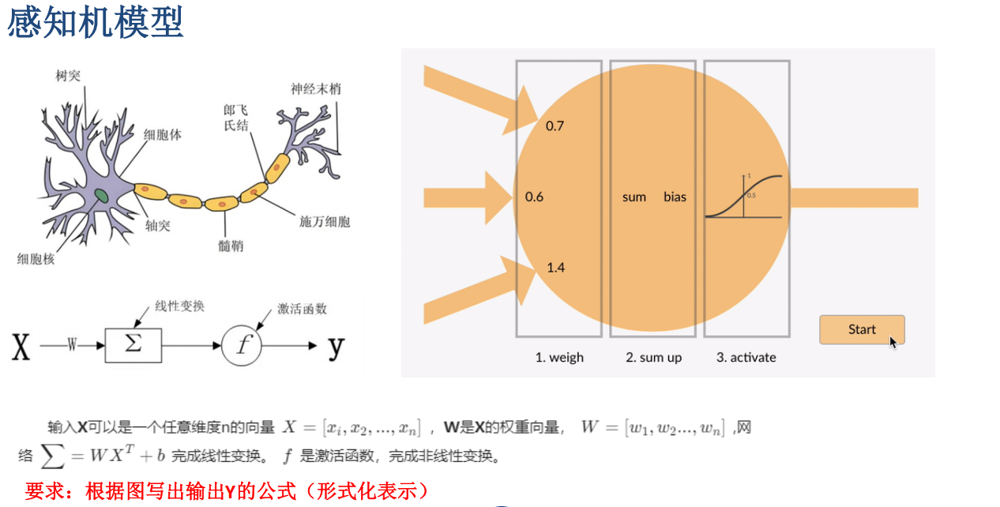
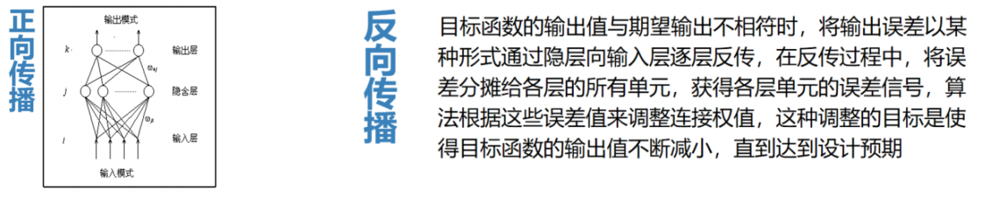
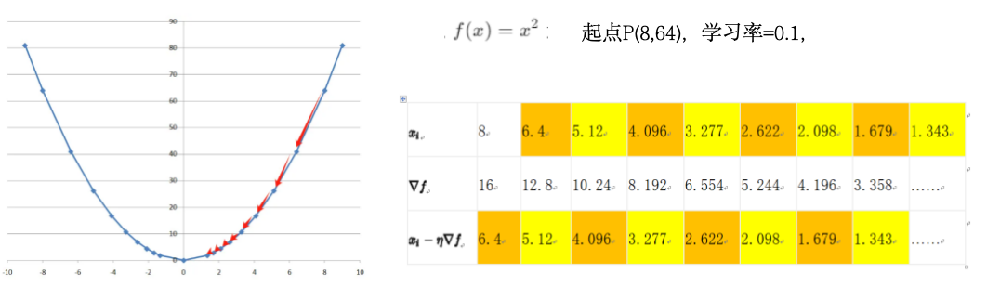
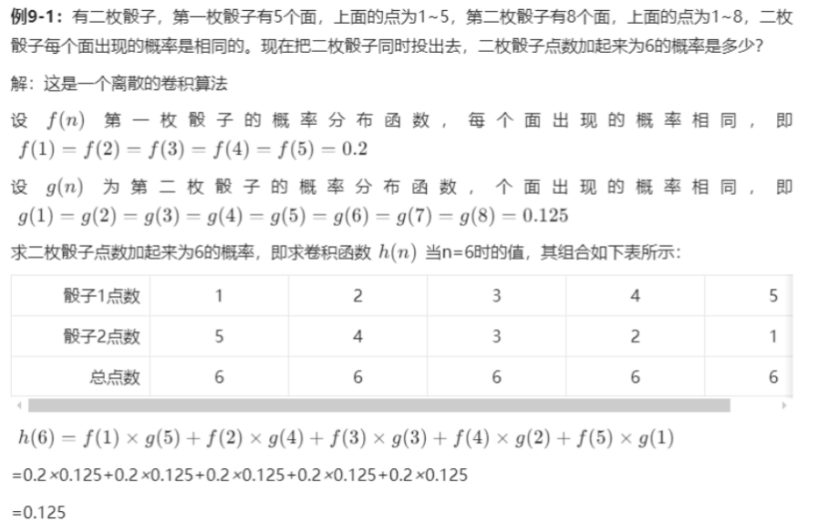
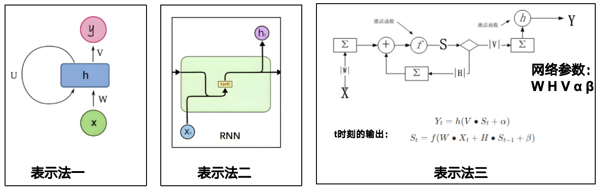
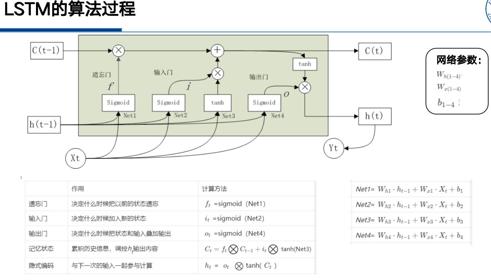

# 第三篇 深度学习篇
## 七、深度网络基本构建
>详细阐述深度学习三要素  
>解释神经元的“全或无”特性  
>列举不同的损失函数使用条件  
>比较不同优化器的优缺点  
>比较不同激活函数的优缺点  
>对一元二次方程进行梯度下降法计算  
>详细阐述BP 算法的基本过程、特点和局限性  
>阅读并理解Scikit-learn 编写的感知机模型代码并给出注释  
### 深度学习三要素
从机器学习到深度学习：  

* 机器学习：把大量数据归纳到少量参数中（参数估计）
* 机器学习到深度学习：从简单到复杂，从线性到非线性。从可解释到不可解释
* 最小二乘法是机器学习最基础的模型

>详细阐述深度学习三要素  

三个要素：**算法、数据、算力**  

>解释神经元的“全或无”特性 

只有当外来刺激有足够大的强度，才能引起神经元细胞的兴奋并产生动作电位，但再增加刺激强度并不会导致动作电位的幅度发生变化。神经元细胞产生的动作电位沿着细胞膜向周围传播，传播的范围和距离也不会随刺激强度的不同而不同。  

```
2（24期末选择）、选出符合“全或无”的概念解释
```

**深度学习（Deep Learning，DL）是机器学习的一个子集**，它使用**多层人工神经网络**来精准完成诸如物体检测、语音识别、语言翻译等任务。网络的深层结构是“深度”学习名称的来源。  

```
1、（24期末）机器学习是深度学习的子集。  
F ,反了  

1.（24期末多选）下列哪些是深度学习模型（）  
A.CNN B.RNN C.扩散模型 D.transformer  
ABCD  

```
**基本思想：**通过**构建多层网络**，对目标进行多层表示，以期通过**多层的高维特征**来表示数据的**抽象语义信息**，从而获得更好的**特征鲁棒性**。  

**特征**：多层网络结构、自动特征提取、非线性激活函数、大规模数据处理能力  

### 从机器图像识别到感知机模型
#### 感知机模型、M-P模型
感知机（感知器）可以被视为一种**最简单形式的前馈式人工神经网络**，是一种二元线性分类器。（前馈是指神经元的控制信号会传播给下一个）  

最早对神经元建立数学模型的是沃伦·麦卡洛克和沃尔特·皮茨提出的**简易数学模型（M-P 模型）。**  

* 神经元M-P模型  

1. 完成信息输入并与连接系数做内积运算
   每个输入连接有对应的权重 $w_{ij}$，神经元的**内部状态（净输入）** 为：$\text{net}n = \sum_j w{ij} x_j$
2. 将内积运算结果通过传递函数T
3. 由阈值函数判决，若输出值大于阈值门限，则该神经元被激活，否则处于抑制状态。阈值函数课描述为二值函数（阶跃函数）：

* 感知机模型  
感知机模型用激活函数代替了最初的传递函数功能  

ppt上的题  
$y = f(0.7x_1 + 0.6x_2 + 1.4x_3 + b)$

感知机模型可以实现所有的线性分类和线性回归问题。  

```
（24期末计算）感知机，单层的，给了W X 以及偏置阿尔法 求输出  

```

>比较不同激活函数的优缺点  

**解决感知机局限的方法：激活函数**：  

* 激活函数的作用：通过非线性变换，是的神经网络具备非线性特征，以解决一些非线性任务
* **Sigmoid**：$\sigma(x) = \frac{1}{1 + e^{-x}}$
  * 非线性
  * 在-3与3之间，优化比较明显
  * 在-3与3之外，优化不明显
  * 值域在0~1之间，是非对称算法，这意味着下一个神经元只能接受正值的输入
* Softmax：$\mathrm{softmax}(x_i) = \frac{e^{x_i}}{\sum_j e^{x_j}}$
* ReLU: $\mathrm{ReLU}(x) = \max(0, x)$
  * 非线性
  * 不会同时激活所有神经元
  * 计算速度快
  * 有趋于0的梯度
  * **ReLU是目前隐含层中最为常用的损失函数**
* ELU: $f(x) = \begin{cases} x, & x > 0 \\ \alpha (e^x - 1), & x \leq 0 \end{cases}$
  * 非线性
  * 计算速度快（特指收敛速度快）
  * 参数可调，可控制负数部分的表现
  * 与ReLU相比，没有死亡神经元
  * 缺点：负数部分计算较慢

```
3（24期末）、激活函数是非线性的。  
T  

4（24期末）、根据“天下没有免费的午餐“”定理，relu是最好的激活函数，被默认使用。  
F，relu是最广泛的，但不是“最好的”。不同问题可能需要不同的激活函数  

3（24期末选择）给出一个图像，问是哪个激活函数（给的sigmoid的，甚至答案都印出来了）

12（24期末选择）softmax采用原因 （ ） D 结果代表分布概率  

3（24期末多选）感知机可以应用在（）  
A.二分类问题 B.线性回归 C.异或问题 D.多分类问题  
ABD  

4（24期末多选）下列哪些激活函数生成的输出在0-1之间（）  
A.relu B.softmax C.sigmoid D.高斯滤波  
BC  

（24期末计算）计算softmax ，值给出了  
```

### 浅层人工神经网络模型
**多层感知机：深度学习的雏形**：**多层神经网络**解决了感知器模型只能处理线性可分问题的缺陷，使神经网络真正成为强大的建模工具。

#### 多层感知机（MLP）
一个多层感知器至少包含三层：一个**输入层**，一个**隐藏层**和一个**输出层**。数据通过输入层进入网络，乘以连接的权重入后输入到隐藏层节点。隐藏层节点将这些加权后的输入求和并经过一个非线性变换（称为激活函数）后送往输出层。    

只有一个隐含层的叫浅层学习网络，隐藏层大于一层的叫深度学习网络（深度学习一词的起源）  

```
2（24期末）、所有的多层感知机都是深度学习模型。  
F，只有隐藏层>=2才是深度学习模型  

1（24期末选择）、数多层感知机的权重数量  
。

2、 MLP有哪几个层（）  
A.输入层 B.池化层 C.输出层 D.隐藏层  
ACD,池化层是CNN的  

（24期末问答）二、 给出了经典用MLP对mnist实现手写数字识别的代码  
a 问了一句代码段的作用，X, y = mtData.data / 255.0, mtData.target  
b 问最后一层的激活函数是什么  
c 询问了loss函数 有binary 和 Category（多类别相关）  
d 询问了隐藏层数 并且询问某一层的神经元  

```

>列举不同的损失函数使用条件

#### 常用损失函数
**回归损失函数**  

* 均方误差（MSE）预测值与真实值误差的平方，取平均
$$
\mathrm{MSE} = \frac{1}{n} \sum_{i=1}^{n} (y_i - \hat{y}_i)^2
$$
* 平均绝对误差（MAE）误差的绝对值平均值，更不易受极端值影响。
$$
\mathrm{MAE} = \frac{1}{n} \sum_{i=1}^{n} |y_i - \hat{y}_i|
$$
* 平均绝对百分比误差（MAPE）相对误差的平均值，常用于评估预测精度的百分比表现。
$$
\mathrm{MAPE} = \frac{100\%}{n} \sum_{i=1}^{n} \left| \frac{y_i - \hat{y}_i}{y_i} \right|
$$
* 均方根对数误差（RMSLE）对数差值的均方根，常用于数据具有指数增长特征时。
$$
\mathrm{RMSLE} = \sqrt{ \frac{1}{n} \sum_{i=1}^{n} \left( \log(1 + \hat{y}_i) - \log(1 + y_i) \right)^2 }
$$

**分类损失函数**  

* 二进制交叉熵
  * 用于二分类问题，对应的激活函数是sigmoid

$$
\mathcal{L}_{\text{BCE}} = -\frac{1}{n} \sum_{i=1}^{n} \left[ y_i \log(\hat{y}_i) + (1 - y_i) \log(1 - \hat{y}_i) \right]
$$

* 多分类交叉熵
  * 用于分类问题，对应的激活函数是softmax 

$$
\mathcal{L}_{\text{CCE}} = -\frac{1}{n} \sum_{i=1}^{n} \sum_{j=1}^{C} y_{ij} \log(\hat{y}_{ij})
$$

#### 误差反向传播算法（BP算法）
>详细阐述BP 算法的基本过程、特点和局限性  

**反向传播算法**是一种常见的**人工神经网络学习**算法，特别适用于**多层前馈神经网络的训练**。该算法由学习过程中的信号正向传播与误差的反向传播两个过程组成。


* 优势：自适应、自主学习，较强的非线性映射能力，严谨的推导过程，较强的泛化能力
* 局限性：易陷入局部最小值，收敛速度慢，隐节点选取缺乏理论指导，学习新样本时可能遗忘旧样本

```
5（24期末）、在反向传播中，权重的更新是由实际值与网络计算值的误差自动调整。  
T  

5(24期末多选)BP局限性（）
A.局部最优 B.学习新样本会遗忘旧样本 C.不严谨 D.隐函数缺乏理论指导  
ABD 
```

#### 梯度下降法
以最快的速度找到函数局部最小值的优化算法  

>对一元二次方程进行梯度下降法计算  

* 最小值寻找过程：
  1. 方向的选择-梯度 
  2. 前进的步长-学习率
  3. 何时终止 - 梯度≈0
$x_{n+1} = x_n - \alpha \cdot \nabla f(x_n)$
* $\alpha$：学习率（step size）
* $\nabla f(x_n)$：梯度，表示函数在当前点 $x_n$的最陡上升方向
  * 在一元函数中，梯度就是导数 f’(x)
  * 在多元函数中，梯度是偏导数组成的向量：$\nabla f(x) = \left( \frac{\partial f}{\partial x_1}, \frac{\partial f}{\partial x_2}, \dots, \frac{\partial f}{\partial x_n} \right)$



#### 梯度下降的优化过程和优化器的选择
优化器作用：不断调整模型参数，以最小化（或最大化）目标函数（通常是损失函数）。  

* **随机梯度下降法**Stochastic Gradient Descent, SGD
  * 一次计算全部样本的误差之和->一次只计算一个（批）样本
  * 优点:高效,可并行计算,可适应新数据变化（预训练思想萌芽）,有机会全局最优
  * 局限：不稳定,没有解决学习率选择问题,随机最优解,模型不可控
  * 改进：小批量梯度下降法（Mini-batch SGD）,动量梯度下降法（Momentum SGD）
* **自适应梯度算法** Adaptive Gradient,AdaGrad
  * 根据权重的梯度自适应调整学习率
  * 优点：自动化调整学习率，自适应，所有权重“步调一致”
  * 局限：梯度消失（训练次数作为分母），训练速度慢
  * 改进：自适应平方根梯度法（RMSProp），自适应矩估计法（Adam）目前最常用

* MNIST数据集是学习深度学习最常用的数据集

>阅读并理解Scikit-learn 编写的感知机模型代码并给出注释  
作业

### 拓展阅读

---

## 八、卷积神经网络（CNN）
>卷积的基本数学公式  
>卷积神经网络的特性、优点和缺点  
>掌握卷积的过程，对于不同卷积网络的参数，可以计算输出后的shape  
>能够自己完成简单的代码实现  

### 多隐含层MLP
### 卷积运算基础
>卷积的基本数学公式  

* f 与 g 的卷积（连续函数的卷积表示）
$h(x) = (f \cdot g)(x) = \int_{-\infty}^{\infty} f(\tau) g(x -\tau)d\tau$
函数f的自变量与g的自变量相加为x  
* 离散函数的卷积表示
$h(n) = (f \cdot g)(n) = \sum_{m = -\infty}^{\infty} f(m) g(n - m)$
f的自变量与g的自变量相加为n  



* 感受野：物体在视网膜处投射出影像后，在视觉信号向大脑传导的过程中，并不采用所有神经元全连接的方式，而是首先进行局部处理，经过多个层次的局部处理提取出特征值，再逐层传递。这个局部的大小范围就是“感受野”。因此，基于卷积算法思想和感受野概念构成的神经网络就被命名为“卷积”神经网络

**卷积运算**：卷积运算就是通过设计一系列大小适中的卷积核（感受野），对数字图像的各个通道分量（二维矩阵）进行卷积，提取特征值的过程。常用的卷积核大小为3×3、5×5、7×7。  

### 卷积神经网络及实现方法
>掌握卷积的过程，对于不同卷积网络的参数，可以计算输出后的shape  

卷积运算的三个主要参数：
* 卷积核形状（核的大小）
* 步长：决定运算的速度
* 卷积核数量：决定每一层能提取的特征数

输出形状的计算公式：  

* 输入尺寸：$H_{\text{in}} \times W_{\text{in}}$
* 卷积核大小：$K_H \times K_W$
* 步长（stride）：$S_H$, $S_W$
* 填充（padding）：$P_H$, $P_W$
* 那么输出尺寸为：
  * $H_{\text{out}} = \left\lfloor \frac{H_{\text{in}} + 2P_H - K_H}{S_H} \right\rfloor + 1$
  * $W_{\text{out}} = \left\lfloor \frac{W_{\text{in}} + 2P_W - K_W}{S_W} \right\rfloor + 1$

```
6（24期末）、在卷积神经网络中获取更多特征可以通过增大卷积核来完成。  
？，增大卷积核尺寸 确实可以提取更大感受野（捕捉更大范围的信息），但这并不意味着一定“获取更多特征”，甚至有时会适得其反。在卷积神经网络中，获取更多特征通常通过增加卷积核数量（输出通道数）来完成

5.（24期末选择）给定12x12的cnn，kernel是5x5，步长是2，填充是1，求output矩阵的size  
[12+2*1-5]/2+1=5,5x5 

（24期末计算）计算卷积，具体而言就是给了2x2的卷积核，步长为1，要你生成输出矩阵  
```

### CNN的应用
**CNN拓扑结构**  

* 三要素
  * **卷积**
  * **池化**：缩小特征图的尺寸，减少计算量
    * 最小池化、最大池化、平均池化
  * **展平**

**CNN的本质**：层次特征学习  

通过层次性处理逐渐提取抽象特征

**应用**：  

* 图像分类
* 物体检测
* 分隔
* 回归问题

```
7（24期末）池化的原理是可以使用图像子块的统计信息  
T，池化（Pooling）层 的核心原理之一就是：对图像（或特征图）的子区域（子块）进行统计操作，从而降低空间维度，提取更加鲁棒的特征。

11（24期末选择）6x6 cnn 池化是 2x2 步长2 问输出大小  
[6-2]/2+1=3,3x3

```

---

## 九、循环神经网络
>了解循环神经网络（RNN）的结构、特点  
>了解LSTM的内部结构及变种  
>用循环神经网络或LSTM实现简单的应用  
### 经典RNN模型

* **循环神经网络（Recurrent Neural Network，RNN）**：是一种特殊类型的反馈神经网络，专门用于**处理序列数据**，我们通常致力于最小化预测误差，例如在
回归问题中最小化均方误差。
而强化学习的目标是最大化长期累积奖励。这意味着智能
体不仅要考虑即时的结果，还要考虑其行为对未来可能产
生的影响。。
* **核心思想**：循环结构，网络能捕捉和利用序列中的顺序依赖性信息。
* 基本单元：一个**具有循环连接的神经网络层**——允许网络在处理每个时间步的数据时，能利用之前时间步信息。RNN在每个时间步都会**接收一个输入，并产生一个输出**，同时其内部状态（隐藏状态）会被更新并传递到下一个时间步。



* h 和 f 是激活函数
* W 是输入层到隐含层的权重矩阵
* V 是隐含层到输出层的权重矩阵
* H 是隐含层上一次的值作为这一次的输入的权重
* α, β 是偏置值

**RNN结构分类**：  

* 一对一：图像去噪、数据加密
* 一对多：关键词->写作拼写纠正
* 多对一：语句情感分类、垃圾邮件识别、股票跌涨判断、关键词提取
* 同步多对多：命名实体识别、词性标注
* 异步多对多：语句预测、机器翻译、文本摘要、聊天机器人、语音识别、股票走势预测

```
13（24期末选择） 哪种任务适合RNN （ ）B文本生成
```

### LSTM
>了解LSTM的内部结构及变种  

**RNN的问题：无法学习太长的序列，“很快忘记前面说过的话”**  

**长短期记忆网络（Long Short-Term Memory， LSTM ）**：专门设计用于解决长期依赖的问题


LSTM使用领域：机器翻译，文本生成，情感分析，聊天机器人，语音识别，时间序列预测，推荐系统，异常检测，音乐生成，动作识别  

LSTM局限：  

* 计算复杂
* 顺序处理，无法进行并行化计算
* 计算慢，实时响应难

### 其他循环神经网络
### 案例：股票走势预测

---

## 十、人工智能应用开发方法
数据准备、模型设计、模型训练、模型评估  
