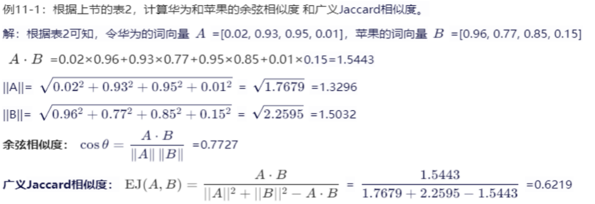

# 第四篇 大语言模型

## 十一、自然语言处理模型
> 了解自然语言处理的发展历程、任务类型和常用技术
掌握语言转化为向量的过程  
>学习一些常见的NLP架构或模型（Word2Vec、Seq2Seq、Transformer...）  
>编写程序完成最基础的NLP步骤（分词、构建词向量、计算相似度等）  

### NLP概述
> 了解自然语言处理的发展历程、任务类型和常用技术
掌握语言转化为向量的过程  

**NLP任务分类**:  

* 文本转换
* 文本生成
* 语音识别
* 文本分析

NLP技术演变：基于规则->统计模型->生成模型->预训练-微调  

统计语言模型  

* 生成式模型
* 区分式模型 判别式模型

### NLP技术基础
#### 分词

**Token：令牌**，可以是一个字，也可以是一个词，或者是一个字母，甚至是一个字节，要看具体的情况。本质上，一个“Token”就是通过分词技术（工具）将一句话分割成的最小单位，**是一个特定的自然语言处理模型能处理的最基本元素**。  

```
6.（24期末选择）“大马高人骑人高马大”，词汇表几个token，句子几个token  
9,5  

6(24q期末多选)天行健君（X）自强不息 生成X会用到（）  
A 天 B 自 C 君 D 不  
AC，用前面的词  

```

#### 词向量和词嵌入：  
**词向量**就是词的特征分布，是NLP模型层与层之间进行信息传递的数据形式。**词向量和词嵌入**是指的同一个东西，区别在于词向量是指数字编码技术，词嵌入是指NLP网络之间的数据存在形式  

#### 文本相似度
**余弦相似度**  
$\cos(\theta) = \frac{\vec{A} \cdot \vec{B}}{\|\vec{A}\| \, \|\vec{B}\|} = \frac{\sum_{i=1}^{n} A_i B_i}{\sqrt{\sum_{i=1}^{n} A_i^2} \, \sqrt{\sum_{i=1}^{n} B_i^2}}$  

**曼哈顿距离**  
即“城市街区距离”，向量在各维度的绝对距离之和：$D_{\text{Manhattan}}(\vec{A}, \vec{B}) = \sum_{i=1}^{n} |A_i - B_i|$  
距离越短，则两个文本越相似  

**欧氏距离**：
两个向量间的几何距离：$D_{\text{Euclidean}}(\vec{A}, \vec{B}) = \sqrt{ \sum_{i=1}^{n} (A_i - B_i)^2 }$  
距离越短，则两个文本越相似  

**Jaccard相似度**：  
狭义定义：$J(A, B) = \frac{|A \cap B|}{|A \cup B|}$  
$EJ(A, B) = \frac{A \cdot B}{\|A\|^2 + \|B\|^2 - A \cdot B}$  
值越大，越相似  



```
19（24期末）欧式距离越短，标明两个越相似  
T  

7（24期末）、余弦相似度（）  
A.范围在0-1之间 B.结果0，说明两个向量相同 C.结果为1，说明两个向量完全相同 D.同c，改为完全不同  
C  

（24期末问答）一、给了一段算余弦相似度的代码   
a 问import math作用  
b 问def 一个算相似度的函数 的作用  
c 问调用这个函数部分的作用  
d 问输出（就是会算狭义余弦相似度）  

```

>学习一些常见的NLP架构或模型（Word2Vec、Seq2Seq、Transformer...）  

### 经典模型
#### 词袋模型
词袋模型（Bag of Words，简称BoW）是自然语言处理和信息检索中的一种常用文本表示方法。它将文本表示为一个词的集合，忽略词语的上下文关系，只计算词语的出现频率和其他统计值。  

构建过程  

* 分词
* 构建词表：每个词语对应着一个唯一的索引
* 计算词频：统计每个词在文本中出现的频次
* 向量化：文本表示为向量

**问题**：不考虑词的次序，比如GAI=AGI  

#### Word2Vec  
向量矩阵降维、CBOW模型、Skip-Gram模型

```
8（24期末）、CBOW中，通过周边词来计算中心词的向量值  
T,CBOW 是 Word2Vec 模型的两种架构之一（另一种是 Skip-gram）。它的基本思想是：通过上下文（周边词）来预测中心词，也就是学习中心词的向量。
```

#### SeqSeq
其核心思想是使用一个编码器网络将输入序列（如源语言句子） 编码为一个固定维度的向量或一系列隐状态，然后使用一个解码器网络从这个向量或隐状态出发，逐词生成目标序列 （如目标语言句子）。整个过程无须人工设计复杂的语言规则，而是让神经网络自行学习如何进行有效的序列转换。  

### Transformer框架
**Transformer**是一种**基于注意力机制**的序列模型，仅使用自注意力机制（self-attention）来处理输入序列和输出序列，可以并行计算，极大地提高了计算效率  

Transformer两个技术特点：
* 序列到序列的编码器-解码器，自回归语言生成技术
* 注意力机制

* 总体架构
* 编码器--输入向量
* 编码器
* 编码器-逐位置前馈网络
* 解码器--数据预处理
* 解码器--微调大模型
* 自注意力机制
* 多头自注意力机制

**经典应用**  

* **BERT**：仅采用编码器结构而无解码器，google 2018年提出
  * 强项：语义的理解能力，通过注意力机制，可同时考虑单词的上下文信息，多任务训练方式
  * 弱项：自然语言生成能力，因此需要搭配其他语言模型或进行微调
  * 应用：阅读理解、完形填空、命名实体识别、QA、机器翻译、情感分类等
* **GPT**：仅采用解码器结构而无编码器，OpenAI  2018年提出
  * 强项：自然语言生成能力，通过自回归技术生成对话
  * 弱项：语义的理解能力，因此需要搭配其他语言模型或进行微调
  * 应用：内容生成、问答系统、机器翻译、代码补全
* **编码-解码模型**Google T5系列
  * 强项：将NLP任务统一到一个框架（序列到序列）下进行训练，能力比较平衡
  * 弱项：参数规模小，模型结构复杂，计算资源需求高，特定任务表现差
  * 应用：翻译、摘要、问答

```
9（24期末）、transformer中，编码器通过词嵌入进入数据传递，同时要保证向量形状相同  
T  

10（24期末）、以transformer架构设计模型，必须同时具有编码器和解码器  
F  

18（24期末） transformer中，进入编码层，应对输入编码，可以是独热编码，也可以是word2Vec模型训练好的编码  
T  

8（24期末选择）自回归生成“恰似一江春水向东流”，进行了几次推理  
9，一个 token 接一个 token 地预测下一个 → 就是 自回归 Transformer  

7（24期末多选）transformer结构包括（）  
A 编码层 B 解码层 C 注意力机制 D 跨层和归一化  
ABCD  


```

---

## 十二、大语言模型与生成式人智能
>常见名词辨析：AIGC、LLM、GAI、AGI、GPT、ChatGPT
简述预训练和微调的不同目标  
>阐述AI造假的原因、危害和预防措施  
>使用国内大语言模型平台解决学习和工作上的问题  

### 大语言模型概述
>常见名词辨析：AIGC、LLM、GAI、AGI、GPT、ChatGPT
简述预训练和微调的不同目标  

* **AIGC**（Artificial Intelligence Generated Content，人工智能生成内容），是指利用人工智能技术，使计算机自动生成各种形式的内容，如文章、音乐、图片、视频等。AIGC与以前的搜索引擎技术不同，搜索引擎只能获取已经存在的内容或者知识，如某个网页、数据库中的某段文字。而AIGC则可以根据输入或提示，模拟生成相应的新内容。
  * AIGC的原创性：作为原有内容的一种排列组合，难以实现原创性。
  * AIGC的可解释性：基于概率来预测新的内容 （自回归算法），缺乏可解释性。
* **LLM**（Large Language Model，大语言模型），是专门用于执行 NLP 任务的语言模型
  * 训练数据大
  * 参数规模大
  * 耗资巨大
**涌现能力：**当一种系统在复杂性增加到某一临界点时，会出现其子系统或较小规模版本中未曾存在的行为或特性  

```
11（24期末）AIGC的原理是通过数据库搜索最相近的答案  
F，是生成，不是搜索  

13（24期末）、当一种系统在复杂性增加临界点，会出现子系统或小规模版本中未存在的行为或特性，这种能力称为“涌现”  
T

15（24期末）给大模型足够多的训练语料，可以保证每次生成的内容相同  
F  

8（24期末多选）LLM的大包括（）  

```

* **GAI**（Generative Artificial Intelligence，生成式人工智能），是特指能生成全新内容的AI，其生成的内容就是前面所提的AIGC，AIGC侧重内容生成的来源，而GAI侧重AI系统的功能特点。  
  * 自回归生成技术，带有随机性
  * 不是搜索引擎
* **AGI**（Artificial General Intelligence，通用人工智能），是指机器能够完成人类能够完成的任何智力任务的能力。它旨在实现一般的认知能力，能够适应任何情况或目标，是人工智能研究的最终目标之一。AGI能够执行各种复杂的任务，包括学习、计划、解决问题、抽象思维、理解复杂理念等。
  * 领域无关
  * 任务无关
  * AGI的设计目标是超越人类的个体能力，目前仍是理论上的概念

```
12（24期末）、 GAI相关内容，忘了。。  

9（24期末多选） AGI要求  
A 任务无关 B 领域无关 C 训练必须使用GPU D 使用监督学习  
AB  
```

* **GPT**（Generative Pre-trained Transformer，生成式预训练变换器），是一种基于Transformer结构的预训练模型。其系列模型包括GPT2，GPT3，GPT3.5，GPT4等
* **ChatGPT**（Chat Generative Pre-trained Transformer），是OpenAI推出的采用GPT架构的聊天机器人

* **预训练**（海量，无监督，目标是通用能力）：不针对特定任务，而是用大规模的数据训练模型，使其具备各方面的基础能力，类似于我们人类的通识教育。
  * **LLM的预训练**：大语言模型的预训练是通过在大规模未标注文本数据上，利用**无监督学习**（如预测下一个词或掩码词）来捕捉文本中的规律，最终生成一个能够理解并生成语言的通用模型。
* **微调**（小量，有监督，目标是任务适配）：利用预训练模型已经学到的通用特征表示，针对特定任务微调使模型能够更好地适应某个任务。
  * 对预训练的所有模型参数进行调整
  * 保持预训练模型的参数不变，而增加一个小型网络
  * 冻结预训练模型的大部分参数，只训练其中的少部分参数

>阐述AI造假的原因、危害和预防措施  

造价的原因：不可预知、隐蔽、难以辨别  

### 公开数据集  
HuggingFace  

### 大语言模型平台

---

## 十三、预训练与多模态模型
>绘图说明扩散模型的训练过程  
>绘图说明CLIP模型的实现过程  
>列举AI绘画的发展三阶段及代表模型  
>根据需求设计一个MLLM结构  
>阅读并理解基于预训练大模型实现的聊天机器人的代码并注释  
>阅读并理解个性化助手微调预训练模型的代码并注释  

### 私人助手定制
微调模式分类：  
全微调、部分微调、高效参数微调（PEFT）、提示词微调、RLHF

### 多模态大语言模型
常见的多模态模型：AI绘画  

* 发展历史
  

* **CLIP**模型
  * 文本信息通过文本编码器进行编码，图像信息通过图像编码器进行编码，二者的编码信息存入多模态的隐空间中。所谓的隐空间就是数据的一种表示和存储方式，即将现实世界的实体（如本文中的图像、文本）编码为计算机算法可运算的数据格式。文本编码器和图像编码器的参数经过模型训练获得最优值，以实现文本与图像的匹配。
  * 工具：Midjourney、Stable DIffusion
* **扩散模型**
  * 能够让AI生成以假乱真的图片、视频和音乐。它们的名字来源于自然界的扩散现象，就像水里的墨水慢慢散开一样。扩散模型通过逆转扩散过程来生成新数据，也就是说，它通过在数据中添加随机噪声，然后再逆转这个过程，从而从噪声数据中恢复原始数据分布，这样就能创造出新的数据。
  * **前向过程**（扩散过程）
  * **反向过程**（去噪过程）

```
16(24期末)扩散模型的过程，通过带参模型U-net一步步加入 ，经过N步，最终生成一副不再扩散的图像  
T？，扩散模型先将图像逐步加入噪声形成扩散过程；训练完成后，利用带参数的 U-Net 模型，从随机噪声开始，经过 N 步逐步去噪，最终生成一幅清晰的图像。  
```

#### 多模态大语言模型MLLM
多模态大型语言模型（Multi-Modal Large Language Model, MLLM）是可以同时处理文本、图像、视频、语音等多种模态数据的模型，也是当前人工智能发展的重要方向之一。 

* 核心能力
  * 模态编码器（Modality Encoder）
  * 预训练的大型语言模型（LLM）
  * 连接不同模态的模态接口
  * 支持多种输入输出形式：图像和视频的编码与处理、类似人类的眼睛信号处理、类似人类的耳朵对声音信号处理、LLM理解并推理，类似人类的大脑
* 常见多模态任务
  * 图文跨模态检索
  * 视觉问答
  * 文生图
  * 图像描述及指称表达

```
17（24期末）多模态是通过AGI的必由之路  
T  

9（24期末）哪个模型是多模态的（）  
A DALL-E B AAROW C GAN DDeepDream   
A  

14（24期末选择）、 开源大模型需要快速使用，应该进行什么处理（） A.专业知识数据微调训练  

10（24期末多选）多模态模型可以训练（）  
A 视频 B 声音 C 文本 D 气味   
ABCD  
```