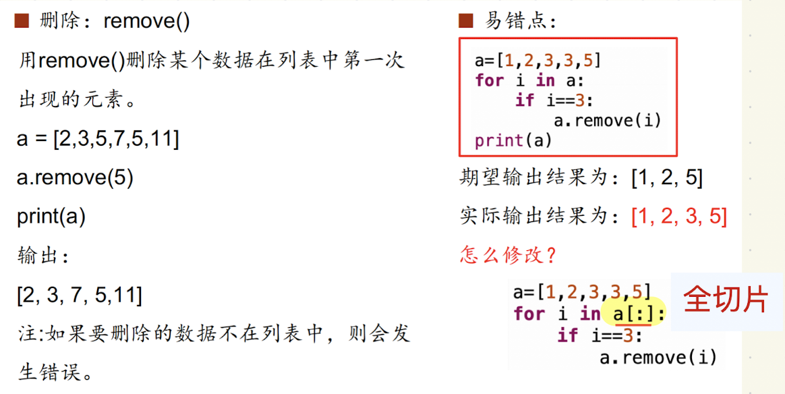

# 删除元素的方法
## 列表
| 方法/语句     | 用法                    | 删除依据     | 不存在时报错？     | 返回值             |
|---------------|-------------------------|--------------|--------------------|--------------------|
| `pop([i])`    | `lst.pop()` 或 `pop(i)` | 下标         | 是（`IndexError`） | 删除并返回该元素  |
| `remove(x)`   | `lst.remove(x)`         | 元素值       | 是（`ValueError`） | 无                 |
| `del lst[i]`  | `del lst[i]`            | 下标         | 是（`IndexError`） | 无                 |
| `del lst[:]`  | 删除整个列表内容        | 切片         | 否                 | 无                 |
| `clear()`     | `lst.clear()`           | 清空整个列表 | 否                 | 无                 |
## 集合
| 方法         | 用法             | 删除依据 | 不存在时报错？     | 返回值             |
|--------------|------------------|----------|--------------------|--------------------|
| `remove(x)`  | `s.remove(x)`    | 元素值   | 是（`KeyError`）   | 无                 |
| `discard(x)` | `s.discard(x)`   | 元素值   | 否                 | 无                 |
| `pop()`      | `s.pop()`        | 随机元素 | 是（`KeyError`）   | 返回被删除元素     |
| `clear()`    | `s.clear()`      | 清空集合 | 否                 | 无                 |
## 字典
| 方法         | 用法                   | 删除依据  | 不存在时报错？     | 返回值                    |
|--------------|------------------------|-----------|--------------------|---------------------------|
| `pop(k)`     | `d.pop(k)`             | 键        | 是（`KeyError`）   | 删除并返回该键对应的值   |
| `pop(k, v)`  | `d.pop(k, default)`    | 键        | 否                 | 默认值或无                |
| `popitem()`  | `d.popitem()`          | 最后一对  | 是（`KeyError`）   | `(key, value)` 元组       |
| `del d[k]`   | `del d['key']`         | 键        | 是（`KeyError`）   | 无                        |
| `clear()`    | `d.clear()`            | 清空字典  | 否                 | 无                        |
## 字符串
| 方法       | 说明                     | 是否可变 | 删除方式           |
|------------|--------------------------|----------|--------------------|
| 切片替换法 | `s = s[:i] + s[i+1:]`    | 否       | 构造新字符串替代原始 |

易错的一个点：  


---

解释器启动
→ 创建内建命名空间（builtins）
→ 加载主模块，创建全局命名空间
→ 函数定义（记录其作用域）
→ 函数调用（创建局部命名空间）
→ 若有嵌套函数，形成 enclosing 命名空间
→ 每次查找变量名时，遵循 LEGB 顺序

---

# 计算
## 优先级
| 优先级等级 | 运算符                  | 描述                                 | 示例                    |
|------------|--------------------------|--------------------------------------|-------------------------|
| 1（最高）  | `()`                     | 圆括号（表达式分组）                 | `(a + b) * c`           |
| 2          | `x[index]` `x.attr`      | 下标、属性访问                       | `list[0]`, `obj.attr`   |
| 3          | `**`                     | 幂（右结合）                         | `2 ** 3 ** 2`           |
| 4          | `+x` `-x` `~x`           | 正负号、一元按位取反                 | `-a`, `+b`, `~c`        |
| 5          | `*` `/` `//` `%`         | 乘、除、整除、取余                   | `a * b`, `a % b`        |
| 6          | `+` `-`                  | 加法、减法                           | `a + b`, `a - b`        |
| 7          | `<<` `>>`                | 位移运算                             | `a << 2`                |
| 8          | `&`                      | 按位与                               | `a & b`                 |
| 9          | `^`                      | 按位异或                             | `a ^ b`                 |
| 10         |  \|                     | 按位或                               | `a | b`                 |
| 11         | `==` `!=` `>` `<` `>=` `<=` `is` `is not` `in` `not in` | 比较运算 | `a == b`, `a in list` |
| 12         | `not`                    | 逻辑非                               | `not a`                 |
| 13         | `and`                    | 逻辑与                               | `a and b`               |
| 14         | `or`                     | 逻辑或                               | `a or b`                |
| 15（最低） | `=`, `+=`, `-=`, ...     | 赋值运算符                           | `a = b`, `a += 1`       |
## 。。。
```/ ```总是返回浮点数

---

# 数据类型
## 元素类型限制
| 数据类型   | 元素是否可重复 | 是否有序 | 元素类型限制                     |
|------------|----------------|-----------|----------------------------------|
| 列表 list  | ✅ 可以重复     | ✅ 有序   | 任意类型                         |
| 字典键     | ❌ 不可重复     | ❌ 无序（3.7+起逻辑上有序） | 必须是可哈希（不可变）类型       |
| 字典值     | ✅ 可以重复     | 无顺序性要求 | 任意类型                      |
| 集合 set   | ❌ 不可重复     | ❌ 无序   | 必须是可哈希（不可变）类型       |

## 检查元素是否位于某个数据类型中
### in
| 适用类型       | 用途             | 示例                            |
| ---------- | -------------- | ----------------------------- |
| 字符串 `str`  | 检查子串是否存在       | `'a' in 'abc'` → `True`       |
| 列表 `list`  | 检查元素是否存在       | `3 in [1, 2, 3]` → `True`     |
| 元组 `tuple` | 同上             | `'a' in ('a', 'b')` → `True`  |
| 集合 `set`   | 同上             | `2 in {1, 2, 3}` → `True`     |
| 字典 `dict`  | 检查“键”是否存在（不是值） | `'key' in {'key':1}` → `True` |

### find() 方法（仅用于字符串）
| 适用类型      | 用途              | 示例                       |
| --------- | --------------- | ------------------------ |
| 字符串 `str` | 查找子串位置，找不到返回 -1 | `'abc'.find('b')` → `1`  |
|           |                 | `'abc'.find('x')` → `-1` |

>✅ 适合做：if s.find(x) != -1: 来判断字符串中是否包含子串。

### get() 方法（仅用于字典）
| 适用类型      | 用途                      | 示例                            |
| --------- | ----------------------- | ----------------------------- |
| 字典 `dict` | 获取键对应的值，若键不存在返回默认值 None | `d.get('x')`, `d.get('x', 0)` |
|           |                         | `{'a':1}.get('b')` → `None`   |

>✅ 适合安全访问字典键，避免抛出 KeyError。

### 总结
| 方法/运算符 | 适用类型       | 是否返回布尔值 | 用途                         |
|--------------|----------------|----------------|------------------------------|
| `in`         | str/list/tuple/set/dict | ✅ 是        | 判断元素/键是否存在         |
| `find()`     | str            | ❌ 否（返回索引） | 查找子串位置，-1 表示不存在 |
| `get()`      | dict           | ❌ 否（返回值或默认） | 安全获取键对应的值      |

---

# 一些函数
```.isalnum()```检验是否只含数字或字母，并至少含一个字符
```.isalpha() ```检验是否只含有字母字符
```.isascii()``` 检验是否仅包含asc2码
```.isdecimal()``` 检验字符串是否只包含十进制字符（即数字字符，不包括负号、小数点）
```.isdigit() ```是否只含数字字符
```.islower() ```是否全是小写
```.isidentifier() ```是否是一个有效的标识符（符合python标识符规则的字符串）
```.isnumeric() ```是否只包含数字字符/i```.isdigit()```
```.isspace() ```是空格或回车

```.title() ```每个单词的首字母大写，其余字母小写
```.upper() ```所有大写 ```.lower()``` 所有小写

---

# ```zip()```
## 打包两个列表（并行配对）
```python
a = [1, 2, 3]
b = ['a', 'b', 'c']

z = zip(a, b)
print(list(z))  # [(1, 'a'), (2, 'b'), (3, 'c')]
```

## 打包多个列表
```python
a = [1, 2]
b = ['x', 'y']
c = ['!', '?']

print(list(zip(a, b, c)))  # [(1, 'x', '!'), (2, 'y', '?')]
```

遇到不同长度：默认按最短截断  

## 典型应用场景
1. 并行遍历两个或多个序列
```python
names = ['Alice', 'Bob']
scores = [90, 85]

for name, score in zip(names, scores):
    print(f"{name}: {score}")
```

2. 转置二维矩阵（行转列）
```python
matrix = [
    [1, 2, 3],
    [4, 5, 6]
]

transposed = list(zip(*matrix))
# [(1, 4), (2, 5), (3, 6)]
```

3. 解压已打包的数据
```python
pairs = [(1, 'a'), (2, 'b')]
nums, letters = zip(*pairs)

print(nums)    # (1, 2)
print(letters) # ('a', 'b')
```

4. 构造字典
```python
keys = ['name', 'age']
values = ['Alice', 22]

d = dict(zip(keys, values))
# {'name': 'Alice', 'age': 22}
```

5. 与 enumerate() 搭配使用（同时拿下标和多个值）
```python
a = ['A', 'B']
b = [10, 20]

for i, (x, y) in enumerate(zip(a, b)):
    print(f"{i}: {x} - {y}")
```

---

## ```enumerate()```
### 基本用法
```enumerate(iterable, start=0)```   
interable:可迭代对象（如列表、元组、字符串等）  
start：起始下标（默认值是0）  
返回值：一个可迭代的enumerate对象，其中每个元素是一个(index,value)的元组  

```python
lst = ['a', 'b', 'c']

for index, value in enumerate(lst):
    print(index, value)
```

输出  
```
0 a
1 b
2 c
```

---

# 异常处理
```python
try:
    # 可能出错的代码
except SomeException:
    # 捕获特定异常
else:
    # 如果没出错，执行这里
finally:
    # 无论有没有出错，都会执行

try:
    x = int("123")
except ValueError:
    print("转换失败")
else:
    print("成功转换为整数")
finally:
    print("程序结束")
```

常见异常类型一览

| 异常类                 | 说明          |
| ------------------- | ----------- |
| `ZeroDivisionError` | 除零错误        |
| `ValueError`        | 类型转换失败、无效数值 |
| `TypeError`         | 错误类型运算      |
| `IndexError`        | 索引越界        |
| `KeyError`          | 字典中键不存在     |
| `FileNotFoundError` | 文件未找到       |
| `IOError`           | 文件读写错误      |

---

集合s1,s2
* 交集 s1.union(s2) s1|s2
* 并集 s1.intersection(s2) s1&s2
* 差集 s1.difference(s2) s1-s2
* 对称差 s1.symmertric_difference(s2) s1^s2 除共同元素之外的所有元素

# *和**的用法
# 1. *（星号）用法

*主要用于解包可迭代对象（如列表、元组）和收集位置参数。

## a. 用于函数定义中的参数收集（收集位置参数）

*args 是一个常见的写法，它用于收集函数中的可变数量的非关键字参数，并将它们封装成一个元组。
``` python 
def example(*args):
    for arg in args:
        print(arg)

example(1, 2, 3, 4)
# 输出：
# 1
# 2
# 3
# 4
```

*args 会把函数调用时传递的所有位置参数（非关键字参数）收集到一个元组 args 中。
可以传入任意数量的位置参数。

## b. 用于函数调用中的解包（解包可迭代对象）

*也可以用于函数调用时，解包一个可迭代对象（如列表、元组），把它的元素当作单独的参数传递给函数。
```python 
def add(a, b, c):
    return a + b + c

numbers = [1, 2, 3]
result = add(*numbers)  # 解包列表
print(result)  # 输出 6
```
*numbers 会解包列表 [1, 2, 3]，将其元素作为位置参数传递给 add() 函数。

## c. 用于解包字典中的键值对（不常见）

  *也可以用来解包字典中的键（但这种用法更常见的是 **，用于字典的解包）。
```python 
my_dict = {'a': 1, 'b': 2}
def print_keys(*args):
    print(args)

print_keys(*my_dict)  # 解包字典的键
# 输出:
# ('a', 'b')
```
*my_dict 解包字典的键，即 'a' 和 'b'。


# 2. **（双星号）用法

** 主要用于解包字典和收集关键字参数。

## a. 用于函数定义中的参数收集（收集关键字参数）

**kwargs 是一个常见的写法，用于收集函数中的可变数量的关键字参数，并将它们封装成一个字典。
```python 
def example(**kwargs):
    for key, value in kwargs.items():
        print(f"{key}: {value}")

example(name="Alice", age=25, city="New York")
# 输出：
# name: Alice
# age: 25
# city: New York
```
**kwargs 会把函数调用时传递的所有关键字参数收集到一个字典 kwargs 中。
可以传入任意数量的关键字参数。

## b. 用于函数调用中的解包（解包字典）

** 也可以用于函数调用时，解包字典，把字典中的键值对当作关键字参数传递给函数。
```python 
def greet(name, age):
    print(f"Hello {name}, you are {age} years old.")

person_info = {"name": "Alice", "age": 25}
greet(**person_info)  # 解包字典
# 输出:
# Hello Alice, you are 25 years old.
```
**person_info 会解包字典 person_info 中的键值对，并将其作为关键字参数传递给 greet() 函数。

## c. 用于字典合并

** 可以用来合并多个字典。
```python 
dic1 = {"a": 1, "b": 2}
dic2 = {"b": 3, "c": 4}
merged_dic = {**dic1, **dic2}  # 合并字典，dic2 的值会覆盖 dic1 中相同的键
print(merged_dic)
# 输出: {'a': 1, 'b': 3, 'c': 4}
```
**dic1, **dic2 会将 dic1 和 dic2 合并成一个新的字典，且 dic2 中的键值对会覆盖 dic1 中相同的键。


# 3. * 和 ** 组合使用

你可以在同一个函数定义中同时使用 *args 和 **kwargs，来收集位置参数和关键字参数。
```python 
def example(a, b, *args, **kwargs):
    print(f"a: {a}, b: {b}")
    print(f"args: {args}")
    print(f"kwargs: {kwargs}")

example(1, 2, 3, 4, 5, name="Alice", age=25)
# 输出：
# a: 1, b: 2
# args: (3, 4, 5)
# kwargs: {'name': 'Alice', 'age': 25}
```
a 和 b 是普通的位置参数。
*args 收集剩余的位置参数（3, 4, 5）。
**kwargs 收集关键字参数（name="Alice" 和 age=25）。

# 4. * 和 ** 在函数调用中的顺序
在函数调用中，位置参数必须出现在关键字参数之前。
解包的字典和可迭代对象也必须遵循这个规则。
```python 
def example(a, b, c):
    print(a, b, c)

nums = [1, 2]
kwargs = {'c': 3}

# 解包列表和字典
example(*nums, **kwargs)
# 输出: 1 2 3
```
*nums 解包列表 [1, 2]，**kwargs 解包字典 {'c': 3}。


# 5. * 和 ** 在函数定义中的高级用法

## a. 强制关键字参数

从 Python 3 中，* 可以用于强制函数的参数必须作为关键字参数传递。这意味着在参数列表中，* 后面的参数必须通过关键字传递，而不能作为位置参数。
```python 
def example(a, b, *, c):
    print(a, b, c)

# 正确调用
example(1, 2, c=3)

# 错误调用，会抛出 TypeError
# example(1, 2, 3)  # 位置参数不能传递给 c
```
## b. 可变数量的参数和关键字参数

你可以在同一个函数中同时使用 * 和 ** 来处理可变数量的位置和关键字参数。
```python 
def example(a, b, *args, c, **kwargs):
    print(a, b, args, c, kwargs)

example(1, 2, 3, 4, 5, c=6, name="Alice", age=25)
# 输出: 1 2 (3, 4, 5) 6 {'name': 'Alice', 'age': 25}
``` 
总结：
* *用于函数定义时收集位置参数，并在函数调用时解包可迭代对象。
* ** 用于函数定义时收集关键字参数，并在函数调用时解包字典。
* *和 ** 在函数定义中可以组合使用，允许你灵活处理不同类型的参数。
* *也可以用于强制关键字参数和字典解包。