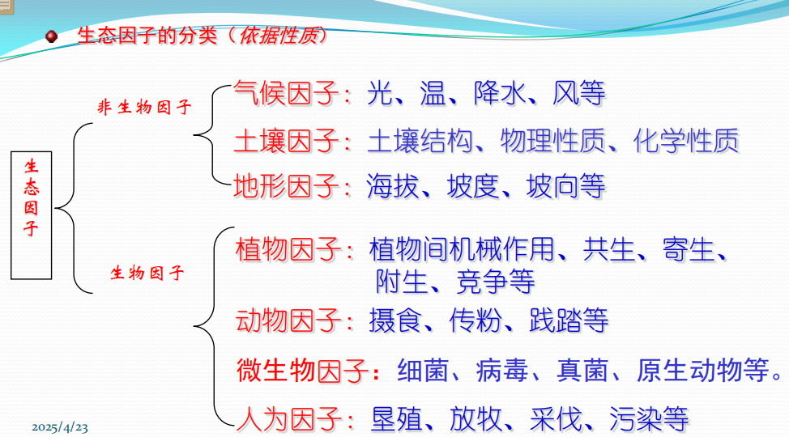
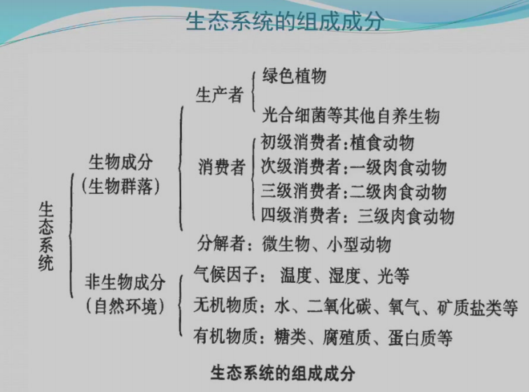
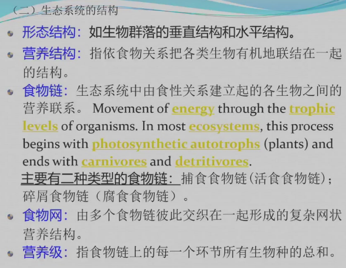
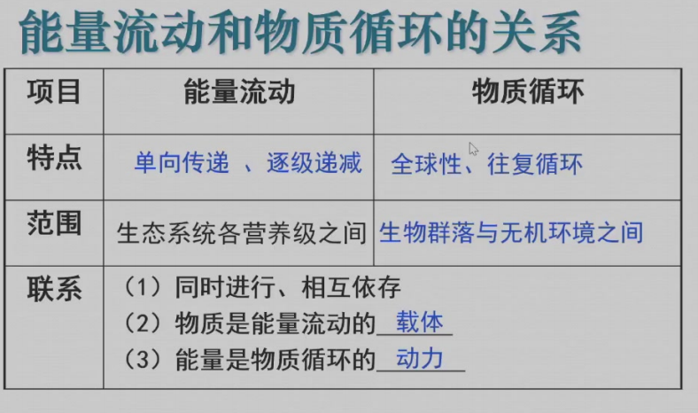

# 第七章
!!! warning 
    建议直接背98上那个整理的提纲，因为我背的就是那份

==**生物圈**== 地球上存在着生物并受其生命活动影响的区域叫做生物圈。它包括大气圈的下层，整个水圈和岩石圈的上层，厚度达20km。而生物的大部分个体集中分布于地表上下约100m厚的范围内，形成环绕地球的一个生命膜  

生物圈的结构  

* 垂直准正态分布式结构：集中分布在某一范围内，向上和向下都逐渐减小  
* 水平连续不均匀结构
* 多级嵌套结构

## 一、地球的生物界

>名词解释: 生物圈，岩石圈，水圈，大气圈，物种，盖亚假说。  
>简要说明生物圈的演化史，并思考其与地质、大气演化的协同关系。  
>物种命名有何法则？  
>地球上的生物主要可分哪些界，各有什么主要特征？ 

生命的起源：从无机物到简单有机物阶段；从简单有机物到复杂有机物阶段；从高分子有机物到具有新陈代谢机能的蛋白体阶段  
生命体的演化：生物种类由少到多；生物圈结构由简单到复杂；生物分布的空间范围由小到大并由海洋向陆地拓展。  
### 生物的分类与命名

**分类学**：探讨生物多样性的学科叫做分类学。它从事对生物的基本分类，并且研究多样性的进化、生态与行为的科学  
**生物的命名**：双名法。属名加种名

* 原核生物界
    * 原核生物是一类起源古老、细胞结构简单、不具备核膜，没有明显细胞核的原始生物。包括细菌和蓝藻。
* 原生生物界
    * 原生生物是由原核生物进化而来的另一类微生物，有机体以单细胞的为主，也有一些群体。**细胞内都具有由核膜包围起来的真正的细胞核，属于真核生物**。主要生活在水中和潮湿的陆地环境中  
* 植物界
    * 细胞中具有明显细胞核的真核生物，有机体的细胞中多含有叶绿素或其它色素，能够利用太阳光能制造有机食物的自养生物。极少数为非绿色的寄生物。包括蓝藻之外的全部藻类植物和所有高等植物  
    * 苔藓植物
    * 维管植物
        * 蕨类植物：个体很小，有类似于茎叶的分化而无真根，体内没有起输导作用的维管束组织，是高等植物演化的一个盲枝
        * 裸子植物
        * 被子植物
* 真菌界
    * 属于真核生物。体内不含可进行光合作用的任何色素而为营腐生或寄生生活的异养生物；有机体大多由多细胞的菌丝汇集在一起形成的菌丝体，以孢子进行繁殖  
* 动物界
    * 不含光合色素的真核异养生物。没有细胞壁
        * 环节动物-蚯蚓、水蛭等
        * 软体动物-蜗牛、田螺等
        * 节肢动物-虾、蟹、蜘蛛等
        * 脊椎动物-圆口类、鱼类、两栖类、爬行类、鸟类、哺乳类  

界门纲目科属种  

## 二、生物与环境

> 生态因子、生态幅、限制因子定律、物候
> 生态因子的作用有什么特点  
> 光照、温度、水分、空气、土壤的生态因子，分别通过什么方式对生物产生影响  
> 生物对环境的指示作用  
> 生物之间是如何相互作用、相互联系的  
> 什么是趋同效应、趋异适应  

环境是指生物有机体或生物群体所在空间内的一切事物和要素的总和。生物是主体，环境是相对主体而言的,它包括非生物的所有自然要素也包括主体生物之外的其他一切动植物。  

### 生态因子作用的一般特点

==**生态因子**==：环境中对生物的生长、发育、繁殖、行为和分布有影响的环境要素叫生态因子  
**生态条件**：生态因子中生物生存不可缺少的那些因子
**限制因子**：接近或超过耐性上下限的生态因子

**生态因子对生物作用的一般特点**

* 综合性
* 非等价性
* 不可替代性
* 限制性  

==**生态幅**== ：每一种生物对每种生态因子都有一个耐受范围，即有一个生态上的最低点和最高点。在最低点和最高点之间的范围  

### 生态因子与生物

1.光与生物

* 光的性质，即光的波长对植物的生态作用
    * 红橙光和蓝光被绿色植物吸收的最多，是光合左右中最有效的生理辐射光
    * 红光-糖
    * 蓝光-蛋白质
    * 黄光绿光多被反射
    * 紫外光能抑制茎的生长和促进花青素的形成，还对生物具有杀伤致死作用
* 光照强度的变化
    * 纬度、海拔高度、地形、时间、生态系统内
* 光照强度与生物
    * 水生生物：分布在光补偿点以上的位置
    * 陆生植物：阳性植物和阴性植物
    * 动物性行为：昼行性、夜行性、第三类、广光性
* 日照强度与生物
    * ==光周期现象==：生物对日照长短或说对昼夜长短比例的反应格式

2.温度与生物

2.1 温度与植物  

* 植物生命活动与温度条件
    * 水分代谢：水分和矿物质的吸收、蒸腾作用
    * 影响生化反应的酶的作用：光合作用、呼吸作用
        * 光合左右达到最高时的温度-光合最适温度
        * 净光合作用为零时的温度，称为热补偿点
* 变温对植物的影响

**非周期性变温**  

* 低温胁迫机理
    * 冻害：细胞间隙中形成冰晶，造成机械损伤；冰晶迅速融解时，造成原生质撕裂损伤
    * 寒害（冷害）：主要是使植物生理活动活性降低，代谢紊乱，生理平衡被破坏。也会使细胞透性降低，引起生理性干旱
    * 霜害：当气温或地表温度下降到0℃，空气中过饱和的岁起凝结成白色的冰晶，即霜，土壤表面和植物表面的温度下降到足以引起植物幼嫩器官伤害或者子网的短时间的低温伤害
* 植物对低温的适应
    * 形态：植株矮小、冬季落叶、芽具鳞片、树皮有较厚的木栓组织等。芽和叶片手油脂类物质保护，植物体表面被蜡粉和密毛，颜色深暗
    * 生理：细胞液浓度增加，冰点降低。代谢减弱，逐渐进入休眠等。
    * 行为：白天叶子张开，晚上闭合，花向着太阳转动
* 影响植物抗寒性的因素：物种、器官、外界环境

* 高温危害：
    * 破会啊光合左右和呼吸作用平衡，导致饥饿死亡
    * 使蒸腾作用加强，破破坏水分平衡
    * 使蛋白质凝固变性，原生质和酶活性丧失甚至凝固；代谢紊乱，有害的代谢中间产物积累，而毒害植物
    * 使树皮、根、茎灼伤
* 植物对高温的适应
    * 形态结构：植物体表面有密绒毛或鳞片；植物体白色、银白色，叶片革质发亮；叶片呈垂直方向排列；树干和根茎有厚的木栓层保护；荒漠植物枝叶开阔，远离地面（避热适应）
    * 生理：强烈的蒸腾；降低细胞含水量、增加可溶性糖或盐的浓度，增加原生质的抗凝结能力；减缓代谢速率（耐热适应）
    * 行为：主要通过叶片的运动，如在光照过强或温度过高时，叶片卷缩、弯曲（避热适应）

**周期性变温（节律性变温）**

* 在自然条件下，气温有着周期性变化，植物适应了某种节律变化而成为一种生物学特征，被称为“**温周期现象**”

**积温**：植物生长发育期间日平均温度的总和  
**有效积温**：生物学零度以上的日平均温度的累加
**生物学零度**：植物生长发育的温度起点（下限温度）  
**有效积温法则**：植物各个发育期需要满足一定的有效积温才能进入下一阶段的发育期  

==**春化作用**==：温带一些一二年生植物，在种子萌发期间，必须在一定时期的低温条件下经过一段时间，以后才能开花结实。低温促进一二年生植物开花的这种作用称为春化作用。  

==**物候**==：动植物长期适应于一年中的温度、水分与光照等生态因子的节律性变化，形成与此相适应的生长发育节律和生命活动规律，称为物候  

2.2 温度与动物  

动物因热能代谢特征的不同分为恒温动物、变温动物、异温动物  
温度对动物生长发育和形态的影响表现在低温可以延缓恒温动物的生长，由于其性成熟延缓，动物可以活得更久，长得更大  

动物对温度的适应

* **贝格曼定律**：生活在寒冷气候中的内温动物的身体比生活在温暖气候中的同类个体更大，从而使得单位体重散热量较少，是减少散热的一种形态适应
* **阿伦定律**：恒温动物身体的突出部分如四肢、尾巴和外耳等在低温环境中有变小变短的趋势，减少散热的一种形态适应
* 恒温动物对低温还有增加毛和羽毛的数量和质量、增加皮下脂肪的厚度

3.水和生物

3.1 水的作用  
懒得打  

3.2 水对生物的影响  
**水分与植被** 

* 水生植物
    * 沉水植物：全部植物体都沉没于水中，扎根与水体基质中，营固着生活
    * 浮水植物：叶片漂浮在水面上
        * 完全漂浮植物
        * 扎根浮叶植物
  * 浮游植物
  * 挺水植物
* 陆生植物
    * 湿生植物：在潮湿的环境中生长，不能忍受长时间的水分不足，即抗旱能力最弱的陆生植物
    * 中生植物：生长在水湿条件适中的环境中
    * 旱生植物：生长在干旱环境，在长期或间歇干旱下仍能维持水分平衡和正常的生长发育的陆生植物
        * 多浆液植物
        * 少浆液植物

* 恒水植物：绝大多数植物不能忍受过量的失水，其含水量变幅小
* 变水植物：很少数的低等植物，如地衣、瓦松等可耐受严重的干旱，并可重新吸水恢复生长

4.空气和植物

4.1 空气化学成分与生物  
绿色植物对大气污染具有净化作用：对有害气体的吸收、减尘作用、杀菌作用、减弱噪声、吸滞放射性物质和二氧化碳  

4.2 空气运动与生物  
风是植物孢子、划分、种子、果实传播的动力  

5.土壤与生物  
不想打了  

就植物对土壤中钙盐的反应，可以分为喜钙植物和嫌钙植物。  

**盐害/盐胁迫**：

* 引起植物生理性干旱
* 伤害植物组织。盐类积聚在表土时常伤害根、茎交界处的组织，土壤盐碱性对植物根系还具有很强的腐蚀作用
* 引起细胞中毒。由于土壤盐分浓度过大，植物奶体内常积聚着大量的盐类，盐分过多会导致植物生理紊乱，使原生质受害
* 土壤强碱性会引起土壤物理性质恶化：土壤结构被破坏，质地变劣，湿时粘重，干时板结  
* 甜土植物
* 盐土植物
    * 聚盐植物，真盐生植物
    * 泌盐植物
    * 避盐植物

根据植物对土壤养分含量的适应特征，可把植物分成贫养植物、中养植物、和富养植物三种类型  

根据植物对土壤中硝酸盐态氮含量的适应特征，可把植物分为喜硝植物和嫌硝植物。  

沙生植物、岩生植物  

6.生物之间的关系  

**6.1 竞争**  
种间竞争的结果是发生**生态分离**  
**高斯的生态竞争原理**：生态学上相同的两个物种不可能在同一地区内共存  

**6.2 寄生作用**  
一种物种的个体（寄生物）生活在另一个物种个体（寄主）的体内或体表，并从其体液或组织中吸收营养以维持生存  
寄生常降低寄主的抵抗力，但不一定导致寄主生物的死亡  

**6.3 捕食作用**  

捕食生物袭击并捕杀被捕食者生物作为食物  

**6.4 原始合作与互利共生**  

**原始合作又称互助**，在一起生活的两物种彼此从中都获得利益，但他们并不需要相互依赖，可以单独生存  
**互利共生**则是两个不同物种的有机体密切地结合在一起，在共同的生活中双方均获得利益，但彼此不能分开单独生存  

**植物与植物群落对环境的指示作用**  
指示植物作用
* 指示矿藏、水文；指示生态状况；指示气候、古气候特征；指示时间、方向、地震、地质灾害、病毒等  

### 生物对环境的适应
1.生物的适应  

生物的形态结构、生理机能、个体发育和行为等特征与其长期生存的一定环境条件相互统一  
生物在环境中经过生存竞争而形成的一种适合环境条件的特征与性状的现象，是自然选择的结果  

2.适应方式  

==**趋同适应**==：是指亲缘关系相当疏远的不同种类的生物，由于长期生活在相同或相似的环境中，通过变异和选择，形成相同或相似的适应特征和适应方式的现象。  
==**趋异适应（辐射适应）**==：同一种生物的若干个体，在不同环境条件下长期生活，形成了不同的适应特征和适应方式。

## 三、生物种群和生物群落
>生物群落、生物群落、生态位、演替  
>生物种群有哪些基本特征  
>影响种群动态的因素  
>生物群落的演替有哪些类型  
>如何利用生物群落演替的规律开展生态修复

1. **种群及其一般特征**
==**种群**==： 在同一时期内占有一定空间的同种生物个体的集合。种群不仅是物种存在、物种繁殖、物种进化和表达种内内在关系的基本单位，也是生物群落的基本组成单位，同时也是生物资源开发、利用和保护的具体对象和生态系统研究的基础  

**种群的数量和密度**  

* 影响因素
  * 物种的繁殖特性、种群的年龄结构和性比、种内和种间竞争、环境条件的不同和变化  

**种群的年龄结构和性比**  

**种群个体的水平分布格局**  

* 随机分布
* 均匀分布
* 集群分布

种群的成群分布形式形成因素：  
* 环境资源分布不均匀
* 植物的繁殖往往以母株为扩散中心
* 动物的社会行为使其结合成群

**出生率和死亡率**  

**种群增长**  

2. **生物群落及其特征**
==**生物群落**==：若干个生物种群有规律地结合在一起，形成为一个多生物种、完整而有序的生物体系  

* 种类构成
    * 物种多样性：生态群落种物种数目的多少（丰富度）和各物种个体数目的多少（均匀度）两个参数的结合
    * **生态位**：群落中每一个生物种群在时间空间上所占据的位置及其与相关种群之间的功能关系与作用。近义词：资源利用谱
    * ==**优势种**==：个体数量多、生物量大，枝叶覆盖地面的程度也大，生活能力强，对生境具有明显影响的生物种群
    * ==**建群种**==：优势种中的最优势者，即覆盖面积大占有最大空间，在建造群落和改造环境方面作用最突出的生物钟
    * 伴生种：群落中的其他次要的种类
* 群落的外貌与植被的生活型
    * **生活型**：植物长期受一定环境综合影响所表现出来的生长形态
    * 植物群落的外貌主要决定于群落优势种的生活型
* 群落的结构
    * 群落的垂直结构-成层现象
    * 群落的水平结构-镶嵌型
    * 群落的时间结构
    * 群落的生态结果-层片
      层片具有一定的种类组成，这些种类具有一定的生态生物学一致性，而且特别重要的是它具有一定的小环境，这些小环境构成植物群落环境的一部分  
* 群落环境-群落内部显著不同于其周围裸地的环境  
* 生物群落的动态
    * 植物群落的季节变化
      **季相**：在不同 季节植物发芽、展叶、开花、结果、落叶、休眠等。
* 生物群落的演替
    * **演替**：在一定地段上一种群落被另一种群落所代替的过程叫做演替  
    * 按群落所在地的基地状况分为原生演替和次生演替
    * 按群落演替发展方向氛围进展演替和逆行演替

## 四、植被与生态系统
> 中国植被分类采用什么原则和分类等级体系  
> 生态系统由哪些组分构成、如何理解生态系统的营养级结构  
> 如何表征生态系统的初级生产和次级生产能力，生态系统各营养级间能量传递的林德曼定律有何启示作用》根据储存库和物质形态，生态系统的物质循环可分哪些类型
> 生态系统如何维持与调节其稳定性  

1.**概念**  
* ==**植被**==：覆盖在一定地区地表的所有植物群落的总称。
    * 主要分类单位：植被型、群系和群丛
    * 植被型：中国植被分类的高级分类单位，是建群种或上层优势种的生活型相同的群系联合
    * ==群系==：中级分类单位，指建群种或共建群种相同的植物群落的联合
    * 群从：分类的基本单位，为乔灌草各个层次的优势种相同的同类群落的联合  
* **生态系统**：一定地区内，生物和它们的非生物环境（物理环境）之间进行着连续的能量和物质交换所形成的一个生态学功能单位

2.**生态系统的组分和结构**

**2.1 生态系统的组分**  
非生物成分+生物成分（生产者、消费者、分解者）

**2.2 生态系统的结构**

3.**生态系统的功能**  
生态系统的功能，即系统的能量流动、物质循环和信息的传递  

**3.1生态系统的生物生产**  

* 初级生产
   * 初级生产：绿色植物固定并转化太阳能，生产有机质的过程
   * 初级生产者（第一性生产者）：初级生产的生产者，如绿色植物
   * 初级生产力：初级生产者积累能量的能力
   * 初级生产量：初级生产过程的生产量
   * ==总初级生产力==（总第一性生产量GPP，Pg）：单位时间单位面积绿色植物的生产量
   * ==净初级生产量==（总第一性净生产量，Pn）：初级生产者扣除呼吸消耗而真正积累的生产量，Pn=Pg-R
   * 光能利用率：净初级生产力与到达地表的单位面积光能的百分比
* 次级生产
    * 次级生产：指生态系统中消费者或分解者利用净初级生产量进行童话作用的过程。或者说是异养生物对初级生产物质的利用和再生产过程
    * 净次级生产量
生物量金字塔：以生物组织的干重表示每一个营养级中生物的总重量  

**3.2生态系统的能量流动**  

来自太阳能，开放的能量系统，单向、不可逆、逐级递减  

生态效率：各营养级的能量利用效率，即能量沿食物链流动过程中，后一营养级能量与前一能量级能量的比值  

林德曼效率：指生态效率通常为10%的规律  

生态金字塔：指将食物链中每一营养级上的生产量或能量按营养级高低由下而上用图形重叠在一起形成的金字塔。有数目金字塔、生物量金字塔和生产力或能量金字塔三种表示方式 

**3.3生态系统的物质循环**  
又称生物地球化学循环。  
全球性、往复循环

**三大循环**：  

* 水循环
* 气体循环
* 沉积型循环

**3.4 生态系统中的物质传递**  
物理信息、化学信息、行为信息  

4.**生态系统的反馈调节与生态平衡**

**反馈机制**：指系统重某一成分发生变化时引起其他成分出现一系列变化，而这些变化最终又反过来影响最初发生变化的那种成分的过程  

* **负反馈**：通过自身功能减缓系统内的压力以维持系统的稳定。使系统得以保持稳定和平衡的最重要动力之一
* **正反馈**：常常使系统原理平衡状态和稳定
* **生态平衡**：系统处于相对稳定状态，系统中生物种群的结构与数量比例持久地没有明显的变动，生物与环境间的相互协调，能量与物质的输入与输出接近平衡，同时生态系统的结构与功能之间相互适应并达到最和谐的协调关系

## 五、陆地和水域生态系统
### 一、陆地生态系统的主要特征与分布规律
1.影响陆地生态系统分布的因素
纬度（太阳高度角、太阳辐射量）、经度（离海远近）、海拔  

2.陆地生态系统的分布规律
   1. 纬度地带性
   2. 干湿度带性（经度地带性）
   3. 垂直地带性  
   **垂直带谱**：每个山地的各个垂直带由下向上按一定顺序排列形成的垂直带系叫做山地垂直带结构或垂直带谱  
   **影响山地生物垂直带结构因素**：纬度、海陆位置、坡向海拔  

3.陆地生态系统的主要类型  
    地带性生态系统：分布在一定气候带的显域生境，即主要受大气候支配  
    非地带性生态系统：不确定分布在哪个地带内，而是分布在所有地带的适宜条件下  

3.1.热带地区生态系统

* 热带雨林系统
    * 植物种类组成丰富
    * 无明显季相变化
    * 群落结构复杂
    * 乔木有特殊构造（高大整齐的树干、树皮薄光滑、茎花、板状根）
    * 雨林中动物的一些特征（种类繁多，昆虫两栖类多，树栖种类多，多数营独居生活采用躲避不擅长快跑长跑）
* 热带季雨林生态系统
    * 树木与草被混生，系统的季相变化非常明显，主要包括雨季和旱季两个季相  
    * 食草动物占优势，动物多具有集群的生活习性，地栖种类占优势，穴居、善跑型动物突出  
* 热带稀树草原生态系统

3.2.亚热带生态系统

* 东岸-亚热带常绿阔叶林系统
   * 也称照叶林
   * 植物种类丰富，多数乔木具有被有腊膜的革质叶片，且常与光线垂直，能反射太阳光
   * 终年常绿
   * 众多的动物，种类组成混杂，有冬眠
* 西岸-亚热带常绿硬叶林与灌丛系统
* 内陆-亚热带荒漠生态系统

3.3.温带生态系统（具体的问高中去吧哦呵呵）
* 温带落叶阔叶林
* 温带草原生态系统
* 温带荒漠生态系统
* 寒温带针叶林系统 
  
3.4.寒带生态系统

### 水域生态系统的主要特征与类型
海洋生态系统、淡水生态系统  
**红树林**主要生活在以赤道为重忻的热带以及亚热带淤泥深厚的海滩上，在海陆交界的潮间带形成壮阔的海上森林  

## 六、社会-经济-自然复合生态系统
人类社会是一类以人的行为为主导、自然环境未能依托、资源流动为命脉、社会文化为经络的社会-经济-自然复合生态系统。即以人为主体的社会、经济系统和自然生态系统在特定区域内通过协同作用而形成的复合系统  
自然子系统、经济子系统、社会生态子系统  

生态农业、智慧农业、智慧城市  

## 七、生物多样性保护  

==**生物多样性**== 是指在一定时间和一定地区所有生物（动物、植物、微生物）物种及其遗传变异和生态系统的复杂性总称。包括遗传多样性、物种多样性、生态系统多样性  

* **遗传多样性**：指存在于生物个体内、单个物种内以及物种之间遗传变异的总和。表现在分子、细胞和个体三个层次  
* **物种多样性**：指某一区域生物群落中生物种类 丰富度或物种的总数目。需从分类学、系统学和生物地理学角度进行研究  
* **生态系统多样性**：生物圈内生境、生物群落和其生存环境间的生态过程的多样化以及生态系统内生境差异和生态学过程的多样化  

**生物多样性的保护**  
就地保护、迁地保护和离体保护