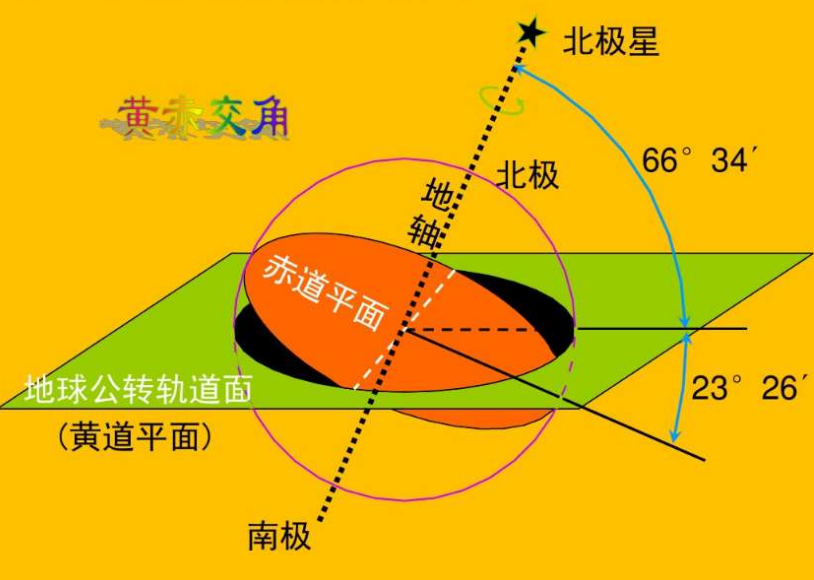
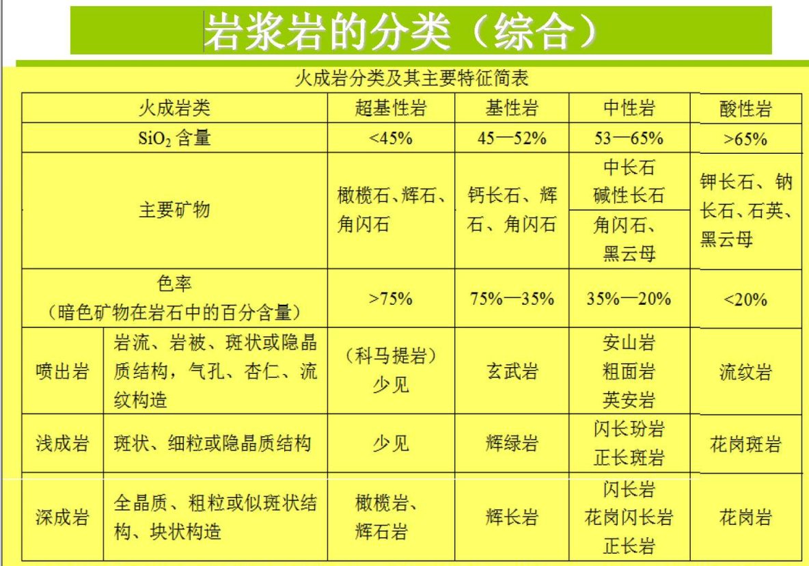
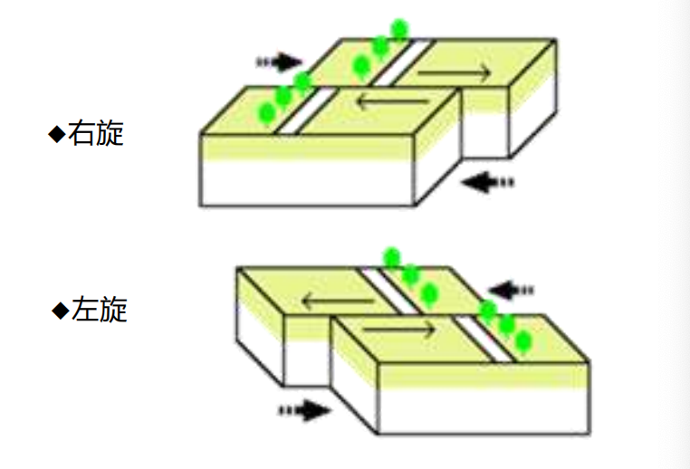
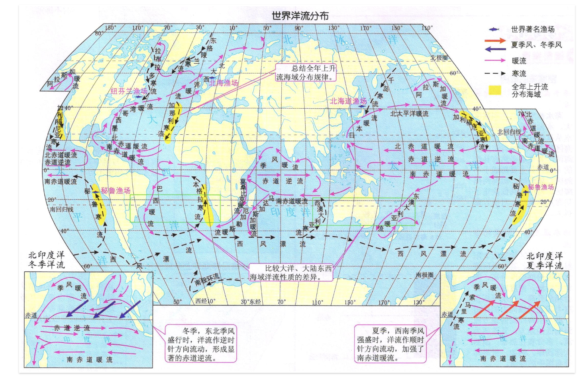
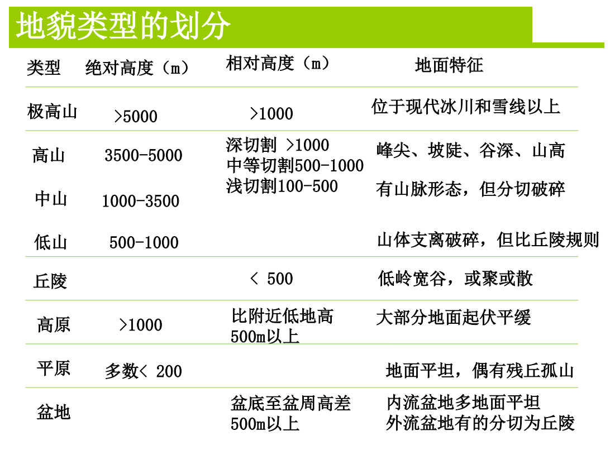

!!! note
    标黄部分是提纲中出现的内容，然后mkdocs的这个自动的目录旁边目录显示有点问题，等我有空就改（）
## 第一章 地球 地球环境 地球表层系统

!!! info "划重点"
    ✅地球表层系统的物质组成；✅地球表层系统的功能，结构，各圈层的功能（简要）;✅地球表层的基本特征;✅人类和地球表层环境的相互作用和影响；✅白道面，黄道面;✅近日点和远日点,✅一轴两面三角度;✅地球大小，形状，自转，✅公转的地理意义;✅科里奥利力;✅地球的圈层构造（简要）;✅地球表面的形态特征

### 地球在宇宙中的位置及其环境效益
#### 太阳系中的地球及其环境效益
* 太阳对地球的贡献
    * **太阳能辐射**
    * 太阳粒子流（太阳风、磁暴、太阳黑子）
    * 太阳引力
    * **地球公转**
    * 公转轨道偏心率的变化
    * 岁差
* 地球的公转
    * 近日点：1.3左右
    * 远日点：7.4
* 地球的公转
    * ==一轴（地轴）两面（黄道面、赤道平面）三角度（66度34分、23度26分）==

    * ==地球公转的地理意义==
        * 正午太阳高度角的变化
        * 昼夜长短的变化
        * 四季和五带的形成
#### 地月系中的地球及其环境效益
* 椭圆形，自西向东，==白道面==与黄道面的交角约为5度
* 周期为一个月
    * 朔望月：地心-日心连线，29日12时44分3秒
    * 恒星月：同一恒星方向，27日7时43分11.4秒
### 宇宙中的地球
#### 日地距离、形状、大小及其环境效应
* 日地平均距离1.496 × 10⁸ 千米  

==地球大小==  

* 平均半径 6370km
* 总质量 $5.98 × 10^{27}$ g
#### 地球的自转及其环境效应
15度/h

* ==地球自转的物理意义==
    * 昼夜更替、地表过程的昼夜节奏
    * 地方时不同，东早西晚
    * 产生自传偏向力-科氏力
    * 潮汐波
    * 地球局部运动的影响
* ==自转偏向力/科里奥利力==
    * D = 2vωsinA （v物体速度，ω地球自传加速度，A纬度）
    * 北半球偏右，南半球偏左
    * 影响：大气运动、洋流、热量和水分的全球平衡
#### 地球的圈层结构
* 地球的内部圈层

大陆上地壳平均厚度：35km（上花岗岩类硅铝层，下部玄武岩类硅镁层）  
大洋上地壳平均厚度：8km（玄武岩类硅镁层）
* 地球的外部圈层
    * 大气圈
    * 水圈
    * 生物圈
#### 地球表面的基本形态和特征
* 海陆分布
* ==地球的表面形态==
    * 地球表面起伏不平
    * 最高点珠穆朗玛峰8848.13m，最低点马里亚纳海沟11034m，地表最大垂直起伏约20km
    * 陆地平均高度875m，海洋平均深度3792m
    * 地表有二级面积较大、起伏较小的台阶，其一是海洋中深4000-5000m的大洋盆地，占地球总面积的22.6%，其二是大路上低于1000m的平原丘陵低山
    * 陆地可分为山地、平原、丘陵、高原、盆地
    * 海底可分为大陆边缘、大洋盆地、大洋中脊

### 地球表层系统
* 地球表层系统的三大界：人文界、有机界、无机界
* 地球表层系统的三态物质组成
* 地球表层环境的圈层结构、地球表层环境的自然地理系统
    * **岩石地形复合体**是自然地理系统的基本组成部分。（下界）
    * **大气**是自然地理系统的活跃部分。（上届）
        * C、H、O、N的物质循环
        * 物质和能量的载体
    * **水分**是自然地理系统其联系作用的组成部分
    * **土壤**是无机界与有机界物质和能量转化的关键环节
    * 自然地理系统的核心-**生物** 
* 地球表层环境的结构特征
    * 垂直分层
        * 从地核、地幔、地壳到水圈、大气圈等，大气圈又可分为对流层、中间层、暖层和散逸层
    * 水平分异
    * 立体交叉
        * 岩石圈、水圈等不是绝然分开，而是相互交叉、相互渗透，在空间上构成了一个立体交叉的结构
    * 多级嵌套
* 地球表层环境的功能
    * 物质传输、能量流动、信息传递；自我调节；支持生命；生命
* ==人类和地球表层环境的相互作用和影响==
    * 地球表层对人类：
        * 地球表层环境的演化与人类的诞生
        * 地球表层环境的区域分异与三大人种的形成
        * 地球表层环境对人口分布的影响
        * 地球表层元素组成与人体健康
        * 自然灾害对人类的影响
        * 地球表层环境对社会发展的影响
    * 人类对地球表层环境的作用与影响
        * 改变了地表物质循环
        * 改变了地表环境能量平衡
        * 对环境的污染与破坏
        * 改变了地表环境演化的方向和速率
        * 改变了地表环境的结构
        * 对自然资源的消耗
* ==地球表层环境的基本特征==
    * 太阳辐射集中分布于地表，太阳能的转化亦主要在地表进行
    * 固态、液态、气态物质同时并存于地表，使海洋表面成为液-气界面，海底成为液-固界面，使沿岸地带成为三相界面
    * 地球表面具有其特有的，由其本身发展形成的物质和现象，如生物、风化壳、土壤层等
    * 相互渗透的地表各圈层之间，进行着复杂的物质、能量交换和循环，并且在交换和循环中伴随着信息的传输
    * 地球表面存在着复杂的内部分异
    * 地球表面是人类社会发生、发展的环境，是人类活动的基本场所

## 第二章 地壳
!!! info "划重点"
    ✅矿物和岩石的概念；✅解理和断口；岩浆岩，沉积岩，变质岩;✅岩浆岩的分类，岩浆作用;✅岩浆岩的结构和构造;✅沉积岩的类型;✅变质作用;✅构造运动的基本方式;✅岩相和地层接触关系;✅海侵层位，海退层位，沉积旋回;主要地质构造类型。✅应力类型。;✅岩层产状要素;✅单斜,背斜，向斜，褶皱;✅节理，层面和断裂;✅断层类型及判断;✅板块构造学说，详述板块边界类型;✅威尔逊旋回;✅世界地震带分布;✅绝对年代和相对年代;✅地质年代表
### 地壳的组成部分
地壳-岩石圈主要有富含硅和铝的硅酸盐类岩石所组成
#### 矿物
* ==矿物==：天然形成的单质或化合物，具有一定的化学成分和内部结构（固体），具有一定的物理、化学性质及外部形态。是组成岩石的基本单元。
* 矿物的形成方式：升华、结晶、凝固、重结晶
* 矿物的形态
    * 单体形态：
        * 一向：柱状、针状
        * 二向延伸：板状、片状
        * 三向等长：立方体，八面体
    * 集合体形态
* 矿物的光学性质
    * 颜色：取决于矿物的化学成分及其结构
        * 本色、外色、假色
    * 条痕：矿物新鲜粉末的颜色
    * 光泽：矿物表面对光线的反射性质而成。金属、半金属、非金属光泽、
    * 透明度：光线透过矿物多少的程度，分透明和不透明
* 矿物的力学性质
    * 硬度：指矿物抵抗外力刻划、压入、研磨的能力
    * ==解理与断口==
        * 解理：矿物手外力作用沿一定方向破裂并产生解理面的性质叫解理
        * 断口：矿物手外力作用不规则破裂并产生凹凸不平的形状叫断口
    * 韧性：矿物抵抗切割、锤击、弯曲、拉引等外力作用的能力
* 七种主要造岩矿物：钾长石、角闪石、斜长石、辉石、石英、橄榄石、韵母（都属于硅酸盐矿物）
  
#### 岩石
* ==岩石== ：由矿物颗粒与粒间充填物组成。
* 岩石的结构和构造
    * 结构：指岩石中矿物的结晶程度、颗粒大小、晶体形态、自形程度以及它们之间的相互关系（**微观层面**）
    * 构造：指岩石中不同矿物集合体之间或矿物集合体与其他组成部分之间的排列和充填方式等（**宏观层面**）
    * 快速冷凝-结晶细，缓慢冷凝-结晶粗大

**岩浆岩（火成岩）**

* ==岩浆岩== 是由高温熔融的岩浆在地表或地下冷凝所形成的岩石，也称火成岩
* ==岩浆作用== ：来自上地幔的岩浆岩岩石圈破裂带上升，经过冷凝、结晶而形成的岩石称为岩浆岩或火成岩
    * 侵入作用
    * 喷出作用（又称火山作用）
* ==岩浆岩的分类==
    * 按矿物组成分类

  * 按岩浆冷凝环境分类
      * 侵入岩
          * 深成岩：在地壳深处冷凝结晶而成
          * 浅成岩：在接近地表处冷凝结晶成
      * 喷出岩：喷出地表冷凝而成
* 岩浆岩的结构
    * 显晶质构造、隐晶质构造（主要根据颗粒直径的大小区分）
    * 花岗岩-中粒结构；花岗伟晶岩-巨晶结构；细晶岩-细晶结构
* 花岗岩的构造
    * 侵入岩：块状构造、带状构造、斑杂构造、球状构造、晶洞构造
    * 喷出岩：气孔构造、杏仁构造、枕状构造、绳状构造、流纹构造/假流纹构造、柱状节理构造、珍珠构造

**沉积岩**  

* ==沉积岩==：沉积作用是地球表层地貌发育和与生命过程的产物，在相宜环境条件下的堆积过程。堆积物质的积累并经过一定的物理变化与化学变化之后称为坚硬的岩石，即沉积岩。
* 压固作用、胶结作用、重结晶作用、新矿物的生长
* 层状
* 沉积岩结构：
    * 碎屑结构：由岩石碎屑、矿物碎屑、火山碎屑、生物碎屑等构成，包括砾（>2mm）、砂（2-0.05mm）、粉砂（0.05-0.005mm）、泥（<0.005mm）
    * 非碎屑构造：化学沉积物和生物化学沉积物不具碎屑结构而分别具有岩浆岩的晶质结构以及生物挂价结构（ 生物架构结构？？？）
* ==沉积岩的主要类型==
    * 碎屑岩类
        * 砾岩和角砾岩
        * 砂岩
    * 粘土岩类
        * 泥岩、页岩
    * 生物化学岩类
        * 硅质岩、石灰岩、白云岩

**变质岩**  

* ==变质作用== 因素
    * 温度：最主要、最活跃，使岩浆重结晶，产生新的高温变质矿物
    * 压力：包括静压力（上覆岩石荷重造成）和定向压力（构造运动或岩浆活动），高压使岩石中的矿物定向排列，产生片理构造，并形成比重大的新矿物
    * 化学性质活跃的气体和溶液
* ==变质作用== 类型
    * 动力变质作用（构造运动所致）
        * 在地壳运动所产生的定向压力作用下，岩石发生变形、破碎乃至产生动力变质矿物。这种作用一方面可以产生片理化，另一方面将岩石压碎形成碎裂岩石
        * 构造角砾岩、碎裂岩、糜棱岩
    * 接触热变质作用（岩浆热力）
        * 以热力（温度）作用为主，岩浆侵入围岩时所散发的热能，使接触带附近围岩中的矿物发生重结晶、重组合，以及引起岩石结构、构造改变的一种作用
        * 斑点板岩、角岩、大理岩、石英岩
    * 接触交代变质作用（和热变质作用相比多了物质交换）
        * 除受温度影响外，同时还有岩浆所析离出挥发分及热液对围岩发生交代的作用，使接触带附近的侵入体和围岩，在化学成分、矿物成分、结构和构造等方面都发生变化，称为接触交代变质作用
        * 矽卡岩
    * 区域变质作用（构造运动+岩浆活动）
        * 综合因素引起，变质程度深，多与地史上强烈的地壳运动和岩浆活动有密切关系
        * 板岩、千枚岩、片岩、片麻岩
    * 混合岩化作用或超变质作用
        * 在区域变质基础上，由于地壳内部热流升高，产生深部热液和局部重熔熔浆的渗进、交代、贯入于变质岩中形成混合岩
        * 混合花岗岩

### 构造运动与地质构造
* 构造运动：地球内部动力作用所引起的地壳结构改变和地壳内部物质变位的运动
* ==构造运动的基本方式==：
    * 水平运动（造山运动）
        * 指地壳物质大致平行于地球表面，沿着大地水准球面切线方向进行
    * 垂直运动（造陆运动）
        * 地壳物质沿着地球半径方向进行的缓慢升降运动
* 地质年代与构造运动
  
* 构造运动的岩相和地层接触关系
    * 岩相
        * 岩相：反映沉积环境的岩性、结构、化石及其组合特征叫岩相。沉积岩的岩相分为海相陆相过渡相
        * 岩相的变化一定程度上反映了沉积环境的变化，通过沉积环境的变化，在一定程度上可以反映构造运动的特征与性质
    * ==海侵层位和海退层位==
        * 海侵层位：地壳下降时，海水侵漫陆地。在垂直剖面上，自下而上沉积物颗粒由粗变细，由于海洋面积扩大，新形成的岩层分布面积大于老岩层面积，形成超覆盖
        >随着海水上涨，沉积环境从近岸高能（如滨海、河口） → 较远低能（如浅海、深水）逐渐推进。 
        * 海退层位：地壳上升，陆地面积扩大，海洋面积减少。垂直剖面，自下而上沉积物由细变粗，退覆现象
        * 沉积旋回：一套海侵层位和一套海退层位，即地壳经历一次下降和上升
    * ==地层的接触关系==
        * 整合接触：在地壳相对稳定的条件下，岩层沉积连续，且下老上新，没有岩层缺失
        * 不整合接触：地壳运动使沉积中断，形成时代不连续的岩层。
            * 平行不整合，角度不整合
        * 侵入接触
        * 侵入体的沉积接触

#### 地质构造
* 地质构造：构造运动所造成的岩层的变形和变位
* ==应力类型== ：挤压应力、拉张应力、剪切应力
* ==主要地质构造类型==
    * 水平构造
        * 总以厚层坚硬的岩石层作为顶盖或次级平台的台面，四周则被流水切割呈锯齿或花边状
    * 倾斜构造
        * ==产状== 以走向、倾向、倾角来确定

    * 单斜岩层：倾斜方向一致、倾角相当的一系列岩层
    * ==褶皱构造==
        * 岩层在侧向应力作用下发生弯曲的现象。褶皱构造的基本单位是褶曲。褶曲是岩层的一个弯曲，两个过两个以上褶曲的组合称为褶皱
        * 代表塑性、韧性或流动变形，而不是弹性或断裂变形。在地壳深度高温高压条件下，应力作用缓慢
        * 背斜向斜
        * 褶曲的形态要素

        * 褶曲的分类
            * 按轴面产状
                * 直立褶皱（对称褶皱）
                * 倾斜褶皱（不对称褶皱）
                * 倒转褶皱
                * 平卧褶皱（横卧褶皱）
            * 按枢纽产状
                * 水平褶曲
                * 颠覆褶曲
    * ==节理和断裂==
        * ==断裂==：岩石因所受应力强度大于自身强度而发生破裂，使岩层连续性遭到破坏的现象称为断裂
        * 节理：虽破裂但破裂面两侧岩块未发生明显滑动者称为节理
        * 破裂又发生明显位移为断层
        * 是脆性变形，施加于岩石的力较快
    * ==断层的类型==
        * 正断层：上盘向下运动
        * 逆断层：上盘向上运动
            * 逆冲（掩）断层，断层面倾角小于45°
        * 走向滑动断层：断层两盘沿断层走向发生水平运动
            * 左旋（对面一盘向左）
            * 右旋（对面一盘向右）

        * 地垒地堑

转换断层（英语：Transform fault），又称为转形断层或错动型板块边界，是一系列沿着张裂型板块边界平行排列、把洋中脊走向切割为不同块段的一种大规模水平位移断层。  

### 大地构造学说

### 地壳的演变

!!! warning
    这一块我们当时没发ppt，用前人笔记补上的 

==板块构造学说，详述板块边界类型==：  

**板块构造学说**：  

* 大陆漂移学说  
    * 古生代至中生代期间全球大陆曾经是一个超级大陆，这个大陆叫泛大陆。200Ma前， Pangaea大陆裂解成一个个小的块体，并漂移到现在的位置。
    * 证据：
        * 两个大陆在地理上的契合
        * 如果对某些大陆进行重建，可以找到年代相近的山地带
        * 化石、古生物学证据
        * 非洲和美洲的岩石可以很好地匹配
        * 冰川沉积
    * 海底扩张说
        * 地幔物质对流迫使地球深部的物质沿洋中脊轴部涌出，并越过海底向外扩张，最后消失在大陆边缘的海沟中。
        * 证据
            * 海岭，大洋中脊，裂谷
            * 海沟，俯冲带
            * 底玄武岩及沉积物年龄
            * 海底存在着磁异常条带
            * 转换断层的发现
* ==板块构造学说==
    * 认为地球的岩石圈不是整体一块，而是被地壳的生长边界海岭和转换断层，以及地壳的消亡边界海沟和造山带、地缝合线等一些构造带，分割成许多构造单元，这些构造单元叫做板块。全球的岩石圈分为亚欧板块、非洲板块、美洲板块、太平洋板块、印度洋板块和南极洲板块，共六大板块。
    * 动力：地幔对流的驱动

**==板块边界类型==**：

1. 离散型板块边界：大西洋的海底扩张 太平洋的海底扩张 大陆裂谷
2. 汇聚型板块边界：洋壳-陆壳碰撞（秘鲁–智利海沟） 洋壳-洋壳碰撞（日本海沟） 陆壳-陆壳碰撞（阿尔卑斯-喜马拉雅造山带）
3. 转换断层型边界：转换断层——洋中脊错断（圣安德烈斯断层）

==威尔逊旋回==： 
是描述大陆板块如何在地质历史中经历聚合—分裂—再聚合的一个完整过程模型   
胚胎期 幼年期 成年期 衰退期 结束期 遗迹期  
东非裂谷 红海 大西洋 太平洋 地中海 喜马拉雅   

==世界地震带分布==：  
环太平洋、地中海-喜马拉雅、洋中脊地震带大陆裂谷（海岭）  

火山：环太平洋、地中海、东非、大西洋海底隆起火山带  

#### 一、地质年代的确定
地质年代——指地质体形成或者地质事件发生的时代  
1. ==相对年代==——根据生物的演化顺序和岩石的新老关系,确定地质体形成或地质事件发生的先后顺序。岩层

确定方法： 

* 地层层序律
    * 叠置原理（下老上新）
    * 原始水平原理：沉积岩层在沉积时呈水平状或近水平状
    * 原始侧向连续原理（沿水平方向逐渐消失或过渡到其他成份）
* 生物层序律
    * 化石
* 切割律
    * 不同时代的岩层或岩体常被侵入岩侵入穿插，就侵入岩与围岩相比，侵入者时代新，悲侵入者时代老  

 
2. ==绝对年代==——依据同位素年龄测定地质体形成或地质事件发生时距今多少年。
确定方法：放射性同位素  

#### 二、==地质年代表==

#### 三、地球演化简史

## 第四章 海洋与陆地水

!!! info "划重点"
    ✅潮汐的成因;✅波基面，波浪的折射;✅洋流，风海流;✅洋流模式和世界洋流分布特点（简要）;✅水系和流域的概念;✅径流;✅河川径流形成阶段（理解）;✅河流根据其地理地质特点常分为五段，试述各段的特点;❌✅河流与自然地理环境之间的相互作用;✅湖泊：正温层，逆温层和同温层;✅夏季和冬季湖泊水体温度的垂直分布状况;✅沼泽形成的两种情况;✅地下水的基本类型及其名词解释;✅等水位线的解读;冰川对地理环境的影响;

### 地球水循环与水量平衡

#### 水循环
* 定义：地球表面的水体在太阳辐射的作用下被蒸发上升至空中，被气流带动输送到各地，水汽在上升和输送过程中，遇冷凝结以降雨的形式回到地面或水体上，再以河流或地下水的形式汇入海洋
* 动力（外因）：太阳辐射和地球引力
* 内因：水的物理性质（三态变化） 重力
* 意义：对于地球水分和热量的再分配意义重大
* 四个阶段：蒸发、水汽输送、降水、径流

#### 水量平衡
* 通式：I-Q=ds/dt
    收入项I，支出项Q 蓄水s
* 全球水量平衡方程
    * 海洋多年平均：P海+R=E海
    * 陆地多年平均：P陆-R=E陆
    * 全球：E陆=E海
    * 特征
        * 海陆降水量之和等于海陆蒸发量之和，说明全球水量保持平衡，基本上长期不变
        * 海洋蒸发量提供了海洋降水量的85%和陆地降水的89%，海洋是大气水分和陆地水的主要来源
        * 陆地降水量中只有11%来自陆地蒸发，说明大陆气团对陆地降水的作用远远不及海洋气团的作用
        * 海洋蒸发量大于降水量，陆地蒸发量小于降水量，海洋和陆地水最后通过径流达到平衡

### 海洋

#### 海水的理化性质
* 海水的化学成分
    水96.5%，其他物质占3.5%
* 海水的盐度和氯度
    盐度：全部溶解固体/海水重量，每千克几克
* 海水的温度
    * 取决于热量收支状况（太阳辐射、地球内部热能释放、海面蒸发）明显的季节变化和日变化
    * 温度分布特征：
        * 垂直分布：从海面向海底呈不均匀递减，千米深度以下递减缓慢
        * 陆地
  * 密度
* 颜色与透明度：取决于海水对阳光的吸收和反射状况

#### 海水的运动
1.潮汐和潮流：  

* ==潮汐==：月球和太阳的引力引起的海面周期性升降现象
* ==潮汐的成因==
    * 内因：海洋水体
    * 外因：天体引潮力（月球是太阳的2.17倍）
* 潮流：海水受月球和太阳引力而发生潮位升降的同时，还发生周期性的流动，就是潮流。也分为半日潮流、混合潮流和全日潮流三种。  潮流在一个周期内出现两次最大流速和最小流速。地形越狭窄，最大和最小流速的差值越大

2.波浪

* 定义：海洋中的波浪是指海水质点以其原有平衡位置为中心，在垂直方向上作周期性圆周运动的现象。
* 波浪包括波峰、波谷、波长、波高四个要素。
* ==波基面== ——1/2波长看成波浪作用的下限，该深度即为波（浪）基面
> 波基面是指波浪在水下所能影响的最大深度。它是根据波浪传播时的能量衰减规律定义的一个重要沉积学概念。
* 波浪剖面上的变形
* ==波浪的折射==
    * 由于波浪受海底摩擦力影响大小不一，使波向发生转折，最终波峰线基本与海岸线平行；当入射波浪不垂直海岸时，便可造成水体沿海岸流动，形成沿岸流
    * 岬角波能辐聚导致侵蚀，海湾波能辐散导致堆积

3.洋流和水团运动

* 定义：==洋流== 是指海洋中具有相对稳定的流速和流向的海水，从一个海区水平地或垂直地向另一个海区大规模的非周期性运动
* 动力：风力，地转偏向力，密度差异，地形，温度、
* 洋流的成因和分类
    * 按照成因分
        * 摩擦流（==风海流==）-盛行风长期作用于海面所形成的稳定的洋流
         Ekman螺旋：
        当风吹掠洋面时，风对海面就施加了一股顺风向的风应力，造成表层海水流动；  
        海水流动时产生科氏力，因此流向会偏向风向之右侧；  
        上层水流动时又会拖曳下方流体运动，而下层流向又再稍偏右；  
        如此一层牵引一层，水流流向由水面向下呈现螺线型态之旋转构造。  
        * 密度流-由于海水密度差异而引起的洋流，又称梯度流
        * 补充流-可以水平流动也可以垂直流
    * 根据温度的高低
        * 暖流
        * 寒流
* ==洋流模式和主要洋流==

    1.**基本状态** ：大气环流、行星气压带、三圈环流模式，盛行西风和信风驱动。反气旋大洋环流，气旋型大洋环流，赤道环流，绕级环流，疾风漂流

    * 以南北回归线的副热带高压为中心形成的反气旋型大型洋流
    * 以北半球中高纬海上低压区为中心形成的气旋型大型洋流
    * 围绕赤道低压系统，南北半球的洋面流分别呈顺时针和反时针方向，形成两个赤道环流。
    * 南半球中高纬度为西风漂流。
    * 在南极大陆形成绕极环流。
    * 北印度洋形成季风环流。冬季北印度洋盛行东北季风，形成反时针方向的东北季风漂流;夏季，北印度洋盛行西南季风，形成顺时针方向的西南季风漂流。

    2.**西边界流**

    * 特点：海水温暖、分布狭窄、快速强劲、沿着大洋西岸由赤道流向极地
         * 湾流
         * 阿古拉斯海流
         * 黑潮-沿台湾东岸向日本流动

    3.**东边界流**-海水寒冷、分布广阔、速度柔弱、沿极地向赤道

    * 本格拉洋流
    * 加那利洋流（金丝雀）
    * 秘鲁寒流
    * 加利福利亚寒流

    4.环南极洋流

* 洋流对地理环境的影响
    * 调节全球热量平衡。全球的大洋环流，对高低纬度间的热量输送和交换，调节全球的热量分布，有重要的意义
    * 洋流对气候的影响
        * 暖流：增温增湿
        * 寒流：降温减湿
    * 对海洋生物的影响
        * 寒暖流交汇北海、北海道、纽芬兰
        * 上升：秘鲁
    * 对海洋环境
        * 利：加速净化
        * 不利：扩大污染范围
    * 对航海：顺行快、逆行慢

#### 海平面变动
* 七万年来的海平面变化：75-11kaBP的末次冰期海平面波动下降趋势明显，海平面最低位于-100~135m，是一次全球性海退
* 近百年的海平面变化：升高

#### 海洋资源利用
* 海洋资源：与海洋本身有直接关系的物质和能量
* 海洋的地理环境意义
    * 海洋的星球，自然地理环境的基本要素
    * 生命的摇篮，海洋生态系统
    * 太阳能的接受者和储蓄者
    * 气温的调节者
    * 洋流对地理环境的影响

### 河流

#### 河流、水系和流域
* 河流：地表水汇集、流动的谷地。经常性水流，有比较固定的流路
    * 河流等级：从河源算起为1级，1级汇入2级
    * 河流纵断面：指沿河流轴线的河底高程或水面高程的变化。
    * ==河流分段==-五段：河源、上游、中游、下游、河口
        * 河源：分水岭附近高山带，大河主河源冰川补给
        * 上游（V、比降大流速大、下切）：山区河流、山高谷深、比降大、流速快、水流暴涨暴落、河流势能主导、下切侵蚀强烈、河流泥沙主要生产与输出区
        * 中游（宽U、中中、侧蚀）：进入山前平原区，以一系列盆地、湖泊为特征，水能势能基本转换为动能、水量丰沛
        * 下游（宽浅U小小、堆积）：无大量支流汇入、虽然流量达到最大，但流速减缓，河流以淤积作用为主，形成广阔中下游冲积平原
        * 河口：三角洲？
* ==水系==：河流的支流、干流组成的有序的河流网络系统
    * 水系类型：山区汇聚式，平原网格式
* ==流域==：每条河流和每一个水系从一定的陆地面积上获得补给，这部分陆地面积就是河流和水系的流域，也就是河流和水系在地面的集水区
    * 流域特征对河流的影响
        * 流域面积、流域形状、流域高度、流域流向、河网密度

#### 水情要素
* 水位
* 流速
* 流量
* 河流泥沙
* 水温与冰情

#### 河川径流
* ==径流==：指大气降水到达陆地后，除了蒸发而余存在地表和地下，从高处向低处流动的水流。径流可分为地表径流和地下径流。/径流是在水文循环过程中，沿流域的不同路径向河流、湖泊、沼泽和海洋汇集的水流
* ==河川径流的形成阶段==
    * 流域蓄渗阶段（产流）：降水开始之后，地表径流产生之前的降水损失过程
        * 植物节流、下渗、填洼
    * 坡地漫流阶段（汇流）：降水产流后，水在重力作用下沿着坡地流动的过程（坡地汇流）
        * 片流、沟流、壤中流
    * 河网汇流阶段（汇流）：指坡地漫流到达河网后，沿着河网向下游干流出口断面汇集的过程（最终环节）
* 径流特征值
    * 径流量
    * 径流总量
    * 径流深度
    * 径流模数
* 径流的变化
    * 年内变化-汛期、枯水期、平水期
    * 年际变化
* 特征径流
    * 洪水
    * 枯水

#### 河流的补给
* 雨水补给
* 季节性积雪融水补给
* 永久性积雪和冰川融水补给
* 湖泊水补给
* 地下水补给

#### 河流的分类
原则：水源/径流量季节变化/河槽的稳定性/综合
==河流和地理环境的相互影响==  

>ppt上没有，当作业了。
（学长的）  
（1）自然地理环境对河流：  
河流是所在流域内自然地理环境背景下的产物。  
河流的地理分布受气候的严格控制。河流是气候的镜子。  
除气候外，流域海拔高度、坡度和切割密度直接影响着径流汇聚条件，地表物质组成决定着径流下渗状况，植被则通过对降水的截留影响径流。  
（2）河流对自然地理环境：  
河流对地理环境也有显著的影响。  
河流是地球水分循环的一个重要的、不可或缺的环节。  
河流对流域气温具有调节作用。  
河流既是山地景观的创造者，又是大小冲积平原的奠基者，还是内陆和海洋盆地中盐类的积累者。  
荒漠地区大多数绿洲的形成与河流有密切的联系。  
河流对于人类社会的的发展也具有重要意义。  

### 湖泊和沼泽

#### 湖泊
* 湖泊：湖盆、湖水、水中物质组合成的自然综合体。仅次于冰川的陆地表面第二水体
* 湖泊分类
    * 成因：构造湖、火口湖、堰塞湖、河成湖、风成湖、冰成湖、海成湖、溶蚀湖
    * 湖水补排情况：吞吐胡、闭口湖
    * 湖水与海洋沟通情况：外流湖、内陆湖
    * 矿化度：淡水湖、微咸水湖、咸水湖、盐水湖
    * 湖水营养物：贫营养湖、中营养湖、富营养湖
    * 存在时间：间歇湖、常年湖

**湖水的性质**  

* 温度
    * 热量平衡
        * 收入：太阳辐射热、水汽凝结热、有机物分解产生热、地表传导热
        * 支出：长波辐射、蒸发
    * 湖温的垂直分布
    * 

==湖泊：正温层、逆温层、同温层==：  

|类型|温度分布|出现季节|水体对流|特点|
|-------|--------|-------|---------|--------|
|正温层|上热下冷|夏季|局部对流，跃层阻隔|分层明显，底层易缺氧|
|逆温层|上冷下暖|冬季|几乎无对流|冰封，底层最稳定|
|同温层|温度一致|春秋|全湖混合|氧气与养分循环良好|

#### 沼泽
==沼泽==：地表土壤层水分过饱和的地段  

* 特征：
    * 地表经常过湿或者有薄层积水
    * 其上生长湿生植物或沼生植物
    * 有或无泥炭积累，但有潜育层的存在
* ==沼泽的形成==
    * 条件：地势低平、排水不畅、蒸发量小于降水量、地表组成物质粘重不易渗透。
    * 形成原因
        * 水体沼泽化：海滨、湖泊、河流
            * 湖泊：湖水较浅湖泊、湖岸平缓、湖底由岸边向湖中心渐渐倾斜。随着湖水深度的不同而生长着不同的植物群；各植物带的植物死亡之后，其遗体得不到彻底分解而在湖底沉积下来，逐年累积，使湖泊变浅；加上机械沉积等作用，植物带也相应地向湖心侵移，植被带扩大，水体不断缩小，原为水生生态系统的区域为湿地植物所占据而湿地化；陆化的进一步发展，原来的湖面全部被沼泽植物所覆盖而形成沼泽湿地
            * 河流：常发生在水浅、流速小的河段，水生植物从岸边生长，形成泥炭堆积，最终导致河流沿岸沼泽化
        * 陆地沼泽化：森林、草甸、冻土
            * 森林：林区地势平坦、低洼、地下水位高、排水不良、水分汇聚的地方 ，地表过湿或积水，引起了湿生植物的不断侵入 ；由于土壤长期处于多水嫌气条件，死亡的植物残体难以分解，逐渐形成泥炭；泥炭保水，又增加了土壤的湿度，通气性差，使树木生长发育不良，并逐渐减少，森林则逐渐演替为沼泽。
            * 草甸：由于地势低洼，地表经常过湿，土壤孔隙度长被水填充，造成嫌气环境，并引起土层严重潜育化，死亡的植物残体，分解非常缓慢；这样在水分增加，养分减少的情况下，为植物的自然演替创造了有利条件，使一些草甸植物逐渐减少，喜湿植物，逐渐增多；这些植物死亡以后，在嫌气条件下，得不到彻底分解，逐渐形成泥炭，最后草甸演替成沼泽。
            * 冻土：在高纬和高山地区，冬季漫长且严寒，夏季短促且冷凉，广泛发育冻土 ；夏季气温回升，表层冻土融化，而下部多年冻土层却依然存在，形成良好的隔水层。同时受夏季大气降水，地表径流补给。地表水因受冻土层阻隔，不能垂向渗入地下，使地表长期积水或过湿导致沼泽湿地的形成和发育；同时，冻土区地温较低，有机残体分解缓慢，促进了沼泽化过程。另外，由于冻土的冻融作用在局部地区形成热融沉陷，为湿地形成提供了负地貌条件，这也是一种湿地的形成过程，如三江平原的许多洼地沼泽，就是在热融沉陷基础上所形成
* 沼泽的水文特征
    * 水体流动非常缓慢
    * 径流极小。沼泽径流包括沼泽表面漫流和地下径流
    * 蒸发是沼泽水的主要损耗方式
* 沼泽的分类
    * 高地沼泽
    * 过渡型沼泽
    * 低地沼泽
    * 近海沼泽
  
### 地下水
* 地壳从上到下分为变温带、常温带、增温带
* 矿化度：地下水中的离子、分子和微粒（不包括气体）的总韩都，表示水中含盐量的多少，以g/L表示
* 硬度：表示地下水中钙离子、镁离子含量的指标
    * 总硬度
    * 暂时硬度-沸腾后形成沉淀失去的
    * 永久硬度-沸腾后仍留在水中的
* 岩石的水理性质
    * 容水性：岩石容纳水的能力
    * 持水性：岩石保持水的能力（主要是不受重力支配的结合水和毛管水）
        * 岩石颗粒越小，总的表面积越大，持水度越大
    * 给水性：饱和岩石在重力作用下能自由排除一定水量的性能
        * 颗粒越粗，给水度越大
    * 透水性：岩石透过水的能力
* 地下水的赋存
* ==地下水的基本类型==（根据地下水的埋藏条件划分）
    * 
    * 
    
* **包气带水**：潜水面以上未饱和的地下水。该带内存在大量气体，地表水经包气带向下渗透
    * 包括气态水、结合水、毛细管水、过路重力水、上层滞水
    * 上层滞水：指包气带中局部隔水层之上具有自由水面的重力水
        * 形成条件：包气带中有局部的隔水层；岩层的倾角不宜太大，分布范围不能太小
    * 特点：直接依靠大气降水和地表水的补给，受季节性变化；矿化度低，水质容易受到污染
* **潜水**：位于第一个稳定隔水层以上具有自由表面的地下水，受重力作用，潜水发生横向流动/地面以下第一个稳定隔水层以上的饱和水，具有自由的表面，称为潜水面
    * 表示方法：剖面图、==等水位线图法==
    * 基本特点
        * 潜水面上一般无稳定隔水层，具有自由表面，有时有局部隔水层
        * 重力作用下潜水由水位高处流向水位低处
        * 潜水通过包气带与地表相通，潜水分布区与补给区一致
        * 水位、流量、化学成分随地区和时间的变化而变化
    * 潜水等水位线图：是由同一时间潜水位相同的各点连线而成
* **承压水**：两个稳定隔水层之间的地下水，在承压区能打出自流井
    * 充满于上下两个稳定隔水层之间的含水层中的地下水，具有静水压力
    * 特点
        * 具有稳定隔水顶板和底板，没有自由水面，水体承受静水压力
        * 与外界联系较差，受气候因素影响小
        * 具有补给区、承压区、排泄区
    * 形成条件
        * 不透水层覆盖在透水性好的岩层上，并且透水层的下部有稳定的隔水底板
        * **地下水体充满整个含水层，否则是潜水**
        * 最适合的两种地质构造：承压向斜蓄水构造、承压单斜蓄水构造
* 地下水的动态和运动
    * 动态
        * 地下水的循环、地下水均衡
        * 影响地下水动态的因素：气候、水文、地质、土壤和生物、人为因素
    * 运动
        * 重力水在岩土空隙中的运动，称为渗透或渗流，它的运动形式，常随水流速度不同而分为层流运动和紊流运动
        * 地下水运动的基本规律
            * 直线渗透定律——达西Darcy定律
            * 非直线渗透定律

==等水位线的解读==：  

* 潜水等水位线图：是由同一时间潜水位相同的各点连线而成。
* 潜水与地表水相互关系的求取：
    * 决定流向
    * 计算水力坡度
    * 埋深
    * 取水位置（取水点在地下水流汇集的地方）
    * 推断含水层的岩性或厚度变化（透水性越好，等水位线越密；含水层厚度越大，等水位线越疏）
    * 确定地表水与地下水的补给关系
    * 确定泉水出漏点和沼泽化的范围（出现在潜水位和地形等高线相等处）
### 冰川
放在第五章地貌里面了。

## 第五章 地貌

!!! info "划重点"
    ✅地貌类型的划分;✅风化作用及其类型;🤡✅风化壳剖面的垂直分带。✅影响风化壳发育的因素;🤗✅块体运动包括哪些？;✅崩塌，滑坡，蠕动的特征和形成条件（理解）;✅地表流水的类型;✅流水作用的类型;✅侵蚀作用的类型;✅河流侵蚀基准面，河流均衡剖面;✅泥石流的特征和形成条件（理解）;✅河谷的形成和发展;🤗✅弯曲环流的侧向侵蚀及其形成的河床地貌;🤗✅牛轭湖的成因;✅河漫滩的二元相沉积结构;✅三角洲的形成条件;✅详述河流阶地的类型及其特征和形成过程;✅倒石堆、✅坡积裙、✅洪积扇、✅冲积扇、三角洲的特征及其形成条件（理解）;✅河流袭夺;✅戴维斯地貌旋回（或循环）学说（简要）;✅喀斯特作用;✅岩溶地貌发育条件;✅冰川，雪线;✅冰川运动的原因，特征;✅冰川的侵蚀作用和主要冰川侵蚀地貌;✅主要冰川堆积地貌;✅冰川对地理环境的影响;✅冻土的概念和分类（理解）;✅风蚀作用和风的搬运作用;✅新月型沙丘的形成;✅主要海蚀地貌和海积地貌;❌流水地貌、冰川地貌和风成地貌的特征及其形成的动力特点;❌地形对气候、植物和土壤的影响作用（理解）

### 地貌成因和地貌类型
#### 地貌成因
* 构造运动与地貌发育
* 地貌形成的气候因素
* 岩性对地貌形成的影响
* 生物对地貌形成的影响
* 人类活动对地貌的影响

#### ==地貌类型的划分==

#### 地貌在地理环境中的作用
* 导致地表热量的重新分配和温度分布状况复杂化
* 改变降水量分布格局
* 地貌对生物界的影响
* 地貌对自然界地域分异的影响
* 地貌对土地类型分化的影响

### 构造地貌
#### 地壳变动的原因
* 内动力地质作用：由地球内部能量（放射能、化学能、地球旋转能、重力能等）引起的地质过程，称为内动力地质作用。包括：岩浆活动、变质作用、地震和地壳运动等
* 地壳均衡

#### 构造地貌的类型
* 按尺度大小
    * 形体构造地貌(大陆与海洋)
    * 大地构造地貌
    * 局地构造地貌

#### 一、大陆与海洋
* 陆壳与洋壳的差异
    * 陆壳25-70km（35km）Si、Al花岗岩层
    * 洋壳5-15km（8km）Si、Mg玄武岩层
* 海陆分异的原因
    * 固体地球的圈层结构
    * 陆壳与洋壳的差异
    * 地壳均衡

#### 二、大地构造地貌
* 海洋巨地貌
    * 大洋中脊
    * 大洋盆地与海底火山
    * 沟—弧地貌
* 大陆边缘巨地貌
    * 沟-弧-盆大陆边缘
    * 安第斯山型大陆边缘
    * 不活动大陆边缘
* 陆地巨地貌
    * 平原与高原
    * 构造山系
    * 大陆裂谷
    * 陆地转换断层
* 陆地巨地貌

#### 海底地形特征

* 大陆边缘
    * 大陆架：海与陆地接壤的浅海平台。由海岸线向外海延伸至海底坡度显著增大的转折处。大陆架部分的海底坡度平缓，一般<0.3度，平均约0.1度，水深<200m，最深可达550m，平均为130m。
    * 大陆坡：大陆架外侧坡度明显变陡的部分。平均坡度4.3度，最大坡度可达20度以上；水深一般200-2000m；平均宽度为20-40km；大陆坡上常发育有海底峡谷，峡谷的下切深度可以达数百米乃至千米以上，两壁陡峭，有些海底峡谷可切过整个大陆架与现代大河河口相接
    * 大陆基：大陆坡与大洋盆地之间的缓倾斜坡地。坡度5-35分，水深2000-4000m，展布宽度可达1000km。大陆基主要分布于大西洋和印度洋边缘，在海沟发育的太平洋边缘不发育。
    * 岛弧与海沟：岛弧是大洋边缘延伸距离很长、呈弧形展布的岛群；海沟是大洋边缘的巨型带状深渊，其长度常达1000km以上，宽度近100km，深度多在6000m以上。

#### 两类大陆边缘巨地貌
* 活动大陆边缘（板块边界、强烈构造活动）
    * 沟-弧-盆（东亚型）大陆边缘
    * 安第斯山型大陆边缘
* 不活动大陆边缘（非板块边界）

#### 三、局地构造地貌
* 褶曲地貌
* 断层地貌
    * 断层崖
    * 断层梯形面与断层三角面
    * 断层线崖
    * 断层谷
    * 断块山地与断陷谷（盆地）
* 火山地貌
* 岩性构造地貌

### 坡地地貌/风化作用与坡地重力地貌
#### 风化作用
* ==风化作用==
    * 风化指十分接近地表的或直接暴露于地面的岩石，处于新的地球表层岩石圈与大气圈、水圈、生物圈发生物质与能量交换的环境，所发生的种种物理和化学变化
    * 物理风化：岩石与矿物的体积增大、机械破裂与酥松崩解等物理变化
        * 接近或暴露地面的岩石，减荷破裂（减荷节理）
        * 内侧进行球状风化
    * 化学风化：一系列的化学反应，某些成分的丢失与新生物质成分的产生的化学变化
    * 生物风化：生物物理、生物化学
* 风化速度

**风化作用的产物**  

* ==风化壳== ：岩石在长期的风化过程中，一些不稳定的矿物遭到分解，其中可溶性部分被水流失，难溶部分残留在原地，这些残留在原地的物质即是风化壳或称残积物。由于残积物未经过搬运，残积物中碎屑棱角明显，大小不一，也无层理。由地表向下粒度逐渐变粗而过渡为基岩。**风化壳**常分布在分水岭上或缓坡上，构成一个不连续的薄壳
    * 基本特征
        * 空间分布上呈不连续性，厚度差异大
        * 组成物质以粘土和碎屑为主
        * 结构疏松，表层分散性强，分解程度高，底层反之
        * 风化壳可分强度分化，中度分化和微分化三个层带
    * 面状、线状、囊状、复合型风化壳；微风化层-弱风化层-强分化层-全分化层
    * 
    * ==垂直分带==（学长的）
        * 发育和保存均较好的风化壳，可以划分强度风化、中度风化和微风化三个层带。
        * 以红色风化壳为例：强度风化带氧化作用强，代表性稳定矿物为铁铝氧化物，黏土矿物主要是高岭土，颜色棕红、有新生块体和铁质化现象。中度风化带位于强度风化带之下，水呈垂直运动，氧化及淋滤作用较弱，但水解作用强，为高岭土及过渡性黏土矿物组成的夹碎屑黏土层。微风化带接近母岩并为潜水层，水化和淋滤作用强，黏土矿物以水云母、绿泥石为主，本质上仍属疏松岩石。
    * ==影响风化壳发育的因素==
        * 气候条件、生物条件
            * 极地和高山寒冷地区：岩屑型风化壳
            * 温带半干旱和沙漠地带：硅铝-氯化物-硫酸盐型风化壳
            * 温带草原气候：硅铝-碳酸盐型风化壳
            * 温带森林气候：硅铝-粘土型风化壳
            * 热带、亚热带湿热气候：砖红壤风化壳
        * 地貌条件
            * 地表起伏较大、新构造运动较强烈的山区及地势低洼的地方均不利于风化壳的发育。只有在准平原上、分水岭的鞍部以及较平坦的地区才有可能发育成巨厚的残积型风化壳。高大山区会形成风化壳类型的垂直分带性。
        * 岩性和时间
            * 母岩的成分影响风化壳的发育 石灰岩>玄武岩>花岗岩>砂岩页岩
    * 风化壳的意义
        * 阐明地壳运动
        * 恢复古地理环境
        * 风化壳对找矿具有重要意义
        * 研究风化壳对工程建设也有重要
        * 对农业生产非常重要

**影响风化作用的因素**  

>ppt上没有

#### 重力地貌
坡地上的风化碎屑或不稳定的岩体、土体，主要在重力作用下所形成的各种地貌形体  

==**崩塌**==  

* 形成条件
    * 地貌条件：在陡峻的斜坡地段
    * 地质条件：片理、劈理、岩层顺向和坡向相一致的变质岩在它们的倾向和坡向一致的情况下容易发生崩塌；垂直节理发育的黄土；构造运动强烈、地层挤压破碎、地震频繁的区域也容易发生崩塌
    * 气候条件：降水或地下水；物理风化
    * 触发因素：崩塌的发生往往与暴雨、地震、人工过分开发等事件有关
    * 发生崩塌的条件首先是斜坡过陡，超过坡地物质的自然休止角，并导致大岩块的张裂。
* 特征
    * 速度快
    * 规模差异大
    * 崩塌下落后，崩塌体各部分相对位置完全打乱，大小混杂，形成较大石块翻滚较远的倒石堆
* ==倒石堆== ：崩塌的岩块碎屑在坡麓部位构成的堆积体称为倒石堆
    * 大小不一、棱角分明的碎石
    * 组成物质没有明显的排列层序

==**滑坡**==  
由岩石，土体或碎屑堆积物构成的山坡体在重力作用下沿软弱面发生整体滑落的过程  

* 发生条件：重力引起的下滑力超过软弱面的抗滑力
* 发生因素：
    * 内在因素：地层岩性，地质构造，坡体结构和有效临空面等
    * 诱发因素：降水强度、地下水、地震、地表径流对坡麓的冲淘、坡面加积作用，以及人为的在坡地上蓄水灌溉、建房筑路时破坏坡地稳定性等
* 发生发展阶段：
    * 蠕动变形阶段
    * 剧烈滑动阶段
    * 停息阶段

==**蠕动**==  
坡面岩屑、土屑在重力作用下以极缓慢的速度移动

* 特征：
    * 速度慢
    * 产生蠕动的倾角一般小于该坡地物质的自然休止角，15~30最宜
* 原因：土层温度升降尤其是冻融交替、干湿变化

==**块体运动**==  
崩塌、滑坡、蠕动

### 流水地貌
#### 流水作用
* ==地表流水的类型==
    * 坡面流水（暂时性）
    * 沟谷流水（暂时性）
    * 河流流水（经常性）
* ==流水作用的类型==
    * 侵蚀、搬运、沉积
* ==侵蚀作用==
    * 化学溶蚀
    * 机械侵蚀
      * 线状侵蚀
          * 下蚀：线状水流对河谷或沟谷底部进行的侵蚀，结果使河谷（沟谷）加深；下蚀在上游及山地区最强烈；
          * 侧蚀：水流对河谷或沟谷两坡进行的侵蚀，结果使河谷（沟谷）拓宽；侧蚀主要发生在河（沟）床凹岸
          * 溯源侵蚀：由于下蚀作用而使河流向源头方向不断加长。是引起河床纵剖面调整与变化的主要过程
      * 片状侵蚀
          * 片蚀
* ==河流均衡剖面==：河流处于平衡条件下的纵剖面。河流平衡是由河流溯源侵蚀作用实现的
* ==侵蚀基准面==：河流下切到某一水平面以后，逐步失去侵蚀能力，不能侵蚀到该面以下
    * 局部（地方性）侵蚀基准面
    * 终极侵蚀基准面：海平面
* ==河流袭夺==：相邻的两条河流水面比降与流速、流量有明显差别，有一条河的深切与溯源侵蚀强于另一条，久而久之就会切开两河之间的分水脊，使另一条河的上游来水转入那条溯源侵蚀明显较强的河流，就叫河流袭夺。  
* 搬运作用：流水将侵蚀下来的物质向下游搬移的过程。推移、跃移、悬移、溶解质搬运。
* 堆积作用：由于流水搬运能力下降而造成泥沙堆积

#### 坡面流水和沟谷流水地貌

**片流和片流地貌**  

片流（暂时性水流）  
片流携带的松散物质会在平缓低地或坡麓地带堆积下来，形成的松散堆积物，称为坡积物（talus）。围绕坡麓分布的一系列坡积物貌似衣裙，称为==坡积裙==（talus fan）。  

**沟谷流水地貌**  

沟谷水流的特点  

* 流量变化极大，暴涨暴落
* 水流湍急，侵蚀力很强
* 含沙量大，可能形成泥石流
沟谷的发育与形态：细沟->切沟->冲沟->坳沟

==**扇形地**==  

沟谷暴流速大，挟带有大量碎屑物质，到了山前沟口，坡降骤减，流速降低，搬运能力降低，且暴流无地形约束，形成放射状散流，携带的碎屑物质便堆积下来，首先是粗大的物质堆积在扇顶，随之较细的物质堆积在扇缘，形成扇形地。  

* ==冲积扇== ：扇形面积较小，坡度较大，形态隆起似半椎体
* ==洪积扇== ：扇形面积较大，坡度小，形态较扁平

==**泥石流**==  

含有大量泥沙石块等固体物质，突然爆发，历时短暂，来势凶猛，具有强大破坏力的特殊洪流   

* 形成条件
    * 突发性水流：暴雨、融雪或冰湖溃决
    * 大量碎屑物：崩塌、滑坡、断层破碎带的存在，提供碎屑物
    * 陡峭的地形：泥石流形成的沟谷比降为10-30%。
    * 人类活动

#### 河流地貌
**河谷**  

由河流作用塑造而成的长条状凹地  
==形成和发展== ：V型谷->河漫滩河谷->成型河谷  

**河床**（==弯曲环流的侧向侵蚀及其形成的河床地貌==）  

河谷中平水期水流所占据的谷底部分称为河床  
深槽：河床中水深较大的河槽部分；在弯曲流河床中分布于凹岸。  
浅滩：浅滩是深槽与深槽之间槽底较浅的部分，铺有沙质堆积  
边滩：凸岸的堆积  
心滩：展宽段河床中的堆积  

* 侧向侵蚀与河床地貌  
* ==牛轭湖的成因==
  在平原地区流淌的河流，河流弯曲的情况下，流水不断冲刷并侵蚀弯曲的河面，河流便会越来越弯曲，最后导致河流自然截弯取直，河水由取直部位径直流过，原来弯曲的河道慢慢废弃，形成的形似牛轭状的湖泊称为牛轭湖。

**河漫滩**  

指洪水期被淹没而平水期出露水面的谷底滩地。广阔的大型河漫滩被称为“泛滥平原”  
形成条件：河流的横向迁移和洪水漫堤的沉积作用  
发育：滨河床浅滩→雏形河漫滩→河漫滩  
==河漫滩的二元相沉积结构== ：河漫滩的上部由洪水泛滥时沉积下来的细粒物质组成，下部由河床侧向移动过程中沉积下来的粗粒物质组成  

**河流阶地**  

是河谷中沿河分布的、由河流的侵蚀和堆积作用形成的、不再被洪水淹没的阶梯状台地  
==形成过程==：地壳上升、气候变化或者基准面的变化  
地壳升降运动：当地壳相对稳定或下降时，河流以侧向侵蚀作用为主，此时塑造出河漫滩；然后地壳上升，河床纵比降增加，水流转而下切，于是原来的河漫滩成了河谷两侧阶地。如果地壳多次间歇性上升，则可形成几级阶地。  

* 河流阶地的形体要素
    * 按地形单元划分为：阶地面、阶地陡坎、阶地前缘和阶地后缘
    * 阶地高度从河床水面起算
    * 阶地宽度指阶地前缘到阶地后缘间的距离
    * 阶地指数从下往上依次排列
* ==阶地的类型==
    * 
    * 侵蚀阶地：完全由基岩组成的阶地
    * 堆积阶地：完全由河流沉积物组成
        * 上迭阶地
        * 内迭阶地
        * 埋藏阶地
    * 基座阶地：下部为基岩上部为河流沉积物

**三角洲**  

河流注入海洋或湖泊而在河口区形成的堆积平原称为三角洲。

* 三角洲沉积分布
    * 三角洲平原相：陆上部分，河流作用为主，沉积物具有陆向特征。其中由浅滩相、心滩相、河漫滩相、河床相和沼泽相等。沉积物下粗上细，粉砂为主
    * 三角洲前缘相：水下斜坡部分，河海作用相当的环境下堆积的，颗粒稍粗
    * 前三角洲项：波基面以下，海相沉积物为主，沉积物最细，主要是粘土及淤泥，富含有机质淤泥及海相生物化石，具有水平层理
* ==三角洲形成条件==
    * 河流作用减弱
    * 丰富的沉积物来源
    * 海洋作用力弱
    * 构造稳定或稍有下沉的宽浅海滨区
    * 河口区的堆积作用超过侵蚀作用而形成
* 类型
    * 河流型
    * 波浪型
    * 潮汐型

==**戴维斯：地貌循环（旋回）学说**==  

地貌发育过程（时间）可以分为幼年期、壮年期与老年期等几个地貌发育阶段。每一轮回即从构造抬升到再次达到老年晚期，全区呈现和缓波起伏准平原状态，大约需要几百万年到几千万年之久。  
夷平面：是由于外营力（如风化、流水侵蚀等）持续作用，把原本高低起伏的地表削平，形成的一个接近平坦的地貌面。它反映了地壳长期相对稳定、剥蚀作用主导的结果。  

### 岩溶地貌
* ==喀斯特作用==：
    * 地表水和地下水对可溶性岩石的破坏和改造作用称为喀斯特作用，即水对可溶性岩石的溶蚀、冲蚀、堆积，以及重力崩塌的总称。以化学溶蚀作用为主，机械侵蚀作用为辅
* ==喀斯特作用的条件==
    * 岩石因素
        * 岩石的可溶性-碳酸盐类、硫酸盐类、卤盐类
        * 岩石的透水性
    * 水动力条件
    * 气候因素
        * 降水量
        * 温度-温度越高水中二氧化碳越少，但温度能加速水分子的解离度，促使水中氢离子增多，溶蚀力增大
        * 气压-气压越高水中二氧化碳含量越高

### 冰川地貌
==冰川==：在重力和压力的影响下由雪源地向外缓慢移动着的冰体  

==雪线==：冰川累积区和消融区的界线  

#### 冰川的形成、运动和类型
**冰川运动=可塑带的流动+底部的滑动**  

* ==原因==：重力和压力
    * 冰体在压力下呈塑性，高山冰川主要靠重力往下流，两级冰川主要靠压力，往外流
    * 速度：缓慢而不均匀的运动速度，为层流。

#### 冰川作用及冰川地貌
==**冰川侵蚀作用及侵蚀地貌**==  

* 挖掘作用：压力及冰劈作用，，，地科导好像叫拔蚀
* 磨蚀作用：岩屑与底床的挫磨
* 冰川侵蚀地貌
    * 冰斗、刃脊、角峰
    * 冰川谷
        * 冰蚀谷（U形谷）
        * 串珠湖
        * 悬谷
    * 冰川磨光面和冰川擦痕
    * 羊背石-指示冰川运动的方向

**冰川的搬运作用**  

* 冰川搬运的特征
    * 均为碎屑物
    * 为层流
    * 搬运过程中不磨圆
* 冰川搬运物-运动冰碛

**冰川的堆积作用**  

* 搬运作用的原因：融化、被搬运物增加
* 冰川堆积物（冰碛物）的特征
    * 皆为碎屑物
    * 大小混杂，明显缺乏分选
    * 无定向排列
    * 无层理
    * 无磨圆
    * 表面磨光面和擦痕
    * 具漂砾
* ==冰川堆积地貌==
    * 冰碛丘陵
    * 侧碛堤
    * 终碛堤
    * 鼓丘-由基岩核心和冰砾泥组成的一种小丘

#### 冰水堆积地貌
* 冰前沉积
    * 冰水扇和冰水冲积平原
        * 冰水扇：冰下河流携带大量泥沙从冰舌末端排出，在哦ing院上展开为辫状水系而形成的坡度较大的扇形地，称为冰水扇，在山谷中则形成冰水河谷沉积平原。
    * 冰湖沉积
* 冰川接触沉积
    * 冰阜阶地
        * 冰川两侧靠岩壁因吸热融化而冰面比较低，汇集冰融水而成为冰面边侧的河，并汇集部分冰碛物，在冰川融化后沉落于冰川谷底的边侧成为冰砾阜阶地。
        * 
        * 锅穴是冰水平原上由于埋藏死冰块的融而产生的地面塌陷。
    * 蛇形丘
        * 冰川下部的冰融隧道中的流水沉积体，狭长曲折的高地，由砾石、粗砂构成，有一定的分选性和交错层理

* ==冰川对地理环境的影响==
    * 冰川的侵蚀与沉积作用显著改变地表形态，形成特殊的冰川地貌。
    * 水系的改造
    * 大量湖泊的形成
    * 海平面下降
    * 岩石圈的等静压调整
    * 动植物种群的迁移与选择性灭绝

#### 冰面地貌
冰川表面因受褶皱、断裂、冰床坡度变化、差别消融、流水侵蚀等影响而形成的地貌形态。主要有冰瀑、冰裂隙、冰川弧拱、冰面河、冰面湖、冰蘑菇、冰塔林等几类

#### 冰缘地貌（冻土地貌）
* 冰缘作用：发生在冰缘环境下的侵蚀、搬运和堆积作用
* ==冻土== ：处于0摄氏度以下含有冰的土层或岩石
    * 季节冻土和多年冻土（三年或三年以上）
    * 冻土的土层可分为上下两层，表层位夏融冬冻的活动层，下层位多年冻结层
    * 地下冰的存在是冻土最基本的特征
        * 埋藏冰（原生地表地下冰）：由地表冰埋藏形成
        * 洞脉冰（后生土中冰、次生冰）：地表水充填于冻土中的洞穴和裂隙后冻结形成
            * 脉冰为多边形脉冰
* 影响冻土发育的因素
    * 高度和维度
    * 气候
    * 植被和雪盖
    * 地形
    * 岩性
* 冻土地貌
    * 石河和石海
        * 石河及寒冻崩裂的大量岩块碎屑汇集于沟谷中，又在自身重力作用下，在下垫的细碎屑层或多年冰界面上顺沟整体运动
        * 石海：寒冷风化作用下，岩石遭受崩解破坏，形成大片巨石角砾，就地堆积在平坦的地面上
    * 构造土：在冻土层表面，常出现碎石按几何图案做规则排列的现象，具有这种现象的冻土称为冰冻结构土
        * 形成：冰冻搅动所产生的分选结果-融冻分选：垂直分选和水平分选
            * 垂直分选实质是冻结提升作用
            * 水平分选的发生是由土体中物质粗细和含水量的差异引起
        * 石多边形：细粒土围的外围砾石，再低表上常排列成为多边形。最后趋向于形成石环
    * 冻胀丘和冰锥
        * 地下水受冻结地面和下部多年冻土层的遏阻，在薄弱地带冻结膨胀，使地表变形隆起，称为冻胀丘。冰锥是在寒冷季节流出封冻地表和冰面的地下水或河水冻结后形成的丘状隆起的冰体
    * 土溜阶坎
        * 融冻泥流在向下蠕动过程中产生的台阶状堆积地貌，阶地面平缓，略向下倾斜
    * 热融地貌
        * 永冻层上部的地下冰因融化引起地面塌陷而产生各种地貌
    * 

### 风沙与黄土地貌
#### 风沙作用
风沙地貌在风力对地表物质的侵蚀、搬运和堆积过程中所形成的地貌  
风沙作用：风对地表细粒物质的作用 

==**风蚀作用**==  

* 吹蚀
* 磨蚀
风蚀地貌  
* 风棱石与石窝
* 风蚀柱与风蚀蘑菇
* 风蚀洼地与风蚀盆地
* 风蚀残丘与雅丹地貌

==**搬运作用**==  

悬移、跃移、蠕移  

**风积作用**  
风积物的特点  

1.碎屑性（<2mm）;  
2.分选良好（0.2~2mm之间，尤其在0.01~0.5mm）；  
3.很细的粉砂也具有较高的圆度，特别是0.5~1mm；  
4.以石英为主，含较多的铁、锰质和其他不稳定矿物；  
5.具有规模较大的层理；  
6.颜色多样，以红色调占优势；  
7.颗粒表面有许多凹坑，石英颗粒呈毛玻璃状。  

风积地貌  

* 横向沙丘-新月形沙丘-它是在风向较固定的风力作用下形成，形似新月，两翼顺主风向延伸，迎风坡凸且缓，背风坡位于两翼间，凹而陡。

==新月形沙丘的形成==：  

1.沙堆使近地面风速发生变化  
2.迎风坡受到风沙的冲击，并因上面风速增大而产生上举分力，背风坡产生涡流  
3.沙丘增高的同时，背风坡马蹄形洼地也增大  
4.形成典型的新月形沙丘  

* 纵向沙丘
* 多风向沙丘

#### 黄土地貌
黄土是由风力搬运堆积的一种灰黄色或棕黄色的特殊的土状堆积物  

* 黄土剖面：
    * 质地均一、以粉沙为主
    * 结构松散，空隙比较发育，空隙度一般在40-55%之间
    * 富含碳酸钙，碳酸钙含量一般在10-16%
    * 无沉积层理，垂直层理发育
    * 具有湿陷性
* 黄土地貌
    * 沟谷地貌
    * 沟间地貌

### 海岸地貌
* ==海积地貌==
    * 毗岸地貌如海滩（包括泥滩）；
    * 接岸地貌如各种沙嘴等；
    * 封岸地貌如拦湾坝，连岛坝等；
    * 离岸地貌如离岸坝等。
* 海岸类型
    * 基岩海岸或岩石海岸
    * 沙质海岸
    * 淤泥质海岸

==主要海蚀地貌和海积地貌==： 

* 海蚀地貌：海水对于海岸的侵蚀作用叫做海岸侵蚀作用。  
    * 海蚀地貌主要包括：海蚀崖；海蚀穴；海蚀平台；海蚀阶地；海蚀柱（海蚀崖后退过程中，一些岩石残留并突兀于海蚀平台之上，像一个岩柱，故称为海蚀柱）；海蚀拱桥（是波浪从两侧侵蚀岬角，在两侧都形成海蚀穴或海蚀洞，海蚀穴或海蚀洞贯通，便形成海蚀拱桥）。
* 海积地貌：海积地貌：海积地貌是指主要由于堆积作用形成的海岸地貌。  
    * 海积地貌主要包括泥沙横向运动形成的海积地貌和泥沙纵向运动形成的海积地貌。