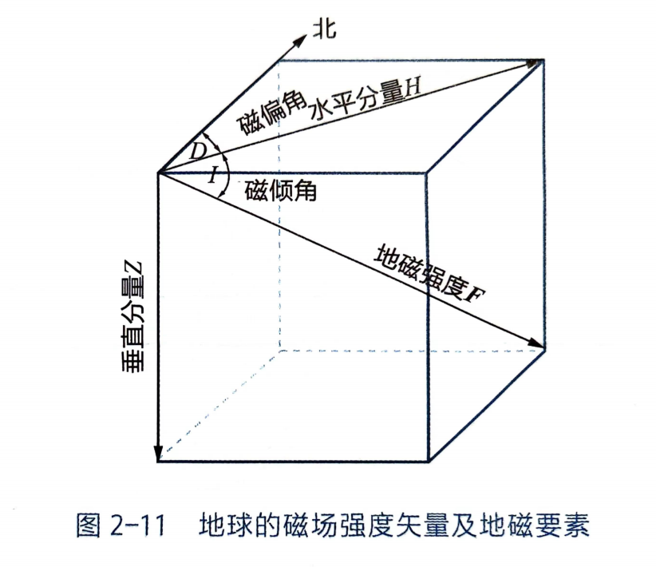
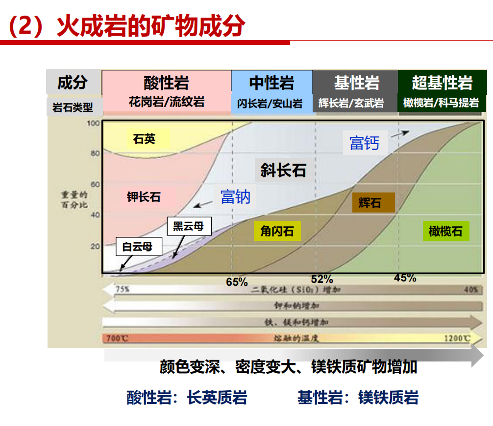
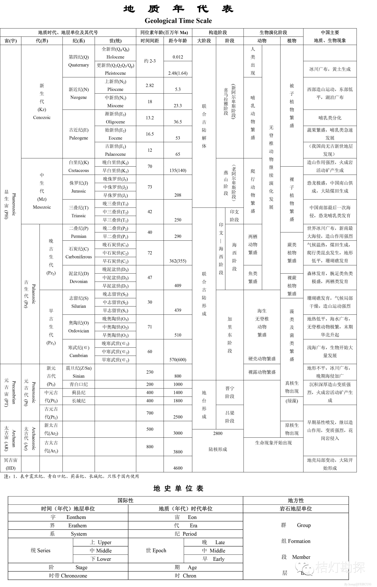
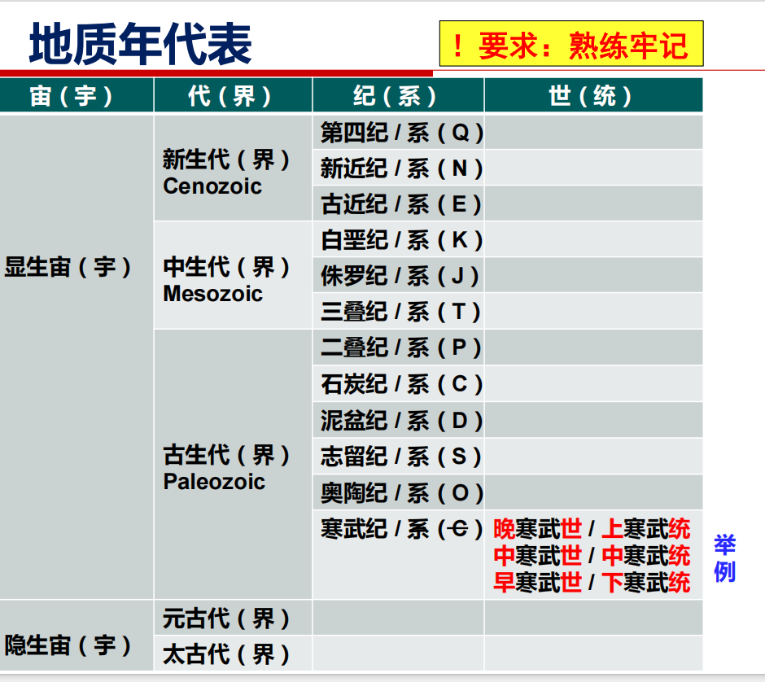

# 第一章
>地球科学的特点  
==地球科学的特点==：全球性与区域性、时空尺度的差异性、研究对象的复杂性、学科交叉综合性强、理论和实践的密切结合、研究方法和内容上的多科学性、技术手段的多样性  

---

# 第二章
>✅宇宙的诞生（课件）证据、提出者，了解基本物理性质：✅地球的重力场（重力值标准值重力异常（正负异常代表什么，密度大or小？）地球的磁场（三要素：磁场强度，磁偏角，磁倾角）（基本磁场、变化磁场、磁异常。磁倾角可以用来古板块的恢复）、✅地球的弹性塑性电性。  

## 第一节 地球在宇宙中的位置&第二节 地球的起源
### 天文学：黑暗天空悖论
1826 **奥伯斯**：如果宇宙是无限的，并且处于稳定状态，那么天空应该到处都是光  
1927 **乔治·勒马特**：宇宙不是无线电，是有限的；宇宙不是静止的，而是还正在膨胀的爆炸的鸡蛋

### 热爆炸理论
1948 前苏联==伽莫夫==第一个提出热爆炸的概念  
==**支持宇宙大爆炸的证据**==：  
* **红移现象**表明所有星系都快速远离我们而去
* 天文测距表明，**星系越远，向外速度越快**
* 速度与距离的相关性，表明所有星系都开始于137亿年前同一位置的大爆炸
* 宇宙中无所不在的**背景辐射**（黑体辐射）
* 宇宙物质的**氢氧比**（3:1）

## 地球的物理性质及其应用
### 一、地球的形状与大小
旋转椭球体，南半球稍粗、短，南极向内凹进30m，北半球稍细、长，北极向外突出10m  
陆地29.2% 海洋70.8%

### 二、地球的质量和密度

### ==三、地球的重力场==
上层，重力岁深度增大而缓慢增大。2891km（古登堡面）达到最大值，之后重力急剧减小  
==重力异常==：实测的重力值和理论值之间有明显的偏离  
**重力异常值**：**实际-理论**对某地的实测重力值，通过地形和高程矫正后，减去理论重力。若为正值则为==**正异常，说明密度大**==
区域正异常、局部正异常

### ==四、地球的磁场==
S位于北极附近，N位于南极附近，磁轴与地球自转轴的夹角约**11.5度**  
==磁场强度（***F***）磁偏角（*D*） 磁倾角（*I*）==  
**磁偏角**：磁场强度矢量的水平投影与正北方向之间的夹角。我国东部地区为西偏（偏向正北以西），甘肃为东偏  
**磁倾角**：磁场强度矢量与水平面的夹角，磁场强度矢量指向下为正值，向上为负值。在赤道为0，磁南极为90。北半球磁倾角为正  
**磁场强度大小**：磁场强度矢量的绝对值  

* ==地磁场==
  * ==基本磁场==：99%以上，构成地磁场主体的稳定磁场，它决定了地磁场相似于偶极场的特征，强度在近地表时强，远离地表时弱，说明了基本磁场起源于地球内部
  * ==变化磁场==：主要由太阳辐射、太阳带电粒子流、太阳黑子活动等因素引起
  * ==磁异常==：是地球浅部具有磁性的矿物和岩石所引起的局部磁场。**磁异常=实测地磁场（进行变化磁场的校正之后）-基本磁场的正常值**。若为正值则为**正异常**
  
* 古地磁和磁场倒转
  * 剩磁：指一种物质在外部磁场撤除后，仍然保留的磁性
    * 热剩磁：（稳定）熔岩从地下喷出时，温度在磁性物质的居里点以上，然后在熔岩冷却的过程中，磁性矿物沿着当时当地的磁场方向被磁化
    * 沉积剩磁：沉积岩中的颗粒在已经磁化的情况下，在沉积过程中沿着当地存在的磁场方向平行排列
    * 化学剩磁：磁性矿物以化学方式析出
  * 古地磁学：由于不同时代的岩石记录了不同时期地球磁性的信息，因此可根据岩石的磁性来研究地史时期地磁场的状态、磁极变化、大陆漂移
  
在偶极子场的前提下，某地的磁倾角*I*可由该点的纬度角θ确定，tan*I*=2tanθ  

磁场的移动曲线：不同时代的地磁极的连线  

### 五、地球的==电性==
地球内部的电性和磁性主要视地内物质的电导率和磁导率而定。磁导率变化不大，电导率变化很大。电导率与温度、岩石成分、孔隙度、孔隙水的矿化度有关，随深度增大而增大  
大地电流的强度和方向均有变化，是由地磁场变化直接感生的

### 六、地球的==弹性和塑性==
* ==弹性==：
  * 地震波是弹性波，地球能够传播地震波，说明地球具有弹性
  * 固体地球的潮汐现象（固体潮就是弹性地球在日月引潮力作用下发生的弹性变形
* ==塑性==
  * 长期受力下会变形。
  * 地球是一个旋转的圆球，表明地球并不是完全的刚体
  * 许多岩层剧烈而复杂的弯曲但没有断裂
* 两种性质在不同条件下可以转化
  * 作用速度快、持续时间短——弹性乃至刚性体
  * 施力速度缓慢、作用时间漫长——塑性
  
### 七、地球的放射性与内部的温度和能量
放射性强度局部增高的地段，叫做放射性异常区
* 地表向下按温度变化划分：
  * 变温层：主要受太阳辐射影响，日变化造成的影响深度较小，年变化造成的影响较大
  * 常温层：层温与当地的年平均温度大致相当，常年基本保持不变，深度大约为20-40m，中纬度地区较深，内陆较深
  * 增温层：深度增加温度增加。大陆常温层到30km，30m/°C ；海洋到15km，15m/°C 。**地温梯度**：深度每增加100m所增加的温度

---

# 第三章 地球内部圈层的特征及其意义
>✅圈层划分（纵波横波），✅莫霍面古登堡面，✅低速层是什么含义。✅大陆地壳大洋地壳的物质组成。岩石圈、软流圈与地层、地幔是什么关系  

## 第一节 地球内部圈层的划分依据
地震波探测和高温高压实验  
纵波p：压缩波，速度快，固体液体传播  
横波s：剪切波，固体传播（p与s相差1.8秒）  
面波  
当遇到地球内部物质发生突变的界面（**不连续面**）时，地震波会发生反射和折射，这种界面被称作波速不连续面

## 第二节 地区内部圈层的划分
==莫霍面、古登堡面、内外核及其过渡带、*低速层*==
**低速层（软流层）**：60-250km，接近地幔的顶部。在低速层内，地震波速度反而比上层减小5 ~ 10%。低速层（软流层）之上为岩石圈。上下没有明显界面，波速渐变。在横向时起伏不平，厚度变化较大。在古登堡面下面  
外核液体 内核固体  

## 第三节 地球内部各圈层的物质组成及物理状态
### 地壳
莫霍面以上的地球表层，5-70km，大陆平均35km，大洋平均6km，总体平均16km，密度2.6~2.9g/cm3，上部密度较小，下部密度较大  
**上层**：O、Si、Al，**花岗岩层/硅铝层**  
康拉德不连续面-隔开上下层  
**下层**：Si、Mg，**玄武岩层/硅镁层**  
* ==大洋地壳（洋壳）==
  * 5-10km，洋中脊较薄，远离洋中脊厚度增大，结构相对比较均一
  * 沉积层
  * 玄武质层：玄武岩和辉绿岩
  * 大洋层：辉长岩、蛇纹化橄榄岩
* ==大陆地壳（陆壳）==
  * 35km，高原70-80km，很强的不均一性，中酸性
  * 上地壳：沉积岩、变质岩
  * 中地壳：混合岩、花岗岩、糜棱岩
  * 下地壳：片麻岩、叫山岩、麻粒岩
**地壳均衡模型**
1.普拉特均衡模型：认为地壳密度不同，高低密度小，平原密度大  
2.艾利均衡模型内：认为地壳密度均匀，存在山根现象  
以上均强调引起均衡的动力是浮力  
3.重力均衡与均衡补偿基面  

### 地幔
固态
* 上地幔
  * p29
* 下地幔
  * 物质结构变化小，地震波速度增加平缓，含铁量相对增加

### 地核
古登堡面至地心
外核：液态，横波不能通过
过渡层
内核：固态

## 第四节 地球不同圈层的相互作用
### 一、地球不同圈层的物质——能量交换
#### 一、不同圈层的能量交换
热量从高温区向低温区传递，地球内部的热可以通过热传导、热辐射、激子、物质运动
#### 二、不同圈层的物质交换
地球的物质循环过程和元素的迁移过程  

**地幔的对流循环：**沿地幔热柱上升的玄武岩熔浆从大洋中脊涌出并冷却形成的洋壳，并在海沟处因俯冲作用被插入大陆岩石圈之下的软流圈，在地幔软流圈被加热并熔融，与地幔物质混合后重新加入地幔的对流循环  

**岩浆——射气作用：**地幔——地壳——水——大气的物质交换。岩石在地壳内部因地壳运动或放射性聚热而熔融，转变为岩浆，导致地壳内部的物质分异  

岩石受风化而溶解、破碎，沉积，固结成岩，熔融，重新加入地幔的对流循环  
#### 三、圈层的元素迁移与富集
水-岩相互作用。溶解、沉淀、吸附和离子交换，以及氧化、还原等化学过程

### 二、地核差异旋转
作为地球内部驱动源的地核，其旋转与整体地球不相一致

---

# 第四章
>✅矿物的概念（以PPT为准）、✅类质同象同质多象的概念、✅矿物的物理性质（光泽、硬度（用小钢刀和指甲2.5划滑石和石膏）、解理、断口。）  
>✅矿物的分类和简介  
>岩石：三大岩类。✅火成岩：岩浆概念、岩浆成分、黏度。喷出作用概念、侵入作用概念。喷出岩的产状，侵入岩产状，隐晶质。  
>✅沉积岩：基本类型  
>变质岩：温度压力发生改变情况下。基本类型。区域变质作用，热接触变质作用等等概念。常见变质岩类型：区域变质岩有哪些，接触变质岩（少数），动力变质岩（少数）（记少放大）

## 第一节 矿物描述
**元素：**同种原子组成的物质已知118种，自然界存在94种。  
亲气元素、亲石元素、亲铁元素、亲铜元素、岩浆元素  
地壳主要元素 O Si Al Fe Ca Mg Na K  
地地球主要元素 Fe O Si Mg S Ni Ca Al  

==**矿物**==：矿物（mineral）自然形成的、具有有序原子结构、具有明确的物理性质和化学组成的无机固体

## 第二节 矿物的基本特征
### 一、矿物的化学成分
#### 组成矿物的化学元素
 矿物是组成地壳的物质单元，固组成矿物的化学元素和与地壳的化学元素相同，主要有亲氧元素、亲硫（石）元素、亲铁元素

#### ==矿物的类质同象与同质多像象==
* **==类质同象==**
    矿物在一定条件下结晶时，其结晶结构中部分质点（原子、离子或离子团）被化学性质类似的其他质点所替换，而不破坏其结晶格架的现象，称类质同相。
* **==同质多象==**
    矿物中化学成分相同，但质点的排列方式不同的现象

#### 胶体矿物
含水多，成分不定

### 二、矿物的内部结构
#### 晶（质）体和非晶（质）体
**晶体：**晶体（crystal）指内部的原子或离子在三维空间呈周期性平移重复排列的固体。是原子有规律排列的外观表象。习惯上，将具有几何多面体外形的物体成为晶体，相应地，不具有几何多面体外形的成为晶粒。  
**非晶体**（non-crystal）：指内部的原子或离子在三维空间不呈规律性重复排列的固体

#### 晶系
七大晶系：立方晶系、四方晶系、斜方晶系、单斜晶系、三方/六方晶系、三斜晶系  

### 三、矿物的形态
* 矿物的单体形态
  指矿物单个晶体的形态，受控于款物的结晶习性。  结晶习性：生长条件一定时，同种矿物晶体发育成固定形状的习性  
  * 一向延长型：晶体沿一个方向特别发育，柱状，针状，纤维状，如柱状石英、石膏，针状普通角闪石等
  * 二向延长型：晶体沿两个方向特别发育；鳞片状、片状、板状等，如片状云母，板状石膏等
  * 三向等长型：三维发育近等，呈等轴状或粒状，如立方体石盐、黄铁矿等
  * 过渡类型
* 矿物集合体形态
  集合体形态是指同种矿物的许多个体集合在一起构成的形态，分为显晶集合体、隐晶集合体、胶态晶集合体  
  * **显晶集合体**：肉眼可看见晶体颗粒
  * **隐晶和胶态集合体**：晶粒和胶粒肉眼无法看出
    * 分泌体：胶体或晶质从孔洞的洞壁向中心沉淀充填，常见环带
    * 结核体：物质围绕一中心从内向外生长而成的球状、透镜状、瘤状等形态的集合体
    * 鲕（er）状和豆状:物质围绕悬浮的核心沉淀而成，有明显的圈层构造
    * 钟乳状集合体:溶液或胶体在较宽敞空间蒸发、逐层凝固堆积而成
    * 肾状、鲕状集合体

### 四、矿物的物理性质
#### 颜色和条痕
==**颜色**==：
* **自色**：与矿物本身化学成分直接相关的颜色
* **他色**：有非矿物本身固有组分引起的颜色
* **假色**：由光的反射、折射和干涉或者氧化后等引起的颜色

==**条痕**==：
矿物粉末颜色 。通常在瓷板上摩擦矿物留下的粉末痕迹  

#### 透明度和光泽
**透明度**：矿物薄片（厚0.03mm）能透过光线者，称透明矿物，如石英、云母、长石、方解石等；不透光者为不透明矿物，所有金属矿物都是不透明矿物，如黄铁矿、闪锌矿等  

==**光泽**==：矿物的反光能力
* 金属光泽-反射很强，所有金属矿物
* 非金属光泽-反射较弱，多属于透明矿物
  * 玻璃光泽-长石
  * 油脂光泽-石英断口
  * 丝绢光泽-绢云母、白云母
  * 土状光泽-高岭石

#### 力学性质（硬度、解理、断口）
**==硬度==**：  
物体抵抗外力机械作用的强度。==1滑石，2石膏，3方解石，4萤石，5磷灰石，6正长石，7石英，8黄玉，9刚玉，10金刚石==

**==解理==**： 
受到应力作用而超过弹性极限时，能沿着一定方向的网面发生破裂的特性  

**==断口==**：  
不规则裂开的面，通常有贝壳状（石英），锯齿状（黄铁矿、石膏）

#### 密度
轻矿物<2.9,重矿物>2.9

#### 滴酸
碳酸盐矿物、方解石起泡，白云石不起泡

## 第三节 矿物分类和重要矿物简介
从成分角度:硅酸盐、碳酸盐、氧化物、硫化物、硫酸盐  

按照晶体常数和晶轴，矿物又可分为七大晶系  

### 常见硅酸盐矿物
* 橄榄石
  * 一种重要的暗色硅酸盐矿物，呈**橄榄绿色**，具有**玻璃光泽**，解理**中等或不完全**，常常呈细小粒状 是**上地幔**主要的造岩矿物
* 石榴石（Garnet）
  * 具有**玻璃光泽**，解理**不完全**，**贝壳状**断口，棕色-深红色，产生于高压变质岩中
* 辉石
  * 普通辉石最为常见，是一种见的硅酸盐造岩矿物，呈**黑色不透明状**，**两组近90°**广泛存在于深色火成岩和变质岩中，由硅氧分子链组成主要架构
* 角闪石
  * 普通角闪石最为常见，双链状结构硅酸盐矿物 从深绿色-黑色，两组解理夹角**60°和120°**, 在火成岩中常呈其他浅色矿物的暗色部分，硬度**5-6**
* 黑云母（Biotite）
  * 是云母族中富铁的一种，从黑色到褐色、红色或绿色都有，具有玻璃光泽，硬度**2-3**形状为板状、柱状，有**一组极完全解理**，断口不平坦，大多数浅色火成岩组成矿物，包括花岗岩
* 白云母(Muscovite)
  * **一组极完全解理**，**硬度2.5~3**,相对柔软 一般产于变质岩中，但也产于花岗岩。颜色：白色，也可以是较淡的褐、绿、红色到无色，具有**玻璃光泽到丝绢光泽**形状为板状、片状，六方晶体或细粒的集合体。
* 长石（feldspar）
  * **地壳中最常见的矿物**，含钙、钠和钾的浅色铝硅酸盐矿物分为**正长石和斜长石**两类，钾长石颜色多为肉红色，斜长石多为白色、灰色。硬度为6~6.5，发育**2组解理夹角90**
* 高岭石（kaolinite） 
  * “高岭土” “瓷土”因首先在江西景德镇附近的高岭村发现而得名 **白色粘土矿物**，主要由长石长石、普通辉石等铝硅酸盐类矿物风化形成，土状或块状，硬度小，湿润时具有**可塑性、黏着性和体积膨胀性**
* 石英 （Quartz）
  * 物理性质和化学性质均十分稳定，是地球表面分布最广矿物之一, 硬度较高为7，**无解理，贝壳状断口、油脂光泽**，三方晶系，以α石英（低温）最为常见，还有β石英、柯石英

### 重要的非硅酸盐矿物 
#### 碳酸盐矿物
* 方解石
  * **三组完全解理、滴酸强烈起泡**
  * 最常见的碳酸盐岩矿物，分布很广，形状多种多样，它们的集合体可以是一簇簇的晶体，也可以是粒状、块状、纤维状、钟乳状、土状等，主要沉积形成于灰岩中或热液成因敲击方解石可以得到很多方形碎块，故名方解石
* 白云石
  * 三方晶系的碳酸盐矿物，**晶体结构与方解石类似**，晶形为菱面体，晶面常弯曲成马鞍状，聚片双晶常见，多呈块状、粒状集合体
  * 白云石为白色，因含其他元素和杂质有时呈灰绿、灰黄、粉红等色，玻璃光泽。三组菱面体解理完全，性脆。摩氏硬度3.5-4，比重2.8-2.9矿物粉末**在冷稀盐酸中反应缓慢。**
  * 主要来自白云岩和白云质灰岩等沉积岩，主要用作碱性耐火材料和高炉炼铁的熔剂

#### 卤化物矿物
* 岩盐
* 萤石（氟石）
  * 等轴晶系，主要成分是氟化钙（CaF₂） 为八面体和立方体，**玻璃光泽**，颜色鲜艳多变，质脆，莫氏硬度为4，具有**完全解理**的性质，部分样本在受摩擦、加热、紫外线照射等情况下可以发光

#### 硫酸盐矿物
* 石膏
  * 包括生石膏和硬石膏两种矿物。单斜晶系，晶体为板状，通常呈致密块状或纤维状， 白色或灰、红、褐色，**玻璃或丝绢**光泽，摩氏硬度为**2**

## 第四节 矿物的识别与利用

## 第五节 岩石概述
火成岩最多，沉积岩最少但地表分布最广  
* 火成岩占整个地壳体积的64.7%，变质岩占27.4%，沉积岩只占7.9%；其中基性岩（玄武岩和辉长岩）占全部火成岩的65.7%，花岗岩和其它浅色岩约占34%
* 沉积岩主要分布在陆地的表面，约占大陆面积的75%。从地表面往下，越深则越少，而火成岩和变质岩则越来越多；地壳深处和上地幔主要是火成岩和变质岩

## 第六节 火成岩
**==岩浆==**：是指地球深部产生的一种炽热的粘度较大的**硅酸盐熔融体**  

==岩浆的黏度==：受岩浆的成分、温度即挥发分等因素的影响，一般来说SiO2含量越高黏度越大，温度越高黏度越小，挥发含量越多黏度越小  

**火成岩**：指由地下深处炽热的岩浆（熔融或部分熔融物质）在地下或地表冷凝形成的岩石。（喷出岩和侵入岩两类）  

**==侵入作用==**：指地下深处岩浆沿裂隙上升，但未达到地表，只在地面以下的一定部位冷凝结晶形成岩石  
**==喷出作用==**：从岩浆喷溢出地表，至冷凝成为岩石的全过程  

分类

### 火成岩的产状
* ==喷出岩的产状==
  * 火山锥
  * 熔岩流及熔岩瀑布
  * 岩被
* ==侵入岩的产状==
  * 岩床、岩盖、岩盆、岩墙、岩株、岩基

### 火成岩类型与特征
* 火山岩或浅层侵入岩
  * 往往全部呈==玻璃质或半晶质==（即玻璃物质与结晶物质共存）或==隐晶质==（矿物粒径小于0.3mm）
* 深层侵入岩
  * 不同粒度的==全晶质==（指的是岩石中全部（或几乎全部）由晶体矿物组成，不含玻璃质（非晶质）成分。）

## 第七节 沉积岩
* 形成过程
  * 风化作用、搬运作用、沉积作用、成岩作用
* 风化作用
  * 物理风化、生物风化、化学风化
* 沉积作用
  * 机械沉积作用
  * 化学沉积作用：胶体溶液沉积作用、真溶液沉积作用、化学沉积分异作用
  * 生物基生物化学沉积作用

* ==**沉积岩的分类**==
* 碎屑（按成因）
  * 火山碎屑岩（按自然粒级细分）
    * 火山集块岩
    * 火山角砾岩
    * 凝灰岩
  * 沉积碎屑岩（按自然粒径分）
    * 砾岩（角砾岩）
    * 粗砂岩
    * 中砂岩
    * 细砂岩
    * 粉砂岩
* 黏土岩（按固结程度）
  * 粘土
  * 泥岩
  * 页岩
* 化学岩与生物化学岩（按成分细分）
  * 碳酸盐岩
    * 泥灰岩
    * 灰岩
    * 白云岩
  * 铝、铁、锰质岩
  * 硅、磷质岩
  * 盐类岩
  * 可燃有机岩

## 第八节 变质岩
**==变质岩==**：原岩在固体状态下，经过一定的温度与压力的作用，有时还有新的成分加入，使其内部物质组成或结构发生了不同程度的变化而形成的一种岩石  

**==变质作用==**：不论是岩浆岩，还是沉积岩，如果受到强大的地壳应力作用，在一定的温度和压力条件下，岩石中的矿物都将发生物相的变化  
<!--
* **动力变质作用**：主要由于应力引起的矿物碎裂或韧性变形
* **接触变质作用/热变质作用**：侵入体边部围岩物质，受侵入体影响而温度升高发生重结晶的过程
* **区域变质作用**：在大区域范围内，主要由于温度、压力（两者往往相互关联）普遍升高而引起的变质过程
* **退化变质作用**：矿物组合适应温度和压力的下降而发生新的变化
* 多代变质作用：相对原岩来说，在变质过程中有组分的带出和带入
* 复变质作用：多余一次
* 热液变质作用：有水参与、较高温度
-->
### 变质作用类型
* 区域变质作用-沉积埋藏导致围压增大、造山作用导致 差异应力，引起区域变质作用
* 接触变质作用
  * 热接触变质作用-岩浆侵入引起接触变质或热力变质作用
  * 接触交代变质作用
* 动力变质作用
* 混合岩化作用

### 常见的变质岩
* 热接触变质岩：
  * 角岩
  * 矽卡岩
* 区域变质岩
  * 片岩
  * 片麻岩
* 动力变质岩
  * 断层角砾岩
  * 碎裂岩
  * 糜棱岩
* 混合岩化
  * 混合岩

# 第五章
>什么是化石、地球生命的演化（阶段）、==**地质年代**==相对地质年代、**地质年代表**、**简写的字母**、什么是地质年代及和他对应的年代地层  

## 第一节 化石与生命演化
**==化石==**：保存在岩层中的古生物遗体、遗迹或化学痕迹。是研究地球生命历程的直接证据  
课本分类  
* 实体化石
* 遗迹化石
* 模铸化石
* 微体化石
* 化学化石

**古生物**：地质时期的生物通常被称为古生物，大体是指生活在全新世（距今约1万年）以前的生物，以区别于现代生物  

**化石的形成**：生物的遗体或遗迹在被沉积物埋藏后，在沉积物的成岩作用下被石化，从而形成化石  

**石化作用**：
* 主要包括**矿物质填充、置换和碳化作用**三种形式
* 时间、生物本身、生物死后的环境、埋藏、成岩作用等诸多掉件

### ==生命起源与演化==
40亿年前，最早的生命是有机物大分子  
1. 厌氧异养原核生物
  没有细胞核膜分异、不能自己制造养分，生物圈还没有形成  
  38亿年前形成的适应当时沸腾海水的极端嗜热细菌（球状和杆状单细胞生物）
2. 厌氧自养生物出现和生物圈初步形成
  蓝细菌，还原二氧化碳产生氧气，生物圈初步形成
  25亿年前生命开启”光合作用“，开始产生少量氧气，26-18亿形成高峰  
3. 真核生物出现和动物界爆发演化
  21-16亿年前，真核细胞生物诞生，早期生命繁殖依靠细胞分裂，到12亿年前，有性生殖产生  
  6亿年前软躯体动物首次爆发  
* 显生宙生命演化事件
  * 小壳动物群出现和分异
  * 寒武纪生物大爆发
  * 从水生到陆生发展
  * 生物的集群性灭绝
  
4. 陆生生物发育和全球生物圈建立
5. 爬行类和裸子植物天地
6. 哺乳动物阶段和人类出现

### 进化
达尔文学说：共祖、渐变和自然选择  

## 第二节 地质年代
### 相对地质年代
* 原始地层三定律
  * 原始层序叠加律
  * 原始侧向连续律
  * 原始水平律
* 生物层序律
* 穿切关系原理
  * 切穿地质体形成于被切穿地质体之后
* 包裹关系原理
  * 捕虏体
* 不整合面
  * 角度不整合面
  * 非整合面
  * 平行不整合面

金钉子：全球地层单位界线的标准“锚点”，由国际地层委员会（ICS）确定，用于精确定义地质年代单位（如纪、世、阶）界线的位置。  

### 绝对地质年龄
同位素  
* 地质年代表

* 年代地层和地质年代划分对应关系
  * 年代地层单位：宇、界、系、统、阶（下、中、上）
  * 地质年代单位：宙、代、纪、世、期（早、中、晚）

---

# 第六章 
>**板块构造理论**、边界划分（离散、汇聚、转换，哪些属于什么）、转换断层和走滑断层、平移断层的区别特点（p93）  

## 大地构造学说
**大陆漂移学说**  
* 近乎完美的大陆拼图
* 跨海古生物化石相似性
* 岩石和构造地质证据
* 古气候
* 岩石磁学与移极现象

**海底扩张学说**
* 大洋中脊
* 大陆边缘
* 海底平顶山
* 地磁场反转
* 以洋中脊为中心，海底洋壳磁异常呈对称分布
* 洋中脊为中心，海底洋壳向两侧呈对称逐渐变老

**板块构造学说**  

**转换断层和平滑断层的区别：**
（1） 断层两侧洋中脊的距离不一定增加（平滑则不断增加）
（2） 错动仅发生在两侧中脊轴之间的段落，之外的段落没有相互错动（平滑则沿整条断裂线发生）
（3） 转换断层中发生相互错动方向，恰好与平滑断层中把洋中脊错开的方向相反。（最重要）

# 第七章
>造山带、山脉、应力应变、变形的影响因素、背斜向斜（核、转折端、翼）、褶皱的类型（斜歪？褶皱、倒转褶皱）、断裂（节理、断层的基本类型

# 第八章
>衡量地震大小的震级烈度、火山（为什么、产生的机理，板块作用解释火山的成因）  

# 第九章
>了解  

# 第十章
>重点（课件）  
>石油天然气基本的理论、石油地质理论（圈闭理论、背斜勘探理论）、我国科学家对石油地质的贡献（什么理论没听清）、课后思考题（在课件，现状、能源供给如何保证）  

# 第十一章
>大气过去和现在、**p174大气划分 特点**、气候系统的能量平衡（什么是太阳常数、长波辐射、短波辐射）、水汽循环（相对湿度等基本概念、水汽在大气中扮演什么角色、气候系统的水循环）  

## 第一节 大气组成部分
### 一、早期大气成分
主要成分：氢气、氦气，也包括甲烷、氨气，被称为一次大气  
火山喷发释放出大量的水气、CO2，还有少量的氮气、氢气、一氧化碳、硫化氢和甲烷
### 二、现代大气成分
N2-78.1% O2-21% 惰性气体（稳定）和痕量气体（变化较大）-1%  
温室气体：CO2、CH4、N2O、水汽  、O3、CFCs
* 水汽的作用：
  * 产生云和降水的必要条件
  * 水汽相变产生大量的潜热，潜热是大气能量循环的重要组成部分
  * 温室气体，对地气系统能量平衡起着重要的作用  
* O3
  * 集中在大气的平流层（10-50km）
  * 平流层，吸收紫外线（被CFCs破坏）
  * 对流层，是光化学烟雾的主要组成成分，造成大气污染
  * 温室气体
气溶胶：大气中悬浮的微小固态和液态颗粒

## 第二节 温度和热力过程
### 一、大气温度空间分布特征
<!-- 图图 -->
<mark>大气圈划分</mark>
* 对流层
  * 从地表到大约10km。高度随纬度和季节变化，赤道夏季高20km，极地冬季7km
  * -15℃--55℃，6.5℃/km下降
  * 对流运动强烈，热空气上升，冷空气下降
  * 逆温：对流层中的大气温度随高度升高而升高
* 平流层
  * 从对流层向上到约50km
  * 温度随高度逐渐上升（臭氧存在，浓度最高25km；紫外线；密度小）
  * 对流作用弱
* 中间层
  * 从平流层向上到约85km
  * 温度随高度升高而下降，85km约-80℃，整个大气层最低温
* 热层
  * 从中间层向上约500km
  * 氧气分子吸收太阳辐射，加热大气。仅有1%的大气分子
  * 温度日变化
* 逃逸层
  * 热层顶到约1wkm
  * 稀薄
    
* 均匀层
  * 湍流混合作用强，大气各组分均匀分布
  * 对流层、平流层、中间层
* 非均匀层 — 热层
  * 热层以上以分子扩散为主，湍流作用弱，重的在低层，轻的在高层
* 电离层 — 中间层的上部和热层
  * 受大气辐射对大气原子和分子的电离作用，对无线电波的传播有重要作用
  
### 二、气候系统能量平衡
* <mark>收支平衡</mark>
  * 收入：到达地气系统的太阳短波辐射
  * 支出：从地气系统逃逸到太空的长波辐射
* <mark>太阳常数</mark>
  * 表示进入地球大气层顶太阳辐射能量的强度，即在日地平均距离，大气上界垂直于入射太阳光线的单位面积单位时间内接收的太阳辐射能量。1368/m2
* 大气中的能量传输过程
  * 长波
  * 短波-太阳
  * 热传导：热量在物质中分子间的传输
  * 对流：通过流体的运动传输热量
    * **对流、热传导统称为感热**
  * <mark>潜热</mark>：水在相变过程中所吸收或放出的热量
* **大气的主要热量来源是地表**
* <mark>反照率</mark>
  * 反射的太阳辐射量/入射的太阳辐射量
  * 水面10%，森林10%-30%，冰面30%-40%，新血75%-95%
  * 行星反照率：大气和地表的总反射率
* 长波辐射依赖于地表和大气的温度。少云温暖的地表放出的长波辐射多，极地多云的地方放出的长波辐射少。赤道向两极递减

## 第三节 水汽和水循环过程
### 一、大气水汽分布特征
大气中的水汽含量可以用**大气湿度**表示
* <mark>绝对湿度</mark>
  * 单位体积大气中的水汽含量，g/m3
  * 体积会随压力变化而变化，因此一般不用
* **比湿和混合比**
  * 比湿：气团内水汽的质量和气团质量的比值
  * 混合比：气团内水汽质量和干空气质量的比值
* 水汽压
  * 水汽压越大，气团中的水汽含量越大
* 饱和水汽压
  * 给定温度下，大气中水和水汽达到相对平衡时的水汽压，随温度升高而升高
* <mark>相对湿度</mark>
  * 实际水汽压/同温度下饱和水汽压

### 二、<mark>气候系统水循环</mark>
蒸发量最大值出现在副热带的海洋

## 第四节 大气中的力和大气环流
### 一、作用与大气的力
* 质量和高度
  * 10km以下-73.9%
  * 30km以下-98.8%
  * 50km以下-99.9%
  * 90km以下99.999%
* 大气压
  * 单位面积上大气柱的重量，大气中任意一点的气压可以用这一点以上的大气柱总质量来衡量
  * 大气压随高度升高而降低
* 大气运动
  * 受质量守恒、能量守恒、动量守恒等基本规律约束
  * 气压梯度力、地转偏向力、惯性离心力、重力、摩擦力等控制
* 气压梯度力
  * 由大气压的分布不均匀引起
  * 垂直气压梯度力
    * 静力平衡：空气微团的垂直气压梯度力和空气微团自身重力的平衡
  * 水平气压梯度力
    * 正比于水平气压梯度，从高压指向低压
    * 地表受热不均匀，造成水平气压的不均匀分布

# 第十二章
>曹龙的课件  

# 第十三章
>上课没详细讲，了解  

# 第十四章
>一些基本概念，曲流河牛轭湖、阶地、河流下切侵蚀、冰川常见地貌、冰碛物（特点）、风的作用风蚀地貌、新月形沙丘、黄土的搬运。。🙄不知道在说啥🙄  

# 第十五章
>火山地震，了解  

# 第十六章
>😓😓😓😓教材里面都有有兴趣看不作为考察重点😓

# 题型
* 名词解释（10个）。尽量准确
* 术语归类（10个）
  * eg：属于矿物/岩石/地质术语
* 单选（20个）
* 判断（10个）
* 简答题（3个）
* 论述题
  * 读图😓😓论述分析😓😅😅