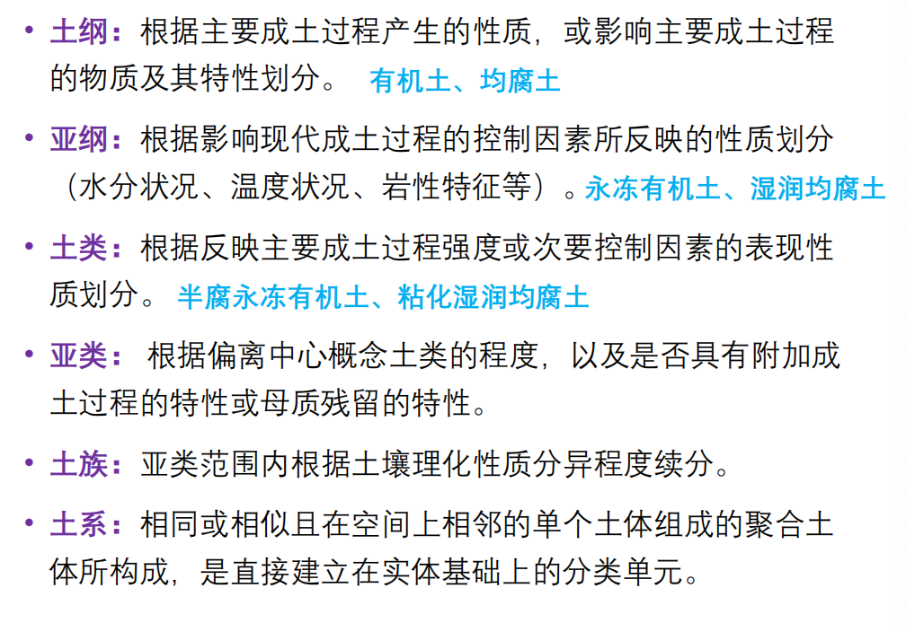
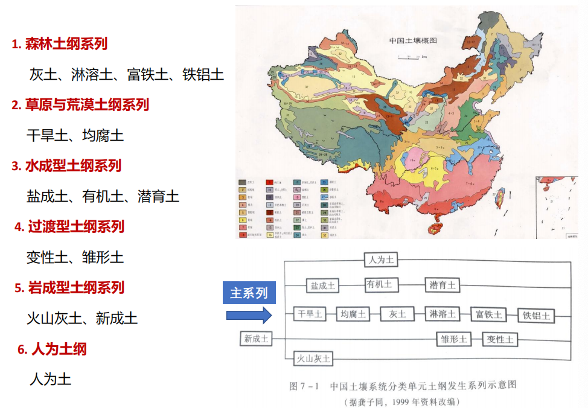

# 土壤
## 一、土壤与土壤圈的概念
土壤是地球陆地表面具有肥力能够生长植物的疏松层。  
**土壤**是发育于陆地表面具有生物活性和孔隙结构、进行物质循环和能量转换的疏松表层。  
**土壤肥力**：土壤具备同时地、不断地协调供给植物生长所需要的水分、养分、空气和热量（水肥气热4个要素）的能力  

## 二、土壤的物质组成
### 土壤中的矿物质
来源：岩石的风化作用  

影响：土壤肥力、土壤理化性质
* 岩石碎屑
* 原生矿物：直接来源于母岩，只受不同程度的物理风化作用，化学成分和结晶构造并未改变。土壤中的沙粒和粉沙粒几乎全是原生矿物
* 次生矿物：原生矿物在风化和成土过程中新形成的矿物，化学组成和构造经过改变。粘土矿物  

物理风化作用：温差效应、冰劈作用、风蚀作用、流水作用、减荷破裂  

化学风化作用：溶解作用、水化作用、氧化作用、水解作用  

生物风化作用：生物的生长和分解产物对岩石与矿物所起的物理的和化学的风化作用  

风化壳：基岩（或堆积物）经受风化残存于原地的产物。与下伏基岩呈过度关系，网上渐变为微风化层、弱风化层、强风化层和全风化层  

### 土壤中的有机质
来源：植物残体、动物、微生物残体；动植物、微生物的排泄物和分泌物  
组成：普通有机质（10-15%），土壤腐殖质（85-90%）  
普通有机质-来自动植物及微生物残体和分解代谢产物  

**腐殖质：**有机质在微生物作用下分解后再缩合或聚合而成的一系列暗色高分子有机化合物（富里酸、胡敏酸、胡敏素）

* 土壤有机质转化
  * 矿质化过程：指进入土壤中的动植物残体等有机质在土壤微生物的参与下，将复杂的有机物质分解为简单的有机化合物，最终分解为无机化合物的过程
  * 腐殖质化过程：指进入土壤中的动植物残体，在土壤微生物的作用下，分解后再缩合和聚合成一系列暗黑色高分子有机化合物的过程
土壤微生物是土壤有机质转化的主要动力

* 土壤腐殖质的形成
  * 木质素-蛋白质聚合学说
  * 生物化学合成学说
  * 化学聚合学说

### 土壤中的水
类型：
* 吸湿水：土壤颗粒表面张力所吸收的水汽，即干土从空气中吸着水器所保持的水。吸力范围>3100kPa，不能迁移和运输营养物质（束缚水）
* 毛管水：毛管孔隙中靠毛管力吸附保存的水分，吸力范围10kPa-3100kPa。是土壤中可自由移动的水分，土壤中植物利用的有效水分（自由水）。分为毛管上升水和毛管悬着水
* 重力水：土壤水分含量超过田间持水量（毛管悬着水达最大值）时沿土壤非毛管孔隙向下移动的多余水分（自由水）

土壤水的有效性：不能被植物吸收利用的称无效水，能被植物吸收利用的称为有效水  
土壤有效水分的下限称为凋萎系数  
旱地土壤有效水分的上限为田间持水量  
旱地土壤最大有效水分量=田间持水量-凋萎系数  

### 土壤中的空气
特点
* 不连续存在于固体隔开的土壤空隙中。成分在土壤中的各处可能很不一致。
* 具有比较高的含水量，在土壤含水量适宜时，土壤空气的相对湿度接近100%
* 土壤空气中的CO2含量比大气中的高，氧含量较低
* 土壤空气的含量与土壤水分互为消长

### 土壤溶液和土壤胶体
#### 土壤溶液
土壤水分及其所含溶质、气体的总称  
* 无机盐类：钙、镁、钾、纳等的硝酸盐、亚硝酸盐、碳酸盐、硫酸盐、氯化物、磷酸盐等
* 有机质：可溶性糖、蛋白质、氨基酸、胡敏素、富里酸等-溶解性气体：O2、CO2、NH3、N2、CH4等

#### 土壤胶体
土壤中高度分散，粒径在1-100(1000)nm之间的固相物质。  
矿质胶体、有机胶体、有机无机复合胶体  
性质：巨大无比的表面积、具有电性、分散和凝聚性  

#### 土壤的离子交换与酸碱度
土壤离子交换：土壤胶体表面与溶液介质中电荷符号相同的离子发生交换。可分为阳离子交换作用和阴离子交换作用。  

土壤的活性酸度：存在于土壤溶液中氢离子引起的酸度  
土壤的潜在酸度：吸附在土壤胶体表面的$H^+$和Al3+所引起的酸度。  
土壤缓冲性：土壤缓冲酸碱度剧烈变化的性能，土壤胶体吸附的盐基离子多，缓冲酸的能力强，土壤胶体吸附的酸性离子多，缓冲碱的能力强  

#### 土壤生物
土壤中的植物、动物和微生物，以及地上部分的动植物  

## 三、土壤的形态特征
### 土壤的颜色
土壤颜色主要决定于土壤的化学组成与矿物组成，影响土壤颜色的主要物质有腐殖质、矿物质、水分、质地和生物活动等  

土壤颜色描述-芒赛尔颜色系统是以颜色三属性，即**色调、亮度、色度**为基础的  
* 色调（色相）：土壤所呈现的颜色，即占优势的光谱色。共有10个基本色调，其中，5个主色调，即R（红）、Y（黄）、G（绿）、B（蓝）、P（紫）；5个辅色调，即YR（黄红）、GY（绿黄）、BG（蓝绿）、PB（紫蓝）、RP（红紫）。再以2.5划分4个等级，如2.5YR、7.5YR、10YR等。
* 色值（亮度）：土壤颜色的相对亮度，以无彩色N作基准，把绝对黑（理想的黑色）作为0，把绝对白（理想的白色）作为10，分为0—10由暗到明的等分。
* 色度（彩度）：光谱色的相对纯度或强度，分为0-10由弱到强的等分，色度愈高、颜色愈浓艳
  
### 土壤质地
组成土壤的大小不同的土粒按不同比例混合在一起表现出来的土壤粗细状况称**土壤的机械组成或土壤质地**  

土壤质地分类是以土壤中各粒级含量的相对百分比作为标准  
* 砂土-砂粒含量70%以上
  * 颗粒组成粗大，相应的空隙也较大，排水和通气条件良好。但也有保水和蓄肥能力弱的缺点，土体多呈松散状态，结构性不强
* 粘土-粘粒占优势的土壤，粘粒的含量一般不低于40%
  * 粘质土的颗粒细小，有巨大的比表面积，所以对水分和养分有很强的保持力，粘质土中虽然空隙较多，但都属于小空隙。水、气 的运动缓慢，排水和通气状况不佳。粘质土通常有较强的粘结性和可塑性。湿时粘着，干时硬结，胀缩幅度较大
* 壤土-砂粒、粉沙粒、粘粒三者在比例上均不占绝对优势的一类混合土壤
  * 兼有砂质土和粘质土壤的一些特性，并调和了它们的一些不利因素，因此是一种物理性质介于二者之间的土壤，大多数农业价值较高的土壤都属于壤质土

### 土壤结构
土壤结构式指土壤颗粒粘结的状况，土壤中的固体颗粒一般相互粘结在一起，形成一定形状和大小的团聚物，称为结构体  
* 团粒结构
  土壤结构胶结成粒状或小团块状。是透水性与透气性好、机械稳定性较强的一种土壤结构。是有机质含量较高土壤的表层（A层）的重要特征  
* 块状结构
  非规则形状，大体上像立方体。在质地比较粘重、缺乏有机质的土壤中易形成。常见于B层土壤，特别是在湿润地区。在A层中也可存在  
* 片状结构
  相对薄的、水平层状或盘状的结构。常由成土母质发育而来，尤其是通过冰或水运动形成的母质，或由压实作用产生  
* 柱状结构
  呈直立的柱状或台状，包括圆柱和棱柱状结构。常见于B层土壤，特别是干旱和半干旱地区

### 土壤结持性（土壤紧实度）
指土壤堆机械应力所表现出来的状态。一般用小刀插入土壤中，视用力的大小来衡量，分为紧实、稍紧实、疏松等级别  

### 土壤孔隙状况
指其中孔隙的大小和孔隙的多少。土壤孔隙状态常在较大的结构体表面观察，可分为微孔隙、很细孔隙、细孔隙、中孔隙、粗孔隙、很粗孔隙以及少孔隙、中孔隙、多孔隙等级别

* 土壤容重
  * 指单位容积原状土壤的烘干质量
  * 反映土壤松紧程度
* 土壤密度
  * 单位体积的烘干土壤固体物质重量
* 土壤孔隙度
  * 指土壤孔隙占土壤总体积的百分比

### 土壤干湿度
反映土壤中水分含量的多少，干、润、潮、湿  
质量含水量、体积含水量  

### 土壤新生体特征
指土壤发育过程中土壤物质淋溶淀积和集聚的生成物  

### 土壤侵入体特征
指土壤中出现的不是由成土过程所产生的某些物质，这些物质有些是从母质中继承而来的，有些则是成土过程中由某些原因从外部进入土壤的  

## 四、土壤剖面
**土层**-成土过程对疏松物质的改造作用，特别是腐殖质的形成和加入过程，以及颗粒与溶解物质的转移过程，导致土壤内部沿垂直方向发生分异，形成了一些物理和化学性质明显不同的水平层次，称为土层（土壤发生层次）  

**土壤剖面**-自然土壤是由不同性质的土壤层叠合构成，由上而下，显示土层序列及组合状况的垂直切面，称为土壤剖面  

根据土壤剖面中物质累积、迁移和转化的特点，土壤颜色、土壤质地、土壤结构、土壤孔隙、土壤中的结核等构成情况的差异，可以在土壤剖面上划分出六个主要发生层次  
* O层（有机质层）-覆盖于矿质土壤表面的由植物和动物残落物组成的层次。以分解的或未分解的有机质为主的土层
* A层（腐殖质层）-形成于表层或位于O层之下的发生层。最接近表层的矿物颗粒组成为主，由于有机质的累积作用变成暗色的土层
* E层（淋溶层）-土壤剖面中由水分淋溶作用所形成的土层。硅酸盐粘粒、铁、铝等单独或一起淋失，石英或其它抗风化矿物的砂粒或者粉粒相对富集的矿质发生层。该层一般接近表层，位于O层或A层之下
* B层（淀积层）-土壤剖面中位于淋溶层之下的矿质土壤，是A层淋洗出来的物质沉淀和聚集的层次
* C层（母质层）-指土体一下疏松的、尚未受到成土过程（特别是生物作用）影响的层次。它是上部土体赖以形成的母体物质
* R层（基岩）-尚未受到风化作用影响的下垫坚硬岩石，如花岗岩、砂岩、石灰岩等。有些土壤与基岩由发生上的继承关系（残积母质）有些则没有（运积母质）
* 凡兼有两种主要发生层特性的土层，称为过渡层（如AE、BE、EB、BC等）

耕作土壤剖面
* **耕作层（表土层）**：属于人为表层，包括灌淤表层、堆垫表层和肥熟表层。土性疏松、结构良好、有机质含量高，颜色较暗、土壤比较肥沃
* **犁底层（亚表土层）**：在耕作层之下，土壤呈层片状结构，紧实，腐殖质含量比上层少
* **心土层（生土层）**：在犁底层之下，受耕作影响小，淀积作用明显，颜色较浅
* **底土层**：几乎未受耕作影响，根系少，土壤未发育，仍保留母质特征

## 五、土壤的形成与发育
成土因素说的创始人——道库恰耶夫  

### 成土因素
1. 母质因素
岩石风化的产物称成土母质，简称母质。母质为土壤提供矿物质，是土壤形成的物质基础。  
残积母质：岩石风化后，停留在远处很长时间的疏松物质  
运积母质：岩石风化后，由外移至他处的疏松物质  
* 多数土壤的属性均继承了母质的特征  
* 不同母质对土壤的次生矿物有影响
* 不同母质所形成的土壤养分状况不相同
* 成土母质影响土壤的质地

2. 生物因素
包括土壤植物、土壤动物和土壤微生物。生物是有机质的制造者和分解者，影响土壤发生、发育最活跃的因素  
* 绿色植物：利用太阳能进行光合作用制造成活体有机质，再以有机生物残体形式聚集与母质表层，推动了土壤的形成和演化
* 土壤微生物：分解动植物有机残体释放其中潜藏的能量和养分供生物再吸收利用，促进土壤肥力不断发展；还参与土壤腐殖质的形成
* 土壤中的原生动物、各种昆虫：参与土壤有机残体的分解、破碎、翻动、搅拌疏松土壤和搬运土壤

3. 气候因素
为土壤直接提供水分和热量  
* 影响岩石矿物风化的速度
* 影响次生矿物的形成
* 影响土壤微生物的种类和数量
* 气候对土壤有机质的积累和分解起重要作用
* 影响土壤的地带性分布规律

4. 地形因素
地形是影响土壤与环境之间进行物质交换和能量交换的一个重要条件。它是通过其它成土因素对土壤起作用
* 影响母质
* 影响水热条件
* 影响土壤年龄与肥力

5. 时间因素
决定土壤形成因素作用的强弱及土壤发育的进程。土壤的形成时间随时间的增长而加强，母质、气候、生物、地形等因素在土壤形成过程中的作用强度，均随土壤年龄的增长而加深
* 原始阶段：土壤未发育的母质
* 幼年阶段：土壤开始发育，出现土层分化，A-C土壤
* 壮年阶段：出现淀积层（B），A-B-C型剖面
* 老年阶段：土壤发育缓慢趋于稳定。某些土层出现淋溶层E

土壤年龄 具代表性的土壤发生层的最终形成年代。（土壤年龄与土壤母质生成年龄，是两个不同的概念）  

6. 人类活动

### 成土过程
土壤形成的基本规律——**物质的地质大循环与生物小循环**
* **地质大循环**：指结晶岩石矿物在外力作用下发生风化变成细碎而可溶物质，悲流水搬运迁移打破海洋经过漫长的地质年代变成沉积岩，当地壳上升，沉积岩又露出海面成为陆地，再次受到风化淋溶。提供岩石母质】矿物质、营养元素
* **生物小循环**：指植物吸收利用大循环释放出来的可溶性养分，通过生理活动制造成植物的活有机体，当植物有机体死亡之后，在微生物分解作用下，又变为可被植物吸收利用的可溶性有机物。提供有机质。

主要成土过程  
1. **原始成土过程**：在裸露的岩石表面或薄层岩石风化物上着生细菌、放线菌真菌等微生物，即后生长藻类，再后生长地衣、苔藓，它们开始积累有机物并为高等植物生长创造条件
2. **淋溶过程**：可溶性盐类和其他移动物质（粘土矿物和有机化合物等）自土体内淋失或从上部土层淋洗至下部土层。
3. **灰化过程**：在寒带或寒温带湿润气候和生长针叶林条件下，堆积了较厚的枯枝落叶层，在真菌的分解产生强有机酸。在强酸性淋溶作用下，表层除二氧化硅外，其他矿物元素皆被淋失或流走，结果在残落物层下部形成强酸性**灰白色土层**，称**灰化层**，在土壤下部形成褐色或红褐色淀积层。这是**灰土的典型特征**。
4. **粘化过程**：粘土矿物生成和聚集过程。尤其在温带和暖温带气候条件下，化学风化强烈作用，原生矿物积极分解而次生粘土矿物也大量形成，在土体中下部聚集形成**粘化层**，是**淋溶土的典型特征**
5. **富铝化过程**：土壤中土体脱硅和铝铁富集过程。在湿热带的气候条件下，原生矿物彻底分解，盐基离子和硅酸大量淋失，**铝和铁的氧化物及氢氧化物在土层中大量积聚**，常形成铝土矿和铁盘。土壤矿质养分不丰富，呈酸性，土色深红。如**砖红壤**。
6. **钙化过程**：碳酸盐淋溶沉淀过程。在干旱和半干旱条件下，季节性淋溶使得矿物风化释放的易溶性盐类大部分淋失，硅铁铝氧化物在土体中基本未发生移动。土壤溶液和地下水均为钙离子所饱和，从土壤表层向下迁移的钙便在一定深度上又积聚起来，形成**钙积层**。如**黑钙土、栗钙土、棕钙土**等。
7. **盐渍化过程**： 土体上部易溶性盐类的聚集过程。在干旱、半干旱区成土母质中的易溶性盐类随流水搬运至排水不畅的低地，盐分在蒸发作用下向土体表层集中，形成**盐积层**。
8. **碱化过程**：土壤吸收复合体上交换性钠占阳离子交换量30%以上，pH大于9，呈碱性反应，并引起土壤物理性质恶化的过程。
9. **潜育化过程**：低洼积水地区土体发生的还原过程。在长期渍水条件下，由于嫌氧和还原作用，铁、锰等处于还原态并易流失，使粘粒中的铝铁率和硅铁率高，同时土体呈青灰色。如沼泽土、水稻土。
10. **潴育化过程**：土壤形成过程中的氧化还原过程，主要发生在直接受地下水浸润的土层中。由于地下水雨季升高，旱季下降，土层干湿交替，引起土壤中铁锰物质处于还原和氧化的交替状态，形成一个有锈纹锈斑、黑色铁锰结核的土层，称为潴育层
11. **腐殖质化过程**：指进入土壤中的动植物残体，在土壤微生物的作用下，分解后再缩合和聚合成一系列暗黑色高分子有机化合物的过程
12. **泥炭化过程**：在沼泽地中因过渡潮湿，土壤表层积累的大量有机质在嫌气的还原条件下得不到充分的分解和转化，其中许多难以分解的物质如纤维、木素、树脂等不断积累，并和各种生物残体及腐殖质等堆积在一起，形成泥炭层。是有机土的典型特征
13. **土壤的人为熟化过程**：在人类合理耕作利用改良及定性培育下，使土壤向着肥力提高的方向发展的过程

## 六、土壤的分类及空间分布规律
>土壤发生学分类和系统分类，中国土壤系统分类的土纲

不同土壤类型是不同自然地理环境条件下成土过程即土壤发育的产物。土壤类型是综合自然地理环境特征的标志。  
### 土壤分类
土壤类型 是土壤发生系统中土壤发育到达某种程度的综合性特征的体现，包括【土壤地址、土壤物理、化学、水温、肥力与生物效应、过程及其后生变化中的改良或退化等】【土壤类型】一系列土壤特征指标的集成

* 前苏联-**==土壤发生分类==**
  强调土壤与成土因素和地理景观间的相互关系，以成土因素及其对土壤的影响作为土壤分类的理论基础，以成土过程和土壤属性（土壤形态、土壤物理、土壤化学、矿物及生物等）作为土壤分类的依据。  
  土壤分类系统中分为土类、亚类、土属、土种、亚种、变种、土组、土相８级。

* 美国-**==土壤系统分类==**
  分类所依据的具体指标是可以直接感知和定量测定的土壤属性，而将土壤的发生学关系作为选择土壤分异特性时的参考依据，土壤类型的划分主要根据土壤的诊断层和诊断特征；
  * 诊断层：指用于鉴别土壤类型，在性质上有一系列定量说明的土层
  * 诊断特性：用以做为土壤类型鉴别依据的定量化的土壤性质（水分状况、温度状况、氧化还原特性、有机物质状况等）。
  土壤分类系统中分为土纲、亚纲、土类、亚类、土族、土系6级。

* 中国分类
  1. ==中国土壤发生学分类==
   分类基础：成土因素、成土过程和土壤属性
   分类系统七级：土纲、亚纲、土类、亚类、土属、土钟、变种。12个土纲，30个亚纲
  2. ==中国土壤系统分类==
   分类基础：诊断层及诊断特性  
   分类系统六级：土纲、亚纲、土类、亚类、土族、土系。。11个诊断表层，20个诊断表下层，2个其它诊断层和25个诊断特性。14个土纲、39个亚纲  
   

### 主要土壤类型

土壤分布的地带性规律是指广域土壤与大气和生物条件相适应的分布规律

### 土壤空间分布规律

## 七、土壤资源的利用与保护