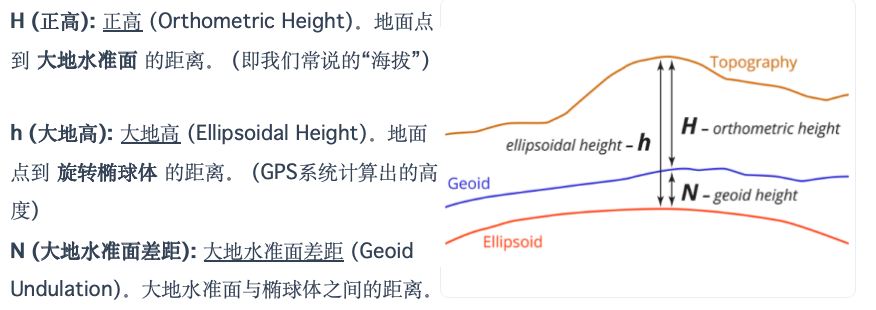

# 3.地图数学基础
>大哥我真崩溃了。。到底是从哪搞来的这么莫名其妙的ppt的😅疑似ai和lj的嘤语ppt的超绝胡乱大缝合😙

!!! warning
     考过 数学方法在绘制地图中的运用

## 地球的形状
地球是一个极半径略短、赤道半径略长、北极略突出、南极略扁平，近于梨形的椭球体。

### 大地水准面（Geoid）
==大地水准面== 是与静止海平面相重合的水准面。假想它向大陆延伸，穿过陆地，形成一个封闭的曲面。

* 定义: 一个与平均海平面一致的等重力势面。
* 特点: 接近地球自然表面，但仍不规则，无法用简单数学公式表达。
* 用途: 测绘工作的高程（海拔）基准面，但不能在它上面进行计算

### 旋转椭球体（Ellipsoid）（参考椭球体）
为满足测量成果的计算和制图需要，我们选用一个同大地体（大地水准面）相近似的、可以用数学方法表达的旋转椭球体来代替它。

* 定义：由一个椭圆绕其短轴（地轴）旋转而成的表面
* 参数：长半径赤道半径（a），短半径（极半径b），扁率（f）f=(a-b)/a
* 特点：规则、光滑，可用数学公式（WGS84）精确表达
* 用途：地图投影和大地测量（如GPS）的数学基础

我国不同时期采用的椭球体参数：  
海福特->克拉索夫斯基->1975年大地坐标系->2000国家大地坐标系
### 最简模型：球体（Sphere）
地球扁率(f)~1/300，地球扁率极小，赤道半径仅比极半径长约21km，平均半径约6371km  

小比例尺，把地球视为完美球体简化计算  

!!! note "23版"
    地图投影  
    将地理坐标转换为投影（笛卡尔）坐标的方法。把地球“展开”为平面。

    大地水准面(Geoid)：只考虑重力情况下的假想(theoretical)等势表面。重力是实际测量得到的，所以大地水准面是凹凸不平的。

    参考椭球体(Ellipsoid)：假设的地球形状，可以用数学模型表示。

    大地基准/大地坐标系统(Datum)：调整参考椭球体使其拟合大地水准面，有局部的(Local)和全球的(Geocentric)。

## 地球空间基准
空间基准：定位了的椭球称为参考椭球，定位点称为大地原点，地面上其他点的大地坐标，都是根据原点用大地测量的方法测算的。  

大地坐标系是建立在地球椭球体面上，用来确定地面点位置的地理坐标系统。  
### 大地坐标基准
* Beijing 1954（1954北京坐标系）：基于克拉索夫斯基椭球体（Krasovsky spheroid），参心坐标系，拟合不佳
* Xi'an 1980（1980西安坐标系）：基于1975年IUGG椭球体，原点在西安。拟合更好，但精度和维度已落后
* CGCS 2000（2000国家大地坐标系）：地心坐标系，原点为地球质心。与ITRF框架一致，精度高，支持三维坐标。
* WGS 84（World Geodetic System 1984）：采用全球大地基准，是GPS的默认系统。

#### 地理坐标系（经纬度）
地理坐标系是用用经纬度表示地面点位的球面坐标

地位点位置确定  

* 传统测量
    * 天文测量（天文坐标）：通过观测星体计算地面点的经纬度。
    * 大地测量（大地坐标）： 以大地原点为起点，通过三角测量方法获得经纬度。
* 卫星大地测量
    * GNSS&CORS技术：利用人造卫星技术建立控制网，实现多功能高精度测定：

平面控制网：为保证测量成果在精度上符合统一要求，且能互相衔接，必须建立平面控制网。  
一等三角网（骨干）->二、三、四等网（扩展）  
#### 平面直角坐标系
将椭球面上的点通过地图投影的方法投影到平面上时，通常使用平面直角坐标系。  

* 测绘坐标系、数学坐标系  
    * 关键区别：测绘中所使用的直角坐标系与数学中不同，X轴和Y轴互换
    * 目的：以便角度从X轴（北向）按 **顺时针方向** 计量

#### 现代地心坐标系
我国 ==大地坐标系统== (这个题22、23都考了，但是不知道为啥cdf的ppt里面没有？？！) 

|大地坐标系统名称|椭球|坐标原点|缺点|
|--------|-------|-------|------|
|1954北京坐标系|采用苏联克拉索夫斯基椭球元素|北京|椭圆体面与我国大地水准面不能很好吻合|  
|1980国家大地坐标系统|GRS75|西安|参数精度高、椭球体与我国大地水准面符合性好、误差不大，但有坐标维的矛盾，精度矛盾，坐标系统矛盾|
|CGCS2000国家大地坐标系统|全球大地基准|地球质心|我国用|
|WGS-84|地球质心|全球大地基准|国际用，GPS默认系统|

CGCS2000（中国）  
WGS-84（国际）  

CGCS2000与 WGS-84 在长半轴、地心引力常数和自转角速度上参数相同， 仅在扁率上存在极其微小的差异  

### 高程基准
* 高程定义与基准面  
    * 高程 (Elevation)：从高程基准面起算的地面点高度。
    * 基准面确定：由验潮站确定的多年平均海水面。
    * 海拔高程：任何点与零点高程之差。
* 高程控制网作用
    * 目的：保证高程测量成果在精度和衔接上符合统一要求。
    * 基础：全国范围内选取有控制意义的点，精确测定其高程。
* 我国高程基准的演变
    * 各地自选->1956黄海高程系->1985国家高程基准(H85=H56-0,029m)
* 高程控制网分级
    * 一二三四

### 深度基准
海洋测量中的深度起算面，常用于绘制海图。

## 地球投影的基本知识
地球投影：将地球椭圆面上的点投影到平面上的方法称为地球投影
### 地球投影变形
长度变形、方向（角度）变形、面积变形  

衡量变形的方法：

* 变形椭圆
* 等变形线：投影中各种变形相等的点的轨迹线
* 数值法
### 投影的主要类型-按变形性质分类
等角投影（Conformal projections）：保持形状。局部角度是正确的，但会严重扭曲面积。适合于地形图、天气图、导航图、交通、洋流、风向。  

等积投影（Equivalent / Equal Area projections）：保持面积。国家/地区的相对大小是正确的，但会扭曲形状。 (例如：高尔-彼得斯)。适合于专题地图、政区图  

折衷投影（Compromise projections，书上的翻译是【任意投影】）：寻求平衡。在形状、面积、距离等失真之间取得平衡。 (例如：温克尔)。适用于一般性、非关键应用。

等距投影（Equidistant projections）：保留距离；方位投影（Azimuthal projections）：保留方向。适用于航线距离、地震图。  

常见投影  

* 墨卡托投影
    * 等角，圆柱
    * 保持局部形状和角度，恒向线显示为直线，适合航海
    * 严重扭曲高纬度地区的面积。巨大的格陵兰岛
* 高斯-彼得斯
    * 等积
    * 严重扭曲形状，尤其是在赤道和两极附近（物体被垂直拉伸）。
* 温克尔
    * 折衷
    * 制作世界地图的标准投影

### 投影的主要类型-按投影构成方法分类
几何投影、非几何投影  

几何投影：以几何特征为依据，将地球椭圆面上的经纬网投影到平面上  

* 圆柱投影(Cylindrical)：在赤道较准确
    * 想象将地球包裹在一个圆柱体内，然后将其展开。
    * 经线是相互平行的垂直线
    * 墨卡托
* 圆锥投影(Conic)：在中纬度较准确
    * 将地球的一部分投影到一个圆锥体上，然后展开圆锥体。
    * 经线是汇聚向一极的直线，纬线是同心圆
* 平面投影（方位投影）(Planar)：在两极较准确
    * 将地球投影到一个平面上，通常在某一点与地球相切。
    * 保留从中心点出发的方向和距离的准确性。

非几何投影：根据制图的某些特定要求，选用合适的投影条件，用数学解析方法，确定平面与球面点与点见的函数关系。按经纬线形状。可分为伪方位投影、伪圆锥投影、伪圆柱投影和多圆锥投影  

* 数学投影：其他自定义投影方式
### 投影方向(Projection Aspect)

地图投影中，投影平面与地球表面接触的方式  

正投影（Normal Aspect）：投影平面与地球表面相切，通常以赤道或极点为接触点。适用于例如极地方位投影和等距圆锥投影等。  

横投影（Transverse Aspect）：投影平面与地球表面相切于某一经线（例如本初子午线）。这种方式适用于横轴圆锥投影等。  

斜投影（Oblique Aspect）：投影平面与地球表面相切于一个任意的纬线和经线交点。适用于一些特殊的投影，通常用于需要优化某些特定区域的地图。

### 投影情况(Projection Case)

投影面与地球表面接触的具体方式和位置。

Tangential Case（切触情况）： 

* 投影面与地球表面仅在某一条线或某一小区域接触（例如赤道或某个经线）。
* 这种情况下，投影面只与地球表面接触在一点或一条线上，变形最小，接触点或接触线的周围失真较小。

Secant Case（割切情况）：

* 投影面与地球表面交于两条曲线或两条区域。
* 这时投影面不再是仅与地球表面接触在一点，而是交于两个点或两条曲线，变形相对均匀，接触区域较大，因此较为准确。

Interrupted Case（断裂情况）：

* 这种情况通常出现在一些地图投影中，特别是一些为了减少变形的投影，投影面被“断开”成多个部分。
* 这样做的目的是为了减小某些区域的失真。

>我天呐，超绝胡言乱语☺️能在ppt的第一句告诉我他准确的定义吗？？？？
>建议去看书。
## 高斯-克吕格投影及其应用
从地图投影性质来说是等角投影，从几何概念来说是横切椭圆柱投影。是我国小比例尺地图常用的投影。  

* 大于等于1:50w用
* 基本条件、变形
    * 中央经线（椭圆柱和地球椭圆体的切线）的投影为直线，而且是投影的对称轴
    * 投影后没有角度变形
    * 中央经线上没有长度变形
    * 沿纬线方向，离中央经线越远变形越大
    * 沿经线方向，纬度越低变形越大
    * 因此，在中低纬地区误差较大，比较适用于纬度较高的地区
* 子午线收敛角
    * X 轴正向与过已知点所引经线的切线间的夹⻆
* 分带
    * 每个条带单独按高斯-克吕格投影进行计算（限制经差）
    * 6°分带法
        * 从格林尼治0°算起，每6°分为一个投影带，全球共60个
        * 我国1:2.5w-1:50w比例尺地图采用。我国领土位于72°E-136°E之间，即13带~23带
    * 3°分带法
        * 1:1w和更大比例尺用3°，我国24-45带
* 坐标网
    * 经纬网：由经线和纬线所构成的坐标网，又称地理坐标网。
        * 1∶5 000～1∶10万的地形图上，经纬线以图廓的形式直接表示出来；1∶25万地形图上，除内图廓上绘有经纬网的分划外，图内还有加密用的十字线；1∶50万～1∶100万地形图，在图面是直接绘出经纬线网，在内图廓间也绘有加密经纬网的加密分划短线。
    * 方里网：由平行于投影坐标轴的两组平行线构成的方格网
        * 间隔整公里，又称公里网
        * 为了使用坐标的方便，避免y坐标出现负值，规定将投影带的坐标纵轴西移500km
        * 在1∶5 000、1∶10 000、1∶25 000、1∶50 000、1∶100 000和1∶250 000比例尺地形图上，按一定的整公里数绘出方里网
    * 邻带方里网
        * 高斯-克吕格投影应用于地形图中采用分带投影方法，各带具有独立的系，相邻图幅方里网是互不联系的。
        * 经线是向投影带的中央经线收敛的，它和坐标纵线有一定的夹角。
        * 当处于相邻两带的相邻图幅拼接时，图面上绘出的直角坐标网就不能统一，形成一个折角，给拼接使用地图带来很大困难。
        * 为了解决相邻带图幅拼接使用的困难， **规定在一定的范围内把邻带的坐标延伸到本带的图幅上，这就使某些图幅上有两个方里网，一个是本带的，一个是邻带的。** 图面上都以本带方里网为主，邻带方里网系统只在图廓线以外绘出一小段，需使用时才连绘出来。
### ==通用横轴墨卡托投影== （UTM）
与高斯-克吕格投影近似
横轴等角割圆柱

* 84°N到80°S之间（低纬度和中纬度国家，没有包括两级地区）
* 是一种全球统一划分的投影系统，采用 6° 分带，将地球划分为 60 个投影带。
* 割线上没有变形，中央经线上长度比将小于1
* 改善了高斯-克吕格投影在低纬度和中纬度地区的变形

## 正等角圆锥投影及其应用
* 我国1∶100万地形图采用双标准纬线正等角圆锥投影
    * 角度没有变形，即投影前后对应的微分面积保持图形相似，故亦可称为正形投影；
    * 等变形线和纬线一致，同一条纬线上的变形处处相等；
    * 两条标准纬线上没有任何变形；
    * 在同一经线上，两标准纬线外侧为正变形(长度比大于1)，而两标准纬线之间为负变形(长度比小于1)，因此，变形比较均匀，绝对值也较小；
    * 同一条纬线上等经差的线段长度相等，两条纬线间的经线线段长度处处相等。
* 赤道起算，纬差每4°一幅作为一个投影带，在每个投影带内，长度变形最大值为±0.3‰，面积变形最大值为±0.6‰。
* 每个投影带的两条标准纬线近似位于边纬线内35′处
* 处于同一投影带中的各图幅的坐标成果完全相同，因此，每个投影带只需计算其中一幅图(纬差4°，经差6°)的投影成果即可
* 1∶100万地图采用的等角圆锥投影是对每幅图单独进行投影，因此同纬度的相邻图幅在同一个投影带内，所以，东西相邻图幅拼接无裂隙。但上下相邻图幅拼接时会有裂隙，裂隙大小随纬度的增加而减小。

全球范围内80°S～84°N之间采用等角圆锥投影。极区附近，即由80°S至南极、84°N至北极，采用极球面投影(正等角方位投影的一种)。  

## Web墨卡托投影及其应用
* 将球面墨卡托投影公式运用于椭圆面坐标
* 采用坐标：WGS-84椭圆面坐标
* 关键近似：将表示地球的参考椭球体近似为正球体处理。
* 坐标系
    * 标纬线：赤道
    * 中央经线：本初子午线
    * 坐标原点：两者交点
    * 方向: 东北为正, 向西南为负。
* 高纬度变形，但是角度不变（保角）
* 优点：方法简单，易于切片；加载速度快，利于网络应用；保持形状，视觉友好
* 缺点：面积变形大；长度变形大；并非严格的墨卡托投影

!!! note "gpt说的"
    投影面  
    ├── 圆柱投影  
    │   ├── 墨卡托（等角）  
    │   │   ├── 高斯-克吕格（TM投影）  
    │   │   └── Web墨卡托  
    │   ├── 高斯-彼得斯（等积）  
    │   └── 等距圆柱、折衷圆柱  
    ├── 圆锥投影  
    │   ├── 正等角圆锥（等角）  
    │   ├── 拉姆贝特等积圆锥（等积）  
    │   └── ...等距  
    └── 平面投影  
        └── 方位等距投影（等距）...  
    折衷投影  
    └── 温克尔（整体折衷）  

## ==地图投影的选择==
>我说真的这ppt长得也太像ai了有点没招了（当然只是我觉得，也有可能只是因为手搓得太专业了所以像ai）
### 选择地图投影的影响因素
* 制图区域的空间特征
    * 形状：圆形 (两极/中纬/低纬) ⇨ 方位/圆锥/圆柱；南北向 ⇨ 横轴圆柱；斜向 ⇨ 斜轴
    * 大小
    * 重要区域：变形最小
* 用途
    * 政区：等面积；
    * 航海/军用: 等角；
    * 交通图: 等距离；
    * 教学图: 任意（折衷）（变形小）
* 精度
* 特殊要求与内容
    * 经济：等面积
    * 航海/气候（流向）：等角(?为啥又和前面重复了？)
    * 特殊线：球心投影
* 投影特征

### 我国编制地图常用的地图投影
* 中国分省（区）地图
    * 圆锥投影（Lambert Conformal Conic）
        * 首选：正轴等角割圆锥
        * 备选：等面积、等距离圆锥投影
    * 高斯-克吕格
        * 采用宽带，经差可达9°
    * 南海海域
        * 单独成图时，可使用正轴圆柱投影
* 中国分幅地图历史沿革
    * 北洋军阀时期：多面体投影
    * 新中国成立以前：等角割圆锥投影
    * 新中国成立以后：高斯-克吕格投影
* 中国全图（主区）
    * 常用投影：斜轴等面积方位投影，斜轴等角方位投影，彭纳投影 (Bonne Projection)，伪方位投影
* 中国全图（南海诸岛作附图）
    * 正轴等面积割圆锥
    * 正轴等角割圆锥
    * 标准纬线： φ1=25°00′,φ2=47°00   
### 各大洲地图常用投影
### 世界地图常用投影
* 差分纬线多圆锥投影
* 正切差分纬线多圆锥投影
* 任意伪圆柱投影
* 正轴等角割圆柱投影（墨卡托）
### 半球地球投影
* 东/西半球
    * 横轴等面积方位投影
    * 横轴等角
* 南/北半球
    * 正轴等距离方位投影
    * 正轴等角方位投影
    * 正轴等面积方位投影
### 南北极
正轴等角方位投影

## 地图坐标变换
地图投影变换、量测系统坐标转换

* 解析变换法：找出两投影间坐标变换的解析计算公式
* 数值变换法：利用离散点，用数值逼近的方法建立关系
    * 最佳逼近 最小二乘法
* 数值-解析：结合前两种
* 七参数变换（3D）

## 地图定向
### 三北方向
* 真北True North：指向地理北极的方向。在图上，通常指图幅的中央经线（真子午线）。
* 坐标北Grid North：图上方里网的纵向（坐标纵线）。平行于投影带的中央经线。
* 磁北Magnetic North：磁北针实际指向的方向（磁子午线），指向磁北极，位置会随时间变化。

三北引发三偏角：MathML for C3 = C2 - C1    

* 子午线收敛角C1：真北 (经线) 与 坐标北 (坐标纵线) 之间的夹角。
* 磁偏角C2：真北 (经线) 与 磁北 (磁子午线) 之间的夹角。
* 磁针对坐标纵线的偏角C3.关键的G-M角

### 一般地图定向
北方定向、斜方位定向、其他定向  

地形图定向是技术性的，设计三北和三偏角，用于在实地进行精确的罗盘导航  
一般地图定向是布局性的

## 地图比例尺
文字、图示、数字

!!! note "23部分"
    ppt里好像没看到。

    ## 经纬度  
    地心经纬度(Geocentric Coordinates)：地球上的位置与地心连线和赤道面的夹角为纬度，所在子午面与大圆的夹角为经度。  
    大地经纬度(Geodentic Coordinates)：利用椭球体模型，根据大地上的位置（法线）来计算经纬度。  

    ## 底索指示图(Tissort's Indicatrix)

    用来表示地图投影中失真程度的几何图形。

    如果圆变成椭圆，表示形状发生了失真；

    如果圆的大小变化，表示面积失真；

    如果圆保持不变，表示角度没有失真。