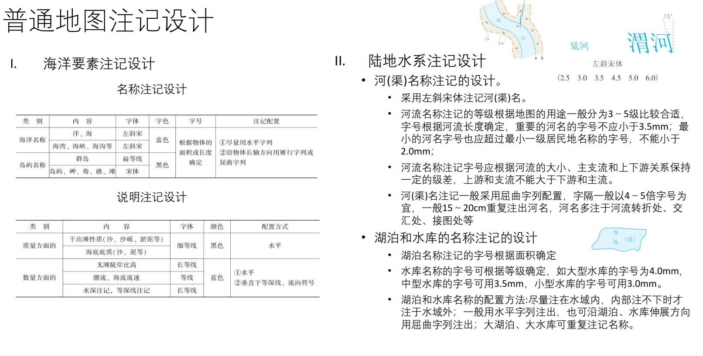
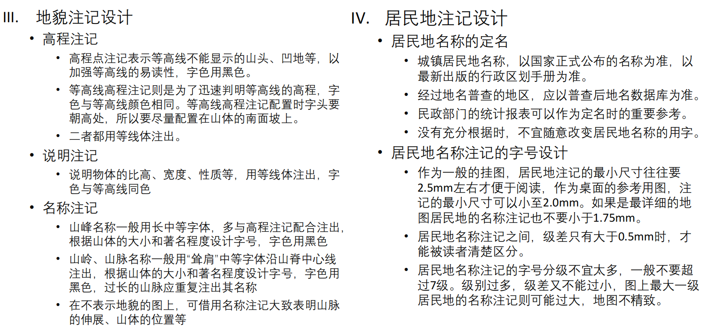

# 6.地图注记

* 地图注记是地图语言的重要组成部分。
* 地图符号由图形语言构成，地图注记则由自然语言构成。
* 地图注记对地图符号起补充作用，地图有了注记便具有了可阅读性和可翻译性，成为一种信息传输工具。

## 地图注记的功能

* 标识各对象
* 指示对象的属性
* 表明对象间的关系
    * 经区划的区域名称往往表明影响区划的各重要因素间
的关系.
* 转译：注记需要翻译（？）

## 地图注记的分类

* 名称注记
    * 地理事物的名称
* 说明注记：分为文字和数字两种
    * 补充说明制图对象的质量或数量属性

## 地图注记要素

概念：能引起视觉差别的注记变化因素称为“注记要素”。

* 字体：以不同的字体区别物体的类别。
* 字大：注记的大小在一定程度反映被注对象的重要性和数量等级。
* 字色：注记颜色主要用于强化分类概念，例如水系名称注记用蓝色，等高线高程注记用棕色。
* 字隔：注记字隔指在一条注记中字与字之间的间隔，而最大字隔不应超过字大的5～6倍。
* 字位：注记字位指注记的位置。
* 字向：字向分直立与斜立两种。
* 字顺：字顺是指同一注记中各字的排列顺序。

## 地图注记的特性

* 对象属性：地图注记是对地图符号的说明与补充
* 分散性：是由地物的纵横交错特征导致的，要注意注记的排列组织
* 层次性：使专题要素凸显出来，弱化底图要素
* 艺术性

## 地图注记设计
>何意味是什么意思？

很重要，经常出题。
### 地图注记设计
* 字体
    * 常用宋体、黑体、仿宋、隶书、魏碑体
    * 图名、区域名要求字体明显突出，多用隶体、魏碑体或其他美术字体
    * 河流、湖泊、海域：左斜宋体
    * 山脉：右耸肩体。山峰、山隘：长中黑体
    * 居民地-城市：黑体。乡、镇、行政村：宋体。其他村庄：细黑体/仿宋体
* 字号
    * 根据地图用途和使用方式
    * 注记的级差之间至少要保持0.5mm以上
* 字色
    * 普通地图：水系蓝色，地貌棕色，地名黑色（重要红色）
    * 专题地图：分为两个层次，地理底图钢灰色，专题信息：高饱和彩色



### 文字一般规则

1. 不要使用奇怪字体。
2. 斜体（Italic）用于某些特定用途，比如水域名称、文献名称
3. 不要在一张图上使用超过两种字体。如果用两种就要用完全不一样的两种。（如衬线体和无衬线体）
4. 字体大小应该和地图要素的大小、地图元素的重要性相匹配
5. 一般文字的方向应该是水平方向，除非需要与地图要素对齐，如带有弯曲纬线的经纬网地图，文字应随纬线弯曲。标注斜向或弯曲要素（如河流、山脉、斜向的街道）时，文字方向应与要素走向一致。
6. 文字与文字、文字与地图要素之间不应该重叠。叠置的处理办法：遮罩（在文字下方、地图要素上方放置一个多边形背景。）、光晕（围绕字母边缘向外扩展的轮廓线。）、引线/标注框

### 点要素注记规则
* 放置标注时应避免覆盖其他地图要素。
    * 位置优先级：1.右上，2.右下，3.左上，4.左下，5.上，6.下，7.右，8.左
* 不要让其他地图要素位于点符号与其标注文字之间；
    * 标注应靠近符号，可以放弃优先级更高的位置
* 当优选位置顺序无法提供合适方案时，考虑使用遮罩 (Mask)、光晕(Halo)、标注框(Callout)。或者使用简单的引线 (Leader line)。
    * 点符号的引线应当非常细，不带箭头，并且指向点符号的中心，但不要与点符号直接接触。
* 多行文字标注应整体按照优选位置顺序放置；各行文字应水平对齐或居中对齐。
* 沿海地区的特殊处理
    * 陆地上的点： 如果点符号在陆地上且靠近海岸线，标注应完全落在陆地上。
    * 跨海岸线的点： 如果点符号恰好压在海岸线上，标注应要么完全在陆地，要么完全在水域（以此避免文字被海岸线切断或叠压）。

!!! note "总结(学长的)"
    1. 不能让点要素和注记之间出现其他地图要素  
    2. 如果点要素附近没有空间可以写注记，可以使用引线（leader line），引线不能碰到点要素  
    3. 多行文字需要对齐，通常是在靠近要素的一侧对齐  
    4. 文字不要放在海岸上，要么就全部放在陆地上，要么就全部放在海上  

### 线要素标注规则

（规则和工程制图类似，技术人应该懂）
>没学过技术:D

1. 文字应该沿着线要素的方向，但是不能碰到。（比如g，y的下伸部）
2. 文字的方向绝对不能朝下，水平从左往右读。在垂直的情况下文字朝左边。
3. 文字在线的上面。当你把地图转到和文字一个方向的时候，文字一定是在线要素的上面。（例外情况是线的上面和下面都有文字）
4. 如果线要素非常弯曲，不需要完全贴上去，符合大致走向即可
5. 非常长的线要素可以标注不止一次

### 面要素标注规则
1. 尽量把文字全部写在面要素的里面。对于形态复杂、边界曲折的面要素，标注文字应遵循要素的总体走向。  
2. 最好全部用大写字母  
3. 可通过加大字距和词距来强调面要素的空间范围，但行间距不要太大  
4. 如果面要素实在太小，可以把它当做点要素，或者用引线（leader line），引线要插入面要素内部  
5. 如果某些线状要素（如很宽的河流）是以“面”的形式画出来的，应遵循面状要素的标注规范。 

## 地名译写
* 名从主人
* 专名以音译为主，意译为辅
* 通名以意译为主，音译为辅
* 地名中的附加形容词可以意译，也可以音译
* 约定俗成地名的沿用

## 地名标准化
* 各国按自己的官方语言对国内地名确定一种标准的书写形式，使国内地名标准化
* 非罗马字母的国家提供一种本国地名的罗马字母拼写的标准形式，这称为单一罗马化
* 制定一台各国公认的转写法，以便将地名从一种语言文字译写成为另一种语言文字的形式

## 我国地名的国际转写标准化
### 汉语拼音字母拼写规则
* 分写和连写
    * 专名和通名分写
    * 专名或通名中的修饰、限定成分，单音节的与其相关部分连写，双音节或多音节的与其相关部分分写
    * 自然村镇名称各音节连写
    * 通名已专门化的，按专名处理。例如，黑龙江/省，景德镇/市。
    * 以人名命名的地名，人名中的姓和名连写。例如，左权/县，张之洞/路。
    * 地名中的数字一般用拼音书写。例如，五指/山(Wǔzhǐ Shān)，第二/松花/江(Dì'èr Sōnɡhuā Jiānɡ)。
    * 地名中的代码和街巷名称中的序数词用阿拉伯数字书写。例如，1203/高地。
* 语音的依据：普通话/普通话审音委员会审定
* 大小写、隔音、儿化音、移行
    * 第一个字母大写/分段书写时每一段第一个字母书写
    * aoe开头的第一音节用隔音符号```'```隔开
    * 儿化音用r表示
    * 移行以音节为单位，上行末尾加短横线
* 起地名作用的建筑物、游览地、纪念地、企事业单位名称的书写。
    * 能够区分专名、通名的，专名与通名分写。修饰、限定单音节通名的成分与其通名连写。例如，黄鹤/楼，北京/工人/体育馆。
    * 不易区分专名、通名的一般连写。例如：三潭映月。
    * 含有行政区域名称的企事业单位名称，行政区域的专名和通名分写。例如，浙江/省/测绘局，北京/市/宣武/区/育才/学校。
### 少数民族语地名的音译
音形兼顾