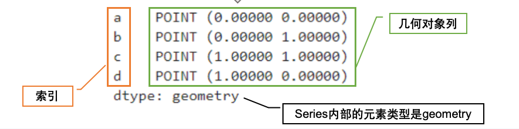
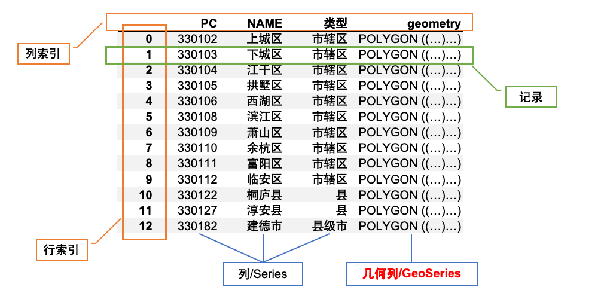

# GeoPandas
## 几何对象与几何数据
Shapely是一个遵循BSD许可协议的Python包，用于在笛卡尔平面内操作和分析平面几何对象，许多软件都集成了Shapely用于几何对象的处理（比如PostGIS）。  

Shapely不关心数据格式或坐标系，但是可以很轻松的与别的Python包结合起来实现（比如和pyproj包结合来实现坐标系设置与投影转换）  

GeoPandas使用shapely下的geometry模块来定义几何对象

```python
    # 构造一个Point对象
    geometry.Point(0,0)

    # 构造一个MultiPoint对象
    geometry.MultiPoint[(0,0),(0,1),(1,0)]

    # 使用顺序连接的若干对坐标即可构造一个LineString对象
    # 不闭合
    geometry.LineString([(0, 0), (1, 1), (1, 0)])

    # 使用顺序连接、首尾闭合的若干对坐标即可构造一个LinearRing对象
    # 闭合
    # 可令首尾坐标相等以显式地闭合序列。否则，会自动地复制第一个坐标来隐式闭合序列
    geometry.LinearRing([(-2, 0), (0, 2), (4, 1)])

    # 使用顺序连接的若干对坐标的列表即可构造一个MultiLineString对象
    geometry.MultiLineString([[(0, 0), (1, 1), (1, 0)], [(-2, 0), (0, 2), (4, 1)]])

    # 使用顺序连接、首尾闭合的若干对坐标即可构造一个Polygon对象（首尾坐标处理和LinearRing一样）
    geometry.Polygon([(-2, 0), (0, 2), (4, 1), (4, -1)])

    # 添加第二个环状序列，用来指定多边形内部的“洞”
    geometry.Polygon([[(-2, 0), (0, 2), (4, 1), (4, -1)],[(0, 0), (1, 1), (1, 0)]])
```

## GeoPandas数据结构
### GeoSeries
GeoSeries由索引（index）和列组成，列的部分可以看作是一个一维向量，向量的每个元素都表示着一个几何对象（以shapely的格式表示）  

```python
from shapely import geometry 
import geopandas as gpd 

s = gpd.GeoSeries([geometry.Point(0, 0), 
               geometry.Point(0, 1), 
               geometry.Point(1, 1), 
               geometry.Point(1, 0)
              ], index=['a', 'b', 'c', 'd'])

```


|属性	|作用|
|------|---|
|s.area|	返回GeoSeries中每个几何元素的面积值（单位取决于投影坐标系）|
|s.bounds	|返回GeoSeries中每个几何元素的外包box的左下角与右下角的坐标|
|s.length|	返回GeoSeries中每个几何元素的边长|
|s.geom_type|返回GeoSeries中每个几何元素的几何类型|
|s.exterior s.interiors|返回GeoSeries中每个几何元素的外边框线/内部孔洞边界|
|s.boundary|返回GeoSeries中每个几何元素的低维简化表示|
|s.centroid|返回GeoSeries中每个几何元素的几何中心|
|s.convex_hull|返回GeoSeries中每个几何元素的凸包|
|s.envelope|返回GeoSeries中每个几何元素的外包box|
|s.is_valid|返回GeoSeries中每个几何元素是否符合shapely语法|

### GeoDataFrame
GeoDataFrame是一个表格型的数据结构，它含有一组有序的列，每列可以是不同的值类型（数值、字符串、布尔型值、几何对象）。GeoDataFrame既有行索引也有列索引，它可以被看做由Series和GeoSeries共同用一个索引的情况下组成的DataFrame。  




#### 按标签切片取行列

`DataFrame.loc[行选择, 列选择]`

`.loc`通过行列名对数据进行索引筛选  

* 基本格式：`gdf.loc[行标签, 列标签]`  
    * 选择单行：`gdf.loc['idx1']`,表示选择 index 为 idx1 的这一行。
    * 选择多行：`gdf.loc[['idx1', 'idx3']]`
    * 行切片：`gdf.loc['idx1':'idx3']`左闭右闭
    * 选择单列：`gdf.loc[:, 'name']`，`:`表示所有行，`name`表示name这一列
    * 选择多列：`gdf.loc[:, ['name', 'geometry']]`
    * 同时选行和列：`gdf.loc['idx1':'idx3', ['name', 'value']] `，选择 idx1 到 idx3 的行，只取 name 和 value 两列。
    * 条件筛选：`gdf.loc[gdf['type'] == 'road']`
    * 多条件筛选`&且` `|或` `~非`

`iloc`：按位置选择  

* 基本格式：`gdf.iloc[行位置, 列位置]`
    * 行切片：`gdf.iloc[0:3]` 左闭右开
    * 其他和loc类似


`.cx` 按坐标范围筛选空间对象

* 基本语法：`gdf.cx[xmin:xmax, ymin:ymax]`
    * 只限制x：`gdf.cx[0:5, :]`
    * 只限制y：`gdf.cx[:, 0:5]`
    * 不限制任何方向：`gdf.cx[:, :]`相当于返回全部数据

`.cx`筛选的是“相交”，不一定是完全包含。只要 geometry 和这个矩形范围有交集，就会被选中。

## GeoPandas数据IO
读数据`gpd.read_file(<file_dir>, layer=<layer_name>)`  
支持shapefile、geojson、geopackage等多种矢量数据源，同时还支持zip、tar等压缩文件

* `rows`
    * rows过滤方法基于给定行数来读取前若干行矢量数据记录
    * `gpd.read_file(<file_dir>, rows=10)`仅读取前10行数据
* `bbox`
    * 基于给定的一组` (minx,miny,maxx,maxy)` 坐标所构成的矩形框对数据进行过滤，只有与该矩形框相交的数据才会被读取
    * `gpd.read_file(<file_dir>, bbox=(0,0,6,3))`
* `mask`
    * mask过滤方法基于给定的一个多边形对数据进行过滤，只有与该多边形相交的数据才会被读取，相比bbox方法，mask方法可以进行更精确的过滤
    * `gpd.read_file(<file_dir>, mask=geometry.Polygon([(0,0),(0,3), (6, 3)]))`

### 从 PostGIS 数据库读取空间数据
1.创建数据库连接  
`db_conn = create_engine("postgresql://user:pw@host:port/db_name")`  
`postgresql://用户名:密码@主机地址:端口号/数据库名`  

2.写 SQL 查询语句  
`sql = "SELECT * FROM china_province"`表示从数据库表 `china_province` 中读取所有字段、所有记录。   

```text
SELECT  → 查询
*       → 所有列
FROM    → 从哪个表
```

如果只想读部分字段，也可以写  
```python
sql = """
SELECT name, geom
FROM china_province
"""
```

3.用 GeoPandas 读取 PostGIS  
```python
gpd.read_postgis(
    sql,# 要执行的SQL查询语句
    db_conn,# 前面创建好的数据库连接
    geom_col='geom',# 指定那一列是几何列
    crs='EPSG:4326'# 指定参考坐标系
)
```
## 坐标参考系与投影
坐标参考系统（Coordinate Reference System, CRS）是描述物体在地球及近地空间的位置的坐标参考系统，包括地理坐标系和和投影坐标系，任何GIS研究与应用都离不开CRS。  

地理坐标系是基于地球的球面模型，以经纬度来表示位置的坐标系统。这种坐标系能够直接反映地球表面物体的经纬度位置，适用于全球范围内的定位和导航，但在处理大范围的地理数据时，由于地球的曲率，会导致距离和面积的计算不够精确。因此地理坐标系往往可以用于定位，但不能直接处理长度、面积等几何属性的计算。  

投影坐标系则是为了将地球表面的三维球面数据转换为二维平面数据而设计的坐标系统。由于地球是一个不规则的椭球体，直接将球面数据映射到平面上会产生变形，因此需要通过各种投影方法来实现转换。**在计算几何对象的长度、面积等属性时，需要将其坐标系转变为投影坐标系。**  

### Proj4
Proj4是一个用于制图投影的转换库，该库提供了一种用遵循特定语法的字符串表示坐标参考系的方法。一个Proj4字符串包含了一种CRS全部元素信息，其中用加号+连接每个元素定义部分。  
用来描述一个坐标系是经纬度坐标，还是投影坐标；使用什么椭球体、基准面、中央经线、单位、偏移量等参数。  

基本结构：`+proj=xxx +datum=xxx +ellps=xxx +units=xxx +no_defs`  

| 参数            | 含义    |
| ------------- | ----- |
| `+proj`       | 投影方法  |
| `+datum`      | 大地基准面 |
| `+ellps`      | 椭球体   |
| `+zone`       | 投影带号  |
| `+units`      | 坐标单位  |
| `+lon_0`      | 中央经线  |
| `+lat_0`      | 原点纬线  |
| `+x_0`        | 假东坐标  |
| `+y_0`        | 假北坐标  |
| `+k` 或 `+k_0` | 比例因子  |

`+proj=longlat +datum=WGS84 +no_defs`表示`WGS84 经纬度坐标系，也就是 EPSG:4326`  

```python
gdf.set_crs("EPSG:4326")   # 声明坐标系
gdf.to_crs("EPSG:3857")    # 转换坐标系
```

### WKT
WKT,Well-Known Text，中文常译为 通用文本表示法。用于描述坐标参考系统。它可以表示地理坐标系、投影坐标系和高程坐标系等。WKT字符串的优点是可以描述各种常用坐标系库中没有的，自定义的复杂坐标系。  

#### Point:点
```python
POINT (116.4 39.9)
```
对应Shapely：
```python
from shapely.geometry import Point

p = Point(116.4, 39.9)
```

#### LineString：线
```python
LINESTRING (0 0, 1 1, 2 1)
```
表示一条折线，依次连接`(0,0) → (1,1) → (2,1)`  

对应Shapely：
```python
from shapely.geometry import LineString

line = LineString([
    (0, 0),
    (1, 1),
    (2, 1)
])

print(line.wkt)
```

#### Polygon：面
```python
POLYGON ((0 0, 4 0, 4 4, 0 4, 0 0))
```
Polygon 的首尾点必须闭合  
对应Shapely：
```python
from shapely.geometry import Polygon

poly = Polygon([
    (0, 0),
    (4, 0),
    (4, 4),
    (0, 4),
    (0, 0)
])
```

#### Multi 几何类型
MultiPoint：多个点`MULTIPOINT ((0 0), (1 1), (2 2))`  

MultiLineString：多条线`MULTILINESTRING ((0 0, 1 1), (2 2, 3 3))`  

MultiPolygon：多个面`MULTIPOLYGON (  ((0 0, 4 0, 4 4, 0 4, 0 0)),  ((10 10, 14 10, 14 14, 10 14, 10 10)))`  

#### 带洞 Polygon 的 WKT  
```python 
POLYGON (
  (0 0, 10 0, 10 10, 0 10, 0 0),
  (3 3, 7 3, 7 7, 3 7, 3 3)
)

POLYGON (
  外环,
  内环
)
```

第一组坐标：外边界  
第二组坐标：内洞  


#### GeometryCollection
GEOMETRYCOLLECTION 可以混合存放不同类型的几何对象。  
```python
GEOMETRYCOLLECTION (
  POINT (1 1),
  LINESTRING (0 0, 2 2),
  POLYGON ((0 0, 1 0, 1 1, 0 0))
)
```

#### GeoPandas / Shapely 中 WKT 的使用
几何对象转 WKT  
```python
from shapely.geometry import Point

p = Point(116.4, 39.9)

p.wkt
```

WKT 转几何对象  
```python
from shapely import wkt

geom = wkt.loads("POINT (116.4 39.9)")

print(geom)
print(type(geom))
```

DataFrame 中 WKT 转 geometry    


GeoDataFrame 的 geometry 转 WKT  

#### WKT 和 CRS 的关系

几何 WKT 本身通常只保存坐标，不保存坐标系。  

所以读入 WKT 后，通常要手动设置 CRS：
```python
gdf = gpd.GeoDataFrame(
    df,
    geometry="geometry",
    crs="EPSG:4326"
)
# 或者：

gdf = gdf.set_crs("EPSG:4326")
```

### EPSG（European Petroleum Survey Group）
EPSG（European Petroleum Survey Group）编码是一组4-5位的数字编码，对每种已经存在的CRS进行了ID编号，在使用CRS时就只需要引用这些约定俗成的编号即可，而不需要像Proj4一样写出长长的一串字符串（比如使用WGS84地理坐标系，只需要指定EPSG:4326即可）。  

设置crs`gdf = gdf.set_crs("EPSG:4326")`  （不会改变坐标值）

转换crs`gdf_3857 = gdf.to_crs("EPSG:3857")`（会改变坐标值）

#### PyProj
PyProj是一个用于管理投影的Python包，GeoPandas基于PyProj实现了对矢量数据坐标参考系的管理，GeoDataframe也包含有crs属性用于存放坐标参考系信息。  

定义坐标系：  
```python
gdf.crs = pyproj.CRS.from_user_input('EPSG:4326’)
gdf.crs = pyproj.CRS.from_proj4("+proj=longlat +datum=WGS84 +no_defs")
```
重投影坐标系：
```python
gdf.to_crs(crs='EPSG:4326')
```

## GeoPandas数据可视化
matplotlib是Python最常用的绘图库，GeoPandas基于matplotlib实现了对GeoSeries和GeoDataFrame的基础可视化能力。  

使用GeoSeries.plot()函数即可对GeoSeries中的几何对象进行可视化，函数可选的参数包括：  

* figsize：传入(宽度, 高度)形式的元组或列表，用于控制绘制出图像的宽度和高度，单位均为英寸
* facecolor：设置几何对象的填充色，可接受颜色名称和十六进制色彩，设置为'none'时不填充颜色
* edgecolor：设置几何对象的边界色，对面数据和点数据效果较为明显，不建议对线数据设置该参数，传入格式同facecolor
* linewidth：设置几何对象边界宽度，对面数据和点数据效果较为明显，不建议对线数据设置该参数
* linestyle：字符串类型，用于设置几何对象边界及线数据的线型
* markersize：设置点数据的大小
* marker：字符串类型，用于设置点数据的形状
* alpha：设置对应几何对象全局的色彩透明度，0-1，越大越不透明
* label：适用于纯粹的线数据或点数据，在需要添加图例时适用，用作各个对象在图例中显示的名称
* hatch：字符型，用于设置面数据内部的填充线样式下文的例子中将具体举例说明
* ax：matplotlib坐标轴对象，如果需要在同一个坐标轴内叠加多个图层就需要用这个参数传入先前待叠加的ax

使用GeoDataframe.plot()函数对GeoDataFrame中的几何对象进行可视化时，有更多的可选参数可供使用：

* column：用于指定映射地图视觉元素的数值信息，可以是对应GeoDataFrame的列名，或是直接传入与几何对象一一对应得数值序列，默认为None
* cmap：传入映射视觉元素时的色彩方案，具体使用方式下文中会做详细介绍
* categorical：bool型，True表示指定映射目标列采取离散表示，对于数值型的列有意义，当对应目标列为类别型时自动变为True
* legend：bool型，为True时会为地图添加图例
* scheme：str型，用于指定地区分布图分层设色的数值划分方案，下文中会做详细介绍
* k：int型，用于指定分层设色的色阶数量
* vmin：None或float，用于指定分层设色的数值范围下限，默认为None即以对应数据中的最小值为下限
* vmax：None或float，用于指定分层设色的数值范围上限，默认为None即以对应数据中的最大值为上限
* legend_kwds：字典型，传入与图例相关的个性化参数
* classification_kwds：字典型，传入与分层设色相关的个性化参数
* missing_kwds：字典型，传入与缺失值处理相关的个性化参数，用于对缺失值部分的视觉映射做个性化设置

