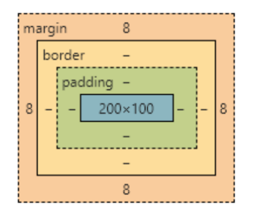

# HTML与CSS
## html
```html
<html>
    <head>
        <title>标题</title>
    </head>
    <body>
        <h1>标题</h1>
        <p>段落</p>
    </body>
</html>
```

### 标题、段落、换行、列表
- `<meta>`用来描述网页的元信息
- `<h1></h1>~<h6></h6>`:标题标签   
- `<p></p>`：段落标签  
- `<br/>`：换行标签  
- ``：图片   
- `<a href ="路径" targer="跳转方式">文字</a>`：
    - `_self`：当前窗口，默认
    - `_blank`：新窗口
- 列表
    - `<ul></ul>`：无序列表
    - `<ol></ol>`：有序列表
    - `<li></li>`：列表项

### 表格
  
```html
<table border="1">
    <tr>
        <th>列标题1</th>
        <th>列标题2</th>
        <th>列标题3</th>
    </tr>
    <tr>
        <td>元素1</td>
        <td>元素2</td>
        <td>元素3</td>
    </tr>
    <tr>
        <td>元素4</td>
        <td>元素5</td>
        <td>元素6</td>
    </tr>
    <tr>
        <td>元素7</td>
        <td>元素8</td>
        <td>元素9</td>
    </tr>

</table>
```
效果：  

|列标题1|列标题2|列标题3|
|------|------|------|
|元素1|元素2|元素3|
|元素4|元素5|元素6|
|元素7|元素8|元素9|

### 表单
`<form></form>`  


- method属性用于设置表单提交时的html方法为post或get
    - get
        - `<form action="/login" method="get">`，提交`用户名：admin\n密码：123456`
        - 浏览器地址栏会变成：`http://localhost/login?user=admin&password=123456`，数据直接拼在 URL 后面。
        - `url?参数1=值1&参数2=值2`
    - post
        - `<form action="/login" method="post">`
        - 提交后数据放在body请求体里面
- action属性用于指定表单提交的目标url，需要后端提供的api（指定提交给哪个后端接口）
- name用于定义控件对应的变量名
- value属性存储了控件当前输入的值
    - 对普通输入框：默认内容
    - 对按钮：按钮文字
    - 对单选框/复选框：提交给后端的值
    - 对下拉框 option：选项值
- required属性将当前控件标记为必填项
- `<textarea></textarea>`是表单域中的文本域控件，用于输入多行文本
- `<select></select>`表单中的下拉列表控件
    - `<option></option>`标签用于设置下拉列表中的选项
    - `<select>` 本身没有像 `<input>` 那样的 placeholder 属性。通常的做法是添加一个默认选项作为提示词：`<option value="" selected disabled>请选择学历</option>`
        - selected：默认选中，disabled：不能被选中提交，value=""：值为空
- `<input type="text">`：input 控件用于让用户输入内容，是 HTML 表单里最常用的元素。
    - `<input>` `<inout/>`都行
    - `<input type="text"name="username"placeholder="请输入用户名"value="默认值"requiredmaxlength="20">`
    - `type`用于设置控件类型，text（文本）、button（按钮）、radio（单选框）、checkbox（复选框）、password（密码）、file（文件）、submit（提交按钮）、reset（重置按钮）、range（范围）、color（颜色）

| 属性            | 作用        |
| ------------- | --------- |
| `type`        | 输入框类型     |
| `name`        | 表单提交时的字段名 |
| `placeholder` | 提示文字      |
| `value`       | 默认值       |
| `required`    | 必填        |
| `maxlength`   | 最大输入长度    |
| `disabled`    | 禁用        |
| `readonly`    | 只读        |

- `<lable></lable>`
    - 表单域中的提示信息，向用户提示控件的用途和功能
    - for属性填入`<label>`所描述的表单控件的name，将两者在语义上相连。for属性并非必填项，但有助于提升网页的可访问性，帮助屏幕阅读器正确地识别和关联表单控件

```html
<!DOCTYPE html>
<html lang="en">
<head>
    <meta charset="UTF-8">
    <meta name="viewport" content="width=device-width, initial-scale=1.0">
    <title>HTML 表单</title>
</head>
<body>
    <form action ="#">
        <label>用户名：</label>
        <input type="text" id="username" placeholder="请输入内容">
        <br><br>
        <label for="psd">密码：</label>
        <input type="password" id="psd" placeholder="请输入内容">
        <br><br>

        <label >性别</label>
        <input type="radio" name="gender">男
        <input type="radio" name="gender">女
        <input type="radio" name="gender">其他<br><br>

        <label>爱好: </label>
        <input type="checkbox" name="hobby"> 唱歌
        <input type="checkbox" name="hobby"> avemujica<br><br>

        <input type="submit" value="上传">
    </form>
</body>
</html>
```

### 容器 div与span
- `<div></div>`块级元素
- `<span></span>`内联元素，常作为文本的容器

### 常用特殊字符
有些字符不能直接写在 HTML 中，否则会被浏览器误认为标签  

| 字符名 | 符号  | 对应代码     |
| --- | --- | -------- |
| 小于号 | `<` | `&lt;`   |
| 大于号 | `>` | `&gt;`   |
| 空格  | 空格  | `&nbsp;` |

## css
CSS（层叠样式表，Cascading Style Sheets）也是一种标记语言，用于为网页设置样式，所谓层叠，指网页具有层状结构，CSS可以为各个层的内容分别设置样式。有了CSS，HTML可以专注于实现页面结构，而CSS负责页面美化  

样式名与样式值之间用`:`分隔，多个样式名与样式值键值对之间用 `;`分隔 

基本格式  
```
选择器 {
  样式名: 样式值;
  样式名: 样式值;
}
```

```css
p {
  color: red;
  font-size: 16px;
}
/* 含义是：
选中所有 <p> 元素，并将文字颜色设置为红色，字号设置为 16 像素 */
```

CSS根据编写位置，可分为行内样式、内部样式、外部样式三种  

- 行内样式：
    - 直接将CSS代码写在标签的style属性中
    - 编写方便，定位准确，但没有实现CSS与HTML的解耦，且样式无法复用
    - `<p style="color: red;">这是一段文字</p>`
- 内部样式：
    - 将CSS代码写在html文件的`<style>`标签中
    - 使CSS与HTML相对独立，且CSS代码可以在同一个文件内复用，但无法在多个文件间复用
```html
<style>
p {
  color: red;
}
</style>
```
- 外部样式：
    - 将CSS代码写在专门的CSS文件中，在HTML里通过<link>标签引入
    - CSS与HTML充分解耦，结构清晰，且方便复用，在开发中最常用
    - `rel = "stylesheet"`说明引入的东西是样式表
```html
<link rel="stylesheet" href="index.css">
```

```css
p {
  color: red;
}
```
### 选择器
- 通配符选择器`*`
    - 用于选中页面中所有元素
- 标签选择器
    - 也称元素选择器，用于选中页面中某一类标签
    - 语法：`标签名{}`
- 类选择器
    - 选择具有相同class属性的元素
    - 语法：`.类名{}`
- ID选择器
    - 根据元素的id属性进行选取，由于id属性值的唯一性，id选择器一次只能选择一个元素
    - 语法： `#id {}`
- 并集选择器：
    - 选择多组元素，多个选择器间用”,”分隔
    - 语法： `选择器1, 选择器2 [,选择器3…] {}`
- 后代选择器：
    - 选择祖先元素的后代元素，多个选择器间用“ ”分隔
    - 语法：`祖先选择器 后代选择器 {}`

```html
<div class="box">
  <p>这是 box 里面的 p</p>

  <section>
    <p>这是 box 里面更深层的 p</p>
  </section>
</div>

<p>这是 box 外面的 p</p>
```
```css
.box p {
  color: red;
}
```
意思是选择`.box`里面所有的`<p></p>`元素，所以html里面前两个p会变红，最后一个（外面的）不会  
注意：后代不一定是“儿子”，也可以是“孙子、重孙子”，如果想只选直接子元素，用子代选择器   

- 子元素选择器：
    - 选择父元素的直接子元素，多个选择器间用“>”分隔
    - 语法： 父元素>子元素 {}
- 伪类选择器
    - 用于给某些选择器添加特殊效果
    - 伪类选择器用冒号（:）表示，例如对于链接元素， a:link {}表示正常链接的样式，a:visited {}表示访问过的链接样式，a:hover {}表示鼠标悬浮时的链接样式， a:active {}表示正在点击的链接样式

```css
/* 鼠标悬停 */
button:hover {
  background-color: orange;
}

/* 点击时 */
button:active {
  background-color: red;
}

/* 输入框获得焦点 */
input:focus {
  border: 2px solid blue;
}

/* 第一个子元素 */
li:first-child {
  color: red;
}

/* 最后一个子元素 */
li:last-child {
  color: green;
}

/* 第 n 个子元素 */
li:nth-child(2) {
  color: blue;
}
```

### 字体属性
CSS字体属性用于定义字体的大小、粗细、斜体、字体类型等  

- font-size：
    - 指定文字大小
    - 常用单位有px（像素）、百分比（相对于父元素的百分比）、em（相对于父元素的大小，1em相当于100%）等
- font-weight：
    - 指定文字粗细
    - 默认值为normal（不加粗），可设为bold（加粗）
    - 也可使用数字100,200,…,900，数字越大字体越粗，400等同于normal，700等同于bold
- font-style：
    - 指定文字是否为斜体
    - 默认值为normal（非斜体），可设为italic（斜体）
- font-family：
    - 指定字体类型
    - 例如p {font-family："Times New Roman", serif}
    - 多个字体间用“,”间隔，如果指定了多个字体，会优先使用第一种字体；若浏览器不支持第一种字体，则依次尝试下一种字体
- font（字体简写属性）：
    - **可以在一条声明中设置字体的所有属性**
    - 可设置的属性是：“font-style font-variant font-weight font-size/line-height font-family”
    - **font-size**和**font-family**的值是必需的。其他值若缺失，浏览器将自动插入默认值

### 文本属性
CSS文本属性用于定义文本的颜色、对齐、修饰、缩进等  

- color：
    - 指定文本颜色
    - 可以使用预定义的颜色值（如red, blue等）、十六进制值（如#FF0000）或RGB值（如RGB(255,0,0)）
- text-align：
    - 指定元素内文本的对齐方式
    - 可设为left(默认值)、right、center
- text-decoration：
    - 指定文本的修饰
    - 可设为none(无修饰，默认值)、underline（下划线）、overline（上划线）、line-through（删除线）
- text-indent：
    - 指定文本首行的缩进
    - 常用em作为大小，1个em相当于1个文字大小
- line-height：
    - 设置文本的行高
    - line-height  行间距，行高越大，行间距越大
    - 若文字行高等于盒容器高度，则文字可以垂直居中

### 背景属性
CSS背景属性用于设置元素的背景颜色、背景图片、背景重复方式、背景图片位置、背景固定方式等  

- background-color：
    - 设置元素背景颜色
    - 默认值为transparent（透明）
- background-image：
    - 设置元素背景图片
    - 默认值为none（无背景图），可使用url()指定背景图片
- background-size：
    - 设置单位背景图片的尺寸大小。

| 值         | 含义            |
| --------- | ------------- |
| 一个值       | 按比例缩放         |
| 两个值       | 拉伸到指定宽高       |
| `contain` | 保持比例，使图片完整显示  |
| `cover`   | 保持比例，覆盖整个元素区域 |

- background-repeat：
    - 设置元素背景重复方式

| 值           | 含义             |
| ----------- | -------------- |
| `repeat`    | 默认值，水平和垂直方向都重复 |
| `no-repeat` | 不重复，只显示一次      |
| `repeat-x`  | 沿 x 轴重复        |
| `repeat-y`  | 沿 y 轴重复        |

- background-position：
    - 设置元素背景图片位置
    - 属性值分别为x方向和y方向的位置值，用空格分隔
    - 可用关键字（top、bottom、left、right、center）、百分比或者数值表示
- background-attachment：
    - 设置元素背景图片是否随页面滚动
    - 可设为scroll（滚动）、fixed（固定）
- background（背景简写属性）：
    - 通过background属性一次设置多个样式。
    - 通常没有顺序要求；但**若同时定义了size和position，则size必须紧跟在position后面，并以"/"分割**
    - `background:#foo url(images/css.png) no-repeat center 30px/120px 60px`

### display属性
- 每个元素都有自己默认的显示模式，但我们也可以使用display属性主动对元素的显示模式进行更改
- 转换为块元素：`display: block`
- 转换为行内元素：`display: inline`
- 转换为行内块元素：`display: inline-block`
- 使用`display: none`可以使元素不可见


### 块元素（display: block）
- 块元素**独占一行**
- 高度、宽度、内外边距可以设置，默认宽度为容器（父元素）100%
- 块元素是个容器，可以盛放块元素与行内元素
- 常见块元素有：`<h1>~<h6>`、 `<p>`、 `<div>`、` <ul>`、 `<ol>`、 `<li>`等
- 文字类块元素内不能使用块元素，即`<h1>~<h6>`、 `<p>`等文字块元素里面不能使用其他块元素

### 行内元素（display:inline）
- 一行可以放置多个行内元素
- 高度、宽度无法直接设置、默认宽度为其内容宽度
- 行内元素只能容纳文本或其他行内元素
- 常见行内元素有：`<a>`（超链接标签）、 <span>等
- <a>里不能再放<a>，但某些特殊情况下<a>里可以放块级元素
    - html5的特性，可以在链接里放一个块级元素如卡片，点击卡片任意位置都能跳转

### 行内块元素（display: inline-block）
- 行内块元素兼具块元素与行内元素的特点
- 一行可以放置多个行内块元素，但元素之间会有空隙
- 默认宽度为其内容宽度
- 高度、行高、内外边距可以设置
- 常见行内块元素有： ``、 `<input>`、 `<td>`等

### 布局
- 使用CSS布局页面时，可以认为每个元素都包含在一个矩形盒子里，网页布局的过程就是摆放盒子的过程
- CSS盒子模型包括盒子内容（content）、内边距（padding）、边框（border）、外边距（margin）



- content内容
    - 指盒子中间放置内容的区域
    - 如果没有设置内边距和边框，则内容区的大小就是盒子大小
    - 使用height和width属性可以设置内容区的大小
    - height和width属性只适用于块元素
- padding内边距
    - 指盒子内容区与边框之间的部分
    - 使用padding属性设置元素的上、右、下、左四个方向的内边距，如`padding: 10px 20px 5px 10px`
        - 若padding只设置了三个值、则分别表示上、左右、下内边距；
        - 只设置了两个值，则分别表示上下、左右内边距；
        - 只设置了一个值，则表示上下左右四个方向的内边距
    - 也可使用`padding-top`、 `padding-right`、 `padding-bottom`、 `padding-left`分别设置内边距
    - 内边距不能为负值
- border（边框）：
    - 使用border属性设置盒子边框，包括边框粗细（`border-width`）、边框样式（`border-style`）、边框颜色（`border-color`），如`border:1px solid red;`
    - 也可使用border-top、 border-right、 border-bottom、 border-left分别设置四个方向的边框
    - 使用`border-radius`属性可以设置盒子的圆角边框，属性值可以设置为数字（px）或百分比（相对于盒子大小）
- margin外边距
    - 外边距**可以为负值**
    - 当块级盒子设置了宽度，且左右外边距都为auto时，盒子**水平居中**
    - 使用margin属性设置元素的上、右、下、左四个方向的外边距，如`margin: 10px 20px 5px 1opx`
        - 若margin只设置了三个值、则分别表示上、左右、下外边距；
        - 只设置了两个值，则分别表示上下、左右外边距；
        - 只设置了一个值，则表示上下左右四个方向的外边距
    - 也可使用margin-top、 margin-right、 margin-bottom、 margin-left分别设置外边距

### 浮动与定位

标准流指网页元素按照默认方式排列，即块元素独占一行、自上而下排列，行内元素在一行中从左到右排列，当放不下时会在新的一行继续从左到右排列   

### 浮动
- 浮动指元素脱离标准流，在父元素中浮起来并移动到指定位置，且不再占用原来的位置；周围的其他元素会自动环绕它
- CSS中使用`float`属性设置浮动，可设置为none（不浮动、默认值）、left（向左浮动）和right（向右浮动）
- 块元素和行内元素都可浮动，浮动后的元素会具有**行内块元素**的特性
- 浮动的元素相互紧靠在一起，如果父盒子的宽度装不下浮动的盒子，多余的盒子会另起一行
- 浮动常和标准流的父盒子搭配，即先用标准流上下布局父元素，再在盒子内部使用浮动布局子元素

### 定位
- 某些情况下，需要某个盒子固定在网页上的某个特定位置，这时候可以使用定位布局
- 定位包括定位模式和偏移量，定位模式主要有静态定位（static）、相对定位（relative）、绝对定位（absolute）和固定定位（fixed），CSS使用position属性设置元素定位类型，属性值可选static、 relative、 absolute、 fixed等。偏移量则通过left、right、top、bottom属性分别设置元素的左、右、上、下四个方向的偏移

- static静态定位（默认定位）
    - `div{position:static;}`
    - 默认正常排列，top/right/bottom/left 不生效。 
- 相对定位（relative）：
    - 相对原始位置发生移动
    - 原有位置仍然保留
    - 典型应用时作为绝对定位元素的父元素
- 绝对定位
    - 元素相对于**离他最近的有定位（相对、绝对、固定）的祖先元素**进行定位
    - 若元素没有祖先元素或所有祖先元素都没有定位，则以浏览器为准进行定位
    - 绝对定位使元素脱离标准流，不再占有原来的位置

??? note "relative 最常见的用途，不是为了移动自己，而是为了给里面的 absolute 子元素当“参照物”"
    ```html
    <div class="card">
        <span class="tag">热门</span>
    </div>
    ```
    ```css
    .card {
        width: 200px;
        height: 120px;
        border: 1px solid black;
        position: relative;
    }
    .tag {
        position: absolute;
        top: 0;
        right: 0;
    }
    ```
    此处card中`position:relative`不是为了移动`.card`，而是为了让`.tag`以`.card`为参考定位  
    如果父元素 `.card` 不写 `position: relative;`，那么 `.tag` 可能会跑去相对于页面或别的祖先元素定位。  

- 固定定位
    - 固定定位的元素被固定在屏幕上的某个位置，页面滚动时位置也不会发生变化
    - 以浏览器的可视窗口为参照发生偏移
    - 固定定位也会使元素脱离标准流
- sticky：粘性定位
    - 平时正常显示，滚动到顶部时固定住，常用于吸顶导航栏。
- z-index：
    - 当元素设置了定位后，可以使用z-index属性调整元素的层级
    - z-index的值为整数，值越大的元素会显示在越上层
    - eg：`弹窗 {z-index: 999;}` `遮罩层 {z-index: 998;}`，弹窗会在遮罩层上面

### css三大特性
- 层叠性
    - 当相同的选择器设置了相同的样式时，后写的样式会覆盖先前的样式（后来者居上）
- 继承性：
    - 子元素会继承父元素的某些样式，合理运用CSS继承性可以简化代码
    - 父元素的字体、文本、行高等属性可以被继承
- 优先级
    - 当多个选择器选中同一个元素时，会出现优先级问题
    - 选择器的权重之间会进行叠加，但不会进位
        - `div ul li`的优先级为
    - 可以理解为ID选择器优先级始终大于类选择器，类选择器优先级始终大于元素选择器
    - **继承 / 通配符 < 元素选择器 < 类选择器 / 伪类选择器 < ID选择器 < 行内样式 < !important**

CSS 优先级里的 0,0,0,0 可以理解成一个四位数的计分系统，用来比较“谁的样式更有权力”，是四个等级的权重，1-4位分别代表`行内样式, ID选择器, 类/伪类选择器, 标签选择器`    

| 选择器          | 优先级     |
| ------------ | ------- |
| 继承或通配符选择器    | 0,0,0,0 |
| 元素选择器        | 0,0,0,1 |
| 类选择器、伪类选择器   | 0,0,1,0 |
| ID 选择器       | 0,1,0,0 |
| 行内样式         | 1,0,0,0 |
| `!important` | 无穷大     |

??? note "优先级例子"
    ```css
    div ul li {
        color: red;
    }
    ```
    这里有3个标签选择器div，ul，li，优先级是**0,0,0,3**  
    ```css
    .box ul li {
        color: blue;
    } 
    ```
    这里有.box一个类选择器和2个标签选择器，优先级是**0,0,1,2**

