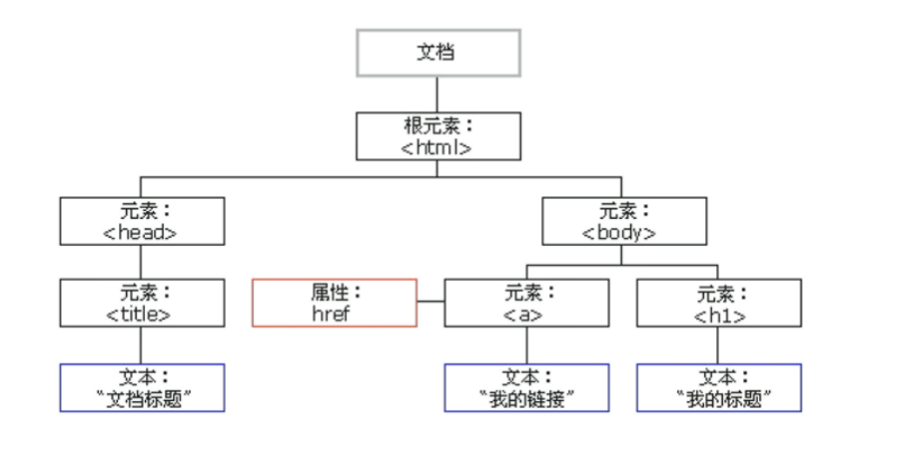

# Web编程语言
## 概述
JavaScript 是一种运行在浏览器客户端的脚本语言，最初用于网页表单验证，后来逐渐发展成 Web 前端开发的核心语言。完整的 JavaScript 体系通常包括三部分：

| 组成         | 含义                          |
| ---------- | --------------------------- |
| ECMAScript | JS 的语法标准                    |
| DOM        | 文档对象模型，用于操作 HTML 页面         |
| BOM        | 浏览器对象模型，用于操作浏览器窗口、地址栏、历史记录等 |

- 特点：  
    - 解释型语言：不需要编译，浏览器可以直接执行。  
    - 语法类似 C / Java：如 if、for、while 等。  
    - 动态语言：变量类型可以变化。  
    - 基于原型的面向对象语言：对象通过原型链共享属性和方法。

- 书写位置
    - 行内式js
    - 内嵌js`<script>alert("hello gis");</script>`
    - 外部js`<script src="index.js"></script>`  

- 输出方式
    - 控制台输出（`console.log()`函数）；
    - 浏览器提示框输出（`alert()`函数）；
    - 页面输出（`document.write()`函数）

## 变量与常量
早期用 `var` 声明变量，ES6 后推荐使用 `let`，常量用`const`  
用`=`给变量赋值  

```js
let age = 20;
const school = "ZJU";
```

- `var`是函数作用域，存在变量提升
- `let`、`const`是块级作用域

??? note
    var 是函数作用域：只被函数限制，不被 if、for 的 {} 限制。  
    ```js
    var i = -1;
    for (var i = 0; i < 10; i++) {}
    console.log(i);
    ```
    最终输出是10，因为这里两个`var i`其实是一个变量，for 循环里的 i 覆盖了外面的 i。  
    如果用let则输出-1  

## 数据类型  

| 类型        | 示例              |
| --------- | --------------- |
| String 字符串   | `"gis"`         |
| Number 数字   | `123`, `3.14`   |
| Boolean 布尔  | `true`, `false` |
| Null 空值     | `null`          |
| Undefined 未定义| `undefined`     |
| BigInt 任意精度的整数   | `123n`          |
| Symbol    | `Symbol()`      |

除此之外，其他基本都属于 Object ，Object是引用数据类型。   

使用`typeof`可以检查一个变量的数据类型  

typeof  null; 返回值为 ‘object‘。 

用`instanceof`操作符可以判断一个对象是否是某个特定类的实例。  

- 字符串（String）：
    - 字符串需要用引号包裹，单引号和双引号都可以；
    - 当字符串嵌套时，使用“外双内单，外单内双”的准则；
    - 字符串的“`.length`”属性可以获取字符串长度；
    - 使用String()方法可以将数字、布尔、null和undefined转为字符串，使用toString()方法可以将数字和布尔转为字符串型；
    - 字符串中有部分特殊字符，称为转义字符，以“\”开头。

??? note "String()\toString()"
    String() 是“强制转换函数”，可以把各种值都转成字符串  
    toString() 是“调用这个值自己的方法”  
    ```js
    let a = 123;
    a.toString(); // "123"
    let b = true;
    b.toString(); // "true"
    ```
    null和undefined没有`toString()`方法  
    toString可以传参数，表示进制转换
    ```js
    let num = 255;
    num.toString();    // "255"
    num.toString(2);   // "11111111"，二进制
    num.toString(16);  // "ff"，十六进制
    String(255); // "255"，只转普通字符串
    ```
    一般优先用`String()`

- 数字Number
    - 整数和浮点数，整数超出范围返回`± Infinity`
    - `NaN`是数字型的一个特殊值，代表一个非数值（not a number），当数值计算没有结果返回时会返回`NaN`（如除数为0的情况）。使用typeof操作符检验NaN会返回‘number’；
    - isNaN()函数可以判断一个变量是否为非数字型，若是数字，则返回false，反之则返回true。
    - 对字符串，`parseInt()`转成整数，`parseFloat()`转为浮点数
- 布尔型Boolean
    - 使用`Boolean()`函数可以将其他值转为布尔值。
- Null
    - 从语义上看null表示的是一个空对象。所以使用typeof检查null会返回一个Object。


类型转换： 

| 方法             | 作用      |
| -------------- | ------- |
| `String()`     | 转字符串    |
| `Number()`     | 转数字     |
| `Boolean()`    | 转布尔值    |
| `parseInt()`   | 字符串转整数  |
| `parseFloat()` | 字符串转浮点数 |

## 运算符
| 类型    | 示例                                |   |        |
| ----- | --------------------------------- | - | ------ |
| 算术运算符 | `+`, `-`, `*`, `/`, `%`           |   |        |
| 逻辑运算符 | `&&`, `                           |   | `, `!` |
| 赋值运算符 | `=`, `+=`, `-=`, `*=`, `/=`       |   |        |
| 关系运算符 | `>`, `<`, `>=`, `<=`, `==`, `===` |   |        |
| 条件运算符 | `condition ? a : b`               |   |        |
| 逗号运算符 | `var a = 1, b = 2`                |   |        |

`+`的双重作用：只要有字符串参与，+ 很可能变成字符串拼接。  
```js
1 + 2       // 3
"1" + 2     // "12"
```

??? note "=== 和 == 的区别"

    | 写法    | 名称        | 是否会自动转换类型 |
    | ----- | --------- | --------- |
    | `==`  | 相等        | 会         |
    | `===` | 全等 / 严格相等 | 不会        |

    example:
    ```js
    "123" == 123//结果是true
    "123" === 123//结果是false
    ```

    | 表达式                  |      结果 | 原因              |
    | -------------------- | ------: | --------------- |
    | `"123" == 123`       |  `true` | 字符串被转成数字        |
    | `"123" === 123`      | `false` | 类型不同，不转换        |
    | `false == 0`         |  `true` | `false` 被转成 `0` |
    | `false === 0`        | `false` | 类型不同            |
    | `"" == 0`            |  `true` | 空字符串被转成 `0`     |
    | `"" === 0`           | `false` | 类型不同            |
    | `null == undefined`  |  `true` | `==` 的特殊规则      |
    | `null === undefined` | `false` | 类型不同            |

## 流程控制句
| 类型   | 语句                           |
| ---- | ---------------------------- |
| 条件语句 | `if...else`, `switch...case` |
| 循环语句 | `while`, `do...while`, `for` |
| 跳转控制 | `break`, `continue`          |

其中 switch...case 要特别注意 break，否则程序会一直运行完所有的case  
```js
switch (value) {
  case 1:
    console.log("one");
    break;
  case 2:
    console.log("two");
    break;
}
```

如果不写break会输出 
``` 
one 
two  
```

## 对象Object
对象是一种复合数据类型，对象中可以保存多个不同数据类型的属性。例如一辆汽车可以有价格、颜色、排量等个属性。  

- JavaScript对象可分为内建对象、宿主对象和自定义对象
    - 内建对象是ES标准定义的对象，例如Math、Date、Function等、
    - 宿主对象是由JS的运行环境提供的对象，例如DOM和BOM
    - 自定义对象是由开发人员自己创建的对象

### 创建对象
使用new关键字调用Object()构造函数创建对象  
```js
let student = new Object();
student.name = "张三";
student.age = 20;
```
使用对象字面量创建对象
```js
let student = {
    name:"张三",
    age:20
}
```
- 添加对象属性：`对象.属性名 = 属性值`
- 修改对象属性：`对象.属性名 = 新属性值`
- 删除对象属性：`delete 对象.属性名`


数据存储：  

- 栈内存用来保存变量和基本类型
- 堆内存用来保存对象
    - 引用类型会在堆内存中保存，变量中保存的实际上是对象在堆内存中的地址

所以对象赋值时，复制的是地址，不是完整对象：

```js
let obj1 = { name: "GIS" };
let obj2 = obj1;
obj2.name = "WebGIS";

console.log(obj1.name); // "WebGIS"
```

### 函数
- 函数声明后不会立即执行，调用时才执行。
- 参数多了，多余参数会被忽略。
- 参数少了，缺少的形参是 undefined。
- 没有 return 时，函数默认返回 undefined。
- JavaScript 中函数本身也是对象。

### 类
ES6 引入了 class 语法，用来更方便地创建对象模板  

```js
class Person{
    constructor(name,age){
        this.name = name;//this 指向 通过这个类创建出来的具体实例对象
        this.age = age;
    }
    greet(){
        console.log(
            "Hello,my name is" + this.name + "." + "I'm" + this.age + "years old."
        );
    }
}
```

`new`创建类的实例（对象）：  

```js
const roger = new Person("roger",24);//创建Person类的实例对象roger
console.log(roger);//输出对象
roger.greet();//调用Person类上定义的方法
```

`extend`创建子类：
```js
class Student extends Person {
  constructor(name, age, grade) {
    super(name, age);//constructor 在 class 里是一个特殊方法，它负责创建和初始化对象，不是像普通方法一样调用的，不能写成super.constructor(name, age);
    //在子类的 constructor 里，必须先调用 super(...)，然后才能使用 this，否则会报错，因为子类对象还没有被父类对象初始化
    this.grade = grade;
  }

  studentGreet() {
    super.greet();//调用父类普通当打
    console.log("I'm studying in grade " + this.grade);
  }
}
```

??? note
    | 写法                       | 含义               | 用在哪里                |
    | ------------------------ | ---------------- | ------------------- |
    | `super(...)`             | 调用父类构造函数         | 子类的 `constructor` 里 |
    | `super.greet()`          | 调用父类普通方法 `greet` | 子类普通方法里             |
    | `super.xxx()`            | 调用父类普通方法 `xxx`   | 子类方法里               |
    | `super.constructor(...)` | 不这样写             | 容易误解，实际不用于调用父类构造函数  |

`instanceof`：判断一个对象是否是某个特定类的实例。  
`student instanceof Student;`  
### 数组
- 使用关键词new和构造函数Array()构造数组对象  
    - 构造函数Array()在创建数组时可以接受多个数组元素，
    - 若Array()只有一个数字类型的参数，则表示创建长度为该数值的数组

```js
let a = new Array(2,3,4);//[2,3,4]
let b = new Array(2);//创建长度为2的数组
```

- 使用数组字面量创建数组  
```js
let arr = [2, 3, 4];
console.log(arr[0]); // 2
```

- 遍历数组：  
    - for循环
    - `forEach()`:数组的forEach方法接受一个函数作为参数，数组有几个元素，该函数就会执行几次 语法：`arr.forEach(function(value, index, array){函数体})`

??? note "forEach()"
    forEach() 可以理解成一句话：让数组里的每一个元素，都执行一次同一个函数。  
    `const arr = ["苹果", "香蕉", "橘子"];`  
    普通for循环：  
    ```js
    for(let i = 0; i < arr.length; i++){
        console.log(arr[i]);
    }
    ```
    输出:  
    ```
    苹果  
    香蕉  
    橘子  
    ```
    用forEach：
    ```js
    arr.forEach(function(value,index,arrat){
        console.log(value);
    });

    | 参数      | 含义        | 例子                   |
    | ------- | --------- | -------------------- |
    | `value` | 当前元素      | `"苹果"`、`"香蕉"`、`"橘子"` |
    | `index` | 当前元素的下标   | `0`、`1`、`2`          |
    | `array` | 正在遍历的整个数组 | `["苹果", "香蕉", "橘子"]` |

数组常用方法  

| 方法           | 作用       |
| ------------ | -------- |
| `push()`     | 末尾添加     |
| `pop()`      | 删除末尾元素   |
| `unshift()`  | 开头添加     |
| `shift()`    | 删除开头元素   |
| `forEach()`  | 遍历数组     |
| `indexOf()`  | 查找元素位置   |
| `includes()` | 判断是否包含元素 |
| `slice()`    | 截取数组     |
| `concat()`   | 合并数组     |

### 常用类
| 类        | 作用               |
| -------- | ---------------- |
| `Math`   | 数学计算，如随机数、取整、最大值 |
| `Date`   | 时间日期处理           |
| `String` | 字符串处理            |

- Math：
    - Math.E：自然对数的底数e
    - Math.PI：$\pi$
    - Math.ceil(x)：向上取整
    - Math.floor(x)：向下取整
    - Math.round(x)：四舍五入取整
    - Math.random()：随机生成[0,1)内的数
    - Math.max(x,y [,...])：求多个值中的最大值
    - Math.min(x,y [,...])：求多个值中的最小值
    - Math. abs(x)：返回x的绝对值
- Date:
    - Date()：Date类的构造函数，接受一个表示时间的字符串来创建一个指定的时间对象
    - getDate()：从 Date 对象返回一个月中的某一天 (1 ~ 31)
    - getDay()：从 Date 对象返回一周中的某一天 (0 ~ 6)
    - getMonth()：从 Date 对象返回月份 (0 ~ 11)
    - getFullYear()：从 Date 对象以四位数字返回年份
    - getTime()：返回 1970 年 1 月 1 日至今的毫秒数
- String:
    - length：返回字符串长度
    - concat()：连接两个或更多字符串，并返回新的字符串
    - charAt()：返回在指定位置的字符
    - indexOf()：返回某个指定的字符串值在字符串中首次出现的位置
    - slice()：提取字符串的片断，并在新的字符串中返回被提取的部分
    - substring()：提取字符串中两个指定的索引号之间的字符
    - toLowerCase()：把字符串转换为小写
    - toUpperCase()：把字符串转换为大写

## 文档对象模型DOM与事件
### DOM
DOM，即 Document Object Model，文档对象模型。浏览器会把 HTML 页面转换成一棵对象树，JavaScript 可以通过 DOM 操作页面元素。  

常见节点包括：  

| 节点类型     | 含义         |
| -------- | ---------- |
| document文档节点 | 整个 HTML 文档 |
| Element元素节点  | HTML 标签元素  |
| Text文本节点     | 文本内容       |
| Attr属性节点     | 标签属性       |



### DOM获取元素节点
DOM获取元素节点（通过document对象调用）：  
>比如页面里有一个按钮`<input type="button" value="确定" id="ok-btn">`，这个按钮在 HTML 里是一个标签。浏览器会把它变成 DOM 里的一个 元素节点。  
如果你想用 JavaScript 操作它，比如修改文字、绑定点击事件、改样式，就要先“获取”它：`let btn = document.getElementById("ok-btn");`，这里的 btn 就代表页面中的这个按钮元素。

- `getElementById()`：通过id获取一个元素节点对象
- `getElementsByTagName()`：通过标签名获取一组元素节点对象，返回类数组对象
!!! note "example"
    `document.getElementsByTagName("p");`对应：
    ```
    <p>第一段</p>
    <p>第二段</p>
    <p>第三段</p>
    ```
    它获取到的是一组 p 标签，不是单个。  
    访问第一个：
    ```js
    let ps = document.getElementsByTagName("p");
    onsole.log(ps[0]);
    ```
- `getElementsByName()`：通过name属性获取一组元素节点对象

**获取元素节点的子节点**：

- `getElementsByTagName()`：返回当前节点的指定标签名后代节点
    - 例如，先`let box = document.getElementById("box");`获取外层元素，再`let ps = box.getElementsByTagName("p");`找到box里面所有的p标签。注意，它找的是**后代节点**，不一定只是直接子节点。
- `childNodes`、`children`：当前节点的所有子节点
    - eg： `box.childNodes;`获取box的所有子节点
    - `childNodes` 不只包括标签，还包括空格、换行形成的文本节点。
    - 实际开发中，如果只想要元素标签，常用`box.children;`
- `firstChild`：当前节点的第一个子节点
- `lastChild`：当前节点的最后一个子节点

**DOM获取父节点和兄弟节点：**

- `parentNode`：当前节点的父节点
- `previousSibling`：当前节点的前一个兄弟节点
    - 但它可能拿到换行空格。
    - 如果想拿前一个兄弟元素，常用 `p1.previousElementSibling;`
- `nextSibling`：当前节点的后一个兄弟节点
    - 可能拿到换行空格
    - `p1.nextElementSibling;`

### DOM与元素属性：
??? note "example"
    `<input id="username" name="user" value="张三">`  
    获取元素：
    ```js
    let input = document.getElementById("username");
    ```
    获取属性：
    ```js
    input.id;      // "username"
    input.name;    // "user"
    input.value;   // "张三"
    ```
    设置属性：
    ```js
    input.id = "newUsername";
    input.value = "李四";
    ```
    执行后变成：`<input id="newUsername" name="user" value="李四">`
    获取和设置html代码：
    ```html
    <div id="box">
        <p>原来的内容</p>
    </div>
    ```
    获取：  
    ```js
    let box = document.getElementById("box");
    ```
    修改：
    ```js
    box.innerHTML(<h2>新的标题</h2><p>新的内容</p>);
    ```


- 获取元素属性
    - 语法：`元素.属性名`，例如`元素.id，元素.name`等  
- 设置元素属性：
    - 语法：`元素.属性名 = 新属性值`，例如`元素.id = “btn1”`
- innerHTML属性：
    - 元素节点可通过该属性获取和设置标签内部html代码
### 节点：
??? note "example"
    原本有
    ```html
    <ul id="list">
        <li>苹果</li>
        <li>香蕉</li>
    </ul>
    ```
    先获取列表：`let list = document.getElementById("list");`  
    创建节点，此时创建了`<li>橘子</li>`但还没有把他放到页面上:
    ```js
    let newLi = document.createElement('li');
    newLi,innerHTML="橘子";
    ```  
    插入到末尾：`list.appendChild(newLi);`  
    页面变成：
    ```html
    <ul id="list">
        <li>苹果</li>
        <li>香蕉</li>
        <li>橘子</li>
    </ul>

- 创建节点
    - `document.createElement(标签名)`：创建元素节点并返回，参数为字符串形式的标签名
- 删除节点：
    - `父节点.removeChild(子节点)`
    - 常用：子节点.`parentNode.removeChild(子节点)`
- 替换节点：
    - `父节点.replaceChild(新节点 , 旧节点)`
- DOM插入节点：
    - `父节点.appendChild(子节点)`
    - `父节点.insertBefore(新节点 , 旧节点)`
- 修改元素内联样式：
    - 语法：`元素.style.样式名 = 样式值`
    - eg:`box1.style.backgroundColor = "red"`
- 读取元素内联样式：
    - `元素.style.样式名`
    -eg:`box1.style.backgroundColor`
- 读取元素当前显示的样式：
    - 通过style属性设置和读取的都是内联样式
    - 通过`getComputedStyle()`方法可以获取元素当前正在显示的样式（如css中显示的样式），该方法需要两个参数，第一个为要获取样式的元素，第二个一般为null，返回值为封装了当前元素样式的对象
- 其他样式相关属性：
    - clientWidth：元素可见宽度数值
    - clientHeight：元素可见高度数值
    - offsetWidth：元素宽度，包括内容区、padding和border
    - offsetHeight：元素高度，包括内容区、padding和border
    - offsetParent：获取当前元素最近的开启定位的祖先元素
    - offsetLeft：相对于定位父元素的水平偏移
    - offsetTop：相对于定位父元素的垂直偏移
    - scrollHeight、scrollWidth：元素滚动区高度/宽度
    - scrollLeft、scrollTop：水平/垂直滚动条滚动的距离 

??? note "example"
    ```html
    <div id="box">
        <p>第一段</p>
        <p>第二段</p>
    </div>
    <script>
        let box = document.getElementById("box");
        // 找子元素
        let ps = box.getElementsByTagName("p");
        // 改内容
        ps[0].innerHTML = "修改后的第一段";
        // 改属性
        box.id = "newBox";
        // 创建新节点
        let newP = document.createElement("p");
        newP.innerHTML = "第三段";
        // 插入新节点
        box.appendChild(newP);
        // 改样式
        box.style.backgroundColor = "red";
        // 读取当前显示样式
        let style = getComputedStyle(box, null);
        console.log(style.backgroundColor);
        // 读取尺寸
        console.log(box.clientWidth);
        console.log(box.offsetWidth);
    </script>
    ```

### 事件
事件指用户与浏览器发生的一些特定的交互瞬间，例如鼠标点击按钮、鼠标移动、键盘按下某个按键等  

三种绑定事件的方式：  

- 写在 HTML 标签中，不推荐大量使用：
    - `<button onclick="console.log('点击确定')">确定</button>`
- 通过DOM对象属性绑定
    - 
    ```js
    btn.onclick = function () {
    console.log("点击确定");
    };
    ```
- 使用事件监听器（最推荐）
    - 
    ```js
    btn.addEventListener("click", function () {
        console.log("点击按钮");
    });
    ```

常用鼠标事件，如果用 addEventListener()，要去掉前面的 on：  

| 事件属性写法         | addEventListener 写法 | 含义       |
| -------------- | ------------------- | -------- |
| `onclick`      | `"click"`           | 用户单击对象   |
| `ondblclick`   | `"dblclick"`        | 用户双击对象   |
| `onmousedown`  | `"mousedown"`       | 鼠标按钮被按下  |
| `onmouseup`    | `"mouseup"`         | 鼠标按钮被松开  |
| `onmousemove`  | `"mousemove"`       | 鼠标移动     |
| `onmouseenter` | `"mouseenter"`      | 鼠标指针移到元素上 |


常用键盘事件： 

| 事件          | addEventListener 写法  |含义        |
| ----------- | --------- | --------- |
| `onkeydown` | `"keydown"` | 某个键盘按键被按下 |
| `onkeyup`   | `"keyup"` | 某个键盘按键被松开 |


- 事件对象：
    - 当某个事件被触发时，会产生一个事件对象Event，这个对象中包含着所有事件有关的信息。包括导致事件的元素、事件的类型以及其他与特定事件相关的信息。例如鼠标事件中，该对象会包含事件类型、鼠标的位置等信息
    - event对象会被传入到事件的处理程序中，可在处理程序中获取与对象相关的信息
    - `event.type`：事件类型
    - `event.clientX`、`event.clientY`：表示鼠标相对于浏览器可视区域的位置。
    - `event.target`：表示真正触发事件的那个元素

```js
btn1.onclick = function (event) {
  console.log(event.type);    // 事件类型，此处为 click
  console.log(event.clientX); // 鼠标指针的水平坐标
};

//也可以写成
btn1.onclick = function (event) {
  console.log(event.type);    // 事件类型，此处为 click
  console.log(event.clientX); // 鼠标指针的水平坐标
};
```

## 浏览器对象模型BOM
JavaScript浏览器对象模型（Browser Object Model, BOM）是一套操作浏览器的API（接口/方法/属性），BOM提供了很多用于访问浏览器功能的对象，使我们通过 JS 来操作浏览器  

BOM 用来操作浏览器本身，而不是页面文档。  

常见的BOM对象

| 对象          | 作用         |
| ----------- | ---------- |
| `window`    | 浏览器窗口，全局对象 |
| `navigator` | 浏览器信息      |
| `location`  | 地址栏信息      |
| `history`   | 浏览器历史记录    |
| `screen`    | 屏幕信息       |

- window对象
    - window 是 BOM 的核心，也是 JavaScript 的全局对象。
    - eg:
    ```js
    alert("hello");
    confirm("Are you sure?");
    prompt("请输入姓名", "张三");
    window.open("https://example.com");
    ```
    - `window.open() `：可以导航到一个特定的URL，也可以打开一个新的浏览器窗口
    - `alert()` `confirm()` `prompt()`可以调用系统对话框
        - `alert()`：接受一个字符串消息作为参数，展示一个包含该消息与确定按钮的对话框
        - `confirm()`：类似alert()，但多了一个取消按钮，该函数会返回用户选择结果的布尔值，即点击【确定】返回true，点击【取消】返回false
        - `prompt()`：弹出带有提示信息和输入框的对话框，并返回用户输入的内容，可以接受提示文字字符串和文本框默认值两个参数`var userInput=prompt("请输入文本","张三");`

- 延时调用`setTimeout()`
    - 
    ```js
    setTimeout(function () {
        alert("hello gis");
    }, 2000);
    ```
    - 第一个参数（必选）为要延时执行的代码，可以是代码串或者函数
    - 第二个参数为延时时间，单位为毫秒，默认为0
    - 后续参数为传给执行函数的其他参数
    - 该方法会返回一个延时器的ID（数字），将该ID传递给`clearTimeout()`方法可以取消执行
- 定时调用`setInterval()`
    - 
    ```js
    //开启定时器
    let token = setInterval(function () {
        lert("hello gis");
    }, 2000);
    //关闭定时器
    clearInterval(token);
    ```
    - 第一个参数（必选）为要定时执行的代码
    - 第二个参数（必选）为间隔时间，单位为毫秒，默认为0
    - 后续参数为传给执行函数的其他参数

- Navigator 对象：浏览器信息
    - `navigator.userAgent`：它会返回一串字符串，里面包含浏览器、系统、内核等信息
- History对象：
    - `history.length`：获取历史记录列表中的网址数
    - `history.back()`：回退到上一个页面
    - `history.forward()`：跳转到下一个页面
    - `history.go()`：前后跳转指定次数
        - `history.go(-1)`：后退 1 页，相当于 `history.back()`
        - `history.go(1)` ：前进 1 页，相当于 `history.forward()`
        - `history.go(-2)`;：后退 2 页
        - `history.go(0)`; ： 刷新当前页面

## 异步编程基础
JavaScript 是单线程语言，一次只能执行一个任务。  
如果某个任务耗时很长，会阻塞页面，导致用户无法操作。  

因此，耗时任务通常要异步执行，例如延时调用，事件监听，浏览器请求服务器资源等  

### 回调函数
回调函数是一种常见的异步解决方案，它是一种将函数作为参数传递给其他函数的方式。  

- 回调函数包含同步的回调函数和异步的回调函数。
    - 同步的回调函数会立即在主线程上执行，不会放入回调队列中。例如数组的forEach等遍历相关的回调函数，Promise 的 executor 函数等。
    - 异步的回调函数不会立即执行，会放入回调队列以后执行。例如定时器回调 ， Ajax 回调 ， Promise 的成功、失败的回调。

同步回调；  
```js
const arr = [1, 2, 3, 4];

arr.forEach(function (item) {
  console.log(item);
});
```
这里的函数`function(item){console.log(item);`是回调函数，它是 同步回调，因为会马上执行，不会等以后。  

异步回调：  
```js
console.log("A");

setTimeout(function () {
  console.log("B");
}, 1000);

console.log("C");
```
这个回调函数不会马上执行，而是等 1 秒后再执行，所以叫 异步回调。  

回调函数的优点和缺点  

- 优点：简单，容易理解
- 缺点：嵌套太多时，可读性差，容易形成回调地狱

### Promise
Promise是ES6中新增的异步编程解决方案，是一个内置的构造函数，Promise 的实例对象用来封装一个异步操作，并可以通过为实例对象指定回调函数来获取其异步操作成功或失败的结果值。  

??? note "补充"
    - promise的三种状态
        - pending 进行中
        - fulfilled 成功
        - rejected 失败
    - Promise基本写法
        - 用`.then()`处理成果
        - 用`.catch`处理失败
    ```js
    const p = new Promise(function (resolve, reject) {
    // 异步任务
        let success = true;
        if (success) {
            resolve("成功结果");//表示异步任务成功。
        } else {
            reject("失败原因");//表示异步任务失败。
        }
    });
    p.then(function(result){
        console.log("成功",result);
    }).catch(function(error){
        console.log("失败",error);
    });
    ```

    例子：
    ```js
    const p = new Promise(function(resolve,reject){
        setTimeout(function(){
            resolve("数据加载完成");
        },1000);
    });
    p.then(function(result){
        console.log(result);
    });
    ```
    输出：数据加载完成  
    执行过程：  
    ```
    创建 Promise
    setTimeout 开始计时
    1 秒后调用 resolve
    then 里的函数执行
    ```

- 优点：
    - 代码清晰，可读性高；
    - 支持对多个异步操作链式调用；
    - 方便进行异常捕获和错误处理。
- 缺点：
    - Promise对象一旦创建就会立即执行，不能中途取消。如果没有设置回调函数，Promise 会在内部抛出错误，不会向外流。

### async/await
async/await 是基于 Promise 的异步编程解决方案， ES2017标准引入了async函数，使得异步操作更加方便。它是 Promise 的进一步简化写法。  
async是异步的意思，await是async wait的简写，即异步等待。  

Promise：  
```js
getData()
  .then(function (result) {
    console.log(result);
  })
  .catch(function (error) {
    console.log(error);
  });
```

async/await：
```js
async function demo(){
    try{
        const result = await getData();
        console.log(result);
    }catch(error){
        console.log(error);
    }
}
```

**async** 表示这个函数是异步函数，异步函数一定会返回 Promise。
```js
async function demo() {
  return "hello";
}

console.log(demo());
```
它不是直接返回 "hello"，而是返回一个 Promise，成功结果是 "hello"。  

**await**的意思是等这个 Promise 完成，然后拿到它的结果。`await`只能在`async`函数里面使用  

**try...catch**处理错误  

- 优点：
    - 代码优雅简洁，使异步代码更加可读和易于维护；消除了回调地狱，使错误处理更加容易。
- 缺点：
    - 需要ES2017支持，不兼容旧版浏览器；await语句等待Promise对象完成时，JavaScript引擎会暂停执行，可能会导致性能问题

### Ajax
Ajax = Asynchronous JavaScript And XML.并非编程语言  

Ajax 的核心作用是网页不用整体刷新，也能向服务器请求数据，然后**局部更新**页面。  

Ajax用 XML，纯文本或JSON文本传输。  

- 网页中发生一个事件（页面加载、按钮点击）
- 由 JavaScript 创建 XMLHttpRequest 对象
- XMLHttpRequest 对象向 web 服务器发送请求
- 服务器处理该请求
- 服务器将响应发送回网页
- 由 JavaScript 读取响应
- 由 JavaScript 执行正确的动作（比如更新页面）

??? note "xml"
    XML 全称是 Extensible Markup Language，中文常译为可扩展标记语言。  
    XML 形式文件就是一种用 XML 语言写成的文本文件，是一种结构化文本，常用来表达数据、配置、服务说明等内容。
    ```xml
    <student>
        <name>张三</name>
        <age>20</age>
        <major>GIS</major>
    </student>  
    ``` 


### Axios
Axios是一个基于Promise的网络请求库，作用于node.js和浏览器中。  

原生 Ajax 写起来比较麻烦，而 Axios 写法更简洁。  

Axios基本用法：`axios(config)`  

- config是请求的配置信息对象
- method：请求方法
- url：请求的服务器地址
- params：请求的参数
- data：请求体数据

在请求后使用.then(function)处理请求成功的结果，.catch(function)处理请求错误的结果  
为了方便起见，Axios为所有支持的请求方法提供了别名，例如`axios.get(url[, config])`，`axios.post(url[, data[, config]])`等。  
```js
axios({
  method: "get",
  url: "/user",
  baseURL: "https://some-domain.com/api/",
  params: { ID: 12345 }
});

//更常见的简写
axios
  .get("/user", {
    params: { ID: 12345 }
  })
  .then(function (response) {
    console.log(response);
  })
  .catch(function (error) {
    console.log(error);
  });

//post
axios({
  method: "post",
  url: "/user/12345",
  data: {
    firstName: "Fred",
    lastName: "Flintstone"
  }
});
```

Axios 和 async/await 搭配  
```js
async function getUser() {
  try {
    const response = await axios.get("/user", {
      params: { ID: 12345 }
    });

    console.log(response);
  } catch (error) {
    console.log(error);
  }
}
```

??? note
    Axios一般写在要向服务器请求数据的地方，如  
    1.页面一加载就请求数据  
    2.用户点击按钮后请求数据  
    3.用户输入、选择、切换图层等操作后请求数据  

    ```js
    //eg:
    const btn = document.getElementById("btn");

    function getData() {
    axios.get("接口地址").then(function (response) {
        console.log(response.data);
    });
    }

    btn.addEventListener("click", function () {
    getData();
    });
    ```
    可以吧js文件理解成三部分：    
    获取 DOM 元素  
    定义功能函数  
    绑定事件 / 执行初始化  