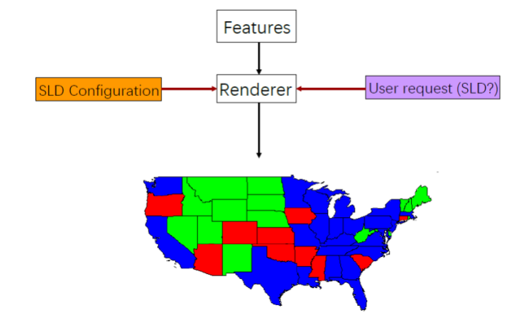
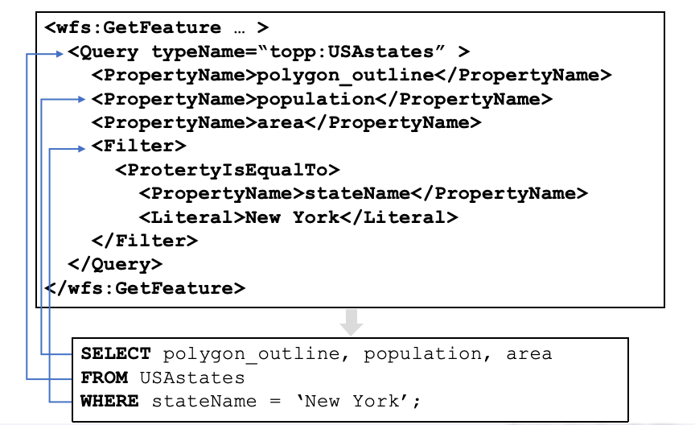
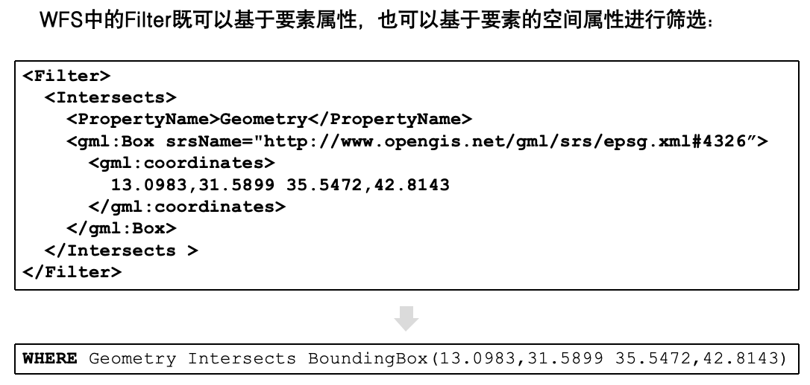
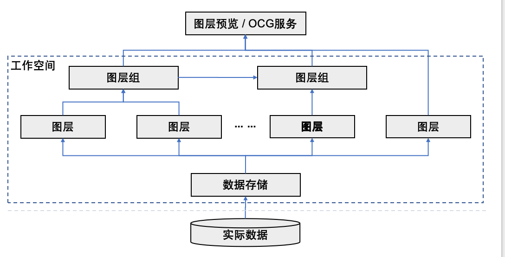

# 空间数据发布与服务
## OGC 地图服务标准
- 从C/S 到 B/S
    - C/S 结构：Client / Server，客户端 / 服务器  
    - **B/S 结构**：Browser / Server，浏览器 / 服务器。
- http会话的基本过程
    - 客户端和服务器建立连接，通常是 TCP 连接。
    - 客户端发送 HTTP 请求，并等待服务器响应。
    - 服务器处理请求，并返回 HTTP 响应。

### OGC
**OGC（Open Geospatial Consortium，开放地理空间信息联盟）**成立于1994年，是一个国际工业标准组织，其任务是将地理空间信息融入的到世界信息服务的框架之中。

OGC提出的一系列开放性标准被称为**OGC标准**，这些标准对接口定义、编码方式、功能描述、应用类型和实现方式进行了规范化的定义，并给出了相应的技术文档。

- **WMS (Web Map Service)**：主要用于获取地图渲染  
- **WFS (Web Feature Service)**：后者用于访问和更新基础地理数据集。

| 服务         | 中文     | 返回内容   | 主要用途             |
| ---------- | ------ | ------ | ---------------- |
| WMS        | 网络地图服务 | 地图图片   | 显示、浏览、简单查询       |
| WFS        | 网络要素服务 | 矢量要素数据 | 查询、编辑、获取属性和几何    |
| TMS / WMTS | 瓦片地图服务 | 预切片图片  | 快速加载大规模地图        |
| WCS        | 网络覆盖服务 | 栅格覆盖数据 | 获取遥感影像、DEM 等栅格数据 |

### WMS网络地图服务
WMS可用于对存储在服务器上的地理要素进行统一的访问和渲染，适合制作地图以及对数据进行简单查询  

- GetCapabilities
    - 返回服务级元数据
    - 元数据使用XML形式文件表示；

**GetMap**  
GetMap操作返回一幅地图（map），接收到GetMap请求后，WMS要么满足请求要么发送一个异常；

**SLD**  

- SLD (Styled Layer Descriptor) 是一段描述了地图渲染样式的XML格式文本，可以直接定义在渲染器中，也可以包含在GetMap操作的请求中。
- SLD由若干个`<Rule>元素组成`，每个`<Rule>`元素又包括：
    - 用于指定规则适用要素的`<Filter>`元素；（规定这个规则适用于哪些要素）
    - 实际渲染时使用的一系列符号化器 (Symbolizer)。（规定这些要素如何画出来。）

**查看地图渲染**  
使用WMS查看一个地图渲染的流程大致如下：



### WFS网络要素服务
WFS可用于对存储在服务器上的地理要素进行直接访问，特别适用于如下场景：  

- 查询一个数据集并检索要素
- 查找要素定义（要素的属性名称和类型）
- 向数据集中添加要素、删除或更新要素
- 锁定要素以防止修改

>WMS 返回的是“地图图片”。WFS 返回的是“数据本身”。  


**GetFeature**  
GetFeature操作可将存储中的数据集当作一个空间数据库，以数据库的形式来执行查询操作。  
比如在数据库中可以执行下面的一个查询操作:  
```SQL
SELECT polygon_outline,population, area
FROM USAstates
WHERE stateName = 'New York';
```
这个查询包括三部分：  

- 查询哪个数据集：`USAstates`
- 返回哪些字段：`polygon_outline`、`population`、`area`
- 筛选条件：`stateName = 'New York'`

在 WFS 中，这个 SQL 查询可以用 XML 请求表达  



WFS中的`Filter`既可以基于要素属性，也可以基于要素的空间属性进行筛选  



**Transaction**  
- Transaction操作可用于以数据库格式进行要素的更新、插入、删除。
- `Update`操作可用于更新要素属性  
- `Delete`可用于删除一个新要素

### TMS瓦片地图服务
TMS，Tile Map Service，瓦片地图服务。  
核心思想是提前在服务器端把地图按照不同缩放级别渲染好，并切成很多小图片。客户端只请求当前视野需要的那些小瓦片。  

TMS投影：Web-Mercator网络墨卡托  

- 避免将极点投影到无穷远处；
- 能将整个投影地图变成正方形

TMS切片方式：
`http://this_is_a_tmservice_host/{z}/{x}/{y}.png`  

- z ：缩放级别。
    - z = 0 时，整个世界地图只有 1 张瓦片。
    - z = 1 时，世界地图被切成 2×2，共 4 张瓦片。
    - z = 2 时，切成 4×4，共 16 张瓦片。
    - 一般瓦片大小是 256×256 像素 PNG 图片。
- x ：横向瓦片编号。
- y ：纵向瓦片编号

## GeoServer
GeoServer 是一个基于 Java 的开源地图服务器。  

它允许用户查看、发布和编辑地理空间数据。  

它最重要的特点是支持 OGC 标准服务。  

GeoServer的主要特性：

- 可以访问MySQL、PostGIS、Oracle等空间数据库并用其中的空间数据生成地图；
- 支持Shapefile、ArcSDE和MapInfo等格式的地图数据；
- 支持多达上百种投影；
- 能够将网络地图输出为多种格式(如jpeg、gif、SVG、KML等)，方便了不同浏览器用户对地图的查看。

数据逻辑：  


## 其他开源空间数据产品
- PostgreSQL + PostGIS 存储空间数据。
    - PostgreSQL 是开源对象关系型数据库。
    - PostGIS 是 PostgreSQL 的空间扩展，PostgreSQL 增加了存储和分析空间数据的能力。
- GeoServer 发布空间服务。
- OpenLayers 在浏览器端展示地图。
    - OpenLayers 是一个开源 JavaScript 地图库。
    - 它主要运行在浏览器端，用于 WebGIS 客户端开发