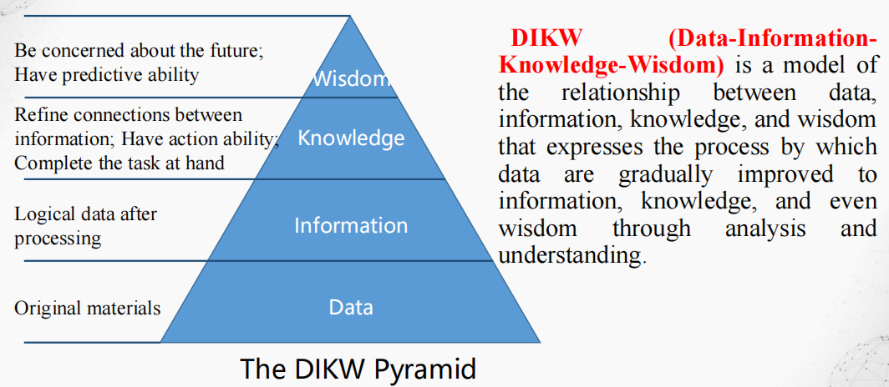
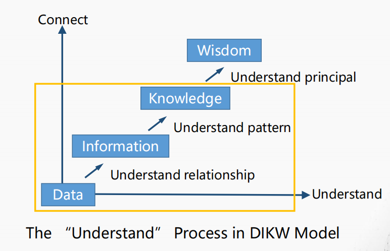

# GIS空间分析导论
## 空间分析概述
### 历史、案例
地理空间分析最早可以追溯到21,000年前，位于法国西南部的拉斯科洞穴。在这个洞穴里，旧石器时代的艺术家们绘制了经常被狩猎的动物，专家认为这些可能是用于宗教仪式或甚至可能是猎物迁徙模式的天文星图。尽管有些粗糙，但这些壁画展示了人类在古代创造周围世界的抽象模型，并关联时空特征以寻找相互关系的古老范例。  

围棋 (The game of go)，19*19，361个交叉点  

赤壁战场与华容道  

空间分析的著名案例：1854年，霍乱在伦敦爆发。超过3万人在自己的粪便排泄物中丧生。约翰·斯诺医生通过绘制地图发现霍乱通过水传播。  

《Design with Nature》1969出版   

* GIS工具：GIS的早期历史  
    * 地理信息系统 (GIS) 领域始于20世纪60年代，当时计算机以及定量和计算地理学的早期概念开始出现。
    * 早期的GIS工作包括学术界的重要研究。
    * 后来，由Michael Goodchild领导的国家地理信息与分析中心，将空间分析和可视化等关键地理信息科学主题的研究正规化。
    * 这些努力推动了地理科学领域的定量革命，并为GIS奠定了基础。
* 第一个GIS
    * 罗杰·汤姆林森 (Roger Tomlinson) 在发起、规划和开发加拿大地理信息系统方面的开创性工作，促成了1963年世界上第一个计算机化GIS的诞生。
    * 加拿大政府曾委托汤姆林森对其自然资源创建一个可管理的清单。
    * 他设想使用计算机来合并所有省份的自然资源数据。汤姆林森设计了自动化计算方法来存储和处理大量数据，这使得加拿大能够开始其国家土地利用管理计划。
    * 他还为GIS（地理信息系统）命名。
* Esri
    * 1969年，哈佛实验室成员杰克·丹杰蒙德 (Jack Dangermond) 和他的妻子劳拉创立了环境系统研究所公司 (Esri)。这家咨询公司应用计算机地图制图和空间分析，帮助土地利用规划者和土地资源管理者做出明智的决策。
    * 该公司早期的工作证明了GIS在解决问题方面的价值。
    * Esri随后开发了许多目前仍在使用的GIS制图和空间分析方法。
    * 这些成果引起了人们对该公司软件工具和工作流程的更广泛兴趣，而这些现在已成为GIS的标准。
* 今日的GIS
    * GIS的核心在于从数据中发现意义和见解。它正在快速发展，并为理解提供了一个全新的框架和过程。

### GIS与空间分析的应用案例
* 气候变化与环境监测
* 保护科学与行动
* 自然资源制图与管理
* 土地信息管理
* 城市与区域规划
* 公共安全、应急管理和安全保障
* 能源与电信公用事业
* 商业与经济发展
* 交通规划与管理
* 公共管理与AEC（行政与经济发展）
## ==空间分析的概念与方法==
!!! note
    简答题：空间分析的概念？例举3个空间分析方法。
### 概念
* 空间分析是对数据的空间信息、属性性息或者二者共同信息的统计描述或说明.Spatial analysis is a statistical description or explanation of spatial information, attribute information or common information of data（Goodchild 1987）
* 空间分析是对于地理空间现象的定量研究，其常规能力是操纵空间数据使之成为不同的形式，并提取其潜在的信息.Spatial analysis is a quantitative study of geospatial phenomena. Its conventional ability is to manipulate spatial data into different forms and extract its potential information. (Openshaw, 1997)
* 空间分析是基于地理对象的位置和形态特征的空间数据分析技术，其目的在于提取和传输信息 (郭仁忠院士，1997)。
* 空间分析是地理学的精髓，是为解答问题而进行的空间数据分析与挖掘（刘湘南，2017）
* **空间分析是研究空间现象分布规律、空间关系、空间模式和空间过程的理论与方法体系。**

### 空间分析方法

| Methods                                                            | Applications                   |
| ------------------------------------------------------------------ | ------------------------------ |
| Probability theory and model 概率论                                   | 用于地理现象、地理要素的随机分布研究。            |
| Hypothesis testing and sampling 假设检验与抽样                            | 用于地理数据的采样和整理。                  |
| Analysis of Correlation 相关分析                                       | 分析地理要素之间的相关关系。                 |
| Analysis of Variance 方差分析                                          | 研究地理数据分布的离散程度。                 |
| Analysis of Regression 回归分析                                        | 用于拟合地理要素之间具体的数量关系、预测发展趋势。      |
| Spatial Patterns 空间模式分析                                            | 用于分析地理分布模式。                    |
| Time Series analysis 时间序列分析                                        | 用于地理过程时间序列的预测与控制研究。            |
| Analysis of Principal Components 主成分分析                             | 用于地理数据降维处理及地理要素的因素分析与综合评价研究。   |
| Clustering Analysis 聚类分析                                           | 用于各种地理要素分类、各种地区区域划分。           |
| Covariance and Coefficient of Variation 方差与变异函数                    | 用于研究地理要素的空间相关性及空间分布的数量规律。      |
| Kriging Method 克里金法                                                | 用于地理要素分布的空间局部估计与局部插值。          |
| Markov Process 马尔可夫过程                                              | 用于研究随机地理过程、预测随机地理事件。           |
| Linear\Integer\Dynamic Programming 线性/整数/动态规划 Spatial Optimization | 用于研究有关规划与决策问题，用于有多阶段地理决策问题的求解。 |
| Analytic Hierarchy Process 层次分析法                                   | 用于有关多层次、多要素战略决策问题的分析。          |
| Network Analysis 网络分析                                 | 用于交通网络、通讯网络、河流水系等地理网络的研究。           |   |
| Input-output Analysis 投入产出分析                          | 用于产业部门联系分析、劳动地域构成分析、区域相互作用分析。       |   |
| Geostatistical Analysis 地统计分析                         | 用于空间分布上既有随机性又有结构性或空间相关和依赖性的地理现象的研究。 |   |
| Fuzzy Mathematics 模糊数学                                | 用于各种模糊地理现象、地理过程、地理决策和系统评价研究。        |   |
| Neural Networks and Artificial Intelligence 神经网络和人工智能 | 用于有关地理模式的识别、地理过程机制的自学习及预测等。         |   |
| Cellular Automaton 元胞自动机                              | 用于模拟城生态、环境、自然灾害等多种高度复杂的地理现象的时空动态。   |   |
| Grey System Theory 灰色系统方法                             | 用于灰色地理系统的分析、建模、控制与决策研究。             |   |
| Fractal Theory 分形理论                                   | 用于有关地理实体的形态及要素分布形态的相似机理研究。          |   |
| Wavelet Analysis 小波分析                                 | 用于多层次、多尺度、多分辨率的地理时空过程的频分布。          |   |
| Genetic Algorithm 遗传算法                                | 用于复杂的非线性地理问题的计算。                    |   |
| Big Data Analysis 大数据分析                               | 用于智能交通、孪生城市、智慧农业、社区….               |   |
| Super Resolution Reconstruction 超分辨率重建                | 遥感影像质量提升                            |   |
| …                                                     | …                                   |   |

### 空间分析的研究内容
* 空间分析理论 (第2讲)：主要指空间概念、空间描述方法、空间特征等基础理论问题，也包括基于空间思维解决问题的方法论。

* 空间分析方法 (第3-14讲)：主要指在空间分析理论的指导下，根据空间特征和问题建立分析与模拟模型，开发分析工具。

* 空间分析应用 (第3-14讲)：主要研究如何应用空间分析的理论和方法解决实际问题，侧重于如何将复杂具体的实际问题抽象为空间问题，在模型、方法和应用之间搭建桥梁。

### 空间分析的目标
空间分析的主要目的是揭示地理空间特征以解决空间问题  

* **认知** (Cognition)：有效获取空间数据并科学组织其描述，利用数据重现事物本身，如绘制风险图。
* **解释** (Explanation)：理解并揭示地理空间数据的背景过程，认识事件发生的本质规律，如房价中的地理邻居效应。
* **预报** (Forecast)：在理解和掌握事件发生现状与规律的前提下，利用相关的预测模型预测未来局势，如传染病的爆发。
* **调控与决策** (Regulation and Decision-making)：调控地理空间中发生的事件，如合理配置资源；根据空间分析的结果做出决策，如救援路线的确定。

### DIKW模型
!!! note
    名词解释：DIKW金字塔模型

==DIKW==（数据-信息-知识-智慧）是一个表达数据、信息、知识和智慧之间关系的模型，该模型表达了通过分析和理解，数据逐步提升为信息、知识甚至智慧的过程。  

* 关注未来；具有预测能力。 -> 智慧 (Wisdom)
* 提炼信息之间的联系；具有行动能力；完成手头的任务。 -> 知识 (Knowledge)
* 处理后的逻辑数据。 -> 信息 (Information)
* 原始材料。 -> 数据 (Data)

## 空间分析的PPDAC模型
!!! note
    简答题：用 PPDAC 介绍你的小组项目

PPDAC：问题 (Problem)、计划 (Plan)、数据 (Data)、分析 (Analysis) 和 结论 (Conclusions)。

### Problem
### Plan
### Data
### Analysis
### Conclusion
## 课程大纲
早说pre不算分啊

## 评分标准

## 参考资料及相关网站