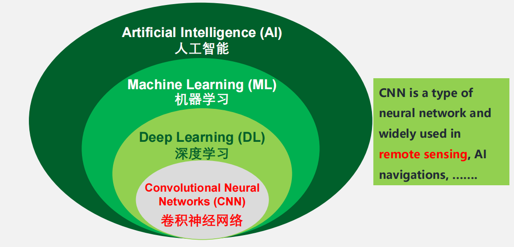
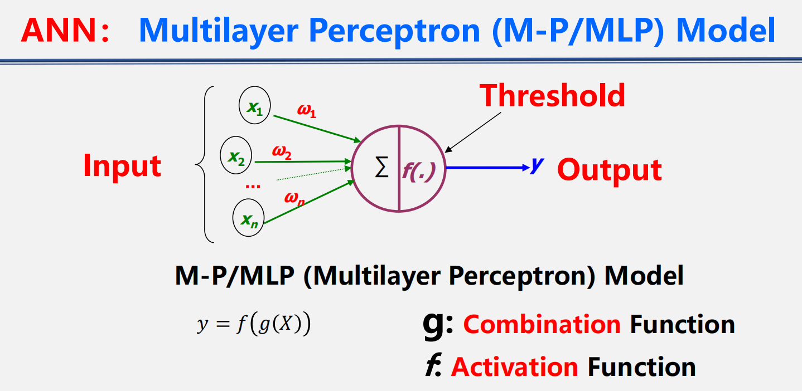
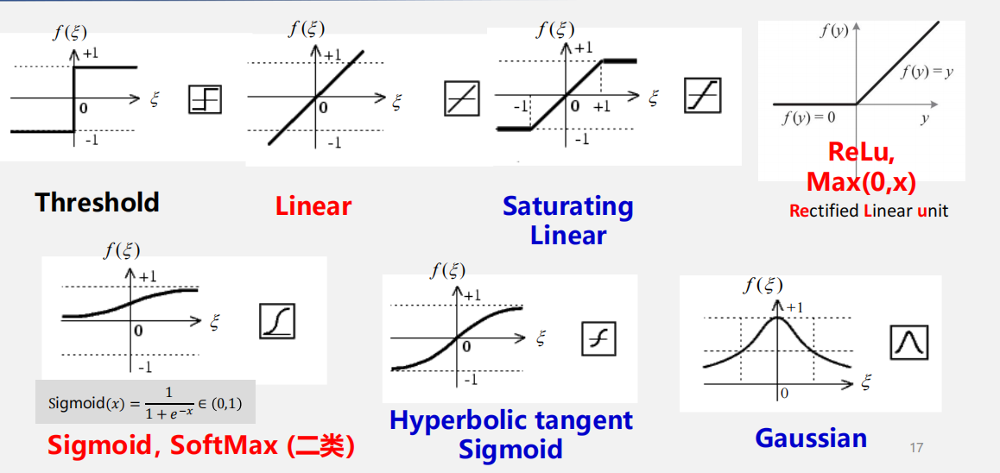
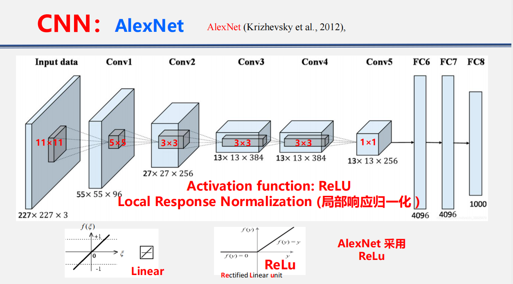
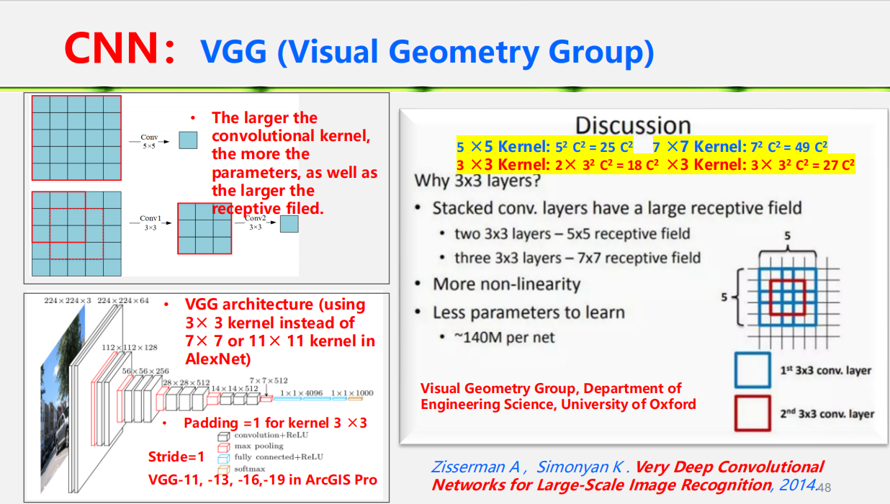
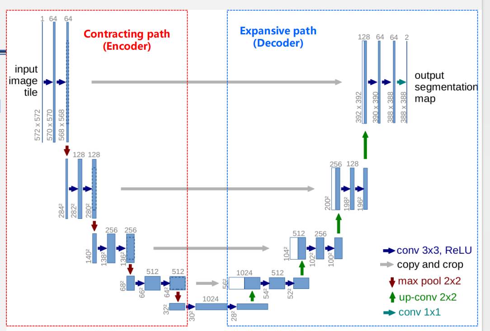
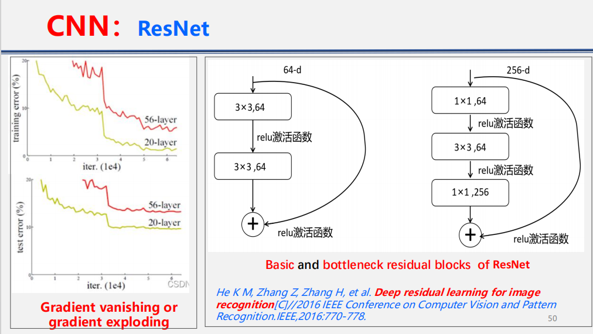
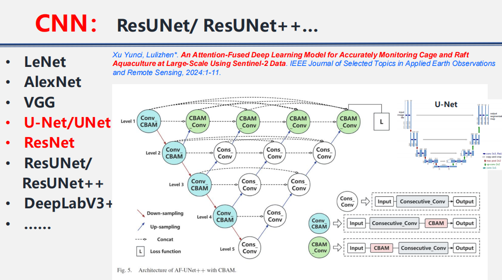

# 遥感深度学习中的目标检测与像素级分类
## 深度学习（DL）概述
### DL的应用

自动驾驶、AlphaGo、图像识别、人脸识别、AI 翻译、ChatGPT、DeepSeek、元宇宙、AI 创作等  

> 。。？世界上最尊重深度学习的学院来了

### 人工神经网络（ANN）
#### 多层感知机（M-P/MLP）模型
g：组合函数   f：激活函数  

**两种主流组合函数：** 

- 加权求和：
    - $g(X) = \sum_{i=1}^{n} \omega_i x_i - \theta$
    - $y = f\left(\sum_{i=1}^{n} \omega_i x_i - \theta\right)$
    - 用于普通感知机、BP神经网络、卷积网络、Transformer网络中
- 径向距离：
    - $||x - c|| = \sqrt{\sum_{i=1}^{n} (x_i - c_i)^2}$
    - $y = f\left(||x - c||\right)$
    - 主要用于径向基神经网络，用于判断样本离中心点有多远

**激活函数**  

- 为什么要引入激活函数
    - 没有激活函数，多层网络等价于单层线性模型，无法拟合复杂数据
    - 限制输出范围，防止数据爆炸
    - 提升模型表达能力，实现分类、拟合、特征区分等
    - 加快收敛、抑制梯度消失/爆炸

Threshold 阈值函数：超过阈值输出 1，否则输出 0，类似最早的感知机。  
Linear 线性函数：输出与输入成线性关系，但表达能力有限。  
Sigmoid 函数：$Sigmoid(x)=\frac{1}{1+e^{-x}}$ ,输出范围在 0 到 1 之间，常用于二分类概率表达。  
Tanh 双曲正切函数：输出范围一般在 -1 到 1，适合中心化数据。  
ReLU 函数：$ReLU(x)=max(0,x)$ ,小于 0 输出 0，大于 0 保留原值。ReLU 是 CNN 中非常常见的激活函数，因为计算简单、收敛较快，并能缓解梯度消失。  

人工神经网络的两个核心问题：

- Architecture 网络结构：神经元如何连接？是前馈结构、循环结构，还是更复杂的结构？
    - 前馈网络 Feedforward Architecture：信息从输入层向输出层单向流动，没有回路，
        - eg：CNN 
        - 适合静态输入，如单幅遥感影像分类。
    - 反馈/循环网络Feedback or Recurrent Architecture：网络中存在循环连接，适合处理动态序列，
        - 例如 LSTM 可以用于时间序列遥感数据，如植被指数序列、作物物候序列
- Learning Approach 学习方法：网络中的权重、偏置，甚至结构本身如何自动确定？

**学习途径是让网络学会正确的权重和结构的一整套方法，包括：**

- **损失函数**：是模型学习途径中的目标函数，告诉模型要往哪个方向努力
    - 均方误差MSE： $E = \frac{1}{2}\sum_{k}(y_{k} - t_{k})^{2}$
    - 交叉熵误差： $E = -\sum_{k}t_{k}\log y_{k}$，$y_{k}$ 和 $t_{k}$ 分别表示输出和真实值。
- **权重更新规则**，如反向传播+梯度下降：计算梯度->按梯度下降最快的方向更新权重
- **优化算法**，如SGD, ADAM, RMSprop：决定怎么改权重才能让损失变小，是学习的行动方案
- **学习策略**，如学习率、迭代次数、正则化：决定学多久、学多快、怎么避免学歪

**两大类：**

- 监督学习，例如，AlphaGo
- 无监督学习，例如，AlphaZero

**ANN分层器的层级特征**  
浅层神经元识别简单颜色、边缘和纹理；  
第二层识别更细的纹理，如布料纹理、叶片纹理；  
第三层可能识别黄色烛光、蛋黄、夜间高光等局部模式；  
第四层开始识别狗脸、瓢虫、圆形物体等组合结构；  
第五层可以识别花、屋顶、键盘、鸟等更复杂对象。  

### 卷积神经网络（CNN）
卷积神经网络（CNN）是一类深度前馈人工神经网络，已成功应用于分析视觉图像。  

- 全连接层参数量巨大  
    - 参数数量（一层） $= N_{in} \times N_{out} + N_{out}$ （偏置）  
    - **参数数量** $= (K_h \times K_w \times C_{in}) \times C_{out} + C_{out}$  
- 卷积层
    * 输入尺寸：$H_{\text{in}} \times W_{\text{in}}$
    * 卷积核大小：$K_H \times K_W$
    * 步长（stride）：$S_H$, $S_W$
    * 填充（padding）：$P_H$, $P_W$
    * 那么输出尺寸为：
        * $H_{\text{out}} = \left\lfloor \frac{H_{\text{in}} + 2P_H - K_H}{S_H} \right\rfloor + 1$
        * $W_{\text{out}} = \left\lfloor \frac{W_{\text{in}} + 2P_W - K_W}{S_W} \right\rfloor + 1$
- 池化层
    - Max Pooling 最大池化：取窗口中的最大值，保留最显著特征。例如建筑物边缘、道路亮线等强响应。
    - Average Pooling 平均池化：取窗口平均值，保留整体趋势，平滑局部变化。
    - 池化常与卷积层交替使用，形成“卷积提特征—池化降维—更深层提语义”的结构。

LeNet：早期 CNN，用于手写数字识别，是 CNN 基础结构的代表。  

#### AlexNet
AlexNet：2012 年推动深度学习在图像识别中爆发的重要网络。AlexNet 使用 ReLU 激活函数和局部响应归一化。  

#### VGG(Visual Geometry Group)
VGG 用多个 3×3 小卷积核替代更大的 7×7 或 11×11 卷积核。这样既能扩大感受野，又减少参数量。例如两个 3×3 卷积核可以近似 5×5 感受野，三个 3×3 卷积核可以近似 7×7 感受野，但参数更少，非线性表达能力更强。  

#### U-Net
!!! note
    简答题：画出U-Net架构图，说明U-Net优点，说明组成部分

==U-Net== 有编码器和解码器结构。编码器负责逐步压缩图像、提取高级语义；解码器负责逐步恢复空间分辨率，输出像素级分类结果。U-Net 中的跳跃连接可以把浅层空间细节传给解码器，因此特别适合医学图像分割和遥感影像语义分割。  

- 每个蓝色方框对应一个多通道特征图。
- 通道数标注在方框上方。
- x-y 尺寸标注在方框的左下角边缘。
- 白色方框表示复制的特征图。
- 箭头表示不同的操作。

>左边通过卷积和池化逐步压缩图像、提取高级语义特征；右边通过上卷积逐步恢复空间分辨率，并利用跳跃连接融合左边的细节特征，最终用 1×1 卷积输出每个像素的分类结果。
#### ResNet
ResNet残差网络。深层网络容易出现梯度消失或梯度爆炸，ResNet 通过残差连接让信息和梯度更容易传播，使网络可以做得更深。  

#### CNN对遥感图像的重要性
1. **局部感受野**：适合识别道路、建筑物边缘、农田纹理；
2. **权重共享**：减少参数，提高效率；
3. **多层特征**：浅层识别边缘纹理，深层识别地物对象；
4. **多尺度结构**：适合遥感影像中大小不同的地物
### 其他DL网络
**RNN循环神经网络 / LSTM长短期记忆网络**：适合时间序列数据，例如多时相 NDVI、作物生长曲线、土地覆盖变化序列。LSTM 可以保留长期依赖关系，因此适合处理遥感时间序列。  

**GAN 生成对抗网络**：可用于图像生成、超分辨率、缺失数据重建、遥感影像增强、灾后影像生成等。  

**transformer 系列**： Transformer、ViT、TNT、Swin Transformer、Swin-Unet 等。Transformer 的核心是 self-attention 自注意力机制，适合建模长距离依赖关系。对于遥感影像，它可以捕捉远距离空间关系，例如城市区域整体结构、农田斑块间关系、大尺度土地覆盖模式。  

**CNN + Transformer 混合网络**：几乎所有基础模型都会融合这类思想。CNN 擅长局部纹理，Transformer 擅长全局关系，二者结合特别适合遥感大场景、多尺度、多模态任务。  
## ArcGIS Pro中用于目标检测和像素级分类的DL方法
应用场景：影像分类、目标检测、像素分类、实例分割等  

工作流：  

- 配置深度学习环境。包括检查显卡、显存、驱动程序，安装深度学习库。
- 构建训练数据
    - 为深度学习标注对象/训练样本管理器
    - 导出训练数据进行深度学习
- 训练模型
    - Epoch：训练轮次，默认 20。表示模型完整看多少遍训练数据。
    - Batch size：批量大小，一次送入模型计算的样本数量。受 GPU 显存限制。
    - Learning Rate：学习率，控制权重更新步长。太大可能震荡，太小训练很慢。
    - Backbone Model：骨干网络，例如 ResNet、VGG 等，用作特征提取基础。
    - Processor Type：使用 CPU 或 GPU。深度学习训练通常优先 GPU。
- 查看训练结果
    - **Overall Accuracy (总体精度):** 所有被正确分类的样本（像素）数量占总样本（像素）数量的比例
        - $OA=\frac{TP+TN}{TP+FP+FN+TN}$
    - **Precision (精确率):** 所有被分类为正样本的样本中真实正样本的比例，衡量模型对正例的“查准能力”
        - $Precision=\frac{TP}{TP+FP}$
    - **Recall (召回率):** 所有真实正样本中被正确分类为正样本的比例，衡量模型对正例的“查全能力”
        - $Recall=\frac{TP}{TP+FN}$
    - **F1-Score:** Precision和Recall的调和平均数，综合反映模型的精确性和召回性，尤其在类别不平衡时比单一指标更稳健。
        - $F1=2\frac{Precision \times Recall}{Precision+Recall}$
    - **IoU 与 mIoU (平均交并比):** 对于每个类别，计算分类结果与真实标签的交集与并集之比（IoU）；再对所有类别取平均值。mIoU对每个类别的预测区域重叠质量进行直接评估，对类别不平衡敏感。
        - $IoU_c=\frac{TP_c}{TP_c+FP_c+FN_c}$
        - $mIoU=\frac{1}{C}\sum_{c=1}^{C}\frac{TP_c}{TP_c+FP_c+FN_c}$

TP (True Positive): 真的正样本，即正样本被正确分类为正样本  
TN (True Negative): 真的负样本，即负样本被正确分类为负样本  
FP (False Positive): 假的正样本，即负样本被错误分类为正样本  
FN (False Negative): 假的负样本，即正样本被错误分类为负样本  
C 为类别总数，c 为某一类别  
## 案例
全球土地覆盖变化评估：利用卫星数据分析 2001–2020 年间歇性和长期土地覆盖变化。  
Temporal 2D-variation modeling：面向一般时间序列分析的时间二维变化建模。  
水产养殖监测：使用 Sentinel-2 数据和注意力融合深度学习模型，大尺度监测网箱和筏式养殖。  
覆膜农田制图：使用 Sentinel-2 和指数—特征—空间注意力融合深度学习模型，进行大范围覆膜地识别。  
CRIT 时间序列分类：通过改造 Transformer 模型，对原始、不规则时间序列进行大区域土地覆盖制图。  
这些案例说明，本节课的方法并不是只做单幅图像分类，而是扩展到了多时相、多尺度、多源数据和复杂地理过程分析。  