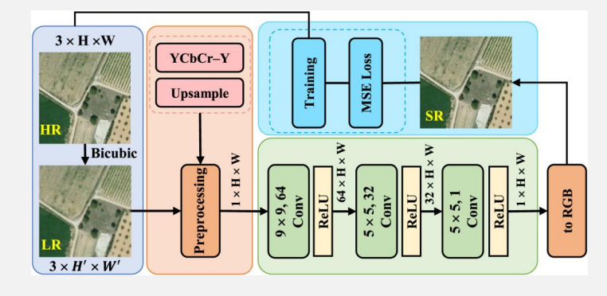

# 遥感影像超分辨率Remote Sensing Image Super-Resolution（RSISR）
## RSISR综述
图像超分辨率（SR）是指从一幅或多幅同一场景的低分辨率图像中重建或生成高分辨率图像的技术。  

### 分类
- 按输入划分：  
    - 单图像超分辨率（SISR）：从一幅低分辨率图像重建高分辨率图像。
    - 多图像/多帧超分辨率（MISR/MFSR）：从同一场景的多幅低分辨率图像中重建高分辨率图像，通常具有亚像素偏移。
- 按是否使用深度学习划分：
    - 传统方法
    - 深度学习方法
- 按是否使用监督划分：
    - 监督方法
    - 无监督方法
- 按超分辨率遥感影像的模态划分：
    - 光学遥感影像超分辨率方法
    - 合成孔径雷达遥感影像超分辨率方法
    - 红外遥感影像超分辨率方法
    - 激光雷达遥感影像超分辨率方法

### 为什么RSISR重要
- 克服传感器分辨率限制
    - 遥感传感器受到硬件、轨道高度、成本、重访周期和物理成像条件限制。高分辨率卫星成本高、覆盖范围和重访能力有限。超分辨率提供了一种软件层面的增强方法：不用换卫星，也能提升影像空间细节。
- 获取更细致的地表信息
    - 低分辨率图像中，建筑、道路、河流、车辆、船只、城市结构等小尺度目标容易模糊。超分辨率可以增强边缘、纹理和形状，让目标与边界更清楚。
- 减轻混合像元问题
    - 在中低分辨率遥感图像中，一个像元可能同时包含植被、土壤、水体和建筑等多种地物，这叫 mixed-pixel problem，混合像元问题。超分辨率通过提供更细的空间信息，可以改善土地覆盖分类和目标提取。
- 提升下游遥感任务性能
    - 更高分辨率影像可以帮助土地利用/土地覆盖分类、目标检测、语义分割、变化检测、灾害评估、城市监测、农业监测、环境监测等任务。
- 提升已有历史遥感数据价值
    - 很多历史卫星影像空间分辨率较低，但时间跨度长，非常适合做长期变化研究。超分辨率可以增强这些旧数据的视觉质量和分析价值，例如城市扩张、植被变化、气候相关分析。

### 应用场景
- 细节增强
- 下游任务提升类
- 专业监测类
- 数据融合与预处理
    - 多源分辨率匹配
    - 高光谱空间增强
    - 历史数据再利用
## 传统RSISR方法
主要包括插值法、基于稀疏编码法、基于回归法、全色税化法等  
### 插值法
代表算法：最近邻插值、双线性插值、双三次插值（立方卷积插值）。通过已知像素点的几何位置关系，直接估计未知像素的灰度值。  

- 双三次卷积插值核心思想：  
    - 插值新像素值，不取最近点、不取平均
    - 以待求像素为中心，选取周围4行4列共16个原始像素
    - 用三次多项式卷积核计算每个像素权重
    - 加权求和得到新像素灰度值

标准三次卷积基函数：  

\[
W(x)=
\begin{cases}
1-2|x|^2+|x|^3, & 0\le |x|<1,\\[4pt]
4-8|x|+5|x|^2-|x|^3, & 1\le |x|<2,\\[4pt]
0, & |x|\ge 2.
\end{cases}
\]

x：目标点与原始像素的距离偏移量，距离越近权重越大，超出2个像素权重直接为0  

局限性：本质是信号重采样，无真实信息恢复，图像边缘易模糊或出现锯齿，高频细节丢失严重。  

### 基于稀疏编码法
>把低分辨率图像块和高分辨率图像块看作可以用少量“字典原子”稀疏表示的信号，通过学习低分辨率字典与高分辨率字典之间的对应关系，用低分辨率图像块的稀疏系数去重建对应的高分辨率图像块。

基于稀疏编码法  

它包含三个算法步骤：字典学习、稀疏编码和高分辨率重建。  

- 字典学习：从配对的低分辨率与高分辨率训练图像块中学习低分辨率/高分辨率字典，建立两者之间的稀疏表示对应关系。
- 稀疏编码：对输入低分辨率图像块提取特征，并在低分辨率字典上求解其稀疏系数表示。
- 高分辨率重建：利用得到的稀疏系数在高分辨率字典中重建对应的高分辨率图像块，并融合生成最终超分辨率图像。

###  基于回归法
基于回归的遥感影像超分辨率方法学习低分辨率和高分辨率图像之间的函数映射，将超分辨率视为一个回归问题。  

流程：  

1. 从成对 LR-HR 数据中提取低分辨率特征；
2. 训练回归模型；
3. 将新的 LR 图像投影到 HR 图像空间；
4. 生成最终超分结果。

代表方法包括 Kernel Regression、Support Vector Regression，SVR、General Regression Neural Network，GRNN 等。  

### 全色锐化
全色锐化使用更高分辨率的全色图像PAN（或栅格波段）与较低分辨率的多波段栅格数据集MS进行融合。结果生成一个具有全色栅格分辨率的多波段栅格数据集，其中两个栅格完全重叠。  

可用于创建全色锐化影像的影像融合方法：Brovey变换；Esri全色锐化变换；Gram-Schmidt光谱锐化方法；强度、色调、饱和度（IHS）变换；以及简单均值变换。  

>PAN 提供“清晰度”，MS 提供“颜色/光谱信息”。全色锐化就是把 PAN 的清晰纹理注入 MS 中。
#### Brovey变换

将各个重采样的多光谱像素乘以相应全色像素亮度与所有多光谱亮度总和的比值。假定全色图像所跨越的光谱范围与多光谱通道覆盖的范围相同。  

- 常规使用红、绿、蓝三个多光谱波段时，Brovey变换公式为：
    - $Red_{out} = \frac{Pan }{(Blue_{in} + Green_{in} + Red_{in}) }\times Red_{in}$
    - 输出波段=原始波段×调整比例
    - 调整比例=PAN亮度/RGB总亮度

- 使用权重的红、绿、蓝、近红外四个多光谱波段时，Brovey变换公式为：
    - $DNF = (P - IW \times I) / (RW \times R + GW \times G + BW \times B)$
    - $Red_{out} = R \times DNF$
    - $Green_{out} = G \times DNF$
    - $Blue_{out} = B \times DNF$
    - $Infrared_{out} = I \times DNF$
    - 先算一个统一的调整因子 DNF，再把这个因子乘到各个波段上。

P或PAN = 全色影像  
R = 红波段  
G = 绿波段  
B = 蓝波段  
I = 近红外  
W = 权重  
RW,GW,BW,IW是不同波段的权重  

>优点：计算简单，增强空间细节明显，影像看起来锐利。  
>缺点：它假设 PAN 与多光谱波段光谱范围匹配。如果 PAN 的光谱范围和 RGB/NIR 不一致，就容易造成光谱失真，例如颜色变得不自然，植被、水体等地物的光谱特征被改变。
#### Esri全色锐化
Esri全色锐化变换使用加权平均和可选近红外波段来创建其全色锐化输出波段。加权平均（WA）的结果可用来创建调整值（ADJ），随后将使用该值计算输出值。  

WA可以看作是由多光谱各波段按一定权重合成出来的"近似亮度图像"。

- 算加权平均亮度 WA:$WA = W_R \times R + W_G \times G + W_B \times B, \quad W_R + W_G + W_B = 1$    
- 算调整值ADj：$ADJ = Pan_{image} - WA$  
- 把调整加到各波段：
    - $Red_{out} = R + ADJ$  
    - $Green_{out} = G + ADJ$  
    - $Blue_{out} = B + ADJ$  
    - $Near\_Infrared_{out} = I + ADJ$  

。

- 多光谱波段的权重取决于多光谱波段的光谱灵敏度曲线与全色波段的重叠程度。
- WA权重是相对的，将在使用时进行归一化。
- 与全色波段重叠程度最大的多光谱波段应获得最大的权重值。与全色波段完全不重叠的多光谱波段应获得权重值0。

>优点：比 Brovey 温和，易理解  
>缺点：依赖权重选择  
#### Gram-Schmidt

Gram-Schmidt全色锐化方法核心是用**向量正交化**分离空间与光谱信息，用高分辨率全色（Pan）替换低分辨率模拟全色，再逆变换重建高分辨率多光谱（MS）影像。  

- 按传感器光谱响应加权多光谱波段，生成与全色光谱范围匹配的低分辨率全色影像$S$。
- 视每个波段为高维向量（维度 = 像素数），以$S$为第一分量$C_1$，逐次Gram-Schmidt正交化其余多光谱波段，得到互不相关的正交分量$C_1, C_2, \ldots, C_n$。
- 将正交分量$C_1$（低分辨率$S$）替换为高分辨率全色，并做直方图匹配以保持统计一致性。
- 用替换后的分量作Gram-Schmidt逆变换，重建高分辨率多光谱影像，空间分辨率与全色一致，光谱特征与原始多光谱接近。

一些常用传感器的建议权重如下（分别为红色、绿色、蓝色和近红外）：  
GeoEye-1：0.6、0.85、0.75、0.3  
IKONOS：0.85、0.65、0.35、0.9  
QuickBird：0.85、0.7、0.35、1.0  
WorldView-2：0.95、0.7、0.5、1.0 

>优点：比 Brovey 更注意光谱保持，适合多波段遥感影像；效果通常比较稳定。  
>缺点：步骤复杂，需要比较合理的权重和直方图匹配；如果 PAN 与 MS 光谱响应差异很大，也可能失真。  
#### IHS（强度-色调-饱和度）色彩空间变换

核心思路：

- 多光谱影像转为IHS空间，分离亮度$I$、色调$H$、饱和度$S$；
  - 色调$H$：地物颜色属性（光谱信息，必须保留）
  - 饱和度$S$：色彩鲜艳程度（光谱信息，尽量保留）
  - 亮度$I$：明暗/空间纹理信息（用高分辨率全色替换）
- 用高分辨率全色影像替换原亮度分量，再逆变换转回RGB，实现空间分辨率提升，保留地物色彩特征。

1.正变换（RGB → IHS）：

$$\begin{cases} I = \dfrac{R + G + B}{3} \\ H = \arctan\left(\dfrac{\sqrt{3}(G - B)}{2R - G - B}\right) \\ S = 1 - \dfrac{3 \min(R, G, B)}{R + G + B} \end{cases}$$

2.将低分辨率亮度$I$替换为直方图匹配后的高分辨率全色：

$$I_{new} = PAN_{matched}$$

3.利用新亮度$I_{new}$ + 原色调$H$ + 原饱和度$S$，反推高分辨率多光谱。

#### 局限
- 优点
    - 计算相对简单，对硬件要求低，适合资源受限场景。
- 缺点
    - 它们主要依赖局部像素关系，不能充分提取深层特征和高级语义信息；
    - 在 4×、8× 这类大倍率超分任务中，往往无法恢复足够细节，结果容易模糊或失真；
    - 回归类方法还容易受噪声影响。

>优点：思路非常清楚，计算简单，视觉增强明显。  
>缺点：通常主要适合 RGB 三波段；如果有更多多光谱波段，比如 NIR、SWIR，高光谱影像，IHS 就不够自然。并且如果 PAN 和 RGB 的光谱范围不匹配，也容易产生颜色失真。  
## 深度学习RSISR方法
### 总览
- CNN-based RSISR：
    - SRCNN：图像超分领域的开创性卷积神经网络
    - msiSRCNN：第一个基于CNN的遥感影像超分辨率模型
    - ESPCN：引入高效亚像素卷积实现端到端上采样
    - EDSR、RCAN、RNAN、HAN、HAUNet、HSENet 等。
- Transformer-based RSISR：
    - SwinIR：基于窗口自注意力机制的经典超分模型
    - HAT：采用混合注意力机制优化特征提取能力
    - TTST：针对遥感图像特性设计的Transformer模型
- GAN-based RSISR：强调生成逼真细节。
- Mamba-based RSISR：利用状态空间模型处理长程依赖。
- Diffusion model-based RSISR：利用扩散模型逐步生成高质量细节。
- Hybrid RSISR methods：混合模型，例如 CNN + Transformer、GAN + Diffusion、CNN + Mamba 等。

### SRCNN
于2014年提出，并于2016年作微调，是深度学习图像超分辨率领域的开山之作，奠定了基于CNN的单图像超分辨率研究范式。  

- 图像块提取：先把低分辨率图像通过双三次插值放大到目标尺寸，然后用卷积层提取浅层特征。
- 非线性映射：通过卷积层将低分辨率特征非线性变换至高分辨率特征空间；
- 图像重建：再次卷积聚合特征，生成最终高分辨率图像。

优点：开创性构建了深度学习超分基线，结构简洁且效果显著优于传统超分辨率方法；  
缺点：计算效率偏低（基于放大后高分辨率特征图运算）、感受野较小且依赖预处理插值。  

### msiSRCNN
msiSRCNN 是第一个基于 CNN 的遥感影像超分方法。它利用 Sentinel-2 多光谱遥感数据训练和微调 SRCNN。  

基于遥感影像YCbCr色彩空间的亮度分量对SRCNN进行微调，并进行了性能评估  

基于SRCNN的遥感影像超分辨率方法示意图：

### ESPCN：高效亚像素卷积神经网络
核心思想：提出亚像素卷积层，彻底颠覆了传统超分任务中"先插值放大、后卷积处理"的流程。该网络将所有卷积运算全部在低分辨率特征图上完成，最后通过亚像素卷积层的像素重排机制，将低分辨率特征图直接高效映射为高分辨率图像，极大降低了计算复杂度。  

所提出的ESPCN，使用两个卷积层进行特征图提取，以及一个亚像素卷积层，该层聚合低分辨率空间的特征图并一步构建超分辨率图像。  

- 优点：推理速度极快；在相同放大倍数下重建效果显著优于SRCNN。  
- 缺点：网络结构相对简单，感受野范围较小，对复杂纹理细节的恢复能力与深层网络相比存在差距，在大尺度超分场景下表现受限。  
## 性能评价方法
定性评价  

- 视觉对比
- 专家视觉评价
- 应用导向评价

定量评价  

- MSE均方误差（mean square error）
- RMSE均方根误差（root mean square error）
- PSNR峰值信噪比（peak signal-to-noise ratio）
- SSIM结构相似性（structural similarity）
- LPIPS感知图像块相似性（learned perceptual image patch similarity）
## 未来展望
- 遥感影像超分辨率中的真实世界退化建模
- 遥感影像超分辨率中的基础模型与迁移学习
- 多模态遥感影像超分辨率方法
- 更好的评价指标和基准数据集
- 基于扩散-Mamba的遥感影像超分辨率方法

## 案例