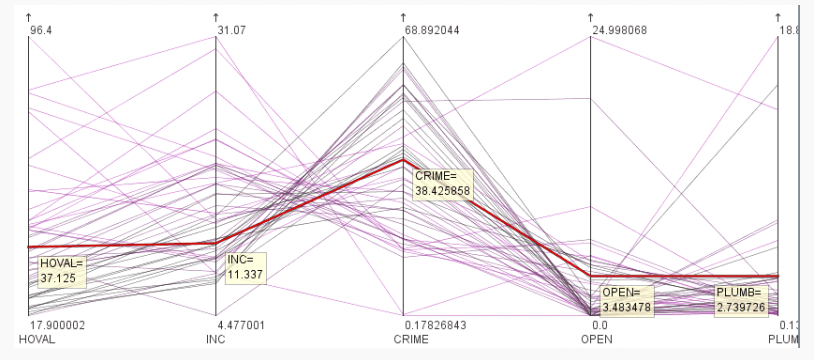

# 探索性空间数据与空间统计
**描述性统计**（或描述性统计分析）是指使用特定方法来描述和总结样本特征，而**推断性统计分析**是指用于从样本中推断出关于总体信息的方法。  

描述性方法属于探索性技术类；推断性统计则属于验证性方法类。
## 描述性统计
* 平均值
* 中位数
* 众数
* 极差
* 四分位距
* 方差与标准差
* 样本方差与样本标准差
* Z得分（标准分数）
    * $z_i = \frac{X_i - \bar X}{S}$
* Variogram变异系数
    * $C_v = \frac{S}{\bar x}$
* 偏度
    * 偏度衡量数据表现出的不对称程度
    * $skewness = \frac{\sum{(x_i - \bar x)^3}}{n S^3}$
* 峰度
    * 峰度衡量直方图的陡缓（尖锐）程度。它的定义与偏度相似，不同之处在于使用的是四次方而不是三次方
    * $kurtosis = \frac{\sum{(x_i -\bar x)^4}}{n S^4}$
    * 峰度 > 3 比正态分布更陡峭
    * 峰度 = 3 标准正态分布
    * 峰度 < 3 低于正态分布（较平坦）

## 推断性分析
案例：Cole等人。能源生产和林业压力驱动下的英国动态景观——2018年CORINE土地覆盖图的结果  

案例：Fasihi H., Parizadi T. 伊朗伊拉姆市城市公园的空间公平性与可达性分析。《环境管理杂志》，2020, 260。

## 统计分布
### 正态分布
### Z-score
低于均值的分数为负数（在均值左侧），高于均值的分数为正数（在均值右侧）。  

Z得分代表偏离均值的标准差数量。  

不同分布之间的z得分具有可比性。  

## 探索性空间数据分析

### 基本思想与概念
Exploratory Spatial Data Analysis, ESDA, 探索性空间数据分析。  

>探索性空间数据分析（ESDA）是在空间数据分析过程中，利用地图可视化和空间统计方法，对空间数据的分布特征、空间聚集、空间异常值、空间自相关及空间异质性等规律进行探索和发现的一种分析方法，其目的是为后续空间建模和决策提供依据。  

!!! note
    名词解释：ESDA
    简答题：什么是探索性空间数据分析，举3种ESDA方法

* 基本思想
    * “让数据说话”
    * 不限制方法的标准，不拘泥于数据的测量准确性。
* 探索性空间数据分析 (ESDA) 的基本内容
    * 检查数据是否存在错误
    * 获取空间数据的分布特征
    * 初步调查空间数据模式
* ==探索性空间数据分析 (ESDA)== 的概念：
    * ESDA是一个循序渐进的过程，通常从非空间工具（如显示变量分布并识别异常值的等值线图和箱形图）开始。
    * ESDA是探索性数据分析的延伸，因为它明确关注地理数据的特定特征。
    * ESDA是一种越来越受欢迎的基于GIS的技术，它允许用户描述和可视化空间分布，识别非典型位置或空间异常值，发现空间关联、集群或热点的模式，并提出空间机制或其他形式的空间异质性。
    * ESDA的优势在于其“数据挖掘”能力，这在没有预先存在理论框架的情况下特别有用（在社会科学的多学科领域中通常如此）。它提出了广泛的主要是图形化的方法来探索数据集的属性，而无需建立正式的模型，而建立模型未必是许多GIS用户感兴趣的。

### 常规可视化探索方法
* 直方图
    * 直方图为每个类别包含一个垂直条。条形的高度代表该类别中的观测数量（即频率），并且通常在水平轴上标记类别的中点。
* 饼图
    * 饼图使用圆的度数所代表的相对频率或百分比，展示整体到各部分的分解。
* 折线图
    * 折线图用于显示变量随时间的变化
* 散点图
    * 散点图通常用于说明两个变量之间的关联（如果有的话）。点的分布模式表明了关联的类型（正向或负向）和强度（弱或强）。散点图适用于数值数据（区间或比率）。
* 箱形图
    * 穿过矩形的水平线表示中位数，矩形的下端和上端分别代表第25和第75个百分位数。
* 平行坐标图
    * 每个变量都显示一个 [最小值, 最大值] 的垂直刻度，以及一条与案例相连的线。
    * 线条根据用户选择的单一变量和分类规则进行着色。
    * 通过选择一条线（如图所示），会显示其变量值，所有其他可视化窗口（例如各种形式的地图和图表）均会高亮显示该选定对象。

###  ESDA的方法
* 专题图
* 条件等值区域图
* 半方差/半变异函数图
    * 半方差云可用于探索空间相关性或寻找全局/局部和局部异常值
    * 半变异值 γ(h) 表示距离为h的空间样本之间属性值差异程度的平均大小,用于描述空间自相关随距离变化的规律。
* 泰森多边形图
    * 给定平面上的一组点，存在一组围绕这些点的关联区域，使得任何给定区域内的所有位置都比任何其他点更接近该区域内（中心）的一个点。这些区域可以被视为点集的对偶，被称为邻近多边形、泰森多边形 (Voronoi polygons) 或泰森区域。
* 地图化数据
* 地图化箱形图
* 趋势分析
* 地图交互性
* 自相关分析
* 热点分析
* 探索性时空数据分析 (ESTDA)