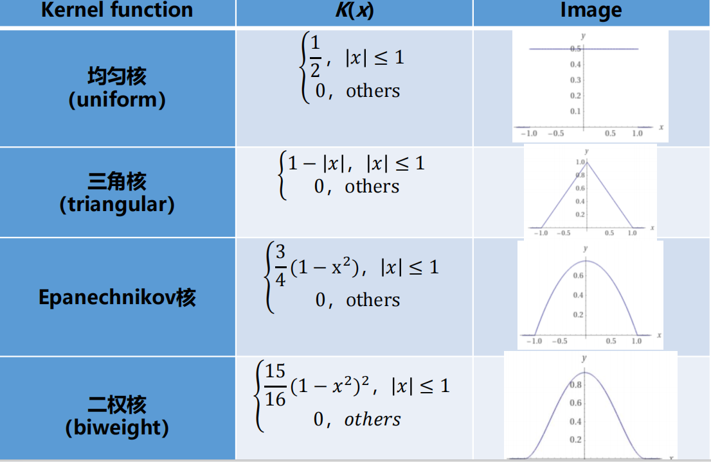

# 空间模式分析
## 空间模式分析的概念
!!! note
    名词解释：空间模式
* ==**空间模式**== 一般是指人或者物体在现实世界中的组织和位置,可以指它们之间的距离的远近或者说它们之间的呈现的相对或者绝对位置的规律。-史舟  
* **空间模式分析**提供了关于事物在哪里发生、事件的分布或数据的排列如何与景观中的其他特征对齐，以及这些模式可能揭示出哪些潜在联系和相关性的深刻见解。
    * 它涉及识别、描述和测量地理数据中的形状、排列、位置、配置、趋势或关系。
    * 在空间模式分析中通常考虑两个概念：**空间对象和分布区域**。后者是空间对象占据的空间范围。
    * 有空间对象的点、线、多边形类型，分布区域的线和多边形类型，以及空间分布的离散和连续类型。

### 空间分布/模式类型
1. 沿线状特征的离散点 —— 沿道路或河流的车站或码头
2. 沿线状特征的连续分布 —— 河流的流速或径流
3. 多边形特征中的离散点 —— 一个区域内的城市分布
4. 线性分布 —— 交通网络
5. 多边形的离散分布 —— 农田分布
6. 多边形的连续分布 —— 行政区划
7. 空间连续分布 —— 降水量

## 点模式的分析方法
## 样方分析 (Quadrat Analysis)
### 基本概念
**样方分析**：比较空间采样区域（样方）内的对象的统计预期和实际计数，以测试诸如随机性和聚类等分布模式。  

样方分析易于使用。  
一个重要的问题是样方的大小：  
    
* 如果网格尺寸太小，会有许多空网格，如果存在聚类但只在最小空间尺度上存在，它将会被遗漏。
* 如果网格尺寸太大，可能会遗漏网格内发生的模式。
* 可能会在某些空间尺度上发现模式而在另一些尺度上没有发现，因此样方大小的选择会严重影响结果。
* Curtiss 和 Mc Intosh (1950) 建议“最佳”样方大小为每个样方两个点。Bailey 和 Gatrell (1995) 建议每个样方的平均点数应约为 1.6。  

样方方法的总结：

1. 将研究区域划分为 m 个等大的网格。  
2. 求每个网格的平均点数 (x̄)。这等于总点数除以网格数 (m)。  
3. 如下求每个网格点数的方差 (S²)：S² = Σ (x_i - x̄)² / (m - 1)  
4. 计算方差-均值比 (VMR)：VMR = s² / x̄  
5. 按如下解释结果：  
    * 如果 VMR = s² / x̄ < 1，则点数的方差小于均值。在比值接近零的极端情况下，不同网格之间的点数变化很小。这表征了点分布在整个研究区域中分散或均匀的情况。
    * 如果 VMR > 1，每个网格的点数有很大变化——有些网格的点数大大多于预期，有些则大大少于预期。这表征了点模式比随机更聚类的情况。
    * VMR 接近 1 的值表明点在研究区域内接近随机分布。

**假设检验：**  

* 对于一组实际的观测数据，如果观测数据的 VMR 与 1 的差异不大，我们决定接受点在空间中随机分布的零假设；否则，我们拒绝零假设。
* 具体地说，如果观测模式的 VMR 大于 $VMR_H$（$VMR_H$ = 具有 α 的第 75 个最高 VMR 值），则拒绝零假设，模式被认为比随机更聚类
* 类似地，如果观测到的 VMR 小于 $VMR_L$（$VMR_L$ = 具有 α 的第 25 个最低 VMR 值），则拒绝零假设，模式被认为比随机更均匀。

**卡方检验：**  

χ² = (m - 1)s² / x̄ = (m - 1)VMR  
其中 m 是样方数，x̄ 和 s² 分别是每个样方中点数的均值和方差。  

如果 χ² < $χ²_L$ 或 χ² > $χ²_H$，则拒绝 H0。说明研究对象的空间模式不是随机的。  

当自由度较大时(大于30), 可以将χ²分布近似为正态分布处理  

### 优缺点

* 优点：
    * 简单直观：样方分析的计算方法简单，结果易于理解和解释，适合快速评估点数据的空间分布模式。
    * 适用于离散数据：样方分析直接基于点的数量，适合处理离散数据。
    * 无需复杂参数设置：只需要设置样方的大小和形状。
    * 易于与其他空间分析结合：结果通常以栅格形式输出，便于叠加分析。
    * 适用于大范围数据：适合区域尺度的空间分布研究。
    * 统计检验方便：可以通过卡方检验等方法，检验数据是否偏离完全随机分布。
* 缺点：
    * 样方大小依赖性：结果高度依赖于样方大小的选择。
    * 边界效应：在样方边界附近，点可能被分配到相邻样方导致不准确。
    * 不适用于小样本数据：点数据较少时结果不够稳定。
    * 无法处理权重数据：标准样方分析无法直接处理带权重的点数据。
    * 形状限制：样方通常为规则形状，可能无法适应不规则研究区。
## 点密度 (Point Density)
### 基本概念
* 计算每个输出栅格单元周围点要素的密度。从概念上讲，围绕每个栅格单元中心定义一个邻域，计算落在邻域内的点数，然后除以邻域的面积。
* P(s) = (圆 C(s,r) 内点 s 的数量) / (πr²)
    * P(s) 是点 s 的点密度，C(s,r) 表示以点 s 为中心、r 为半径的圆
* 半径 (Radius)
    * 增加半径不会极大地改变计算出的密度值。尽管会有更多的点落入更大的邻域内，但在计算密度时，这个数字将被除以更大的面积。
    * 较大半径的主要影响是，在计算密度时会考虑更多的点，这些点可能距离栅格单元更远。这导致输出栅格更加泛化（平滑）。
    * 在某种程度上，半径可以被认为是空间尺度

### 优缺点
* 优点：
    * 简单直观：计算方法简单，适合快速了解空间分布。
    * 计算效率高：算法简单，计算速度快。
    * 无需复杂参数设置：只需设置网格大小。
    * 适用于离散数据。
    * 易于与其他空间分析结合。
    * 边界清晰：使用规则网格，结果边界清晰。
* 缺点：
    * 平滑性不足：结果通常是离散栅格，缺乏连续分布特征。
    * 分辨率依赖性强：高度依赖网格大小选择。
    * 边界效应：网格边界附近可能不准确。
    * 不适用于小样本数据。

点密度方法的主要缺点是密度值可能会从一个值突然变化到另一个值。  
## ==核密度== (Kernel Density)
!!! note
    名词解释：核密度分析
### 基本思想
* 使用核函数计算点或折线要素的单位面积上的量级，以将平滑锥形的表面拟合到每个点或折线上。
* 它可以计算点要素和线要素的密度。

核密度类似于点密度，不同之处在于它使用核函数来塑造输出结果。  

!!! note "核密度和点密度的区别"
    核密度是一种估计点密度的方法：它不是简单数某个格子里有几个点，而是让每个点向周围产生一个随距离衰减的影响，再把所有影响叠加起来。  

    | 概念 | 点密度        | 核密度           |
    | -- | ---------- | ------------- |
    | 含义 | 某区域点有多密    | 用核函数平滑估计出来的密度 |
    | 方法 | 直接计数 / 面积  | 每个点扩散影响后叠加    |
    | 结果 | 常常分区块、网格统计 | 连续、平滑的密度面     |
    | 边界 | 容易受网格大小影响  | 受核函数和带宽影响     |
    | 例子 | 每平方公里有多少餐馆 | 餐馆热点分布热力图     |

假设一个点样本集 S={S1, S2, ..., Sn} 在一个以点 s 为中心、r 为半径的圆形区域内，核密度分析就是估计点 s 的分布密度函数 f。  

$f(s)=\frac{1}{n}\sum_{i=1}^{n}K_{\tau}(s-s_i)=\frac{\tau}{n}\sum_{i=1}^{n}K_{\tau}\left(\frac{s-s_i}{\tau}\right)$

* s：你正在计算密度的位置
* $s_i$：第 i 个样本点的位置
* n：样本总数
* $K_\tau$：核函数（Kernel）

核函数 K(x) 是非负的，积分值为 1，均值为 0。  

  

### 核密度的概念理解
* 从概念上讲，在每个点上都拟合了一个平滑的曲面。表面的值在点所在位置最高，并随
* 与点距离的增加而减小，在搜索半径距离处达到零。
* 只能使用圆形的邻域。曲面下的体积等于该点的人口字段值，如果指定了 NONE，则为 1。
* 每个输出栅格单元的密度是通过将覆盖该栅格单元中心的所有核曲面的值相加来计算的。

### 带宽/搜索半径
用于确定默认搜索半径（也称为带宽）的算法如下：  

1. 计算输入点的平均中心。如果提供了 Population 字段（权重字段），则平均中心及后续所有计算均按该字段值进行加权。  
2. 计算所有点到（加权）平均中心的距离。
3. 计算这些距离的（加权）中位数，$D_m$。
4. 计算（加权）标准距离，SD。
5. 应用公式计算带宽：$\mathrm{SearchRadius}=0.9\cdot\min\!\left(SD,\sqrt{\frac{1}{\ln(2)}}\,D_m\right)\cdot n^{-0.2}$ ,$D_m$是点到平均中心距离的中位数，n 是点数/权重字段总和，SD 是标准距离。

>。。。给我翻译成人口字段是啥意思。
### 优缺点
* 优点：
    * 直观可视化：生成平滑密度表面。
    * 无需假设分布形式：非参数方法，不依赖特定分布。
    * 灵活性强：可调整核函数和带宽。
    * 适用于多尺度分析。
    * 广泛应用：生态学、犯罪学、城市规划等。
* 缺点：
    * 带宽选择敏感：过小粗糙，过大掩盖细节。
    * 计算复杂度高。
    * 边界效应：数据边界附近可能不准确（核函数超出边界）。
    * 对异常值敏感。

## 平均最近邻 (Average Nearest Neighbor)
!!! note
    名词解释：平均最近邻分析

==平均最近邻分析== 是比较样本中每个点与最近邻要素之间的观测平均距离和随机分布中每个点与的最近邻要素之间的预期平均距离(零假设)的方法  

平均最近邻分析就是通过比较“实际最近邻距离”和“随机情况下的期望最近邻距离”，来判断点数据整体上是聚集、随机还是均匀分布的方法。  

对于每个点：

- 找到离它最近的另一个点；  
- 计算两点之间的距离；  
- 对所有点的最近邻距离求平均。
- 得到： $\bar d_o$ ，称为**观察平均最近邻距离（Observed Mean Distance）**。

如果这些点完全随机分布（CSR，Complete Spatial Randomness），**理论上最近邻平均距离**为：$\bar d_e=\frac{1}{2\sqrt{n/A}}$ ,其中：(n) = 点数量，(A) = 研究区域面积，这是随机分布下的期望距离。  

### 最近邻指数R
$R=\frac{\bar d_o}{\bar d_e}$  

* R < 1：聚集分布
    * 观察距离比随机情况更小。说明点彼此靠得更近。
* R ≈ 1：随机分布
    * 观察距离与随机情况接近。
* R > 1：均匀（规则）分布
    * 观察距离比随机情况更大。点彼此刻意保持间隔。

### z-score
$Z=\frac{\bar d_o-\bar d_e}{SE}$

* Z < -1.96 → 显著聚集
* Z > 1.96 → 显著离散
* 介于两者之间 → 与随机无显著差异

### 优缺点
* 优点：
    * 简单易用：适合快速评估。
    * 直观的统计指标：通过 R 值直接判断聚集、随机或均匀。
    * 适用于小样本数据。
    * 无需复杂参数设置。
    * 广泛应用于多个领域。
* 缺点：
    * 对研究区的选择敏感。
    * 仅考虑最近邻点，忽略整体关系。
    * 对边界效应敏感：边界附近点的最近邻可能在区外。
    * 无法反映多尺度特征。
    * 不适用于复杂点模式。
    * 结果解释依赖背景知识。
## Ripley's K 函数 (Ripley's K Function)
### 基本思想
* 围绕每个点或事件 i 构建一个半径为 d 的圆，
* 计算落在该圆内的其他点（标记为 j）的数量，
* 对所有点 i 重复前两个阶段，将结果相加，然后计算平均值，
* 将平均值除以点密度 λ。

$K(d)=\frac{\sum_i \sum_j k_{i,j}}{\lambda n}
 = \frac{A}{n^2}\sum_i \sum_j k_{i,j}$

* r：分析距离
* A：研究区域面积
* n：点数量
* $d_{ij}$：点 (i) 和点 (j) 的距离
* $I(d_{ij}\le r)$：如果两点距离小于等于r，记为1，否则为0

在完全随机分布下，理论值是：$K_{CSR}(r)=\pi r^2$

* $K(r) > \pi r^2$：点比随机情况更聚集
* $K(r) \approx \pi r^2$：接近随机
* $K(r) < \pi r^2$：点比随机情况更分散

>CSR,Complete Spatial Randomness,完全空间随机

使用蒙特卡洛方法对 K 或 L 函数进行统计检验蒙特卡洛方法是一种通过设定随机过程，反复生成随机序列，并计算参数以研究其分布特征的方法。

* 产生 n 次的完全空间随机分布，构建置信区间。
* 观测值 > 期望值：比随机分布聚类程度更高。
* 观测值 < 期望值：比随机分布离散程度更高。
* 观测值超出置信区间则说明该空间聚类或离散具有统计显著性。
### 优缺点
* 优点：
    * 能够同时考虑多个空间尺度，揭示点模式的多尺度特征。
    * 对数据的空间分布特征提供定量化的描述。
* 局限性：
    * 对边界效应敏感，需要校正（如 Ripley 边界校正）。
    * 计算复杂度较高，尤其是对于大规模数据集。