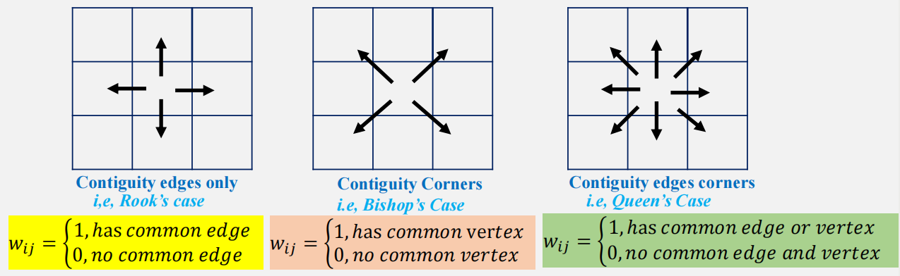
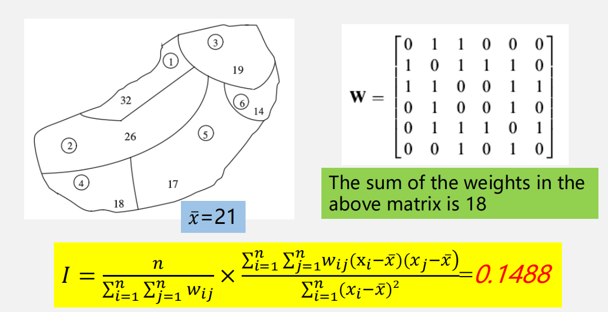
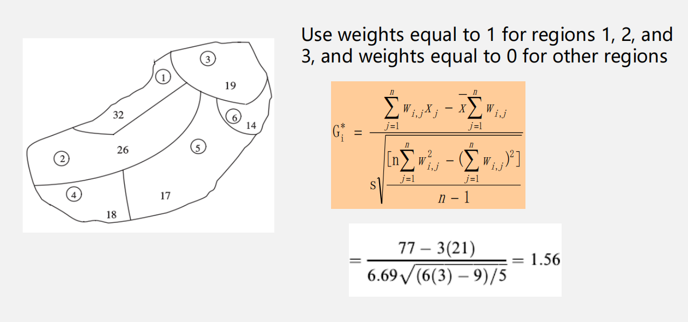

# 空间相关分析
>不是我请问呢这是概统吗
## 地理学中的传统相关分析
### 皮尔逊(Pearson)相关系数
#### 皮尔逊相关系数、协方差
地理相关类型：  
完全相关  
无相关性  
统计相关  

**样本皮尔逊相关系数：**

$$r = \frac{\sum_{i=1}^{n}(x_i-\bar{x})(y_i-\bar{y})}{\sqrt{\sum_{i=1}^{n}(x_i-\bar{x})^2}\sqrt{\sum_{i=1}^{n}(y_i-\bar{y})^2}} =\frac{\sum (x_i-\bar{x})(y_i-\bar{y})}{(n-1)s_xs_y} = \frac{1}{n-1}\sum_{i=1}^{n}z_x z_y$$

其中：  

- $\overline{x}=\frac{1}{n}\sum_{i=1}^{n}x_{i}$ ，$\overline{y}=\frac{1}{n}\sum_{i=1}^{n}y_{i} $   
- $s_x$ 和 $s_y$ 分别是变量 x 和 y 的样本标准差。$s_x=\sqrt{\frac{\sum(x_i-\bar{x})^2}{n-1}}$，$s_y=\sqrt{\frac{\sum(y_i-\bar{y})^2}{n-1}}$
- $z_x$ 和 $z_y$ 分别是与变量 x 和 y 相关的 z 分数。$z_{x_i}=\frac{x_i-\bar{x}}{s_x}$

**总体皮尔逊相关系数：**  

$$\rho = \frac{E[(X-\mu_X)(Y-\mu_Y)]}{\sigma_x \sigma_y} = \frac{\text{Cov}[X,Y]}{\sigma_x \sigma_y}$$

- $\mu_X$ 和 $\mu_Y$ 是总体中变量 x 和 y 的均值
- $\sigma_x$ 和 $\sigma_y$ 指变量 x 和 y 的标准差
- $\text{Cov}[X,Y]$ 是变量 x 和 y 的协方差

**协方差**:  

协方差是方差概念的直接扩展。方差是单个变量观测值与其均值之间偏差平方的期望值或平均值，而协方差是两个变量（如 X 和 Y）各自与其均值偏差的乘积的期望值或平均值。  
变量 x 与其自身的协方差 $\text{Cov}(X,X)$ 等于 X 的方差。  

样本协方差：

$$\text{Cov}[X,Y] = \frac{1}{n-1}\sum_{i=1}^{n}(x_i-\bar{x})(y_i-\bar{y})$$ 

协方差的大小取决于测量单位。  

- 协方差可以通过除以标准差的乘积来标准化，使其值范围在 -1 到 +1 之间。
- 这种标准化后的协方差称为皮尔逊相关系数。
- 相关系数提供了两个变量之间线性关联的标准化度量。

X 和 Y 的协方差可能为负也可能为正。  

- 如果大多数点 (x,y) 绘制在具有正斜率的直线上，则协方差为正。
- 当绘制的点位于具有负斜率的直线上时，协方差为负。

$r \in [-1, 1]$  

- r>0，说明正相关，x 高于均值时 y 往往也高于均值；
- r<0，说明负相关，x 高于均值时 y 往往低于均值；
- r≈0，说明没有明显线性相关。
    - 但注意，r≈0 不代表没有关系，可能只是没有线性关系。两个变量可能有很强的非线性关系，但 Pearson 相关接近 0。所以做相关分析时，不能只看系数，还要画散点图。
#### 相关系数矩阵
$r_{ij}$ 表示两个随机变量之间的相关系数

$$R = \begin{bmatrix} r_{11} & \cdots & r_{1n} \\ \vdots & \ddots & \vdots \\ r_{n1} & \cdots & r_{nn} \end{bmatrix}$$

R 是对称矩阵，对角线元素的值都等于 1。
#### 相关系数示例
存在强烈的线性关联并不一定意味着两个变量之间存在因果关系。  

- 例如，英国煤炭产量与南极企鹅死亡率之间曾发现存在强相关性，但将两者直接联系起来未免过于牵强。
- 另一篇文章曾指出美国每年龙卷风数量与汽车交通量之间存在强关联。该说法——大概是开玩笑——认为美国龙卷风的数量和汽车交通量在整个20世纪都在稳步增加。

####  r 的显著性检验
零假设：$H_0:\rho = 0$  
要检验真实相关系数 ρ 等于零的原假设，假设每个变量的数据来自正态分布。  

如果满足此假设，检验可以通过构建 t 统计量来进行：  

$$t = \frac{r\sqrt{n-2}}{\sqrt{1-r^2}}$$  

如果 t的绝对值大于临界值，就拒绝$H_0$，认为相关显著不为 0。  
如果原假设成立，该统计量服从自由度为 n-2 的 t 分布。    
 
#### 相关系数与样本量
- 相关系数受样本量的影响。
- 样本量大时比样本量小时更容易拒绝 ρ = 0 的原假设。

现实中的很多变量几乎不可能完全没有关系。只要样本量足够大，我们常常能发现它们之间存在某种相关性。  
### 斯皮尔曼(Spearman)秩相关系数  
#### 概念
- 在只有等级数据可用的情况下，或者检验 H₀: ρ = 0 所需的正态性假设不满足时，适合使用斯皮尔曼等级相关系数（秩相关系数）。
- 为每个变量分别建立两组等级。最低值赋等级 1，最高值赋等级 n。

$$r_s = 1 - \frac{6\sum_{i=1}^{n}d_i^2}{n^3-n}$$

其中 $d_i^2$ 是观测值 i 的等级差的平方，n 是样本量。

#### 显著性检验
$t=r_s\sqrt{n-1}$  

空间依赖对相关系数显著性检验的影响：  
空间数据不是独立样本。如果直接套用普通 Pearson/Spearman 相关检验，由于违反了“样本独立”的假设，得到的 p 值往往过小，从而错误地宣称“发现了显著相关关系”。  
如果数据存在空间依赖，普通相关系数检验会高估显著性，容易把不显著的相关误判为显著相关。  
### 偏相关系数  
- 偏相关系数用于衡量两个随机变量之间的关联程度，同时剔除（控制）一组控制变量的影响。
- 如果我们想研究两个感兴趣变量之间是否存在、以及在多大程度上存在数值关系，那么当存在第三个变量同时与这两个变量都有数值关系时，仅仅使用普通相关系数可能会得到误导性的结果。
- 为了避免这种误导，可以对这个混杂变量（confounding variable）进行控制，而实现这一点的方法就是计算偏相关系数。
- 这也正是为什么在**多元回归（multiple regression）**中要把其他解释变量（右侧变量）一起纳入模型的原因。

示例：4个变量，24个案例

| 案例编号 | x₁ | x₂ | x₃ | x₄ |
|---------|----|----|----|----|
| 1 | 679 | 342.9 | 141.8 | 194.3 |
| 2 | 824 | 378 | 192.5 | 253.5 |
| 3 | 859 | 392 | 211.7 | 252.2 |
| 4 | 910 | 421 | 222.2 | 266.8 |
| ... | ... | ... | ... | ... |
| 24 | 81910.9 | 14457.2 | 40417.9 | 27035.8 |

$$R = \begin{bmatrix} r_{11} & r_{12} & r_{13} \\ r_{21} & r_{22} & r_{23} \\ r_{31} & r_{32} & r_{33} \end{bmatrix} = \begin{bmatrix} 1 & r_{12} & r_{13} \\ r_{21} & 1 & r_{23} \\ r_{31} & r_{32} & 1 \end{bmatrix}$$

$$r_{XY \cdot Z} = \frac{r_{XY} - r_{XZ}r_{YZ}}{\sqrt{(1-r_{XZ}^2)(1-r_{YZ}^2)}}$$

$$r_{12 \cdot 3} = \frac{r_{12} - r_{13}r_{23}}{\sqrt{(1-r_{13}^2)(1-r_{23}^2)}}$$

$$r_{13 \cdot 2} = \frac{r_{13} - r_{12}r_{23}}{\sqrt{(1-r_{12}^2)(1-r_{23}^2)}}$$

$$r_{23 \cdot 1} = \frac{r_{23} - r_{12}r_{13}}{\sqrt{(1-r_{12}^2)(1-r_{13}^2)}}$$

---

$$R = \begin{bmatrix} r_{11} & r_{12} & r_{13} & r_{14} \\ r_{21} & r_{22} & r_{23} & r_{24} \\ r_{31} & r_{32} & r_{33} & r_{34} \\ r_{41} & r_{42} & r_{43} & r_{44} \end{bmatrix} = \begin{bmatrix} 1 & 0.416 & 0.346 & 0.950 \\ 0.416 & 1 & -0.592 & -0.469 \\ 0.346 & -0.592 & 1 & 0.579 \\ 0.950 & -0.469 & 0.579 & 1 \end{bmatrix}$$

| | r₁₂·₃ | r₁₃·₂ | r₁₄·₂ | r₁₄·₃ | r₂₃·₁ | r₂₄·₁ | r₂₄·₃ | r₃₄·₂ |
|--|-------|-------|-------|-------|-------|-------|-------|-------|
| | 0.821 | 0.808 | 0.647 | 0.895 | -0.863 | 0.956 | 0.945 | 0.371 |

$$r_{12 \cdot 34} = \frac{r_{12 \cdot 3} - r_{14 \cdot 3}r_{24 \cdot 3}}{\sqrt{(1-r_{14 \cdot 3}^2)(1-r_{24 \cdot 3}^2)}} = \frac{0.821 - 0.895 \times 0.945}{\sqrt{(1-0.895^2)(1-0.945^2)}} = -0.170$$

| r₁₂·₃₄ | r₁₃·₂₄ | r₁₄·₂₃ | r₂₃·₁₄ | r₂₄·₁₃ | r₃₄·₁₂ |
|--------|--------|--------|--------|--------|--------|
| -0.170 | 0.802 | 0.635 | -0.187 | 0.821 | -0.337 |

当有 m 个变量，设变量集合为 X₁, X₂, ..., Xₘ，

要计算在固定其他 m-2 个变量时，即控制特定的一个子集 S，变量 Xᵢ 与 Xⱼ 之间的偏相关系数可以通过递归关系从低阶偏相关系数计算：

$$r_{ij \cdot S} = \frac{r_{ij \cdot S \setminus \{t\}} - r_{it \cdot S \setminus \{t\}} r_{jt \cdot S \setminus \{t\}}}{\sqrt{1-r_{it \cdot S \setminus \{t\}}^2}\sqrt{1-r_{jt \cdot S \setminus \{t\}}^2}}$$

其中 t 是集合 S 中的任意一个变量，S\\{t} 表示从控制集中去掉 t。当 S 包含所有 m-2 个其他变量时，即得所需的偏相关系数。
### 复相关系数
多重相关系数，亦称复相关系数，指一个随机变量与某一组随机变量间线性相依性的度量，反映一的是个因变量与一组自变量(两个或两个以上)之间相关程度。

$$R = \sqrt{r_{yx}^T R_{xx}^{-1} r_{yx}}$$

$R \in [0, 1]$

其中 

- $r_{yx}$ 为 m × 1 的列向量，其中每个元素是 y 与每个自变量 xᵢ 的皮尔逊相关系数
- $r_{yx}^T$ 是 $r_{yx}$ 的转置
- $R_{xx}$ 为 m × m 的自变量之间的相关系数矩阵
- $R_{xx}^{-1}$ 是自变量相关系数矩阵的逆矩阵

- 决定系数：表示在多元线性回归中，自变量 x₁, x₂, ..., xₘ 共同解释的因变量 y 的方差比例（第6讲）

$$R^2 = r_{yx}^T R_{xx}^{-1} r_{yx} = \text{回归平方和}/\text{总平方和}$$

#### 复相关系数 R 的显著性检验
$F=\frac{SSR/(k-1)}{SSE/(n-k-1)}$

SSR：回归平方和，表示模型解释掉的 (y) 的变异部分$SSR = \sum(\hat y_i-\bar y)^2$，说明预测值 $(\hat y)$ 相对于均值 $(\bar y)$ 的波动，如果 SSR 很大，说明模型解释能力强。

SSE：误差平方和，表示模型没有解释掉的误差部分 $SSE=\sum(y_i-\hat y_i)^2$，说明真实值 $(y_i)$ 和预测值 $(\hat y_i)$ 之间的差距。如果 SSE 很小，说明模型预测得准。

SST：总平方和，$SST=\sum(y_i-\bar y)^2$ ,SST=SSR+SSE

## 空间自相关分析
### 空间自相关的概念
地理学第一定律：万物皆相关，近处的事物比远处的事物更相关  

**空间自相关**是利用空间统计学研究空间单元与其周边单元之间的空间相关性，从而分析这些空间单元的空间分布特征。

- 空间自相关程度高，说明相似的空间要素聚集在一起；
- 空间自相关程度低，说明相似的空间要素比较分散。

空间相关分析是指将相关分析方法应用于研究空间分布数据。
### 空间权重矩阵
空间统计并不意味着将传统的（非空间的）统计方法应用于恰好是空间的数据（具有 x 和 y 坐标）。

**空间权重矩阵**是数据集中要素之间空间关系的表示。它是数据集中要素之间存在的空间关系的量化。

**空间关系的概念化**是由Esri提出的一个概念，可以理解为：空间关系的形象化描述信息。通俗的说，就是在进行分析之前，需要对你的空间关系，进一个定义。比如，我们约定在某要素10公里内的要素视为其邻近要素，这种约定就是概念化。

空间关系:  

- 距离
    - 反距离
    - 阈值距离（即距离带）
- 多边形邻接
    - 仅边邻接（即车步邻接，Rook's case）
    - 边和角邻接（即皇后邻接，Queen's Case）
- 邻居
    - K 最近邻
    - Delaunay 三角剖分（即自然邻居）
- 其他
    - 时空窗口
    - 转换表
#### 空间权重矩阵：距离
**阈值距离（距离带）：**  

$$w_{ij} = \begin{cases} 1, & d < D \\ 0, & \text{otherwise} \end{cases}$$

- D 是确定的距离。  
- 阈值距离函数图——阶跃函数  

**反距离：**

$$w_{ij} = \frac{1}{d_{ij}^2}$$    

反距离函数图——递减曲线  

#### 空间权重矩阵：多边形邻接 

$$W = \begin{bmatrix} w_{11} & \cdots & w_{1n} \\ \vdots & \ddots & \vdots \\ w_{n1} & \cdots & w_{nn} \end{bmatrix}$$

其中 $w_{ij}$ 表示区域 i 和 j 之间的空间权重指数。  

空间权重矩阵的构建通常基于两个特征：邻接性和距离。它也可以基于面积和可达性构建。  

基于邻接性的空间权重矩阵可用于矢量或栅格数据。如果用于栅格或格网数据，**邻接性**可以通过以下方式表示：  

  

车步邻接（仅边邻接）： 

$$w_{ij} = \begin{cases} 1, & \text{有公共边} \\ 0, & \text{无公共边} \end{cases}$$

主教邻接（仅角邻接）： 

$$w_{ij} = \begin{cases} 1, & \text{有公共顶点} \\ 0, & \text{无公共顶点} \end{cases}$$

皇后邻接（边和角邻接）： 

$$w_{ij} = \begin{cases} 1, & \text{有公共边或顶点} \\ 0, & \text{无公共边和顶点} \end{cases}$$

#### 空间权重矩阵：邻居
**K-最近邻（K-nearest neighbors）：**  
>K 最近邻是指：对每一个目标空间对象，都选取距离它最近的 K 个对象作为它的邻居。  

如果 K 值（即邻居数量）设定为 8，那么距离目标要素最近的 8 个邻居将被纳入该要素的计算之中。在要素密度较高的区域，分析所涉及的空间范围相对较小；反之，在要素密度较低的区域，分析的空间范围则相对较大。这种空间关系模型的一个优势在于，即便研究区域内的要素密度存在显著差异，它也能确保每个目标要素都拥有一定数量的邻居。  

**Delaunay 三角剖分**  
>Delaunay 三角剖分是一种把空间中的点连接成三角网的方法；如果两个点被同一条三角形边连接，它们就被认为是邻居。  

Delaunay 三角剖分选项通过基于点要素或要素质心构建 Voronoi 三角形来确定邻域关系，使每个点或质心都成为三角形的节点。由三角形边连接的节点被视为邻居。采用 Delaunay 三角剖分可确保每个要素至少拥有一个邻居，即使数据中包含孤立要素或要素密度分布极不均匀的情况，也能保证这一点。  

通常，空间单元与其自身之间不存在邻接关系。  

### 全局空间自相关
#### Moran's I
!!! note
    计算题
    
**Moran’s I** 指数由 Patrick Alfred Pierce Moran 于 1950 年首次提出，用于基于要素位置和属性值来衡量空间自相关性。  

* 空间自相关的特征是：地理位置相近的样本之间存在相关性。 
    * 例如：如果在某区域发现某种灌木，那么在该灌木附近（而非远处）发现同种灌木的可能性更大。
* 空间自相关数据的核心在于：数值在空间上并非相互独。
* 通过测度空间自相关性，我们可以确定数据集或研究区域内空间格局的分布特征。

$$I = \frac{n}{\sum_{i=1}^{n}\sum_{j=1}^{n}w_{ij}} \times \frac{\sum_{i=1}^{n}\sum_{j=1}^{n}w_{ij}(x_i-\bar{x})(x_j-\bar{x})}{\sum_{i=1}^{n}(x_i-\bar{x})^2}$$

- 其中 $x_i$, $x_j$ 分别是区域/要素 i 和 j 的变量 x 的值，$w_{ij}$ 是区域/要素 i 和 j 之间的空间权重，n 等于区域/要素的总数。
- 权重 $w_{ij}$ 可以有多种定义方式

**使用标准化变量计算 Moran's I：** 

$$I = \frac{n \sum_{i=1}^{n}\sum_{j=1}^{n}w_{ij}z_i z_j}{\sum_{i=1}^{n}\sum_{j=1}^{n}w_{ij}\sum_{i=1}^{n}z_i^2}$$

- $z_i=\frac{x_i-\bar{x}}{s}$

最常见的定义是二元连通性：  

- $w_{ij} = 1$，如果区域 i 和 j 相邻
- $w_{ij} = 0$，否则

如果变量值在输入工具之前标准化，Moran's I 将在 [-1, 1] 范围内。  

例子：  

**显著性检验**:  

- 如果区域（要素）数量较大，在没有空间模式的原假设下，Iₙ 的抽样分布趋近于正态分布，I 的均值和方差可用于以通常的方式创建 Z 统计量：

$$Z(I) = \frac{I - E[I]}{\sqrt{\text{Var}(I)}}$$

$$E[I] = \frac{-1}{n-1}$$

$$Var(I) = E[I^2]-{E[I]}^2$$

α = 0.05

- 如果 Z(I) > 1.96，正空间自相关
- 如果 Z(I) < -1.96，负空间自相关
- 如果 -1.96 ≤ Z(I) ≤ 1.96，不显著

>正空间自相关:空间上相邻的区域，数值也相似。高值旁边还是高值，低值旁边还是低值。
>负空间自相关:空间上相邻的区域，数值相反。高值旁边是低值，低值旁边是高值。

**应用**

- 通过找到空间自相关最强的距离，帮助识别各种空间分析方法所需的适当邻域距离。
- 测量种族或民族隔离随时间的广泛趋势——隔离在增加还是减少？
- 总结思想、疾病或趋势在空间和时间上的扩散——思想、疾病或趋势是保持孤立和集中，还是在扩散和变得更加分散？

#### General G
**General G** 是一个统计量，用于测量高值或低值的聚集程度。  

$$G(d) = \frac{\sum_{i=1}^{n}\sum_{j=1}^{n}w_{ij}(d)x_i x_j}{\sum_{i=1}^{n}\sum_{j=1}^{n}x_i x_j}$$

其中 $w_{ij}(d)$ 是空间权重。

- 在原假设或随机分布下，General G 的期望均值：
$E[G] = \frac{\sum_{i=1}^{n}\sum_{j=1}^{n}w_{ij}(d)}{n(n-1)}$

$$Z(G) = \frac{G - E[G]}{\sqrt{\text{Var}[G]}}$$

如果 G(d) > E(G) 且 Z 值显著，则为高-高聚集  
如果 G(d) < E(G) 且 Z 值显著，则为低-低聚集  
如果 G(d) ≈ E(G)，则为随机分布  

**应用**  

- 可应用于犯罪分析、流行病学、投票模式分析、经济地理学、零售分析、交通事故分析和人口统计学等领域。
- 寻找急诊室就诊人数的意外激增，这可能表明当地或区域性健康问题的爆发。
- 比较城市中不同类型零售的空间模式，以查看哪些类型与竞争对手聚集以利用比较购物（例如汽车经销商），哪些类型排斥竞争（例如健身中心或健身房）。
- 总结空间现象聚集的水平，以检查不同时间或不同地点的变化。例如，已知城市及其人口聚集。使用高/低聚类（Getis-Ord General G），你可以比较单个城市内人口聚集水平随时间的变化（城市增长分析）。

>Moran’s I 本身主要告诉你整体上“相似值是否相邻”。General G 更强调：到底是高值在聚集，还是低值在聚集。
### 局部空间关联指标（Local Indicator Spatial Association，LISA）
>LISA 是一类用于衡量每一个空间单元与其邻近空间单元之间局部空间关联程度的统计指标，用来识别局部空间集聚和空间异常。  

!!! note
    名词解释：LISA
#### 局部 Moran's I
由 Luc Anselin 于 1995 年提出的局部 Moran’s I 指数，用于针对给定的要素集（输入要素类）和分析字段（输入字段），识别具有高值或低值的要素空间聚类。  

全局 Moran's I 统计量：  

$$I = \frac{n}{\sum_{i=1}^{n}\sum_{j=1}^{n}w_{ij}} \times \frac{\sum_{i=1}^{n}\sum_{j=1}^{n}w_{ij}(x_i-\bar{x})(x_j-\bar{x})}{\sum_{i=1}^{n}(x_i-\bar{x})^2}$$

**局部 Moran's I 统计量：**  

$$I_i = \frac{x_i - \bar{x}}{S_i^2}\sum_{j \neq i}w_{ij}(x_j - \bar{x})$$

$$S_i^2 = \frac{\sum_{j \neq i}(x_j - \bar{x})^2}{n-1}$$

局部 $Moran’s I_i$ 是每个地区对空间自相关的局部贡献；把所有 $I_i$ 加起来，就得到与全局 Moran’s I 成比例的整体空间自相关。$\sum I_i$与全局Moran’s I只差一个比例常数。  

**Iᵢ 的 Z 统计量：**  

$$z_{I_i} = \frac{I_i - E[I_i]}{\sqrt{V[I_i]}}$$

$$E[I_i] = -\frac{\sum_{j=1, j \neq i}^{n}w_{ij}}{n-1}$$

$$V[I_i] = E[I_i^2] - E[I_i]^2$$

**潜在应用：**  

- 可应用于经济学、资源管理、生物地理学、政治地理学和人口统计学等许多领域。
    - 研究区域内富裕与贫困之间最尖锐的边界在哪里？
    - 研究区域内是否存在消费模式异常的位置？
    - 研究区域内糖尿病发病率意外高的地方在哪里？
#### Getis-Ord Gi*
Getis 和 Ord   
使用以下方程计算 Gi* 统计量：  

$$G_i^* = \frac{\sum_{j=1}^{n}w_{ij}x_j - \bar{x}\sum_{j=1}^{n}w_{ij}}{S\sqrt{\frac{\left[n\sum_{j=1}^{n}w_{ij}^2 - \left(\sum_{j=1}^{n}w_{ij}\right)^2\right]}{n-1}}}$$

$w_{ij}(d)$ 可以为 0、1 或其他值。  

$$\bar{X} = \frac{\sum_{j=1}^{n}x_j}{n}$$

$$S = \sqrt{\frac{\sum_{j=1}^{n}x_j^2}{n} - (\bar{X})^2}$$

显著性检验：Gᵢ* 的 Z 统计量  

**应用**  

- 可应用于犯罪分析、流行病学、投票模式分析、经济地理学、零售分析、交通事故分析和人口统计学等领域。一些例子包括：
    - 疾病爆发集中在哪里？
    - 哪里厨房火灾占所有住宅火灾的比例高于预期？
    - 疏散地点应该设在哪里？
    - 峰值强度在哪里/何时出现？
    - 我们应该在哪些地点和时间段分配更多资源？