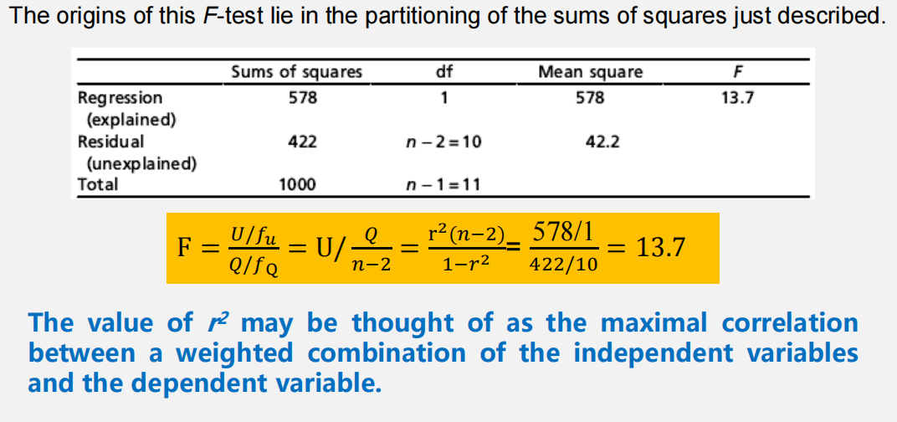
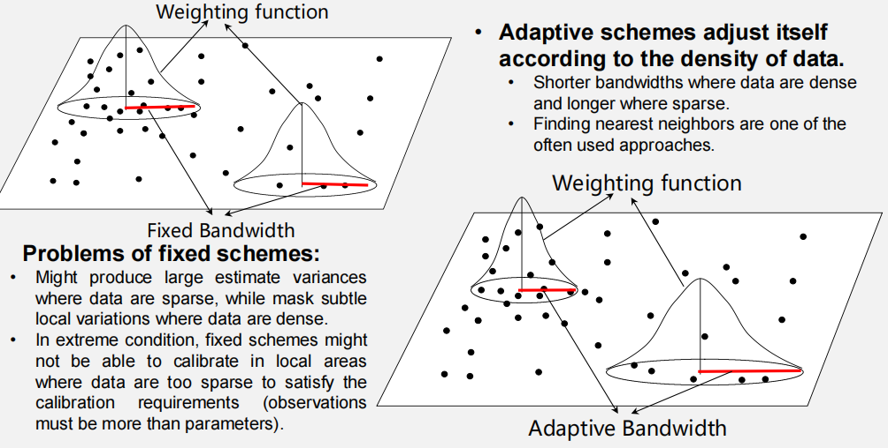

# 地理数据的回归分析
## 回归分析简介
**回归分析**是描述一系列方法的术语，这些方法旨在**建立因变量/响应变量与一组自变量、解释变量之间的因果关系模型**。  

回归分析用于确定和检验变量之间的函数关系。  

回归分析提供了：

- 变量之间的关系的简化视图
- 拟合所提供数据之间模型的方法
- 评价变量重要性和模型正确性的方法

**回归方法的类型：**

- 按自变量数量：
    - 二元（或单变量）回归、多元（或多变量）回归
- 按因变量与自变量之间的关系：
    - 线性回归、非线性回归
- 是否考虑案例之间的空间关系：
    - 传统回归、空间回归
- 估计回归参数的方法：
    - 普通最小二乘法（OLS）、最大似然法（ML）、支持向量机（SVM）、随机森林（RF）、深度学习（DL）...
## 传统回归分析
### 二元线性回归

二元线性回归分析是一种用于双变量的线性回归分析方法。  

- 自变量/解释变量对因变量产生效应或影响。
- 因变量（或响应变量）接收效应或受自变量影响。
#### 基本模型
$$\hat{y} = a + bx$$

- $\hat{y}$ 是因变量的预测值
- $x$ 是自变量的观测值
- $a$ 是截距（即直线与纵轴的交点）
- $b$ 是直线的斜率，可以解释为单位自变量变化引起的因变量预期变化

因变量 $y$ 的每个观测值可以表示为预测值和残差项之和：

$$y = a + bX + e = \hat{Y} + e$$

- $\hat{y}$ 是预测值
- $e$ 称为残差
- $a$ 和 $b$ 是某个"真实"值的估计

该真实回归线的斜率和截距理论上可以通过对总体进行100%的完整抽样来确定。

$$y = \alpha + \beta X + \varepsilon$$

- $\alpha$ 和 $\beta$ 分别是真实回归线的截距和斜率
- 每个观测值 $y$ 可以被视为基于 $x$ 的值（使用真实系数 $\alpha$ 和 $\beta$）预测 $y$ 值的分量与某些随机误差（$\varepsilon$）之和

因变量的观测值可以表示为预测值与"真实"总体误差 $\varepsilon$ 之和，其中：

$$\varepsilon = y - \tilde{y}$$

其中 $\tilde{y}$ 代表真实回归线的预测值

$$\tilde{y} = \alpha + \beta x$$

如果收集了不同的样本，基于样本的回归线会有所不同，但真实回归线保持不变。  

**将回归线拟合到一组双变量数据**   
在回归分析中，目标是找到通过观测数据点集的最佳拟合线的斜率和截距。  

一种方法是拟合直线，使观测值到直线的最小距离之和最小。在线性回归分析中，最小化观测点到直线的垂直距离平方和。

目标是找到使残差平方和最小的 $a$ 和 $b$ 值：  

$$Q = \sum_{i=1}^{n}(y_i - \hat{y_i})^2 = \sum_{i=1}^{n}(y_i - a - bx_i)^2 \Rightarrow \min$$

#### 普通最小二乘法（OLS，普通最小二乘法）

$$b = \frac{\sum_{i=1}^{n}(X_i - \bar{X})(y_i - \bar{y})}{\sum_{i=1}^{n}(X_i - \bar{X})^2}$$

$$a = \bar{y} - b\bar{X}$$

其中：

- $\bar{x} = \frac{1}{n}\sum_{i=1}^{n}x_i$
- $\bar{y} = \frac{1}{n}\sum_{i=1}^{n}y_i$

$$\begin{cases} \frac{\partial Q}{\partial a} = -2\sum_{i=1}^{n}(y_i - a - bx_i) = 0 \\ \frac{\partial Q}{\partial b} = -2\sum_{i=1}^{n}(y_i - a - bx_i)x_i = 0 \end{cases}$$

#### 平方和分解、R² 和 F 检验
用解释平方和与未解释平方和表示回归 

* T：总平方和（Total Sum of Squares）  
    * $\sum_{i=1}^{n}(y_i - \bar{y})^2$
* U：回归平方和/解释平方和（Regression Sum of Squares）  
    * $\sum_{i=1}^{n}(\hat{y}_i - \bar{y})^2$
* Q：残差/未解释平方和（Residual Sum of Squares） 
    * $\sum_{i=1}^{n}(y_i - \hat{y})^2$

$$\sum_{i=1}^{n}(y_i - \bar{y})^2 = \sum_{i=1}^{n}(\hat{y}_i - \bar{y})^2 + \sum_{i=1}^{n}(y_i - \hat{y})^2$$

$$r^2 = \frac{\sum_{i=1}^{n}(\hat{y}_i - \bar{y})^2}{\sum_{i=1}^{n}(y_i - \bar{y})^2} = 1 - \frac{\sum_{i=1}^{n}e_i^2}{\sum_{i=1}^{n}(y_i - \bar{y})^2} = \frac{U}{T} = 1 - \frac{Q}{T}$$

其中 $e$ 是残差值。   

- 使用F检验来确定回归是否成功地解释了 $y$ 的显著变异部分
- 对于二元回归，零假设 $H_0: \rho^2 = 0$

$$F = \frac{U/f_U}{Q/f_Q} = \frac{U/1}{Q/(n-2)} = \frac{r^2(n-2)}{1-r^2}$$

- F分布，自由度为1和n-2
- 如果 $F > F_c$，$F_c$ 是在F表中查到的临界值
- 拒绝 $H_0$
- 该F统计量是检验相关系数等于零的假设时使用的t统计量的平方

#### 简单回归分析的假设：  

(1) $y$ 与 $x$ 之间的关系是线性的；即存在一个构成总体模型的方程。$y = \alpha + \beta X + \varepsilon$

(2) 误差均值为零且方差恒定；即 $E[\varepsilon] = 0$ 且 $V[\varepsilon] = \sigma^2$。误差不随 $X$ 变化，即 $V[\varepsilon|x] = \sigma_x^2 = \sigma^2$。

(3) 残差是独立的；一个误差的值不受另一个误差值的影响。
$\varepsilon \sim N(0, \sigma^2)$

(4) 对于每个 $x$ 值，误差围绕回归线呈正态分布。该正态分布以回归线为中心。

#### Beta 参数检验：t 检验
斜率 β 的 t 检验，用于判断自变量 x 对因变量 y 到底有没有显著影响 

检验斜率真实值等于零的零假设：

$$H_0: \beta = 0$$

$$t = \frac{b - \beta}{s_b} = \frac{b}{s_b}$$

其中 $s_b$ 是斜率的标准差， $S_e$ 是估计的标准误差，也是残差标准差的另一种表达

$$s_b = \sqrt{\frac{S_e^2}{(n-1)S_x^2}}$$

$$s_e = \sqrt{\frac{\sum_{i=1}^{n}e_i^2}{n-2}} = \sqrt{\frac{\sum_{i=1}^{n}(y_i - \hat{y}_i)^2}{n-2}}$$

**Beta检验示例**

$$s_e = \sqrt{\frac{71.273}{8}} = 3.219$$

$$s_b = \sqrt{\frac{71.273}{(202.2)^2 \times 9}} = \sqrt{\frac{71.273}{367,236.36}} = 0.273$$

$$t = \frac{b - \beta}{s_b} = \frac{4.229}{0.273} = 15.49$$

$t_{0.025, 8} = 2.306$（双尾检验，$\alpha = 0.05$）

$\therefore$ 拒绝零假设：$\beta = 0$。该回归模型是显著的。

#### 置信区间
- 用于个体观测值的预测区间
    - 如果数据是个体观测，比如某气象站的 10 组降雨和径流数据，公式中有 (+1)：
    - $\hat{y} \pm t_{\alpha, df} \times S \times \sqrt{\frac{1}{n} + \frac{(x_j^* - \bar{x})^2}{\sum(x_i - \bar{x})^2} + 1}$
        -  $t_{\alpha, df}$ = 在 $\alpha$ 和 $df$ 自由度下的双尾t值
        - $S$ = 估计的标准误差
        - $x_j^*$ = 用于预测Y的特定X观测值
        - $x_i$ = 样本中的每个X观测值
    - 这个区间更宽，因为它不仅考虑回归线估计的不确定性，还考虑单个新观测值自身的随机误差
- 用于均值预测的置信区间
    - 如果预测的是很多观测的平均值，去掉 +1：
    - $\hat{y} \pm t_{\alpha, df} \times S \times \sqrt{\frac{1}{n} + \frac{(x_j^* - \bar{x})^2}{\sum(x_i - \bar{x})^2}}$
    - 这个区间更窄，因为平均值比单个观测值更稳定。

!!! queation "Why two different formulas?"
    一个预测单个观测，一个预测条件均值，前者不确定性更大

#### 案例
- Step 1：建立理论
    - 先提出理论关系：降雨量越大，径流量通常越大。
    - 明确变量：因变量 (y)：Runoff，径流量。自变量 (x)：Rainfall，降雨量。
- Step 2：检查数据
    - 画散点图，看是否近似线性。
    - 计算相关系数：r=0.91，说明降雨量和径流量之间存在较强正相关，并且通过显著性检验。
- Step 3：建立模型
    - $y=b_0+b_1x+\varepsilon$，其中 (y) 是径流量，(x) 是降雨量，($\varepsilon$) 是误差项。
- Step 4：估计并评价模型
    - $R^2=0.82834$,说明模型解释力较强。
    - F 检验中：$F^*=63.47$,临界值：$F_c=4.67$,63.47>4.67,拒绝原假设，认为降雨量显著解释径流量变化。
- Step 5：检查残差
    - 画残差图，横轴是因变量或预测值，纵轴是标准化残差。
    - 如果残差随机分布在参考线之间，说明模型较合理。
    - 如果残差呈现曲线、漏斗形、聚集或空间结构，则说明模型可能存在非线性、异方差或空间自相关问题。
- Step 6：写出回归方程
    - Y=-1415.23+1.264x
    - 为什么可以去掉误差项 (e)？因为在预测时，我们预测的是 (E(y|x))，也就是给定 (x) 时 (y) 的期望值。误差项的期望为 0，所以预测方程中不写 (e)。
- Step 7：预测并构造置信区间
    - 当降雨量为 1600 mm：$Y=-1415.23+1.264\times1600=607.17$，预测径流量约为 607.2 mm。预测区间是：$607.2\pm341.1$，即：[266.1,948.3]。实际观测中，1594 mm 降雨对应的径流量为 641 mm，落在区间内，所以预测是合理的。
### 二元非线性回归
对于非线性关系，我们可以通过用新变量替换原始变量将其转换为线性关系。  

**指数曲线：**  

$$y = de^{\delta x} \Rightarrow y' = \ln y, x' = x$$

$$y' = a + bx'$$

其中 $a = \ln d$

**对数曲线：**  

$$y = a + b\ln x \Rightarrow y' = y, x' = \ln x$$

$$y' = a + bx'$$

**幂函数曲线：**  

$$y = dx^b \Rightarrow y' = \ln y, x' = \ln x$$

$$y' = a + bx'$$

**双曲线：**  

$$\frac{1}{y} = a + b\frac{1}{x} \Rightarrow y' = \frac{1}{y}, x' = \frac{1}{x}$$

**S曲线：**  

$$y = \frac{1}{a + be^{-x}} \Rightarrow y' = \frac{1}{y}, x' = e^{-x}$$

**示例：** 给定某地区森林景观斑块面积（A）和周长（P），尝试建立A和P之间的双对数回归模型。

$$\ln A = \alpha \ln P + \beta$$

| 编号 | 面积/A (m²) | 周长/P |
|------|------------|--------|
| 1 | 10447.370 | 625.392 |
| 2 | 15974.730 | 612.286 |
| ... | ... | ... |
| 41 | 1608.625 | 225.842 |
| 42 | 232844.300 | 4282.043 |
| 43 | 4054.660 | 289.307 |
| ... | ... | ... |
| 82 | 564370.800 | 12212.410 |

$\ln A = 1.505 \ln P - 0.5057$,分形维数 $D = 2/\alpha = 1.33$

### 多元回归
多元回归也称为多重回归。它有多个自变量，一个因变量。 

假设有 $p$ 个独立解释变量，回归方程为：  

$$\hat{y} = a + b_1x_1 + b_2x_2 + \cdots + b_px_p$$

给定一组因变量（y）和自变量（x）的观测值，问题是找到参数 $a$ 和 $b_1, b_2, \ldots, b_p$ 的值，解决方案可以通过**最小化残差平方和**来找到：
$\min_{\{a,b_1,\ldots,b_p\}} (y - a - b_1x_1 - \cdots - b_px_p)^2$

该问题和解决方案在概念上与前面讨论的二元回归相同，只是现在有更多参数需要估计，几何解释在更高维空间中进行。

如果有两个自变量：$\hat{y}=a+b_1x_1+b_2x_2$，几何上就是在三维空间中拟合一个平面。如果变量更多，就进入更高维空间，无法直接画出来，但数学思想一样。  

#### 多重共线性
多元回归多了一个重要假设：自变量之间不能高度相关。  

如果两个解释变量高度相关，就叫 **多重共线性**。  
极端情况下，如果两个变量完全相关，模型无法估计系数。常见情况下，如果高度相关但不完全相关，系数会变得非常不稳定。加入或删除少量样本，系数可能大幅变化。  

- 多重共线性的后果
    - 系数估计不稳定；
    - 标准误变大；
    - 显著性检验不可靠

- 解决方法
    - 逐步回归；
    - 主成分分析；
    - 随机森林等。

#### R² 和调整 R²
普通 $R^2$ ：  
$R^2=\frac{SS_{regression}}{SS_{total}}$，表示模型解释了多少总变异。但是，多元回归中只要加入更多变量，普通$R^2$往往不会下降，即使新变量没什么意义。     

调整 $R^2$ ：  
$R^2_{adj} = 1 - \frac{SS_{residual}/(n-p-1)}{SS_{total}/(n-1)} = 1 - \frac{1-R^2}{n-p-1} \times (n-1)$  
$R^2_{adj} < R^2$  
$n$ — 样本数，$p$ — 变量数  

SStotal——总平方和  
SSregression——回归平方和  
SSresidual——残差平方和  
## 地理加权回归（GWR）
!!! note
    简答题：GWR与OLS区别、画图说明Fixed Weighting 与 Adaptive Weighting（固定带宽加权和自适应带宽加权）的区别、应用场景

>地理加权回归(GWR)是一种局部空间回归模型，它允许回归系数随着空间位置的变化而变化，用来揭示变量关系在不同地理位置上的差异。  

>选一个地点 → 算所有样本到它的距离 → 用距离生成权重 → 做加权回归 → 得到该地点的一组局部系数 → 对所有地点重复。
### 空间非平稳性/异质性
**空间非平稳性/异质性：** 相同的刺激在研究区域的不同部分引发不同的响应  

- 全局模型：针对被假定为平稳（即与位置无关）的过程所建立的模型。
- 局部模型：全局模型的空间分解形式；局部模型的输出结果取决于具体位置——这也是我们通常预期地理（空间）数据所具备的特征。

**如何测量空间非平稳性？**  

- 空间关联局部指标（LISA）：局部莫兰指数、局部 $G_i$ 和 $G_i^*$、Getis-Ord Gi 和 $G_i^*$...

**如何用空间非平稳性预测变量？**  

- 空间回归方法：地理加权回归、深度学习回归...

### GWR模型
- 分析关系中空间变化的局部统计技术
- 假设并检验空间非平稳性
- 基于"地理学第二定律"（空间异质性定律，空间的隔离，造成了地物之间的差异，即异质性(Spatial Heterogeneity)。）
- 直接处理非平稳性
- 允许关系在空间上变化，即 $\beta_k$ 不需要处处相同
    - 这是GWR的本质，其线性形式为：

$$y_i = \beta_{0i} + \beta_{1i}x_{1i} + \beta_{2i}x_{2i} + \cdots + \beta_{mi}x_{mi} + \varepsilon_i= \beta_{0i} + \sum_{k=1}^{m}\beta_{ki}x_{ki} + \varepsilon_i$$

$$y_i = \beta_0(u_i,v_i) + \sum_{k=1}^{m}\beta_k(u_i,v_i)x_{ki} + \varepsilon_i$$

其中 $u_i$ 和 $v_i$ 是位置 $i$ 的坐标

$\beta_k$ 不再处处保持不变，而是根据位置 $(u_i, v_i)$ 变化  

####  GWR 的核心思想
**拟合模型：**

$$\hat{y}_i = \hat{\beta}_0(u_i,v_i) + \sum_{k=1}^{m}\hat{\beta}_k(u_i,v_i)X_{ki}$$

**使用局部加权最小二乘法（权重与位置相关联）：**

$$Q = \min \sum_{j=1}^{n}w_{ij}[y_i - \hat{\beta}_0(u_i,v_i) - \sum_{k=1}^{m}\hat{\beta}_k(u_i,v_i)x_{kj}]^2$$

其中 $W_{ij}$（$j=1,2,\ldots,n$）代表样本 $j$ 对回归分析点 $i$ 的空间权重。$w_{ij}$ 也称为核函数。

$$\hat{\beta}_k(u_i,v_i) = [X^T W(u_i,v_i) X]^{-1} X^T W(u_i,v_i) Y$$

其中 $\hat{\beta}_k(u_i,v_i)$ 是在 $(u_i, v_i)$ 处的参数估计

$$X = \begin{bmatrix} 1 & x_{11} & \cdots & x_{1n} \\ 1 & x_{21} & \cdots & x_{2n} \\ \vdots & \vdots & & \vdots \\ 1 & x_{m1} & \cdots & x_{mn} \end{bmatrix}, \quad Y = \begin{bmatrix} y_1 \\ y_2 \\ \vdots \\ y_n \end{bmatrix}$$

$$W(u_i,v_i) = \begin{bmatrix} w_{i1} & 0 & \cdots & 0 \\ 0 & w_{i2} & \cdots & 0 \\ \vdots & \vdots & & \vdots \\ 0 & 0 & \cdots & w_{in} \end{bmatrix}$$

$W(u_i,v_i)$ 是空间权重矩阵，其对角线值为 $w_{ij}$，$w_{ij}$是样本点 j 对回归分析点 i 的空间权重。

估计GWR模型参数的关键点是获得空间权重 $w_{ij}$

#### GWR的空间加权方案

**距离阈值：**  

$$w_{ij} = \begin{cases} 1, & d_{ij} < b \\ 0, & \text{otherwise} \end{cases}$$

$b$ 是确定的距离

**反距离：**  

$$w_{ij} = 1/d_{ij}^a$$

**高斯或类高斯函数：**  

$$w_{ij} = \exp[-(d_{ij}/b)^2]$$

- 大多数方案倾向于高斯或类高斯，反映了大多数空间过程中发现的依赖类型。

高斯或类高斯函数可以是固定的或自适应的。

**双平方函数：**

$$w_{ij} = \begin{cases} [1-(d_{ij}/b)^2]^2, & d_{ij} < b \\ 0, & \text{otherwise} \end{cases}$$

- 双平方函数集成了距离阈值和高斯函数的优点。
    - 带宽内权重随距离平滑下降，带宽外权重为 0。

#### 带宽
**固定带宽加权方案**  

- 固定方案的问题：
    - 在数据稀疏的地方可能产生较大的估计方差，而在数据密集的地方掩盖微妙的局部变化。
    - 在极端情况下，若数据过于稀疏以至于无法满足校准要求（即观测值数量必须多于参数数量），固定方案可能无法在局部区域进行校准。
- 自适应方案根据数据密度自我调整：
    - 数据密集时带宽较短，稀疏时较长。
    - 寻找最近邻是常用的方法之一
    - 自适应带宽常通过最近邻来实现。

**带宽优化：CV 和 AIC**   

GWR 对权重函数类型不一定特别敏感，但对带宽很敏感。 

- 带宽过小，模型过拟合，局部估计不稳定。
- 带宽过大，模型过度平滑，接近全局回归。
- 最优带宽（或最近邻）满足以下之一：
    - 最小交叉验证（CV）得分
        - CV得分：观测值与使用带宽或最近邻的GWR校准值之间的差异
    - 最小赤池信息准则（AIC）
        - 一种信息准则，考虑GWR增加的复杂性

**交叉验证（CV，交叉验证法）**  

- 一轮CV涉及将数据样本划分为互补子集，在一个子集（称为训练集）上执行分析，并在另一个子集（称为验证集或测试集）上验证分析
- 为了减少变异性，在大多数方法中，使用不同的分区进行多轮交叉验证，并将验证结果在轮次间组合（例如平均）以给出模型预测性能的估计

$$CV = \frac{1}{n}\sum_{j=1}^{n}[y_j - \hat{y}_{\neq j}(b)]^2$$

其中 $\hat{y}_{\neq j}$ 表示在位置 $j$ 的预测值，并且在估计该位置的局部回归时排除了第 j 个样本值本身的影响  

当CV → 最小化时，对应的 $b$ 是最优模型带宽。

**带宽优化的赤池信息准则（AIC）**  

- AIC建立在信息论基础上。
- 当使用统计模型表示生成数据的过程时，表示几乎永远不会是精确的；因此使用模型表示过程会损失一些信息。
- AIC估计给定模型损失的相对信息量：模型损失的信息越少，该模型的质量越高。

$$AIC = 2k - 2\ln L$$

其中 $k$ 是模型中未知参数的数量，$L$ 是最大似然估计值。

- 在估计模型损失的信息量时，AIC处理模型的拟合优度与模型简单性之间的权衡。
- 换句话说，AIC同时处理过拟合风险和欠拟合风险。

>CV：看模型预测误差，误差越小越好。  
>AIC：看模型拟合效果和复杂度的平衡，AIC 越小越好。
#### GWR检验
GWR模型真的比简单线性回归模型更好吗  

- 局部拟合优度指标
    - 局部 R²：计算每个位置的加权 R²，反映局部解释力。
    - 残差空间分析：检验残差是否呈随机分布（例如，利用 Moran’s I 检验空间自相关性）。
- 全局模型比较
    - 调整后 R² 或 AICc：将 GWR 与全局简单线性回归模型进行比较。若 GWR 的 AICc 显著较低，则表明局部模型表现更优。
    - 蒙特卡洛检验：利用蒙特卡洛模拟生成全局模型下的残差零分布，并检验 GWR 的残差是否显著更小。

**系数真的在空间上变化吗？**

**蒙特卡洛检验：**  

- **定义零假设（H0）：**
    - 示例："局部系数 $\beta(u_i,v_i)$ 与零没有显著差异。"
- **在H0下生成模拟数据：**
    - **排列方法：** 随机打乱因变量（Y），同时固定预测变量（X）和空间权重，以打破任何空间关系。
- **对模拟数据拟合GWR：**
    - 为每个模拟数据集重新估计局部系数。
- **构建经验零分布：**
    - 在所有模拟中汇总系数（例如，$\hat{\beta}_1, \hat{\beta}_2, \ldots$）。
- **计算p值：**
    - 将观测系数与零分布进行比较：
    - 小p值（例如，<<0.05）表示显著性

### GWR拓展
#### MGWR：多尺度地理加权回归
传统 GWR 通常对所有自变量使用同一个带宽。但 MGWR 允许不同自变量有不同带宽。  

MGWR 允许每个解释变量在自己的空间尺度上发挥作用，因此比普通 GWR 更灵活。
#### GTWR：地理时空加权回归
GTWR 是 Geographically and Temporally Weighted Regression。它不仅考虑空间位置，还考虑**时间**位置。适用于时空数据，比如房价随空间和时间变化、疫情传播、空气污染变化等。  
模型思想是：附近地点、相近时间的数据权重更大。  

#### 神经网络加权回归扩展
Geographical Neural Network Weighted Regression；  Geographically and Temporally Neural Network Weighted Regression；  Geographically Convolutional Neural Network Weighted Regression。  

## 其他回归方法
- **随机森林（RF）回归：** 
- **支持向量机（SVM）回归：** 
- **深度学习回归：** 