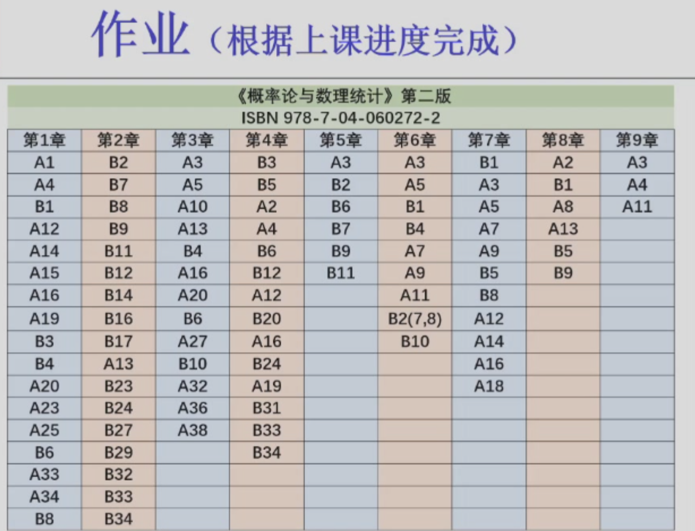

!!! note "课程信息"  
    wgz老师  
    平时 * 0.6 + 期末 * 0.4
    平时：作业和到课率30%，至少两次小测20%（20min，赋分），spoc4次测试8%，spoc至少4个讨论题2%

[savia大跌的笔记](https://savia7582.github.io/Exterior/Math/P%26S/0/){:target = "_blank"}

作业，交电子稿  

