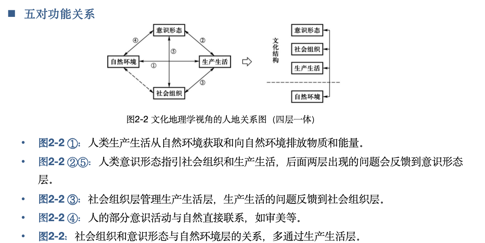

# 第二章 研究主题和核心理论
## 第一节 文化的概念和文化的结构
### 一、文化的概念
狭义：指文学、艺术、宗教、风俗、习惯，以及信仰、道德等  
广义：指人类的所有创造物  

### 二、文化的结构
三个层次
#### （一）生产和生活文化
概念：生产和生活文化地满足人类生存和生活需要所创造的物质产品及其蕴含的人类创造。不仅包含器物，还包括器物的生产、公艺和技术，以及体现的人们对生活和生产的认识和追求等。  

特性：物质性、基础性、时代性  

#### （二）制度文化
概念：制度文化反应个人与他人、个体与群体之间的关系。人们在参与社会活动的过程中，为了调节人与人之间的关系，逐渐形成规范有关行为的准则，被称为制度。  

特点：  
不断发展变化，不仅随着时间而变化，还因为地域差异而变化。  
制度文化往往是历史发展的产物，特别是当某种制度已对人们的观念产生深刻影响而发展出一套理论体系时，非但不能随生产和生活文化而变化，反而制约着生产和生活文化的发展。  

#### （三）精神文化
概念：又称意识形态文化，是人类在社会实践和意识活动中长期育化出来的价值观念、思维方式、道德情操、审美情趣、宗教感情、民族性格等  

分类：按照社会意识形态与人们现实的社会存在关系的远近分为两类。  
基础意识形态：包括政治思想、法律思想、道德伦理等，它们都与制度文化紧密联系。  
上层意识形态：指艺术、宗教和哲学。  

可以分为 书面文化(显型)、广义文本文化(显型)、心理文化(隐型)  

#### （四）三者关系
相互联系，有时很难明确分开  

## 第二节 人文地理学研究的主题
### 一、人类在地表的印记-文化景观
#### （一）文化景观的概念
景观：指相对固定在地球表层的事象。景观是人类认识世界、改造世界的结果，是人与自然的结合，因此可称为文化景观。甚至包括人类随意制造的产物，如垃圾。  

文化景观的主体性。  
文化景观具有空间差异和时间上的变化。 

#### （二）文化景观作为研究主题的原因
* 形象地反映了人类最基本的需求
* 反映了建造者对世界的态度
* 还包括有文化起源、文化传播和扩散、文化发展诸方面有价值的证据

#### （三）如何研究
既包括景观赖以存在的物质基础，也包括景观蕴含的制度与精神  

* 全面分析其演变过程
* 探讨景观的形态、构成、特征及其反映的文化特征

#### （四）相继占据
概念：利用文化景观遗迹来探索某地文化景观的历史发展过程。  

前期的文化景观会影响后续的文化景观的形态。  

### 二、文化的时空现象-文化扩散
概念：同代人间的传播使文化覆盖的区域扩大的过程  
#### （一）文化扩散的分类：扩展扩散和迁移扩散
**1.扩展扩散**  
**扩展扩散** ：指某种文化事象从一地分布到另一地，而传播该文化的 **人的居住地不发生变化** 的传播过程。    
特性：  
空间上具有连续性，新的分布区由旧的分布区扩大而形成；  
各种文化事象的扩散速度不同。  
类型:

* 传染扩散：又称接触扩散，指某种文化事象传播给愿意乃至渴望接受它的人的过程  
* 等级扩散：下层向上层/上层向下层
* 刺激扩散：某种文化事象扩散到新的地方，受某些原因影响作出改变。 **强调接受者从原文化中获得了“刺激”** ，从而唤起了改造文化的灵感。

**2.迁移扩散**  
**迁移扩散** ：指某种文化事象与拥有这种文化事象的 **人或集团迁移到新的地方** ，将他们的文化传播到该地的过程。  
特点：
迁移人口多，被迁移的内容也多。  
文化会因所在的环境差异发生一些变化。  
规律：  
有速度快慢的波动，也存在 **周期现象** 。  

### 三、人文事象的空间表征-文化区
#### （一）文化区的概念
文化区是一种空间表征，它是人们认识文化事象空间分布后，在地图上可以表达出来的一个区域范围。人文事象的空间分布在某一时点或短期时内在地表的存在相对稳定，相同或相似人文事象所连片分布的区域。  
#### （二）文化区的分类
形式区、功能区、乡土区。  
**1.形式区**  
概念：指某种文化事象相对集中的分布区，它具有 **核心的区域以及模糊的边界**   
结构：核心区（最为典型）、外围区（典型性减弱）、边缘区（文化相混现象，可能不存在）  

**2.功能区**    
概念：具有 **明显的自组织中心** ，是一种由政治经济或社会组织起来的人群基本连片分布的地区，如一个行政区。  

功能区与形式区的区别与联系：    
1.功能区由自组织中心，形式区没有  
2.有的情况下两者相互重叠，彼此有高度的一致性  

**3.乡土区**  
概念：也称感知文化区，是一个长期共处的群体在思想和感情上认同的一种区域。乡土区首先是文化区主体对它的认同，也可能是他者对它的刻板印象或思想  

乡土区与功能区、形式区的关系：   
1.乡土区和功能区相比，既无自组织中心，又无明确的边界线  
2.乡土区与形式区相比，缺乏文化景观上的一致性    

表现形式  

* 存在于人们思想感情方面的文化区，往往会在某种情境中表现出来，有的则扎根于当地的民宿中  
* 除 **感情** 方面，还一某种 **符号** 作为标志，比如语言符号、饮食符号、文化图腾  

### 四、文化特质之间的协调--文化整合
#### （一）文化整合的概念
指不同文化背景信仰和价值观的群体融合在一起，是他们能够和谐共处。  
目的是减少文化差异带来的冲突和不理解，促进不同文化之间的相互尊重和理解
#### （二）文化整合对区域的影响
当一个国家、一个民族、一个社会，七文化系统实现整合，有利于发挥文化上的正向功能作用，提高七内部的凝聚力，增强该文化系统的扩散力  
如果一个文化系统不实现整合，既意味着社会（或国家）的文化系统重有不协调的部分，也意味着社会急需发展或变革
#### （三）文化整合的特点
是人类历史上客观存在的一种 **普遍现象** 。  
文化整合的道路上充满了 **重重障碍** 。由于文化具有地域性、民族性、时代性，导致排他性、内部冲突。  
#### （四）文化整合的过程
* 冲突
* 调整、适应
* 整合

### 五、人类活动与环境关系的地理格局-文化生态学
文化生态学是一门研究 **文化与自然环境之间相互关系** 的学科。  
文化生态学可以提供如下四个思维视角去解释文化与自然环境的关系  

* 自然地理格局是理解人文空间格局的基础
    * 大规模人口定居的地区是由自然条件决定的
    * 陆卓明“自然非障区”：地形大致平坦、气候条件并不严苛，有充足的淡水资源，无长期存在的致命生物侵害  
* 自然地理格局仅为人类活动提供可能条件
    * 人类可以将自然要素转化为人类的资源，突破自然的某些限制
    * 一定历史时期内，自然地理条件优劣是有空间差异的
* 人类应对自然的方式具有多样性
    * 应对方式多样、有些决策也是偶然
* 自然地理已经被内划到文化景观之中

## 第三节 作为核心的人地关系理论
### 一、人地关系的主要理论
#### （一）环境决定论
公元前-地理环境影响着人的体格、气质和精神，亚里士多德  
18世纪初-环境论思想更为系统化理论化，孟德斯鸠  
19世纪-增加因果分析，引发传统的记录性、描述性地理学的变革，李特尔  
19世纪-正式把环境决定论系统应用到地理学并创立一种学派的是德国拉采尔  
20世纪初-拉采尔弟子森普尔进一步深化他的思想  
二战初期-德国法西斯学者豪斯霍弗运用到政治上
1930-过分强调环境的决定作用，遭到许多批判  
#### （二）或然论（可能论）
德国地理学家维达尔-白兰士是这一学派的重要代表  
弟子白吕纳进一步发展了他的思想
#### （三）适应论
* 借用生态学的观点来分析人地关系，得出了适应论的人地关系理论
* 承认自然环境对于人类活动具有直接影响，人类对自然环境有适应能力
* 认为人类对环境的适应是一种客观需要，而不是或然论者认为的“心理因素”  
* 适应论强调的适应是“被动的”，而或然论强调的适应是“主动的”
#### （四）环境感知论
* 借用心理学的研究成果来分析人地关系，核心是环境感知。  
* 概念：  
    * 狭义：指环境质量在个体头脑中形成的印象  
    * 广义：指个体周围的环境在个体头脑中形成的映象，以及这种映像不断修改的过程  
* 核心观点  
    * 人与自然的关系有各种可能性。人在进行选择时是有一定的客观规律可循的，它是受一种思想意识的支配
    * 通过研究人类的环境知觉和空间行为，可以透彻地了解和检验人地关系
* 意义 
    * 用人类的 **行为感知** 过程把人类与环境关联起来，克服传统人地关系研究中只把人类活动加以理性化、概括化，且只注重人类活动和环境后果的倾向。
    * 推动地理学对 **行为的人** 的思考，为人地之间的协调或调控提供了新的支撑体系。  
    * 采用 **行为视角和区域视角** 相结合的方法，产生一些新的洞见。  

#### （五）文化决定论
* 主要观点
    * 技术进步才是文化发展的主要因素，这种进步加强了**人类对自然环境的控制**
    * 环境的影响是一种逐步减小的力量，而 **文化的限制因素却在增长。**
* 极端-征服自然论
    * 曾起到促进作用，但不可持续

#### （六）协调论
* 背景：环境问题  
* 主要概念和观点
    * 协调，指客观事物诸方面的配合和协调，或指自然界多样性中的统一。
    * 协调论逐步摆脱了以往人地关系思想中把人合地简化为英国链的两端，不再纠结于谁决定谁，而认为人地关系是一个 **复杂的巨大系统** 。
* 系统的特征：各因素相互作用
* 协调论对人地关系的解释
    * 包括多元指标
    * 保持经济系统和生态系统的和谐发展
    * 合理利用资源，维持资源的永续利用
    * 整治生态环境，实现生态系统良性循环
* 著名的可持续发展思想就是在协调论指导下提出的

### 二、地理学的人地关系地域系统
#### （一）文化地理学视角的人地关系模式：“四层一体”

#### （二）人地关系理论隐含的区域类型

|理论|与区域研究的关系|隐含的区域类型|
|-------|------------|-----------|
|环境决定论|自然区决定了其上的人物活动特点|自然区|
|或然论|某自然区位人类活动提供了多种可能性|自然区|
|适应论|某地区的人类活动类型是不断顺应该区域自然条件的结果|自然区、人文区|
|环境感知论|不同主体个人或群体只能理解感知范围内的人地关系|感知区|
|文化决定论|人类社会的活动分布可以突破自然区的限制|自然区|
|协调论|局部地区的人地关系与全球的人地关系密切相关|自然区、人文区|
|文化景观|某区域的人类景观是在各历史时期层累出来的|自然区、人文区|

* 人地关系地域系统的区域划分
    * 人地关系地域系统的边界不是以一成不变的自然边界为边界的
    * 变化主要依赖人类活动的变化
    * 边界具有尺度转化关系
    * 是人为划定的，这种划定未必在任何状态下均“合理” 

#### （三）根隐喻和四个世界假说
隐喻是隐藏起来的比喻。  
根隐喻：从一个隐喻，可以引申出来一系列的隐喻。  

* 四个世界假说-四类认识或理解世界的方式
    * 形式主义假说：世界是由不同类型的事物组成的地图或马赛克
        * 形式主义的根隐喻：可以将人地关系低于系统描述为不同类型的区域，分类越多、系统越复杂。
    * 机械主义假说：世界是各个部分彼此相连的机械
        * 可以将人地关系地域系统描绘为彼此相关的空间部分。
    * 有机体主义假说：世界是具有生命的、内部矛盾且协调的有机体
        * 描绘为各类区域之间的辩证关系。各区域之间的关系是双向的，功能关系复杂，强调区域中的要素在辩证协同中角色的能动变化。
    * 情境主义假说：在不同的舞台上世界具有不同的意义
        * 绘制为历史演变的不同情况，不同历史时期有对应的人地关系特征和问题
