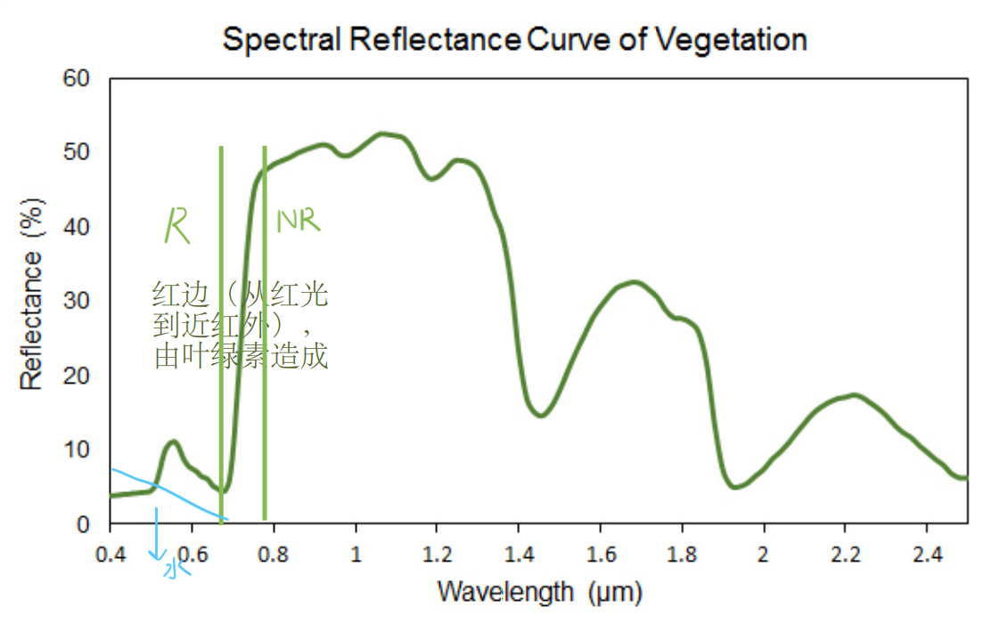

# 绪论

世界上不存在两幅一模一样的遥感影像  

ai与遥感：  

* 输入:拉长技术链条（对象），获得质量更好的输入数据
* 输出：幻觉、了解对象

对象的特征：从数学上理解，满足欧式空间

## 什么是遥感
**遥感定义** ：是从远处探测感知物体，也就是不直接接触物体，从远处通过探测仪器接收来自目标地物的电磁波信息，经过对信息的处理，判别出目标地物的属性。

## 遥感过程和遥感系统
* 能量源或光源
    * 太阳、地球本身、人类本身发射的能量（雷达等，主动遥感）
* 能量向外辐射并穿过大气
    * 云反射可见的太阳辐射，并向太空发射红外辐射以及能对降水程度进行间接测量
    * 微波可用于观测降水
* 能量与目标地物相互作用
    * 波长越长穿透能力越长（散射弱
* 传感器记录辐射能量
    * 辐射、反射
    * 植被的光谱曲线（反射光谱
        * 
        * 红边，叶绿素造成
        * 归一化植被指数 $NDVI = \frac{NR-R}{NR+R}$ 
* 信号接收和转换
* 信号解译和分析
* 应用

## 遥感的特点
* 大面积同步观测、多波段、多时相、多尺度
* 时效性
* 数据的综合性和可比性
* 经济性
* 局限性
### 大面积同步观测
###  多尺度
* 空间（地面）分辨率：遥感图像上能够详细区分的最小单元的尺寸或大小，即传感器能够把两个目标作为清晰的实体，记录下两个目标物之间最小的距离，是用来表征影像分辨地面目标细节能力的指标

!!! note "分辨率低用统计学方法为什么还可以，分辨率高用统计学方法为什么不行"
    分辨率高，图斑差异性大，异质性大  
    考虑正态分布、平均值的正态分布 

### 多波段
* 光谱分辨率：指传感器所选用的波段数量的多少（通道数）、各波段的波长位置（中心波长）、及波长间隔的大小（带宽）。
* 把细节刻画清楚

### 多时相
* 时间分辨率：指在同一区域进行的相邻两次遥感观测的最小时间间隔

## 遥感的类型
* 不同平台
    * 地面
    * 航空
    * 航天
* 不同电磁波段
    * 可见光
    * 红外
    * 微波
* 传感器的不同工作方式
    * 被动
    * 主动

## 遥感应用
* 地质灾害监测
* 突发事件
* 恐怖袭击
* 环境污染
* 褶皱断裂构造野外露头
* 海洋监测
* 遥感考古
* 雾霾检测
* 温度监测
* 干旱监测
* AUV海底图像拼接
* 虚拟现实航迹回溯
* 热浪喷口流速场反演
* 基于深度学习的土地覆盖制图
* 面向岩石薄片图像的矿物深度学习识别
* 水土流失遥感监测

## 遥感发展简史
* 1608-1838 无记录地面遥感阶段
* 1839-1857 有记录地面遥感阶段
* 1858-1956 空中摄影遥感阶段
* 1957- 航天遥感阶段
## 我国遥感发展历程

## 遥感未来发展趋势
* 遥感卫星
    * 更高空间分辨率（WorldView数据等）
    * 更高时间分辨率（PLANET时序卫星等）
    * 更高波谱分辨率（AVIRIS数据等）
    * 更高辐射分辨率（8BIT、16BIT 等）（紫外、热红外、微波等）
* 遥感应用
    * 全球地球综合观测系统
    * 高精度遥感模型与参数反演
    * 遥感产品真实性检验与不确定性
    * 遥感数据与地球系统模式同化
    * 遥感大数据与主动服务

## 遥感数据处理亟待解决的问题
* 海量遥感数据有效地压缩、存储、管理、传输和使用
* 多源遥感数据融合、遥感信息自动识别和应用
* 遥感应用处在定性向定量的过渡阶段，其精度远不能满足社会需求
* 遥感产品真实性检验与不确定性