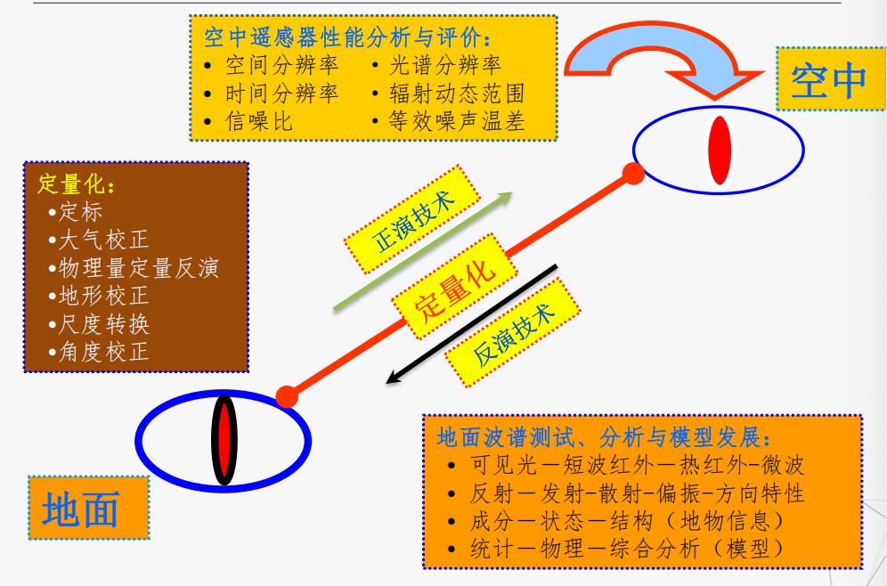
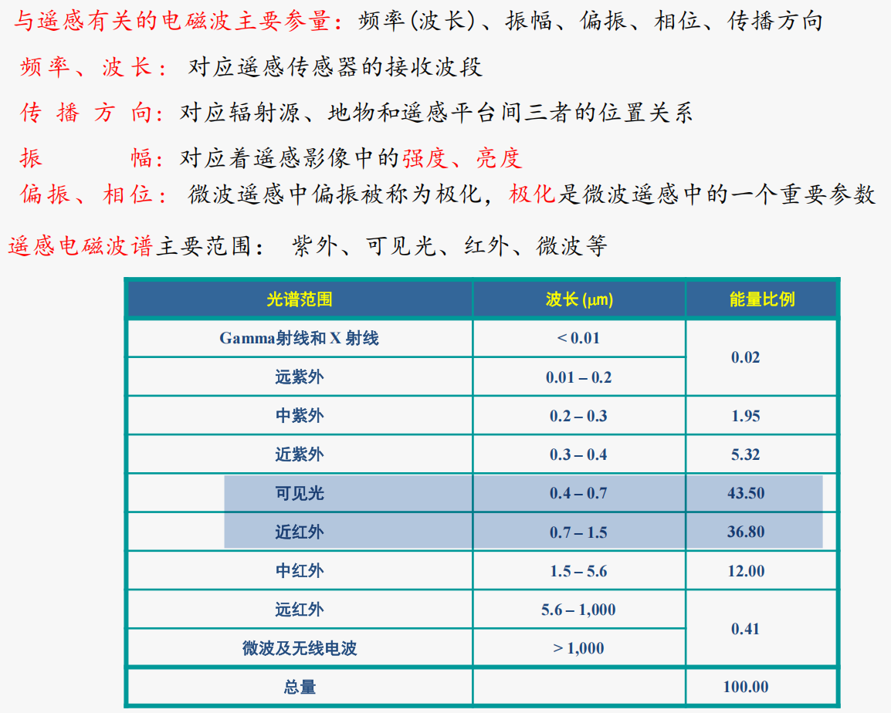
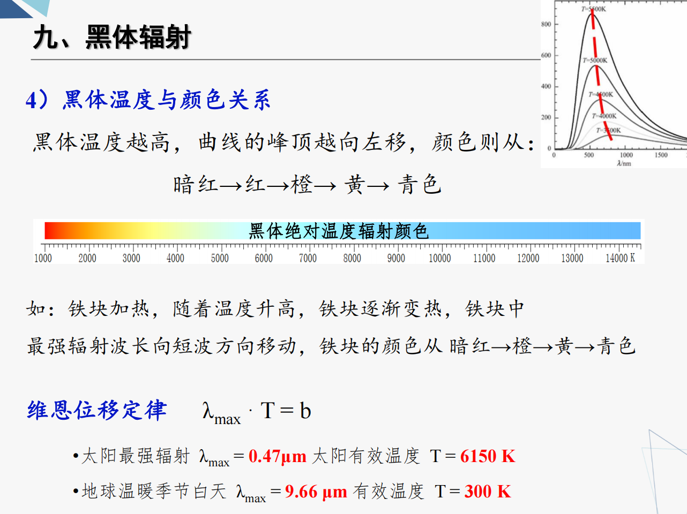
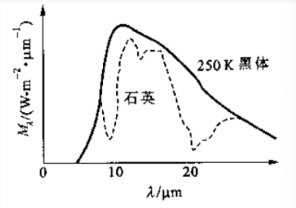
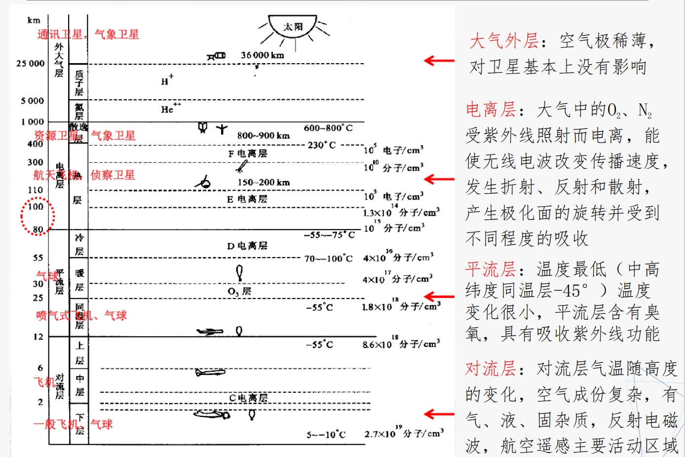
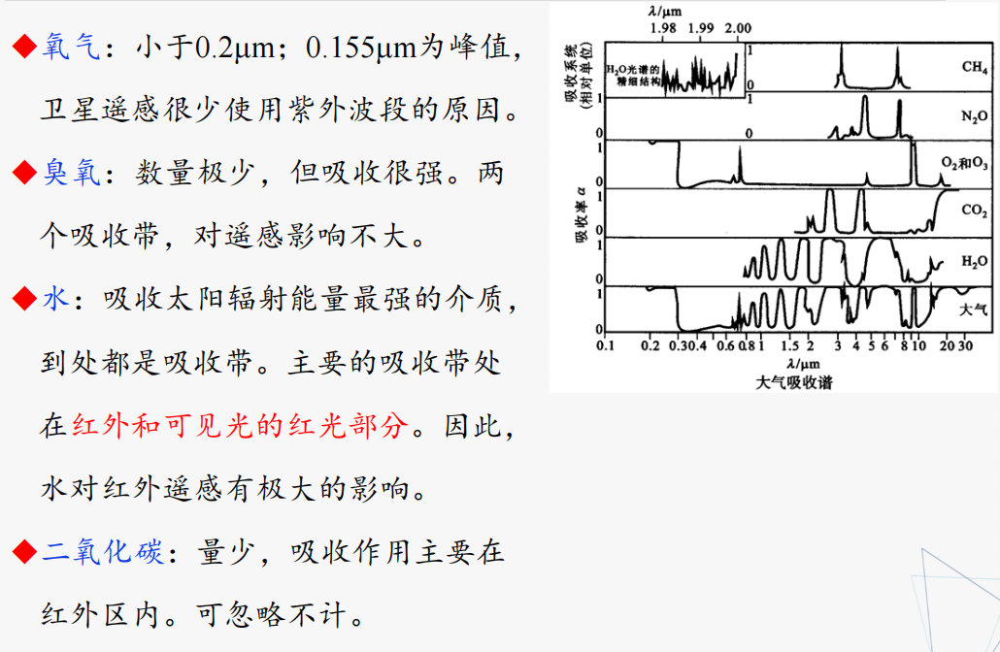
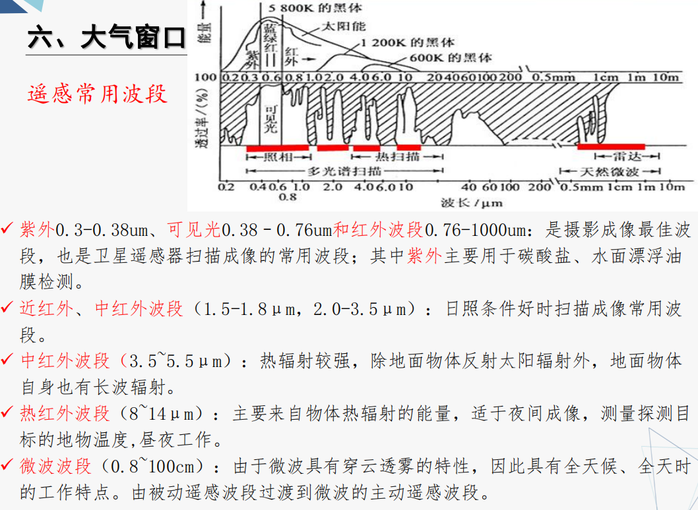
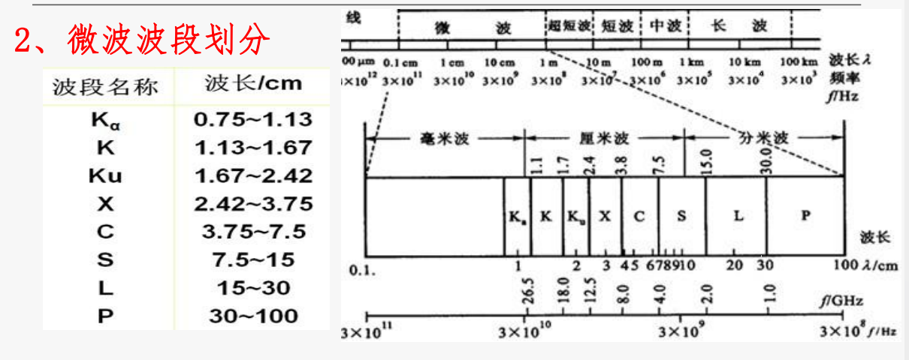
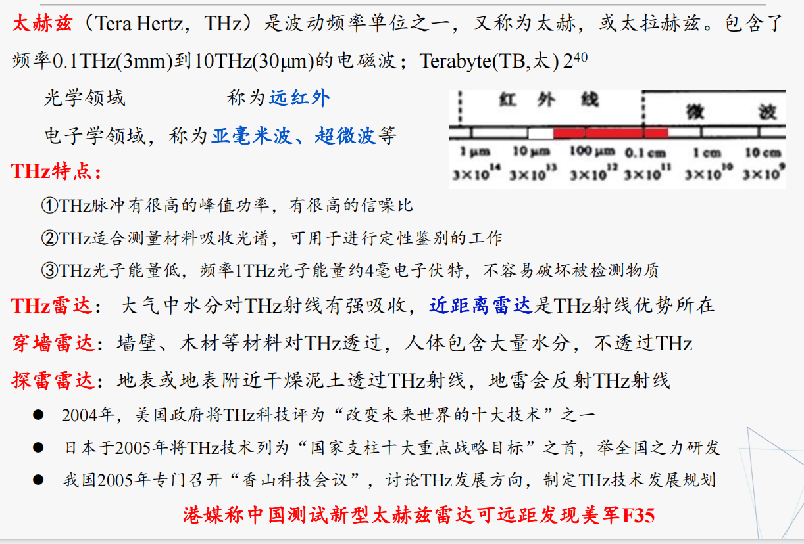

# 遥感物理基础-电磁辐射与地物光谱特征
## 遥感过程和遥感系统
完整的遥感过程

* 能量源或光源
* 能量向外辐射并穿过大气
* 能量与目标地物相互作用
* 传感器记录辐射能量
* 信号接受和转换
* 信号解译和分析
* 应用
## 遥感物理基础
## 遥感物理研究内容

* 不准
* 多尺度

## 建模、反演与波谱测量
* 建模与反演是遥感科学中的两个主题
    * 建模：指针对某种物理过程，建立与之对应的数学方程或方程组的问题
    * 反演（定性）：基于模型知识基础上，依据可测参数值去反推目标的实时状态参数，就是用已知值推未知值，就像解方程或解方程组的问题

无论建模还是反演都离不开地面测量  
## 电磁波谱
* 波谱与光谱的区别：
    * 从物理学角度来说，波谱的定义比光谱更广，光只是波的一种形式而已。
    * 在遥感上，因为遥感传感器中只用到电磁波，波谱与光谱概念经常混用。
  

可见光、近红外最强，主要能量来源是太阳

### 紫外线
* $0.01-0.38\mu m$（只有0.3-0.38能穿过大气）
* 主要用于探测碳酸岩盐的分布、油污染的监测
* 通常探测高度在2000米以下

### 可见光
* $0.38-0.76\mu m$
* 最常用

### 红外
* $0.76-1000\mu m$
* 近红外0.76-3，中红外3-6，远红外6-15，超远红外15-1000 $\mu m$
* 近红外与可见光相似，又称 **光红外** 。中红外、远红外和超远红外是 **产生热感** 的原因，所以称为 **热红外** 。
* 物体在常温范围内发射红外线的波长多在3—40 $\mu m$ 之间
* 超红外易被大气和水分子吸收

### 微波

* 1mm-1m
* 分为：毫米波、厘米波和分米波
* 微波辐射和红外辐射都具有 **热辐射** 性质。由于微波的波长比可见光、红外线要长，能穿透云、雾而不受天气影响，所以能进行 **全天时全天候的遥感探测** 。
* 微波遥感可以采用 **主动或被动** 方式成像，另外，微波对某些物质具有一定的 **穿透能力** ，能直接透过植被、冰雪、土壤等表层覆盖物。

* 电磁波波段的划分代号
    * P波段：米波，Previous
    * L波段：英国最早的搜索雷达，波长23cm，Long
    * S波段：10cm，Short
    * X波段：3cm电磁波火控雷达，X代表坐标上的某点
    * C波段：5cm电磁波雷达，Compromise折中（S和X中间）
    * K波段：1.5cm，Kurtz。K波长可以被水蒸气强烈吸收,不能在雨中和有雾的天气使用
        * Ka波段：频率略高于K
        * Ku波段：频率略低于K

### 米波
超短波（1m\~10m）  
短波（10m\~100m）  
中波（100m\~1km）  
长波（1km\~10km）  
超长波（10km\~100km）  

太赫兹波：0.03-3mm  
FAST4.3m-0.1m

## 电磁波极限分辨率问题
瑞利判据：当一个艾里斑的边缘与另一个艾里斑的中心正好重合时，此时对应的两个物点刚好能被人眼或光学仪器所分辨，这个判据称为瑞利判据  
艾里斑的角度与波长λ及小孔的直径d满足: $sin\theta = 1.22\lambda /d$  
在很多领域，实际应用时用λ/4作识别的理论极限分辨率  

## 电磁辐射的传播
近代物理中电磁波也称为电磁辐射  

电磁波传播到气体、液体、固体介质时，会发生反射、折射、吸收、透射、偏振等现象  
在辐射传播过程中，若碰到粒子还会发生散射现象，从而引起电磁波的强度、方向、波长等发生变化  
这种变化随波长而改变，因此电磁辐射是波长的函数。这种变化可以是单一的，也可以是复合的。  

* 反射、折射与偏振
* 吸收
    * 它使电磁波在介质中传播时其强度随距离的增加而逐渐衰减，在这个过程中，辐射能转化为其他形式的能量，通常是转变为 **热能**
    * 电磁辐射不论在导体或电介质中传播时，都存在吸收过程
    * 吸收的强弱程度与原子、分子及固体的结构有关
    * 电磁辐射在导体中传播时，部分电磁能转化为热能而耗损，电磁辐射强度随传播深度的增加，呈指数地衰减
    * 吸收系数还与电磁辐射的波长有关，即 **吸收具有选择性** 。
* 散射
    * 平面波在均匀介质中传播时，它的传播方向是不变的，如果局部中有不均匀时，辐射就偏离了原来的方向
    * 电磁辐射在不均匀介质中传播时，出现偏离原传播方向的现象，称为 **散射**

## 电磁辐射的度量
* 辐射源  
    * 太阳辐射：可见光遥感和近红外遥感的重要辐射源
    * 地球辐射：热红外遥感的辐射源
    * 人工辐射源：主动遥感（雷达）的辐射源

电磁辐射量度：

* 辐射能量Q（单位焦耳J）  
* 辐射通量φ
    * 单位时间内通过某一面积的辐射能量（辐射功率），即φ＝dQ／dt
    * 单位瓦特W=焦耳J/秒s
    * 辐射通量是波长的函数，总辐射通量应该是各波段辐射通量之和或辐射通量的积分值 
* 辐射通量密度(irradiance，E)
    * 单位时间内通过单位面积的辐射能量
    * E＝dφ／ds，S为面积，单位： $W/m^2$
* 辐射出射度(M)
    * 辐射源物体表面单位面积上的辐射通量
    * M＝dφ／ds，单位：$w／m^2$
* 辐照度(I)
    * 被辐射的物体表面单位面积上的辐射通量
    * I＝dφ／ds，单位：$w／m^2$
* 辐射亮度（L)
    * $L = \frac{\phi}{\Omega (Acos\theta)}$
    * 点辐射源：在某一方向上单位立体角内的辐射通量
        * 单位：瓦/球面度(W/Sr)
    * 面辐射源：单位投影表面、单位立体角内(Ω)的辐射通量
        * 单位：瓦 / 米²•球面度（W/m² • Sr）
        * $ L = \frac{\Phi}{\Omega (Acos\theta )}

## 黑体辐射
看大雾我不想写)))

### 绝对黑体
一个物体对于任何波长的电磁辐射全部吸收  
吸收系数 α(λ, T)=1  
反射系数 ρ(λ, T)=0

自然界没有真正的黑体，黑色的煤烟、恒星和太阳杯看做近似黑体  
### 普朗克定律
$M_{\lambda}(\lambda ,T) = \frac{2 \pi h c^2}{\lambda ^5} \cdot \frac{1}{e^{\frac{hc}{\lambda k T}}-1}$

* 黑体辐射特性由温度唯一决定  
* 随着温度升高，辐射最大值所对应的波长向短波方向移动  
* 温度越高，辐射通量密度越大
### 斯特藩-玻尔兹曼定律、维恩位移定律
* 斯特藩-玻尔兹曼定律 $M = \sigma T^4$ （M总辐射出射度，$\sigma$ -斯特藩玻尔兹曼常数。T-温度）
    * 绝对黑体总辐射出射度与黑体温度的四次成正比。
* 维恩位移定律 $\lambda_{max} T = b$  (b = 2898 m.K)
    * 黑体辐射光谱中最强辐射波长与黑体绝对温度成反比

**太阳：有效温度约6000k，辐射最强波长约 $0.50\mu m$**
**地球：有效温度约300K  ，辐射最强波长（白天） $10\mu m$**

### 黑体温度与颜色关系

## 实际物体辐射
一般地物辐射不适用黑体的辐射定律。吸收系数<1，反射系数>1   

### 基尔霍夫定律
热力学平衡的条件下，不同物体对相同波长的单色辐射出射度与单色吸率之比值都相等，并等于该温度下黑体对同一波长的单色辐射出射度  
$\frac{M_1}{\alpha_1} = \frac{M_2}{\alpha_2} = ... = M_0 = I(\lambda,T)$   
M0 同一温度同一波长绝对黑体辐射出射度  

### 地物发射率  
ε=M/M黑
地物发射率意义：ε的差异是遥感探测的基础和出发点  

地物发射率影响因素：地物种类、表面状况、温度、辐射波长  

eg.石英：设置三个波段（10、20、最大）

比辐射率=吸收率，比辐射率大意味着吸收能力强

* 由基尔霍夫定律可以知道,绝对黑体不仅具有最大的吸收率,也具有最大的发射率,却丝毫不存在反射。
* 对于实际物体,都可以看作辐射源,如果物体的吸收本领大,即“越接近1,它的发射本领也大,即越接近黑体辐射

灰体: **没有** 显著的选择性吸收、吸收率虽然小于1、但基本不随波长变化。一般的金属材料都可以近似看成灰体  
## 太阳辐射
太阳辐射：是最主要的辐射源，尤其是被动遥感。地球表面不同区域接收到的太阳辐射大小是不相等的  

* 太阳常数： 是在不受大气影响，在距太阳一个天文单位（日地平均距离）处，垂直于太阳辐射方向，单位面积单位时间黑体所接收的太阳辐射能量
  * $(1353 \pm 21) W/m^2$
* 太阳总辐射通量：太阳常数×以日地距离为半径的球面积
    * $3.826\times 10^{26}W$
* 太阳光谱： 太阳发出的辐射

## 太阳辐射特点
太阳：有效温度约6000k（5800K），辐射最强波长约 $0.50\mu m$（0.47）  

**紫外-红外波段能量集中、稳定**  
辐射能量主要集中在 0.3-3μm 段  
平面的太阳辐照度分布曲线与大气层外太阳辐照度分布曲线有很大不同，主要是由于地球大气层对太阳辐射的吸收和散射造成  
辐射能量集中在可见光波段（0.38-0.76μm）占43.5%，峰值在0.47μm处  
被动遥感利用波段主要在辐射相对稳定的 **紫外-红外** 波段,使太阳活动对遥感的影响减至最小  
## 可见光谱的发现
牛顿  
可见光谱：390nm-780nm 电磁波  
人眼看到范围：312nm-1050nm 甚至更广  
## 吸收光谱的发现
沃拉斯顿  

## 夫琅禾费吸收线
太阳内部发出的连续光，在穿过较冷的太阳大气时，被其中的原子选择性吸收了特定波长的光。  
## 大气成分及结构

## 大气对电磁辐射的影响
云层及大气成分反射30%  
大气吸收17%  
大气散射22%  
到达地面31%  

* 大气对遥感的影响
    * 影响形式
        * 大气使得太阳(地物)辐射的电磁波信号在到达地面或传感器之前受到 **衰减**
        * 由于大气的散射和本身的发射，将一部分并非地物反射的信号送入传感器
    * 影响结果
        * 图像模糊，信噪比降低
    * 影响因素
        * 大气散射、大气吸收、大气反射
* 大气对电磁辐射的影响
    * 散射、反射、吸收、扰动、折射、偏振、其他

## 大气散射
* 大气散射:辐射在传播过程中遇到小微粒而使传播方向改变，并向各个方向散开
* 散射对遥感数据的影响(质量下降)
    * 对反射辐射成分的改变
    * 改变传感器所接受的电磁波信息
* 大气散射集中于太阳辐射能量较强的 **可见光区**
* 大气散射是重要而且普遍发生的现象
* 大部分进入我们眼睛的光都是散射光
* 如果没有大气散射，则除太阳直接照射的地方外，都将是一片黑暗
* 散射方式与电磁波长λ，大气分子直径dp，气溶胶微粒大小dp有关

### dp << λ，瑞利散射
* $N_2、CO_2、O_3、O_2$，散射率与波长的四次方成反比$（K ∝ 𝜆^{−4})$
* 瑞利散射对 **可见光** 的影响较大，对红外辐射的影响很小，对微波的影响可以不计
* 这是多波段遥感中不使用蓝紫光的主要原因
  
!!! question "天空呈现蓝色的原因"
    瑞利散射强度与波长四次方成反比，太阳光谱中波长较短的蓝紫光比波长较长的红光散射更明显。  
    太阳光谱短波中以蓝光能量最大，在雨过天晴或秋高气爽时（空中较粗微粒比较少，以分子散射为主），在大气分子的强烈散射作用下，蓝色光被散射至弥漫天空，天空即呈现蔚蓝色。

!!! question "朝霞和夕阳偏橘红色的原因"
    早晚时太阳与观测者大气层厚度较厚，蓝光散射殆尽，只剩下红光和极少的绿光

!!! question "交通信息选绿黄红的原因"
    人眼对绿光、黄光最敏感，对紫光、蓝光、青光最不敏感；  
    波长较短光易被散射掉，波长较长红光不易被散射，穿透能力也比波长短的蓝、绿光强，因此用红光作指示灯，可以让司机在大雾迷漫的天气里容易看清指示灯，防止交通事故的发生
###  dp = λ，米氏散射
* 大气中的微粒，如烟、尘埃、气溶胶、小水滴等引起
* 米氏散射的散射强度与波长二次方成反比 $（K ∝ 𝜆^{−2}）$  ，并且散射在光线向前方向比向后方向更强,方向性比较明显
* 云、雾中的气溶胶、小水滴等粒子大小与 **红外线** 的波长接近，所以云雾对红外线的米氏散射不可忽视，潮湿天气米氏散射更显著

### dp >> λ，非选择散射
* 当微粒（水滴、雾、尘埃、烟等大粒子气溶胶）的直径与辐射波长大得多时
* 散射强度与波长无关

!!! question "云雾呈现白色的原因"
    云、雾粒子直径虽然与红外线波长接近，但相比可见光波段，云雾的水滴粒子直径就比波长大的多了，因而对可见光中各个波长的光散射强度相同，是故我们所看到的云雾是白色的，而且从任何角度看都是白色

!!! question "微波具有穿云透雾能力而可见光不能是因为" 
    * 对于大气分子、原子引起的瑞利散射(dp << λ)主要发生在可见光和近红外波段   
    * 对于大气微粒引起的米氏散射(dp = λ)从近紫外到红外波段都有影响，当波长进入红外波段后，米氏散射的影响超过瑞利散射   
    * 大气云层中，小雨滴的直径相对其他微粒最大  
        * 对可见光只有无选择性散射发生，云层越厚，散射越强 
        * 对微波来说，微波波长比粒子的直径大得多，属于瑞利散射的类型，散射强度与波长四次方成反比，波长越长散射强度越小，所以微波才可能有最小散射，最大透射，而被称为具有穿云透雾的能力  

## 大气反射

!!! question "气体、尘埃反射作用很小的原因"
    反射现象主要发生在云层顶部，取决于云量和雾量，而且各个波段均受到不同程度的影响，严重地削弱了电磁波强度  

## 大气吸收
辐射能->内能  

## 大气窗口
由于大气层的反射、散射和吸收作用，使得太阳辐射的各波段受到衰减的作用程度不同，因而各波段的透射率也各不相同  
**通常把受到大气衰减作用较轻、透射率较高的波段称为大气窗口**   

航空遥感大气影响可以忽略不计（一两千米），波段吸收影响主要针对航天遥感。  

## 地物（地球）辐射和地物波谱
### 能量与地物相互作用
从辐射源（如太阳）入射到物体上的辐射可分成吸收、透射和反射三个分量  

根据能量守恒定律，$\alpha + \tau + \rho = 1 $  （吸收率+透射率+反射率）  

### 地物波谱
地物辐射和反射的电磁波能量在电磁波谱范围内随波长分布。
### 地物辐射
* 地球上温度高于0K的物体都能自发地发射电磁波，这一物理现象称为 **热辐射** ，它是组成物体的大量粒子无规则热运动的结果。
* 地物热辐射强度按波长的分布称为地物辐射波谱。
### 地球辐射
指地球自身的热辐射，是热红外遥感的主要辐射源  

* 地球辐射是接近300K的黑体辐射，最大值波长为9.66μm，属于远红外波段
* 地球辐射的能量分布在近红外到微波的范围内，主要集中在6~30μm
* 球辐射与地球表面的热状态密切相关，也称 **热红外遥感**
* 广泛应用地表地热异常探测、城市热岛效应和水体热污染研究等
### 研究地物波谱的意义
* 遥感器的波段选择、定标、校验和评价
* 建立地物波谱与遥感数据的关系
* 相关信息和波谱数据关系的研究，扩大应用范围
* 建立地物波谱应用模式
* 不同波谱段的地物波谱特性的综合研究
## 地表自身热辐射
为衡量不同地物发射电磁波能力大小，常用波谱发射率来表示地物的发射能力  

所有波长的发射率连接起来形成一条以波长为横坐标，发射率为纵坐标的曲线，称 **地物发射波谱曲线**  
影响地物发射率的因素有：  
波长、地物的性质（材料、种类）、表面状况、温度等
### 红外辐射特性
传感器接收的辐射信息由两部分组成：地物反射的太阳辐射与自身向外发出的辐射  

* 可见光-近红外
    * 范围0.76-2.5μm，能量主要来自 **太阳辐射** ，地物辐射很小，两者之比月1000：1，此波段的图像反映的是地物的反射能量，属于可见光-近红外遥感
* 中红外
    * 范围3-5μm，对火灾、活动火山等 **高温目标识别敏感**
* 热红外
    * 范围8-14μm，此波段地物反射的能量很小，可以忽略不急，影像记录的主要是地物热辐射，属于热红外遥感
* 远红外
    * 范围15-30μm，此波段大气透过率低，不能进行卫星遥感
## 地物反射
通常物体的表面分为光滑面与粗糙面两大类，但是，说一个表面的光滑与粗糙并非是绝对的，它是相对于入射电磁辐射的波长而定的

设波长为 λ 的电磁辐射投射到一个凹凸不平的表面，表面起伏的平均高差为h，投射的掠角为 γ (即入射角的余角)，

表面为光滑面的判别准则为: $ h < \frac{\lambda}{8 sin\gamma} $

中等粗糙度平滑准则: $ h < \frac{\lambda}{25 sin\gamma} $

### 反射面类型
* 镜面反射(mirror reflection)：满足于瑞利准则的表面，定义为光滑面，也称为镜面。镜面反射的特点，是反射能量集中分布在反射角 θr 等于入射角 θi 的方向上
* 漫反射(diffuse reflection)： 它不满足瑞利准则的表面，定义为 **粗糙面** ，它也是漫反射面。漫反射面的辐射亮度是一个常数，即是在入射辐照度不变的情况下， **漫反射面的反射亮度与观测的角度无关。**
* 方向反射(directional reflection)：介于漫反射和镜面反射之间，各向都有反射，
但 **各向反射强度不均一**

### 反射特征
* 反射率：地物的反射能量与入射总能量之比，用百分数表示。  
    * 影响因素：入射光的波长、入射角的大小、地物表面粗糙度和颜色。
    * 意义：反射率大的地物 -> 传感器记录的亮度值大 -> 图像上色调浅 -> 遥感图像判读的重要标志。
* 地物波谱特性：地面各种物体所具有的辐射、吸收、反射和透射能力随波长而变化的电磁波特性
* 在紫外、可见光、近红外波段，主要 **反射太阳的辐射** ，遥感信息所反映的主要是地物的反射率。
* 反射光谱曲线：地物反射率随波长是变化的，以波长为横坐标，反射率为纵坐标，将地物反射率波长的变化绘制成曲线，叫**地物的反射光谱曲线** 【地物波谱曲线】

### 植物反射波谱特征
蓝、红光波段为吸收带  
绿光波段为弱反射带   
近红外波段为强反射带，但在1.45μm、1.95μm和2.7μm三个波段存在水的吸收带  

### 水体反射波谱特征
水体的反射主要在蓝绿光波段  
其他波段吸收率很强，特别在近红外、中红外波段有很强的吸收带,反射率几乎为零  
泥沙的存在对水的反射率影响较大  

* 水体表面反射
* 水体底部物体反射
* 水中悬浮物反射
  
### 土壤（裸地）反射波谱特征
* 随着波长增加而增大，呈比较平滑的特征
* 没有明显的反射峰和吸收谷值

## 光谱测量方法及作用
可见光和近红外波段是研究地表的主要波段  

* 测量方法
    * 样品的实验室测量：规律性、条件单一，进行成分关系研究、但不便于模拟自然环境
    * 野外测量
* 作用
    * 传感器波段的选择、验证、评价
    * 建立地面、航空和航天遥感数据的定量关系
    * 进行地物光谱数据与地物特征的相关分析、建模

## 波谱特征分析注意事项
* 地物波谱值具有一定的变化范围，波谱曲线不是一条曲线，而是具有一定宽度的曲线带。
* 地物存在“同物异谱”和“同谱异物”现象
    * **“同物异谱”** ：指在某一个谱段区间，由于时空环境变化，相同类型地物呈现不同的光谱特征。如，地形起伏山地的同种植物类别的反射率受太阳高度、坡度、坡向等影响而发生曲线不完全相同。
    * **“同谱异物”** ：指在某一个谱段区间，不同类型的地物呈现出相同的光谱特征的现象

## 影响地物光谱反射率特征的主要因素
* 太阳位置（太阳高度角、方位角）
    * 太阳高度角和方位角不同，地面物体入射照度也就发生变化
    * 地球资源卫星一般采用 **太阳同步轨道** ，确保卫星以相同的方向经过同一纬度的当地时间是相同的
* 传感器位置（传感器的观测角、方位角）
    * 一般卫星遥感传感器大部分设计成垂直指向地面
* 地理位置
    * 不同的地理位置（经纬度变化），太阳高度角和方位角、地理景观等都会引起反射率变化
    * 海拔高度不同，大气透明度改变也会造成反射率变化
* 地形
    * 地形坡度、山的阳坡和阴面会造成反射率变化
* 季节、时间、生长周期变化
    * eg：新雪和陈雪，不同月份的树叶
* 地物本身的差异、气候变化、地面温度和湿度变化
    * 地物本身的变异，如植物的病害将使反射率发生较大变化，土壤的含水量也直接影响着土壤的反射率，含水置越高红外波段的吸收越严重。反之，水中的含沙量增加将使水的反射率提高
* 测量过程、仪器稳定性等综合误差

## 微波遥感
### 概念
* 微波遥感：利用微波的散射和辐射信息来分析、识别地物或提取专题信息的技术
    * 人为向被探测物体发射的具有一定波长波束
    * 微波辐射源在微波遥感中常用的波段为0.8~30cm
* 雷达探测：雷达可分为微波雷达和激光雷达
    * 激光雷达： **红外和可见光波段** ，精确测量目标位置（距离和角度）、运动状态（速度、振动和姿态）和形状，探测、识别、分辨和跟踪目标。
    * 微波雷达：微波波段,在微波遥感中侧视雷达是常用的微波遥感方式。成像的侧视雷达有真实孔径雷达(RAR)和合成孔径雷达(SAR)两种，由于RAR分辨率较低，已不再作为成像雷达使用

### 微波波段划分

前面学过  

* P波段：米波，Previous
* L波段：英国最早的搜索雷达，波长23cm，Long
* S波段：10cm，Short
* X波段：3cm电磁波火控雷达，X代表坐标上的某点
* C波段：5cm电磁波雷达，Compromise折中（S和X中间）
* K波段：1.5cm，Kurtz。K波长可以被水蒸气强烈吸收,不能在雨中和有雾的天气使用
    * Ka波段：频率略高于K
    * Ku波段：频率略低于K

### 微波遥感的优点
* 微波能穿透云雾、雨、雪，具全天候全天时工作能力
* 微波对地物具有一定的穿透能力，微波越长，穿透力越强。穿透力还与地物类型、密度、含水量、入射角等有关
    * 干沙：几十米
    * 冰层：100m
    * 潮湿土壤：几厘米-几米
* 微波能提供不同于可见光、红外遥感的信息
    * 微波高度计、合成孔径雷达等具有测量距离的能力
    * 微波探测海面风力场
    * 根据冰的界电常数不同，探测海冰的结构和分类
    * 根据含盐度对水的界电常数的影响，探测海水的含盐度
* 微波同时记录振幅和相位信息，可获取高程信息
    * 利用干涉测量技术，可以监测地形变化，达cm级，应用领域如地震形变、火山研究等

### 微波遥感的缺陷
* 空间分辨率低，地物判读困难
* 图像噪声消除困难
* 微波数据处理困难
* 微波数据源较少（现已大幅增加

### 早期星载合成孔径雷达
### 新一代星载合成孔径雷达
### 太赫兹遥感

----

为什么微波可以全天候观测   

* **从“散射”的角度看（最小散射）：**
    * 大气云层中的小雨滴或云雾粒子直径较大，对可见光会产生强烈的“非选择性散射”或“米氏散射”。但微波的波长（1mm—1m）比这些粒子的直径大得多，因此发生的是**瑞利散射**。根据瑞利散射定律，散射强度与波长的四次方成反比（$K \propto \lambda^{-4}$），微波极长的波长使其散射强度变得非常小，几乎可以忽略不计。
* **从“吸收”的角度看（避开强吸收带）：**
    * 大气中的水（包括水汽和云雾水滴）是吸收辐射能量最强的介质，其主要的强烈吸收带集中在红外和可见光的红光部分，因此水汽和云雾对红外遥感等有极大的削弱影响。而微波的波段成功避开了水的强吸收带，在穿过富含水分的云雨层时，能量被转化为热能损耗的比例极低，从而保持了极高的大气透过率。
* **从“反射”的角度看（穿透云顶反射）：**
    * 大气对电磁波的反射现象主要发生在云层顶部，这严重削弱了可见光等短波辐射的强度，导致光学遥感器只能拍到白茫茫的云顶而看不到地表。然而，由于微波波长极长，云层顶部的微小水滴集合体无法对其形成有效的反射面，微波能够直接透射过去而不被云层反射回太空。

**总结来说：**  
微波在穿过云雾雨雪时，**既不被云顶反射，也不被水滴强烈吸收，同时还能将大气散射降到最低**。这三个物理特性的共同作用，造就了微波具有“最小散射和最大透射”的能力，从而真正实现了全天候的穿云透雾观测。
