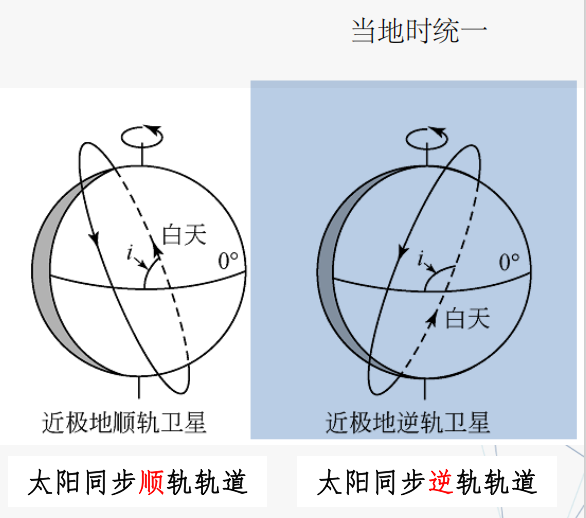
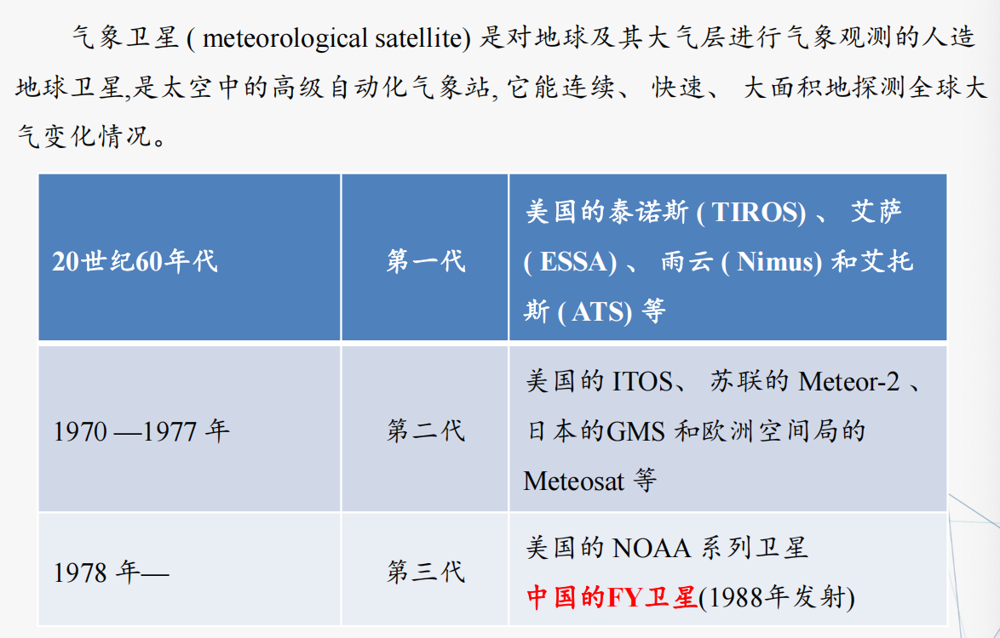
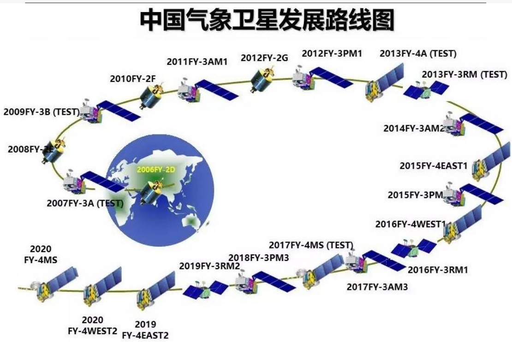
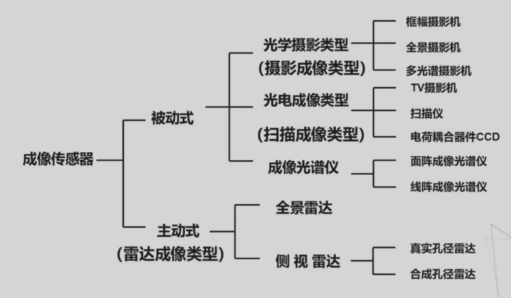
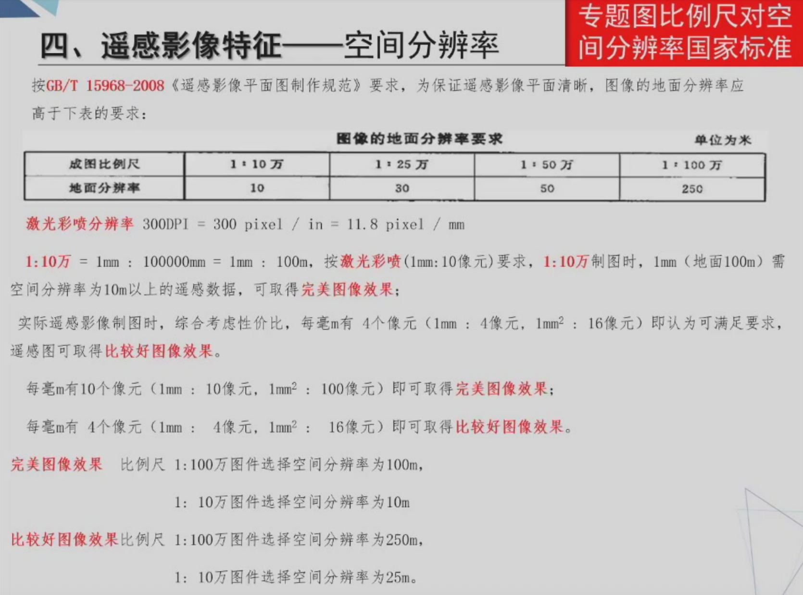

# 遥感成像系统

## 遥感平台及类型
航天平台：100km以上  
航空平台：1-100km  
地面平台：0-1000m  

## 卫星工作原理
* 开普勒第一定律
    * 星体绕地球（或者太阳）运动的轨道是一个椭圆，地球（太阳）位于椭圆的一个焦点上。轨道离地最近的点称近地点，反之为远地点
* 开普勒第二定律
    * 单位时间扫过的面积相等
* 开普勒第三定律
    * $ T^2 = \frac{GM}{4\pi ^2 r^2}$

地球同步卫星，T=24h，H=36000km（距地面
## 卫星轨道及特点
* 地球同步轨道
    * 运行周期与地球自转周期相同的顺行轨道(23:56:4)
    * 每天相同时刻经过地球上相同地点的上空，星下点轨迹是一条8字形的封闭曲线
    * **地球静止轨道** ：地球同步轨道中倾角为零、在地球赤道上空35786km的特殊轨道，从地面上看，这条轨道上运行的卫星是静止不动的。【地球同步轨道有无数条，地球静止轨道只有一条。】
    * 通信卫星、广播卫星、气象卫星
* 太阳同步轨道
    * 太阳同步轨道是轨道平面绕**地球自转轴**旋转的，方向与地球公转方向**相同** ，旋转角速度等于地球公转的平均角速度(360度/年)的轨道，它距地球的高度不超过6000KM。
    * 当卫星每次飞越某地上空时，太阳都是**从同一角度**照射该地，亦即，卫星每次都在**同一当地时间**经过同一纬度。
    * 
* 极地轨道
    * 倾角90°的卫星轨道，每一圈内都可以经过任何纬度和南北两极的上空，因轨道平面通过地球南北两极而得名
    * 气象卫星、地球资源卫星、侦察卫星常采用此轨道。
* 地球资源卫星轨道特点
    * 高度：400-920 km 的中等高度
    * 轨道：与太阳同步的近极地圆形轨道
* 遥感卫星轨道参数
    * 开普勒的6个参数：椭圆长半轴、椭圆偏心率、轨道倾角、升交点赤经、近地点幅角、卫星过近地点时刻
    * 卫星高度：卫星距离地面的高程(开普勒第三定律)
    * 运行周期：卫星绕地球一圈所需的时间。
    * 重复周期：卫星从某地上空开始运行，经过若干时间的运行后，回到该地上空时所需的天数。
    * 降交点时刻：卫星经过降交点时的地方时的平均值。降交点是指一颗极轨卫星在其由北向南运行时与赤道平面的交点，以经度、日期和UTC（协调世界时间）时间给出
    * 扫描宽度：传感器所观测的地面带的横向宽度
* 赤道坐标系
    * 天球坐标系是以 **天极和春分** 点作为天球定向基准的坐标系，分两种：第一赤道坐标系（时角坐标系）和 **第二赤道坐标系（赤道坐标系）** ，天文学更常用第二赤道坐标系
    * **赤道坐标系** 是取赤道面为基准面，以地球自转轴、以及从地心指向春分点的直线为坐标轴所构成的坐标系
* 地心坐标系
    * 以地球质心为原点建立的空间直角坐标系，以B，L，H为其坐标元素
    * **黄道** ：地球一年绕太阳转一周，我们从地球上看成太阳一年在天空中移动一圈，太阳这样移动的路线叫作黄道
    * **春分点** ：太阳沿黄道从天赤道以南向北通过天赤道的那一点。
* 时间
    * 本初子午线：英国伦敦格林威治天文台（旧址）埃里中星仪所在子午线
    * 世界时间
        * 格林威治时间：国际天文学联合会（IAU）于1928年决定，将由格林威治平子夜起算的太平阳时称为世界时，这就是通常所说的格林威治时间
        * 协调时间时间（UTC）
    * 地方时：地方时是指按本地经度测定的时刻统称地方时
    * 儒略日(Julian Day)：在儒略周期内以连续的日数计算时间的计时法，主要是天文学家在使用，周期威7890年
        * 28年为一太阳周期(solar cycle)，经过一太阳周期，星期的日序与月的日序会重复
        * 19年为一太阴周期(Metonic cycle)，经过一太阴周期则阴历月年的日序重复
        * 15年为一小纪(indiction cycle)，罗马皇帝君士坦丁一世所颁，每15年评定财产价值以供课税，成为古罗马用的一个纪元单位
    * 儒略日起点：公元前4713年11月24日12时
    * 简化儒略日(MJD)：公元1858年11月17日 0时，IAU1973年采用，MJD=JD-2400000.5

## 气象卫星
### 气象卫星系统
5个静止卫星系列和2个极轨卫星系列  

三个发展阶段  

  

气象卫星特点：  

* 轨道：
    * 低轨（极轨，近极地与太阳同步,800-1600km，固定时间通过固定地方）
    * 高轨（静止，与地球同步，35800km，固定于高空某一点）
* 短周期重复观测：
    * 静止气象卫星具有较高的重复周期（0.5小时1次）
    * 极轨卫星（如NOAA等）中等重复覆盖周期，约 0.5～1天／次
* 成像面积大
    * 气象卫星扫描宽度约2800km，只需2～3条轨道就可以覆盖我国。
* 资料来源连续，实时性强，成本低

气象卫星应用领域：天气分析和气象预报，气候研究和气候变迁研究，资源环境其他领域如海洋、环境监测  

* FY-1、FY-3系列
    * **FY-1是我国发射的第一颗环境遥感卫星** ，其主要任务是获取全球的昼夜云图资料及进行空间海洋体系水色遥感实验。
    * 风云三号气象卫星 ( FY-3 ) 是在 FY- 1 基础上发展起来的我国 **第二代极地轨道气象卫星**
* FY-2系
    * Y-2 是我国自行研制的 **第一代静止业务气象卫星** , 与极地轨道气象卫星相辅相成，构成了我国气象卫星应用体系
    * 
* NOAA系列

## 陆地资源卫星
和研究地球资源的卫星，可分为陆地资源卫星和海洋资源卫星，一般都采用 **太阳同步轨道**

主要的陆地资源卫星

### Landsat系列陆地资源卫星
数据特点：  

* 波段信息丰富，可挑选三个波段进行RGB组合成像
* 存档数据海量，特别是早期资料
* 价格低廉免费

### SPOT系列卫星

### 美国空间成像公司 IKONOS卫星
第一颗提供高分辨率卫星影像的商业遥感卫星，1999年9月24日由美国航空航天局发射  

### 美国空间成像公司 QuickBird卫星、WorldView-1卫星、美国商业卫星高分系列

### 以色列EROS卫星
### 印度Cartosat卫星
### 俄罗斯卫星
钻石卫星（ALMAZ）、俄罗斯Resurs DK-1  

### 韩国Kompsat卫星
### 日本卫星
### 台湾地区福尔摩沙卫星
### 中国系列
高分卫星  
中巴资源卫星  
中国系列资源3号  

## 海洋资源卫星
利用微波遥感器从空间观测海洋及其有关海洋动力学现象的有效性
### Seasat卫星
海洋遥感特点：  
1）大面积同步覆盖观测  
2）以微波为主，全天候观测海水温度、盐度、粗糙度等  
### EOS（Earth Observation System）卫星
EOS（Earth Observation System）卫星是美国地球观测系统计划中一系列卫星简称  

EOS卫星作用：从极轨空间平台上  
1）对太阳辐射、大气、海洋和陆地进行综合观测，获取有关海洋、陆地、冰雪圈和太阳动力系统等信息；  
2）进行土地利用和土地覆盖研究、气候的季节和年际变化研究、自然灾害监测和分析研究、长期气候变率和变化以及大气臭氧变化研究等；进而实现对大气和地球环境变化的长期观测和研究的总体（战略）目标。  

### 中国海洋卫星
海洋水色环境卫星（海洋一号，HY-1) 
海洋动力环境卫星（海洋二号，HY-2）  
海洋雷达卫星（海洋三号，HY-3）  

## 雷达资源卫星
### Radarsat卫星

## 遥感传感器
### 传感器概述
传感器是收集、探测、记录地物电磁波辐射信息的工具  

组成和工作原理：  

* 收集器：收集地物辐射能量
* 探测器：探测电磁辐射性质和强度
* 处理器：对收集的信号进行处理
* 输出器：输出获取的数据
### 传感器分类
* 根据工作方式
    * 主动式：人工辐射源向目标地物发射电磁波，然后接收从目标地物反射回来的能量，如测试雷达、激光雷达、微波散射计等
    * 被动式：接受自然界地物所辐射的能量
* 按传感器工作的波段
    * 可见光传感器
    * 红外传感器
    * 微波传感器
* 遥感器按照记录方式分类
    * 非成像方式：探测到地表辐射强度按照数字或者曲线图形表示，如辐射计、雷达高度计、散射计、激光高度计等
    * 成像方式：地物辐射（反射、发射或两个兼有）能量的强度用成像方式表示，如摄影机、扫描仪、成像雷达
## 成像传感器

### 成像传感器分类
成像传感器是目前最常见的传感器类型
  

### 摄影成像类型传感器
* 传统摄影成像
* 数字摄影成像

* 单镜头框幅式摄影机——一次曝光成像，中心投影
* 全景式摄影机——缝隙式和镜头转动式摄影机
* 多光谱摄影机——对同一地同一瞬间摄取多个波段影像的摄影机

摄影成像类型传感器特点：  

* 摄影相机胶片记录的灵敏度和分辨率都很高
* 图像几何关系稳定、严密（中心投影）
* 相应波段窄，0.4-1.1μm
* 航天遥感携带胶片有限
* 不利于地物信息的实时传输和数字处理，难以进行较长时间的连续工作

### 扫描成像类型传感器
成像光谱仪：既能成像又能获取目标光谱曲线的“谱像合一”的技术，称为成像光谱技术。按该原理制成的扫描仪称为成像光谱仪  

特点  

* 其图象是多达数百个波段的 **非常窄的连续的光谱波段** 组成，光谱波段覆盖了可见光、近红外、中红外和热红外区域全部光谱带
* 光谱仪成像时多采用 **扫描式和扫帚式** ，可以收集200或200以上波段的收据数据
* 使图像中的 **每一像元均得到连续的反射率曲线** ，而不像其他一般传统的成像谱光仪在波段之间存在间隔

## 微波遥感及微波传感器
微博遥感是指通过向目标地物发射微波并接受其后向回射信号以实现对地观测的遥感。  

### 微波辐射计  
记录目标亮度温度  
地面平台：一个单元的亮度温度  
航空平台（飞机）：沿飞行方向的一条亮度温度曲线  
扫描方式：一个区域或一条沿飞行方向的带状区域的亮度温度  

### 成像雷达（无线电探测与测距的缩写）
由发射极通过天线在很短时间内，向目标地物发射一条很窄的大功率电磁波脉冲，然后再由天线接收目标地物的回波信号而进行显示的一种传感器  

不同物体，回波信号的振幅和相位不同，因此成像雷达通过对回波信号的处理，可测量出目标地物的方向、距离和特征等信息  

根据成像技术的不同，划分为真实孔径雷达、合成孔径雷达  

### 微波遥感特点
* 能全天候全天时工作
* 对某些物体具有特殊的波谱特征
* 对冰、雪、森林、土壤等具有一定的穿透能力
* 能提供不同于可见光、红外遥感所提供的信息
* 雷达遥感图像中包含相位信息和极化信息

## 遥感影像特征
遥感进行地物检测，主要获取三方面信息：  

* 几何特征：目标地物大小、形状及空间分布特点
* 物理特征：目标地物的属性特点
* 时间特征：目标地物的变化动态特点

### 遥感影像表现参数（重要  
* 空间分辨率
* 波谱分辨率
* 时间分辨率
* 辐射分辨率

### 空间分辨率
**空间分辨率** ：遥感影像上能够详细区分的最小单元的尺寸或大小，用来表征影响分辨地面目标细节能力的指标  

* 直接描述方式：  
    * 地面分辨率：遥感影像能分辨的最小地面尺寸  
    * 像素分辨率：一个像素对应的地面距离或尺寸  

### 波谱分辨率
**波谱分辨率** ：传感器接受电磁波辐射所能区分的最小波长范围，或能分辨的最小波长间隔，间距愈小，分辨率愈高，评价传感器探测能力和遥感信息容量的重要指标  

提高波谱分辨率的意义：  

* 多波谱遥感信息的应用大大拓宽了遥感的应用领域
* 专题研究中波段选择的针对性较强
* 提高判读效果

传感器波段设置考虑：  

* 理论上讲，波谱分辨率越小越好，但要考虑遥感数据允许的容量
* 探测目标的光谱特征
    * **人体体温：8-12μm（红外摄像）**
    * **探测森林火灾 3-5μm（Modis、TM）**

### 辐射分辨率
传感器所能探测到的最小辐射功率，或遥感影像记录灰度值的最小差值。反映传感器对入射光的灵敏度、辨识度  

### 时间分辨率（重访周期）
针对同一目标进行遥感采样的时间间隔，即相邻两次探测的时间间隔。间隔越大，时间分辨率越低；间隔越小，时间分辨率越高。  

取决于卫星轨道类型与传感器视场角范围与传感器测试能力  

提高时间分辨率的意义：  

* 进行动态监测和预报
* 进行自然历史变迁和动力学分析
* 利用时间差提高遥感的成像率和解像力

