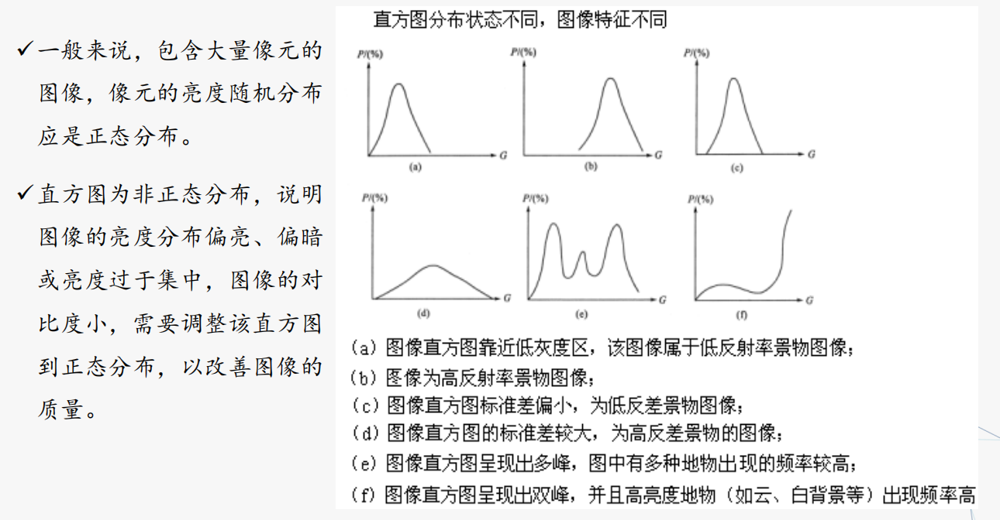
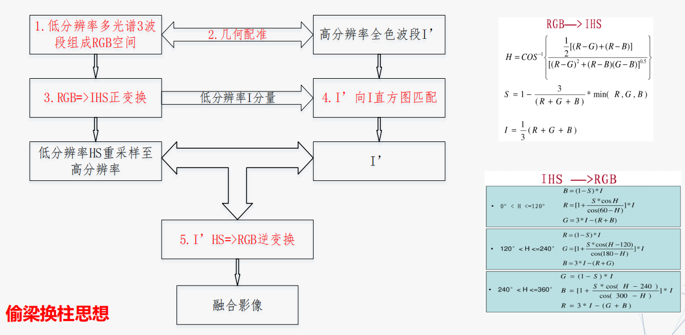

# 遥感图像处理

## 遥感影像
### 遥感数据记录形式
记录形式：光学影像、数字图像

### 遥感数据产品类型(快鸟影像)
* **基础产品** ：快鸟影像产品系列中处理最少的一种，只经过辐射校正、传感器内部几何校正、光学畸变和传感器校正。基础产品既没有地理参考也没有地图投影。
* **标准产品** ：有地理参考的产品，经过了辐射校正、传感器和卫星平台引起的系统误差校正，具有地图投影。
* **预备正射标准产品** ：没有经过地形校正的产品，只经
过了辐射校正、传感器和卫星平台引起的误差校正，具有地图投影,投影到每景快鸟影像覆盖区的平均基高。
### 遥感数据格式
* 遥感数据产品文件格式
    * 分发格式
    * 商业软件文件格式
    * 通用图像文件格式
* 数据格式
    * BSQ格式 波段顺序格式 第一个波段保存后接着保存第二个波段
    * BIP格式 波段按像元交叉格式 第一个波段的第一个像元，之后保存第二波段的第一个像元，依次保存
    * BIL格式 波段按行交叉格式 第一个波段的第一行后接着保存第二个波段的第一行，依次类推

## 光学原理与光学处理
可见光谱：定义 380nm-760nm 的电磁波  

人眼看到范围：312nm-1050nm 甚至更广  

人眼对颜色敏感程度：  

* 绿光、黄光最敏感，交通信息选择绿黄红的原因
* 紫光、蓝光、青光最不敏感
* 基于眼细胞的光敏特性，人眼正常能够分辨 1200 多种颜色

### 颜色空间（颜色模型）
颜色空间也称彩色模型(又称 彩色空间 或 彩色系统），它的目的是在某些标准下用数学方法来形象化对彩色加以说明

三维颜色空间坐标

* 从光学的角度【色彩的客观三属性】
    * 主波长
        * 可见彩色光中占支配地位的光的波长决定光的色彩（色相），要注意的是：光波本身并没有色彩，色彩是通过眼睛和大脑产生的
    * 纯度
        * 纯色光中混有白光的多少【光的饱和度】
    * 明度
        * 光的明亮程度【光的亮度】
* 从人的视觉角度【颜色的心理三属性】
    * 色相
        * 颜色类别和名称
    * 饱和度
        * 色调深浅的程度。各种单色光饱和度最高，单色光中掺入的白光愈多，饱和度愈低。
    * 亮度
        * 色光的明暗程度，它与色光所含的能量有关。

颜色空间与设备关系：  

* 设备相关的颜色空间：RGB
* 设备无关的颜色空间：HSV（色调、饱和度、明度）

颜色空间分类：  

* 从颜色感知角度
    * 混合型颜色空间：按三种基色的比例合成颜色【RGB、CMY(K)、XYZ】
    * 强度/饱和度/色调型颜色空间：用饱和度和色度描述色彩的感知，对 **消除光亮度** 的影响很有用【HSI、HSL、HSV】
    * 非线性亮度/色度型颜色空间：用一个分量表示非色彩的感知，用两个独立的分量表示色彩的感知。当需要黑白图像时，这样的系统非常方便。【YUV（现代彩色电视）】
* 从技术角度
    * **RGB 型颜色空间/计算机图形颜色空间：** 此模型主要用于电视和计算机的颜色显示系统【RGB，HSI, HSL 和 HSV 等】
    * **XYZ 型颜色空间/CIE颜色空间：** 国际照明委员会定义的颜色空间，作为国际性颜色空间标准，用作颜色的基本度量方法。颜色空间与设备无关，在科学计算中得到广泛应用。对不能直接相互转换的两个颜色空间，可利用这类颜色空间作为过渡性的颜色空间
    * **YUV 型颜色空间/电视系统颜色空间：** 由广播电视需求的推动而开发的颜色空间，主要目的是通过压缩色度信息以有效地播送彩色电视图像。【YUV，YIQ，ITU-R BT.601 Y'CbCr等颜色空间】

颜色发展历史  

* CIE颜色系统
    * CIEXYZ是国际照明委员会在1931年开发并在1964年修订的CIE颜色系统，该系统是 **其他颜色系统的基础**
    * **红，绿，蓝** 三种颜色为基色，x表示红色分量，y表示绿色分量，第三维定义亮度
    * E点代表白光，(0.33,0.33)
    * 环绕在CIE边沿的颜色是光谱色，边界代表光谱色的最大饱和度，边界上数字表示光谱色波长，其轮廓包含所有感知色调
    * 所有 **单色光** 都位于 **舌形曲线上** ，这条曲线是单色轨迹，曲线旁标注的数字是单色(光谱色)光的波长值
* RGB 一种光混合配色体系
    * sRGB
    * Adobe RGB
* CMYK减法三原色 青、洋红（品红）、黄、黑，依靠反光的色彩模式
    * RGB是发光的色彩模式
    * 加入黑色的原因
        * 理论上说，CMY 可以合成大部颜色，但现代工艺水平无法得到高纯度的油墨
        * 黑色用的多
* HSI 一种人描述和解释颜色方式
    * 亮度I：光的强和弱
    * 色调H：光的波长、人眼的感觉（反映）颜色（的基本特征）
    * 饱和度（S）：颜色渗入白光的程度（表示）颜色深浅的程度
* HIS <-> RGB
    * 公式转换

### 色彩色度学
色彩学：研究自然界颜色变化的基本规律、色彩之美学规律以及色彩在人们生理和心理上所产生的视觉效果的科学  

色度学：研究人眼的颜色视觉规律、颜色定量测量和评价方法、理论与技术的科学  

印刷色彩学：如何应用色彩学原理进行颜色分解、传递、合成等，从而完成印刷、打印等的科学  

## 遥感影像几何特征
* 投影类型
    * 垂直投影（正射投影)：物体影像通过平行光线投影到与光线垂直的平面上
    * 中心投影：空间任意直线均通过某一固定点（投影中心）投射到一平面而形成的透射关系
    * 负像：物体和投影面位于投影中心两侧
    * 正像：物体和投影面位于投影中心同一侧
### 航空摄影及其影像几何特征
* 特点：分辨率高、质量好、灵活
* 成像范围：可见光-近红外波段
* 航空像片是地面的中心投影正像
* 航空像片的像点位移：地形起伏和投影面的倾斜会引起像点位置的变化——像点位移
    * 倾斜误差：像片倾斜引起的像点位移
    * 投影误差：地形起伏引起的像点位移

### 卫星摄影及其影像特征
* 遥感图像的几何变形
    * 遥感器本身引起的畸变：它与遥感器的结构、特性和工作方式不同而异。如：透镜的辐射方向畸变像差、透镜的切线方向畸变像差、透镜的焦距误差...
    * 外部因素引起的畸变：运载工具姿态变化和目标物引起
        * 地球自传引起的误差:地球自转对于瞬时光学成像遥感方式没有影响，对于扫描成像则造成图像平行错动
        * 地球曲率的影响。在星下点视场角比较小、扫描范围又比较小时地球曲率影响可以忽略，此时可以看成近垂直投影
        * 地形起伏的影响。
            * 地面起伏引起投影点相对于基准面上垂直投影点的像点产生的直线位移称为地面起伏引起的像点位移，也叫投影差。
            * 在高差同为正值的情况下，地形起伏在中心投影影像上造成的像点位移是远离原点向外移动，而在斜距投影（雷达）影像上则是向内变动的。
            *  雷达影像上看到的是反立体，高出地面物体的雷达影像可能带有“阴影”，远景影像可能被近景影像所覆盖。
        * 传感器外方位元素变化的影响
            * 外方位元素：确定摄影光束在摄影瞬间的空间位置和姿态的参数，即6个自由度：三轴方向（X、Y、Z）及姿态角（j、ω、К）
            * 内方位元素：表示摄影中心与相片之间相关位置的参数，如像主点在像平面坐标系中的坐标x0，y0，摄影中心到相片的垂距f。内方位元素一般为已知值，由摄影机鉴定单位提供
        * 大气折射
## 遥感图像几何校正
遥感影像几何畸变  
①内部畸变:传感器性能差异引起  
②外部畸变:运载工具姿态变化和目标物引起  

* 几何校正
    * 几何粗校正：系统级校正，用构像公式（已知构像方程和传感器校正参数）等进行校正
        * 基于共线方程遥感图像几何校正
        * 有理函数遥感图像几何校正
    * 几何精校正：对离散数字图像中的每一个像元逐个进行校正处理的方法，能精确地改正动态扫描图像所有的各种误差
        * 基于控制点对的几何校正（多项式、三角网）
        * 基于多项式的几何精校正
        * 利用已有准确地理坐标和投影信息的扫描地形图或矢量地形图，对原始遥感影像进行纠正，使其具有准确的地理坐标和投影信息

几何纠正的一般过程：  
输入原始数字影像->建立纠正函数->确定输出影像范围->像元几何位置变换->像元灰度重采样->输出纠正数据影像  

* 几何精纠正的两个环节： 
    * 像素坐标的变换，即将图像坐标转变为地图或地面坐标
    * 对坐标变换后的像素，亮度值进行重采样
* 几何精纠正的核心
    * 建立纠正函数
    * 像元灰度重采样函数
* 几何精纠正步骤
    * 建立纠正函数， **关键是选取合适的地面控制点**
    * 确定输出影像范围
    * 像元几何位置变换及重采样
        * 最近邻法、双线性内插值法、三次卷积法
    * 输出纠正数据影像

灰度重采样方法及优缺点  

* 最近邻法：
    * 算法简单，保持原光谱信息
    * 几何精度差，图像灰度具有不连续性，边界可能出现锯齿
* 双线性内插
    * 计算较简单，灰度具有连续性且采样精度比较准确
    * 细节有可能丧失
* 双三次卷积：
    * 计算量大，图像灰度具有连续性且采样精度比较精确

!!! question "控制点选择"
    * 图像上有明显的、清晰的点位标志，如道路交叉点、河流交叉点等
    * 图像上的地物不随时间而变化
    * 均匀分布在整幅影像内，有一定数量保证，不同纠正模型对个数需求不相同
    * 图像边缘和地面特征变化较大的地区要有适当的控制点

* 几何校正与几何配准：
    * 几何校正指消除因大气传输、传感器本身、地球曲率等因素造成的几何畸变，主要是纠正或者赋予影像平面坐标过程
    * 几何配准指将不同时间、不同波段、不同遥感器系统所获得的同一地区的图像(数据)，经几何变换使同一像点在位置上和方位上完全叠合的操作
    * 无论几何校正还是几何配准，要求影像经过几何变换后，精度误差控制在1个像素内

## 遥感图像辐射校正
### 影响因素
导致 传感器测量值 与 目标光谱反射率或光谱辐射亮度等物理量 不同的 因素：  

* 太阳位置和角度条件
* 大气吸收与散射
* 传感器定标
* 地形地势

### 校正对象
辐射校正：消除遥感图像中依附在辐射亮度中的各种失真的过程

* 传感器校正：传感器灵敏度特性引起的辐射误差校正
* 大气校正：大气的散射和吸收引起的辐射误差校正
* 光照条件：光照条件的差异(太阳高度及地形)引起的辐射误差校正

### 校正方法
* 大气校正：将辐射亮度或者表观反射率转换为地表实际反射率
    * 统计型：经验线性定标法，内部平场域法(也称灰度平衡校正)
    * 物理型：6S模型，Mortran
* 辐射定标：遥感数据记录的是亮度值，辐射定标就是建立遥感数据记录的亮度值与其所对应地物的物理量（辐射强度、反射率）之间的定量关系
    * L = G * DN + off 
        * L：定标值，G：增益，DN：亮度值，off：偏移
* 太阳高度角引起的辐射误差校正：通过调整一幅图像内的平均灰度来实现
    * 公式法
    * 波段比值法
* 地形起伏引起的辐射误差校正
    * 地形起伏引起的辐射校正需要知道各坡面的倾角，还要有该区域的 DEM 数据，目前不易实施，一般情况下不对其做校正，在需要时可采用 **比值图像** 来校正

其他校正： 

* 去云
* 去阴影
* 光谱归一化
* 消除椒盐噪声
* 条带噪声

## 遥感图像增强
* 图像增强目的
    * 改善图像的视觉效果，提高图像的 **清晰度**
    * 突出遥感图像中与研究有关的信息，削弱、分离无关的信息，使图像 **更易判读**
* 图像增强方法：分空间域处理和频率域处理两大类
    * 空间域处理：直接对图像进行各种运算，以得到图像的增强结果。如灰度变换、直方图均衡等
    *  频率域处理：将空间域图像变换成频率域图像，在频率域中对图像的频谱进行处理然后再进行反变换，以达到增强图像的目的。如：滤波、小波变换等

图像增强只能改变 **视觉效果** ，不能增加原始图像的信息，有时反而会 **损失** 一些信息

## 图像灰度直方图

直方图：图像中各亮度的像元数分布图，反映 **灰度与其出现概率** 之间的关系,利用直方图，可以简单识别影像中地物类数及影像质量好坏。  

调整为正态分布  

## 线性变换增强
* 简单线性变换是按比例拉伸原始图像灰度等级范围
    * 充分利用显示设备的显示范围，使输出直方图的两端达到饱和
    * 变化前后图像每一个像元呈一对一关系，像元总数不变

## 直方图均衡化增强
通过改变原始图像各像素在各灰度级上的概率分布来实现图像灰度变换的处理方法，通常用来增加图像全局对比度，尤其是当图像的有用数据对比度相当接近的时候

* 效果：增强了峰值处的对比度，两端（最亮和最暗）对比度减弱了
* 缺点：
    * 变换后图像的灰度级减少，某些细节消失
    * 某些图像，如直方图有高峰，经处理后对比度不自然地过分增强

## 直方图匹配增强
指将一幅图像的直方图变成规定形状的直方图而进行的图像增强方法  

具体是将某幅影像或某一区域的直方图匹配到另一幅影像上。使两幅影像的色调保持一致

## 密度分割增强
图像（或影像）的色调密度分划成若干个等级，并用不同的颜色分别表示这不同的密度等级，得到一幅彩色的等密度分割图像  

密度分割可使影像轮廓更清晰，突出某些具有一定色调特征的地物及分布状态，在显示环境污染范围，隐伏构造，以及寻找地下水等方面有广泛的应用，并取得较好的效果  

## 图像平滑增强
图像平滑（低通滤波）实际上是消除各种干扰噪声，使图像中高频成分消退，即平滑掉图像的细节，使其反差降低，保存低频成分  

平滑过程会导致图像边缘模糊化  

## 图像锐化增强
目的：为了突出图像上地物的边缘、轮廓，或某些线性目标要素的特征。这种滤波方法提高了地物边缘与周围像元之间的反差  

效果：增强图像中的高频成分，突出图像的边缘信息，提高图像细节的反差  

## 代数运算增强
代数运算：两幅或多幅遥感图像（波段）之间进行点对点的加减乘除运算，来达到增强某些信息或消除某些影响的目的的过程  

利用植物在可见光红光波段（BR）有很强的吸收特性，近红外波段（BIR）有很强的反射特性  

* 差值植被指数（农业植被指数）DVI = BIR - IR
    * 对土壤背景的变化极为敏感，有利于植被生态的监测，又称环境植被指数(EVI)
* 比值植被指数（绿度）RVI = BIR/IR
    * 优点：绿色植物的灵敏指示参数
    * 缺点：植被覆盖度影响RVI，当植被覆盖度较高时，RVI对植被十分敏感；当植被覆盖度<50%时，敏密度分感性显著降低；
* 归一化植被指数NDVI = (BIR-IR)/(BIR+IR)
    * 优点：消除部分辐射误差
    * 缺点：高植被区灵敏度较低
* 土壤调整植被指数 SAVI = (BIR－IR)/(BIR+IR+L)*(1+L）

* 加法运算
    * 两幅图像相加，可以产生图像叠加效果，去除“叠加性”随机噪音
    * 多景影像定位相加，对影像进行衔接，填补单景遥感图像的空白区域
    * 生成图像叠加效果，如绿波段和红波段图像相加可得到近似全色图像
* 减法运算（差影法）
    * 增加不同地物间光谱反射率以及在两个波段上变化趋势相反时的反差
    * 消除背景影响
    * 检测同一场景两景影像之间的变化。用于动态监测
* 乘法运算
    * 改变图像灰度级
    * 图像局部显示（掩膜）
* 除法运算
    * 有些地物在某些波段较小,在另一些波段较大,通过选择适当波段进行比值运算,可以有效的增强某些地物之间的反差,解决图像中存在的“同物异谱”
    * 比值运算能压抑因地形坡度和方向引起的辐射量变化，消除地形起伏造成的阴影影响

## 遥感数据的融合增强
* 多源遥感影象数据特点
    * 冗余性
    * 互补性
    * 合作性
    * 信息分层的结构特性
* 遥感图像融合定义
    * 把那些在 **时间、空间、波谱** 上关于 **同一目标** 的 **冗余或互补** 的 **多源数据** （不同类别传感器、多时相），按照一定的规则（或算法），进行运算处理，获取比任何单一数据更精确高、更丰富的信息，在规定的地理投影坐标系上，生成一幅具有新的空间、波谱和时间特征的合成图像数据的处理过程
* 遥感图像融合目标
    * 空间分辨率提高
    * 目标特征增加
    * 分类精度提高
    * 信息互补
* 图像融合层次低->高
    * 基于像素级融合
    * 基于特征级融合
    * 基于影像理解的决策层融合

## 遥感数据IHS融合增强

★成像仪已经有很多多光谱波段，为什么还要设置全色波段(TM5及以前没有)?  
★多光谱波段和全色波段空间分辨率为什么不一样?  

## 遥感数据与非遥感数据的融合增强

* 遥感数据与非遥感数据融合意义
    * 提高目视解译效果
    * 实现不同数据之间的优势互补
    * 实现遥感数据和地理数据的有机结合(协同)
    * 扩大遥感数据的应用面
* 遥感数据与非遥感数据融合方法
    * 遥感数据是栅格格式数据，非遥感数据（地形、气象、水文、人口、经济等）进行网格化处理，成为与遥感数据分辨率一样的网格数据，作为分析的“波段”，与遥感数据进行融合
    * 矢量化非遥感数据进行坐标位置配准,直接叠加到遥感数据上
    * 不同层面的非遥感数据，经坐标位置配准，直接或掩膜到遥感数据

## 图像多光谱变换—主成分分析
主成分分析（Principal Component Analysis，PCA）：是一种 **降低维数统计方法** ，又称卡洛南-洛伊（Karhunen-Loeve，K-L）变换、霍特林（Hotelling）变换，该变换通过 **正交变换** 将一组可能存在 **相关性** 的变量转换为一组线性 **不相关** 的变量，转换后的这组变量叫 **主成分**   

主成分分析是将多光谱变量中重复的信息（关系紧密，如辐射强度等）进行合并，生成一新变量（主成分），将不相关的信息（如温度敏感、水体敏感、植物敏感等）进行分离生成几个新变量（主成分），最后建立尽可能少的新变量（主成分），使得这些新变量（主成分）是两两不相关的，而新变量（主成分）反映的信息尽可能保持原有信息  

## 图像多光谱变换—傅里叶变换
傅里叶(Fourier)变换：表示能将满足一定条件的某个函数表示成三角函数（正弦和/或余弦函数）或者它们的积分的线性组合  

傅里叶变换的作用：将信号信息从时间域转换到频率域，数学棱镜  

## 其它图像多光谱变换增强
* 小波变换
* 穗帽变换
* 因子分析

## 遥感数据镶嵌和裁剪
### 图像镶嵌
图像镶嵌：将二幅或多幅（具有重叠部分）影像拼在一起，构成一幅大范围整体图像的过程  

影像镶嵌涉及几何位置的镶嵌和灰度(或色彩)的镶嵌两个过程 

镶嵌的主要内容：  

* 影像定位（几何位置镶嵌）：是指镶嵌影像间对应物体几何位置的严格对应，无明显的错位现象
* 色彩平衡（灰度镶嵌）：指位于不同影像上的同一物体镶嵌后不因两影像的灰度差异导致灰度产生突变现象
* 接缝线处理：可细分为重叠区接缝线的寻找以及拼接缝的消除。在镶嵌过程中，即使对两幅影像进行了色调调整，但两幅影像接缝处的色调也不可能完全一致，需对影像的重叠区进行色调的平滑以消除拼接缝。

镶嵌的关键：  
接边处理、颜色平衡、速度与内存  

### 数字图像裁剪
图像裁剪的目的是将研究之外的区域去除，常用的是按照行政区划边界或自然区划边界进行图像剪裁。

裁剪的关键：  
图像裁剪区的确定  
无数据区的处理  

---

全色波段为什么比多光谱分辨率高  
1:4大多数  

陆地卫星1:2  （全色波段15,多光谱30m）

---

高光谱成像光谱扫描仪  

TM30能做1:10w比例尺的地图吗？不能  

300dpi  
每1mm11条线  

为什么要定义颜色空间  
为了计算  

正则  
double有效位数16、17位，正则化到0-1防止溢出  

加减乘除计算  
NDVI  
