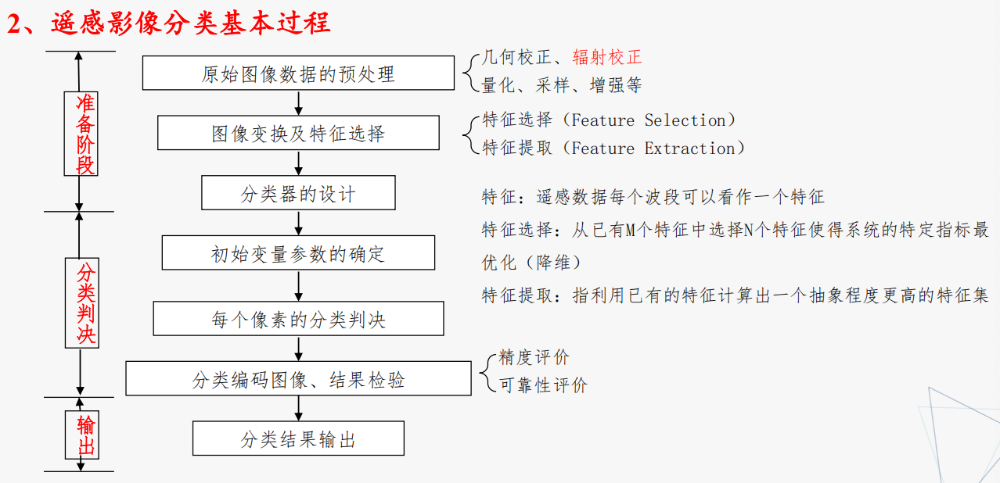
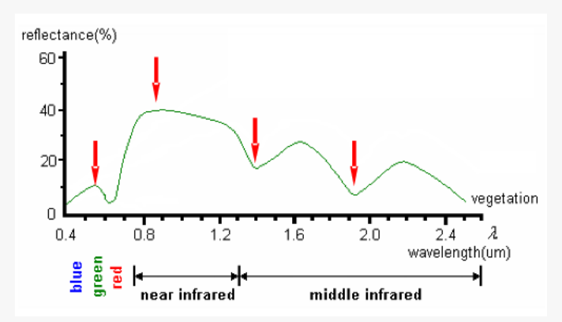
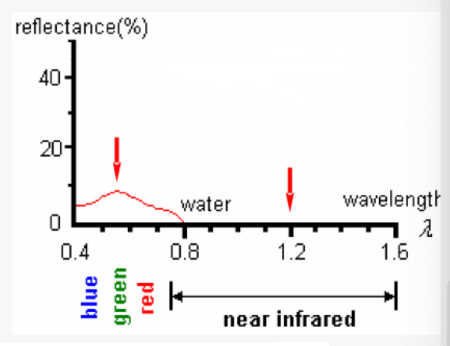
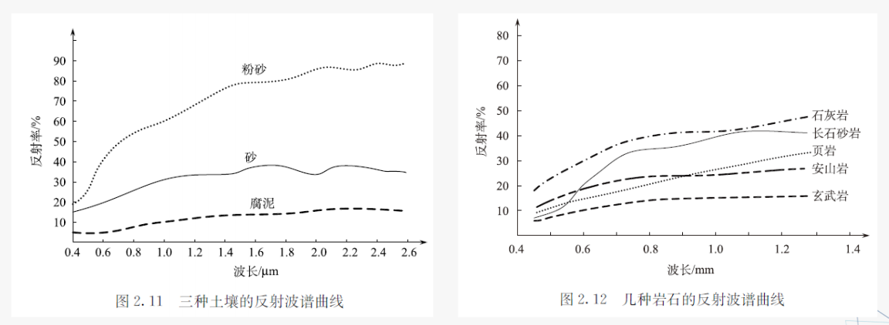
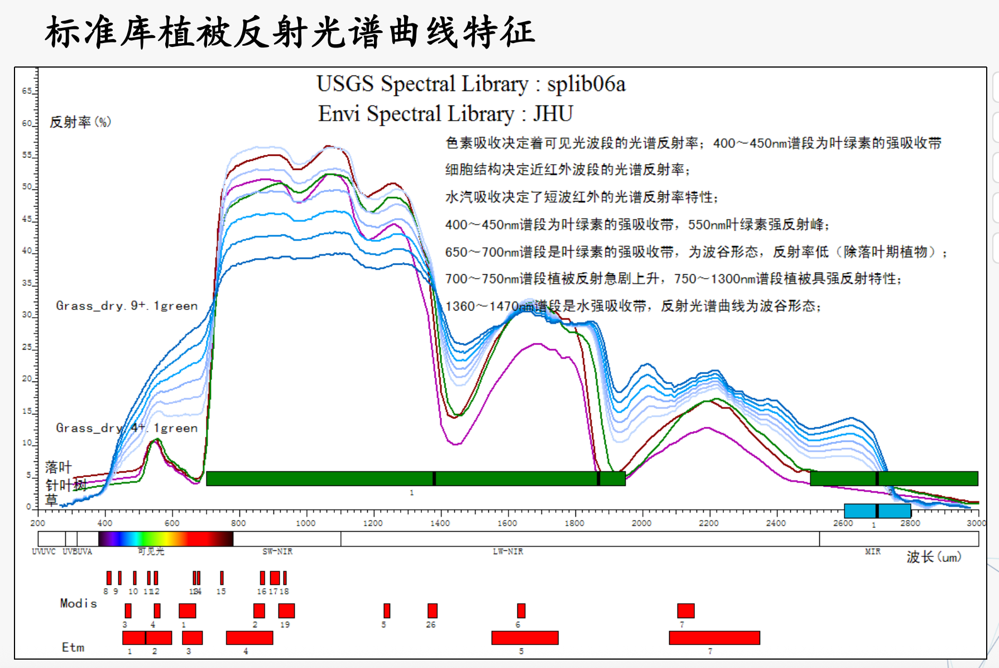
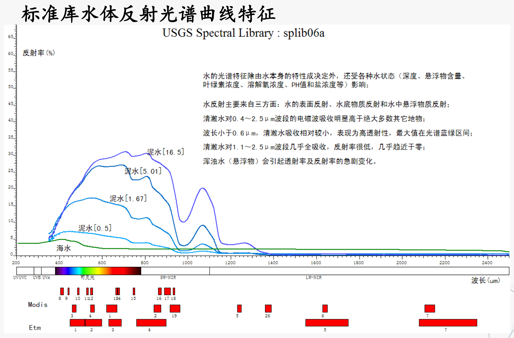
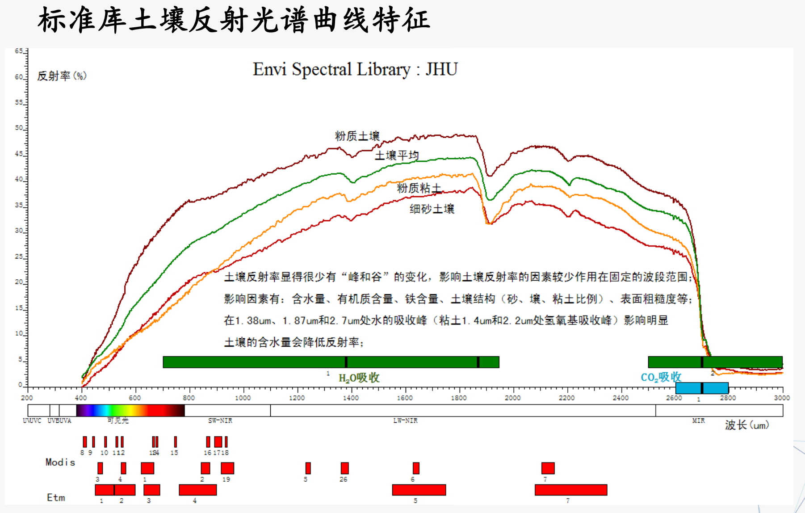

## 一、 综合/解答题

??? question "**画出目视解译技术流程图，并对各流程详细说明（含水稻、高分二号地理图等场景）**（5次)"
    * 目视解译准备工作阶段
        * 明确解译任务与要求
        * 收集和分析有关资料
        * 选择合适波段与恰当时相的遥感影像
    * 初步解译与判读区野外验证
        * 初步解译的主要任务：
            * 掌握解译区域特点
            * 确立典型解译样区
            * 建立目视解译标志
            * 探索解译方法，为全面解译奠定基础
        * 野外考察：
            * 填写各种地物的判读标志登记表，以作为建立地区性的判读标志的依据
            * 在此基础上，制定出影像判读的专题分类系统
            * 建立遥感影像解译标志
    * 室内详细判读
        * 先图外后图内
        * 先整体后局部
        * 勤对比分析
    * 野外验证与补判
        * 野外验证包括：检验专题解译中图斑的内容是否正确，检验翻译标志
    * 目视解译成果转绘与制图

??? question "**画出计算机解译过程，并对各流程详细说明**（5次）"
    

??? question "**画出植被、水体的典型波谱特征曲线**（4次）"
    
    
    
    
    
    

??? question "**估算特定温度（如1000K, 1300K, 1500K）物体热红外探测的最佳波段，给出详细估算过程**（3次）"
    * 估算依据：根据遥感物理中的维恩位移定律（Wien's Displacement Law），绝对黑体辐射的峰值波长 $\lambda_{max}$ 与其绝对温度 $T$ 成反比。（黑体辐射光谱中最强辐射波长与黑体绝对温度成反比）
    * 计算公式：$\lambda_{max} = b / T$，其中常数 $b \approx 2898 \ \mu m \cdot K$。
    * 详细过程：
        1. 对于 $T = 1000K$：$\lambda_{max} = 2898 / 1000 = 2.898 \ \mu m$。此波段位于短波红外至中红外区间，通常选择 3~5 $\mu m$ 的中红外大气窗口进行探测。
        2. 对于 $T = 1300K$：$\lambda_{max} = 2898 / 1300 \approx 2.229 \ \mu m$。峰值位于短波红外区域，可选用 2.0~2.5 $\mu m$ 附近的短波红外波段。
        3. 对于 $T = 1500K$：$\lambda_{max} = 2898 / 1500 \approx 1.932 \ \mu m$。同样位于短波红外波段，通常根据其附近的大气窗口（如1.55~1.75 $\mu m$ 或 2.08~2.35 $\mu m$）来设定最佳探测波段。

---

## 二、 名词（对）解释
??? question "**辐照度 与 辐射出射度**（5次，含单考辐射出射度）"
    * 辐照度(I)：指被辐射的物体表面单位面积上的辐射通量（$I=d\varphi/ds$），代表物体接收的辐射。
    * 辐射出射度(M)：指辐射源物体表面单位面积上的辐射通量（$M=d\varphi/ds$），代表物体发出的辐射。

??? question  "**波谱(光谱)分辨率 与 辐射分辨率**（4次）"
    * 波谱分辨率：传感器接受电磁波辐射所能区分的最小波长范围，或能分辨的最小波长间隔，间距愈小，分辨率愈高，评价传感器探测能力和遥感信息容量的重要指标
    * 辐射分辨率：传感器所能探测到的最小辐射功率，或遥感影像记录灰度值的最小差值。反映传感器对入射光的灵敏度、辨识度

??? question  "**目视解译 与 计算机解译**（4次）"
    * 目视解译：专业人员通过直接观察或借助判读仪器在遥感影像上获取特定目标地物信息的过程
    * 计算机解译：以计算机系统为支撑环境，利用模式识别技术与人工智能技术相结合。根据遥感影像中目标地物的各种影像特征，结合专家知识库中目标地物的解译经验和成像规律等知识，进行分析和推理，实现对遥感影像的理解，完成对遥感影像的解译

??? question  "**辐射定标(标定) 与 大气校正**（4次）"
    * 辐射定标：遥感数据记录的是亮度值，辐射定标就是建立遥感数据记录的亮度值与其所对应地物的物理量（辐射强度、反射率）之间的定量关系
    * 大气校正：大气的散射和吸收引起的辐射误差校正。将辐射亮度或者表观反射率转换为地表实际反射率

??? question "**几何校正 与 几何畸变/精粗校正**（4次，含单考几何校正）"
    * 几何粗校正：系统级校正，用构像公式（已知构像方程和传感器校正参数）等进行校正
    * 几何精校正：对离散数字图像中的每一个像元逐个进行校正处理的方法，能精确地改正动态扫描图像所有的各种误差

??? question " **绝对黑体 与 灰体**（4次，含单考黑体）"
    * 绝对黑体：吸收系数 α(λ, T)=1，反射系数 ρ(λ, T)=0
    * 灰体：没有显著的选择性吸收、吸收率虽然小于1、但基本不随波长变化。一般的金属材料都可以近似看成灰体

??? question  "**监督分类 与 非监督分类**（3次）"
    * 监督分类：又称训练场地法，是一种由已知样本，外推未知区域类别的方法。选择具有代表性的典型实验区或训练区，用训练区中已知各类地物样本的光谱特性来“训练”计算机，获得识别各类地物的判别函数或模式，对未知地区的像元进行分类处理，分别归入到已知的类别中
    * 非监督分类：又称聚类分析或点群分析，是一种无先验（已知）类别标准的分类方法，即事先对分类过程不施加任何的先验知识,仅凭数据（地物光谱特征相似度）自然聚类的特性，进行“盲目”的分类  

??? question " **同物异谱 与 同谱异物**（3次，含单考同谱异物）"
    * **“同物异谱”** ：指在某一个谱段区间，由于时空环境变化，相同类型地物呈现不同的光谱特征。如，地形起伏山地的同种植物类别的反射率受太阳高度、坡度、坡向等影响而发生曲线不完全相同。
    * **“同谱异物”** ：指在某一个谱段区间，不同类型的地物呈现出相同的光谱特征的现象

??? question  "**太阳同步轨道 与 地球同步轨道**（2次，含单考太阳同步）"
    * 太阳同步轨道是轨道平面绕 **地球自转轴** 旋转的，方向与地球公转方向 **相同** ，旋转角速度等于地球公转的平均角速度(360度/年)的轨道，它距地球的高度不超过6000KM。
    * 地球同步轨道：运行周期与地球自转周期相同的顺行轨道(23:56:4)，每天相同时刻经过地球上相同地点的上空，星下点轨迹是一条8字形的封闭曲线
        * **地球静止轨道** ：地球同步轨道中倾角为零、在地球赤道上空35786km的特殊轨道，从地面上看，这条轨道上运行的卫星是静止不动的。【地球同步轨道有无数条，地球静止轨道只有一条。】

??? question  "**主动遥感 与 被动遥感**（2次，含单考主动遥感）"
    * 主动遥感：使用人工辐射源（如雷达等）向目标发射电磁波进行探测
    * 被动遥感：利用自然辐射源（如太阳辐射、地球辐射）进行探测

??? question  "**镜面反射 与 漫反射**（2次，含单考漫反射）"
    * 镜面反射(mirror reflection)：满足于瑞利准则的表面，定义为光滑面，也称为镜面。镜面反射的特点，是反射能量集中分布在反射角 θr 等于入射角 θi 的方向上
    * 漫反射(diffuse reflection)： 它不满足瑞利准则的表面，定义为 **粗糙面** ，它也是漫反射面。漫反射面的辐射亮度是一个常数，即是在入射辐照度不变的情况下， **漫反射面的反射亮度与观测的角度无关。**

??? question  "**维恩位移定律**（1次名词，另有2次简答，3次计算）"
    * 维恩位移定律 $\lambda_{max} T = b$  (b = 2898 m.K)
    * 黑体辐射光谱中最强辐射波长与黑体绝对温度成反比

??? question " **直方图**（1次名词，另有1次简答）"
    直方图：图像中各亮度的像元数分布图，反映 **灰度与其出现概率** 之间的关系,利用直方图，可以简单识别影像中地物类数及影像质量好坏。 

---

## 三、 简答题
??? question "**试解释为什么全色波段的分辨率比多光谱波段高**（5次）"
    课件里没有这个，爱来自gemini。本来想听智云的结果发现没拿麦，，，。。
    全色波段宽，进光量大，像元可以做小，所以空间分辨率高；多光谱波段窄，进光量小，为了保证信噪比必须增大像元，所以空间分辨率低。  

    * 波谱宽度与辐射能量不同： 全色波段涵盖的波谱范围宽，传感器接收到的地物总辐射能量大；多光谱波段的波段窄，接收到的特定波长辐射能量相对较弱。
    * 成像信噪比（SNR）的限制： 传感器必须收集到足够的电磁辐射能量，才能保证图像清晰、信噪比达标，避免有效信号被噪声淹没。在多光谱的窄波段下，由于入射光能量低，如果像元尺寸很小，接收到的有效信号可能会被传感器自身的电子噪声所淹没。
    * 瞬时视场角（IFOV）的物理权衡：全色波段由于进光能量充足，允许将瞬时视场角（单个像元面积）设计得很小，因此空间分辨率高。多光谱波段由于单波段进光能量弱，为了凑够成像所需的最低能量，必须增大瞬时视场角（扩大单个像元面积），因此空间分辨率较低。
  
??? question  "**可见光-近红外遥感，热红外遥感，微波遥感的能量来源分别是什么？为什么？**（4次）"
    * 可见光-近红外遥感（0.76-2.5μm）：能量主要来自太阳辐射。因为该波段地物自身辐射的能量极小，太阳辐射与地物辐射比例约为1000:1，影像主要反映地物对太阳辐射的反射能量。
    * 热红外遥感（8-14μm）：能量主要来自物体自身的热辐射（即地球辐射）。因为此波段地物反射的太阳能量很小可忽略不计，影像记录的主要是地物自身发出的热量，适于夜间成像测量温度。
    * 微波遥感：由人工辐射源提供能量，属于主动遥感。

??? question  "**晴朗的天空为什么是蓝色的？**（4次）"
    瑞利散射强度与波长四次方成反比，太阳光谱中波长较短的蓝紫光比波长较长的红光散射更明显。  
    太阳光谱短波中以蓝光能量最大，在雨过天晴或秋高气爽时（空中较粗微粒比较少，以分子散射为主），在大气分子的强烈散射作用下，蓝色光被散射至弥漫天空，天空即呈现蔚蓝色。

??? question "**目视直接解译的标志是什么？**（3次）"
    * 目视解译标志：遥感影像上那些能够作为识别、分析、判断景观地物的影像特征  
    * 直接解译标志：判读目标自身特点直接在遥感影像上表现出来，可根据这一特点直接判别地物类型，主要有色、形、味
        * 色调与颜色
            * 受自然因素（地物颜色、含水量、风化程度、地面土壤、植被覆盖率、光照条件、成像季节）和人为因素（成像波段选择、假彩色合成参数）影响
            * 存在同物异谱、同谱异物
        * 阴影
            * 本影：地物未被太阳照射到的部分在像片上的构像，获得地物的立体感
            * 落影：阳光直接照射物体时，物体投在地面上的影子在像片上的构像
            * 不同类型遥感影像中阴影的形成可能是不同的
        * 形状
            * 指地物轮廓在遥感影像上的投影
        * 大小
            * 地物的形状、面积的直接显示，是遥感解译最重要的特征之一，根据物体的大小可以推断物体的属性
            * 影像图像上物体大小的因素：物体本身大小、物体反射率差异、影像的空间分辨率、图像比例尺
        * 纹理
            * 通过色调或颜色变化表现的细纹或细小的图案
        * 图型
            * 指目标地物以一定规律排列而成的图型结构
            * 反映岩性、构造的不同，是地质解译重要标志之一
            * 常见有:条带状、网格状、斑点状、环带状等
        * 位置
            * 指目标地物在空间分布的地点
    * 间接解译标志
        * 于现有遥感技术的局限性，许多问题不能从影像直接目视判读，而需要从其它相关事物之间的联系，通过逻辑推理综合获取，这一过程称间接解译，所采用的依据称间接解译标志。如：环境质量评价等
        * 特征
            * 灵活多变，难有规律可循
            * 不同专业判读有不同的间接标志
            * 建立间接标志需丰富的知识背景和逻辑推理，经常需建立模型
        * 目视解译的心理基础
            * **同一时刻，只有一种地物是目标地物** ，图像的其余部分以目标地物的背景出现，此时判读者的注意力往往集中在目标地物上
            * 判读者的 **知识和经验** ：对目标地物的确认有一定的 **导向** 作用，不同的解译者可能得出不同的结论
            * **心理惯性** ：对目标地物的识别有一定的影响。（北半球遥感照片要倒看，南半球不能倒看）
            * 观察的 **时效性** ：正确辨认目标地物，需要一个最低限度的时间才能完成,否则影响质量

??? question "**几何畸变的原因是什么？**（3次）"
    * 遥感器本身引起的畸变：它与遥感器的结构、特性和工作方式不同而异。如：透镜的辐射方向畸变像差、透镜的切线方向畸变像差、透镜的焦距误差...
    * 外部因素引起的畸变：运载工具姿态变化和目标物引起
        * 地球自传引起的误差:地球自转对于瞬时光学成像遥感方式没有影响，对于扫描成像则造成图像平行错动
        * 地球曲率的影响。在星下点视场角比较小、扫描范围又比较小时地球曲率影响可以忽略，此时可以看成近垂直投影
        * 地形起伏的影响。
            * 地面起伏引起投影点相对于基准面上垂直投影点的像点产生的直线位移称为地面起伏引起的像点位移，也叫投影差。
            * 在高差同为正值的情况下，地形起伏在中心投影影像上造成的像点位移是远离原点向外移动，而在斜距投影（雷达）影像上则是向内变动的。
            *  雷达影像上看到的是反立体，高出地面物体的雷达影像可能带有“阴影”，远景影像可能被近景影像所覆盖。
        * 传感器外方位元素变化的影响
            * 外方位元素：确定摄影光束在摄影瞬间的空间位置和姿态的参数，即6个自由度：三轴方向（X、Y、Z）及姿态角（j、ω、К）
            * 内方位元素：表示摄影中心与相片之间相关位置的参数，如像主点在像平面坐标系中的坐标x0，y0，摄影中心到相片的垂距f。内方位元素一般为已知值，由摄影机鉴定单位提供
        * 大气折射

??? question  "**微波遥感的优点/优势是什么？**（2次）"
    * 微波能穿透云雾、雨、雪，具全天候全天时工作能力
    * 微波对地物具有一定的穿透能力，微波越长，穿透力越强。穿透力还与地物类型、密度、含水量、入射角等有关
        * 干沙：几十米
        * 冰层：100m
        * 潮湿土壤：几厘米-几米
    * 微波能提供不同于可见光、红外遥感的信息
        * 微波高度计、合成孔径雷达等具有测量距离的能力
        * 微波探测海面风力场
        * 根据冰的界电常数不同，探测海冰的结构和分类
        * 根据含盐度对水的界电常数的影响，探测海水的含盐度
    * 波同时记录振幅和相位信息，可获取高程信息
        * 利用干涉测量技术，可以监测地形变化，达cm级，应用领域如地震形变、火山研究等

??? question "**什么是大气窗口？大气窗口对遥感有什么影响？**（2次）"
    由于大气层的反射、散射和吸收作用，使得太阳辐射的各波段受到衰减的作用程度不同，因而各波段的透射率也各不相同  
    **通常把受到大气衰减作用较轻、透射率较高的波段称为大气窗口** 

??? question "**NDVI 是什么？理论依据是什么？写出计算公式**（2次，含综合大题连考）"
    * 定义：NDVI 是归一化植被指数，取值范围为 −1≤NDVI≤1
    * 理论依据：植物在可见光红光波段（IR）有一强吸收带，而在近红外波段（BIR）有一强反射高峰。通过对这两个波段进行组合，可以有效提取出植被信息
    * 计算公式：NDVI=(BIR−IR)/(BIR+IR) （即：(近红外波段 - 红光波段) / (近红外波段 + 红光波段)）

??? question "**几何校正之后的灰度重采样有哪几种方法，优点和缺点是什么？**（1次）"
    * 最近邻法：
        * 算法简单，保持原光谱信息
        * 几何精度差，图像灰度具有不连续性，边界可能出现锯齿
    * 双线性内插
        * 计算较简单，灰度具有连续性且采样精度比较准确
        * 细节有可能丧失
    * 双三次卷积：
        * 计算量大，图像灰度具有连续性且采样精度比较精确

??? question "**图像平滑和图像锐化分别是什么？**（1次）"
    * 图像平滑（低通滤波）实际上是消除各种干扰噪声，使图像中高频成分消退，即平滑掉图像的细节，使其反差降低，保存低频成分  
    *  图像锐化增强为了突出图像上地物的边缘、轮廓，或某些线性目标要素的特征。这种滤波方法提高了地物边缘与周围像元之间的反差。增强图像中的高频成分，突出图像的边缘信息，提高图像细节的反差。  

??? question "**什么是基尔霍夫定律？**（1次）"
    热力学平衡的条件下，不同物体对相同波长的单色辐射出射度与单色吸率之比值都相等，并等于该温度下黑体对同一波长的单色辐射出射度  
    $\frac{M_1}{\alpha_1} = \frac{M_2}{\alpha_2} = ... = M_0 = I(\lambda,T)$   
    M0 同一温度同一波长绝对黑体辐射出射度  

??? question "**什么是遥感？**（1次）"
    是从远处探测感知物体，也就是不直接接触物体，从远处通过探测仪器接收来自目标地物的电磁波信息，经过对信息的处理，判别出目标地物的属性。

??? question "**遥感成像过程图分析及高光谱与可见光遥感过程的不同及原因**（1次）"
    * 没看懂这在说啥
    * 一个完整的遥感过程包括以下7个步骤：A. 能量源或光源；B. 能量向外辐射并穿过大气；C. 能量与目标地物相互作用；D. 传感器记录辐射能量；E. 信号接收和转换；F. 信号解译和分析；G. 应用。
    * 探测波段的宽度与连续性（波谱分辨率不同）：
      * 可见光遥感：探测的波长范围主要集中在 0.38—0.76μm（或 0.4—0.7μm）之间。它通常只包含少数几个较宽的波段（例如红、绿、蓝），光谱分辨率相对较低，主要通过地物在该波段内的亮度反差来区分地物。
      * 高光谱遥感：传感器选用的波段数量极多、波长间隔（带宽）极小，并且各波段是连续的。例如，课件中提到传统的TM传感器只有7个波段，而高光谱卫星（如HJ-1A）可以拥有高达 115个波段。
    * 数据表现形式的不同：
        * 可见光遥感：通常得到的是二维的空间图像（如单波段黑白图或三波段彩色图），主要反映地物的空间特征和基本颜色。
        * 高光谱遥感：在成像过程中，同时在“空间维”和“光谱维”进行扫描，最终生成一个立体的数据立方体（Data Cube）。在这个立方体中，可以为图像上的任意一个像元提取出一条极其精细、连续的地物光谱反射率曲线。
---

## 四、 填空题核心考点

??? question "**三种散射类型**（4次）"
    瑞利散射、米氏散射、非选择性散射

??? question "**列举陆地资源卫星**（3次）"
    * Landsat系列陆地资源卫星
        * 数据特点：  
        * 波段信息丰富，可挑选三个波段进行RGB组合成像
        * 存档数据海量，特别是早期资料
        * 价格低廉免费
    * SPOT系列卫星
    * 美国空间成像公司 IKONOS卫星
        * 第一颗提供高分辨率卫星影像的商业遥感卫星，1999年9月24日由美国航空航天局发射  
    * 美国空间成像公司 QuickBird卫星
    * WorldView-1卫星
    * 美国商业卫星高分系列
    * 以色列EROS卫星
    * 印度Cartosat卫星
    * 俄罗斯卫星
        * 钻石卫星（ALMAZ）、俄罗斯Resurs DK-1
    * 韩国Kompsat卫星
    * 日本卫星
    * 台湾地区福尔摩沙卫星
    * 中国系列
        * 高分卫星  
        * 中巴资源卫星  
        * 中国系列资源3号  

??? question "**SAR的中文名，以及属于主动还是被动遥感**（2次）"
    合成孔径雷达(SAR)  
    主动遥感

??? question "**可见光波长范围**（2次）"
    380nm-760nm
 
??? question "**遥感成像系统组成**（2次）"
    A. 能量源或光源、B. 能量向外辐射并穿过大气、C. 能量与目标地物相互作用、D. 传感器记录辐射能量、E. 信号接收和转换、F. 信号解译和分析、G. 应用

??? question  "**遥感数据的储存/常用文件格式**（2次）"
    * 遥感数据产品文件格式
        * 分发格式
        * 商业软件文件格式
        * 通用图像文件格式
    * **数据格式**
        * BSQ格式 波段顺序格式 第一个波段保存后接着保存第二个波段
        * BIP格式 波段按像元交叉格式 第一个波段的第一个像元，之后保存第二波段的第一个像元，依次保存
        * BIL格式 波段按行交叉格式 第一个波段的第一行后接着保存第二个波段的第一行，依次类推
    
??? question "**遥感平台按高度/类型分类**（2次）"
    * 不同平台
        * 地面
        * 航空
        * 航天
    * 不同电磁波段
        * 可见光
        * 红外
        * 微波
    * 传感器的不同工作方式
        * 被动
        * 主动

??? question "**灰度重采样方法**（1次）"
    * 最近邻法：
    * 双线性内插
    * 双三次卷积：

??? question "**反射类型**（1次）"
    镜面反射、漫反射、方向反射

??? question "**分辨率有哪些**（1次）"
    * 空间分辨率
    * 波谱分辨率
    * 时间分辨率
    * 辐射分辨率

??? question "**太阳近似黑体温度，地球近似黑体温度**（1次）"
    6000k,300k