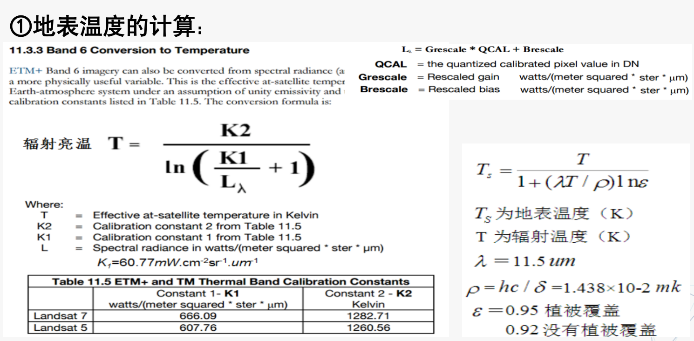
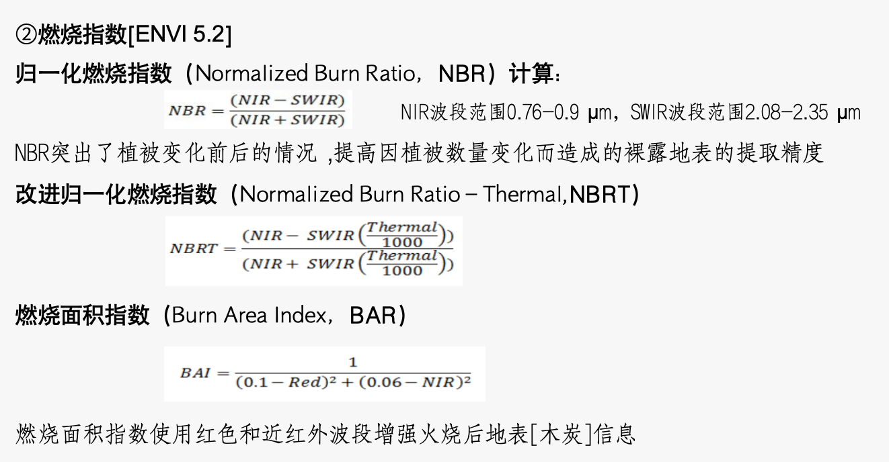
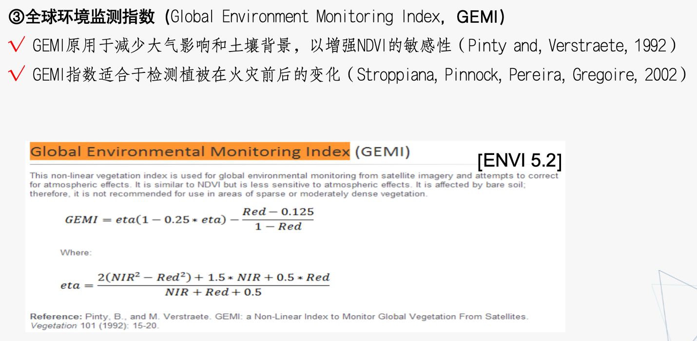

# 遥感应用
## 遥感在生态环境中的应用
### 大气污染监测
* HOT法：
    * 在蓝色与红色波段散点图上，任何地物的像元点均集中分布在一条直线上，该直线称为“晴空线( clear-line)”。
    * 雾霾天气时，随着雾霾的光学厚度增加，蓝色与红色波段的表观辐射值也发生变化，表现在蓝色与红色波段散点图上，灰霾天气像元点偏离晴空线，雾霾光学厚度越大，像元点的偏移量越大。
    *  HOT法就是计算像元点偏离晴空线的偏移量，定义为：HOT =B1 *sinθ-B4 * cosθ，式中： B1为蓝色波段的 DN值；B4为红色波段的 DN值；θ为晴空线的倾角。
    *  通过 HOT转换，能反演雾霾发生强度。

### 土壤侵蚀和土地荒漠化监测
* 土壤侵蚀：“土壤侵蚀”和“水土流失”是水土保持学科的专业术语，两词意义基本相同。我国常用“水土流失”，国外则用“土壤侵蚀”。
    * 定义：是指土壤及其母质在水力、风力、冻融或重力等外营力作用下，被破坏、剥蚀、搬运和沉积的过程。
* 荒漠化：起源于20世纪60年代末和70年代初，非洲西部撒哈拉地区连年严重干旱，造成空前灾难，“荒漠化”名词于是开始流传开来。是一个生态环境问题。
    * 定义：由于干旱少雨、植被破坏、大风吹蚀、流水侵蚀、土壤盐渍化等因素造成的大片土壤生产力下降或丧失的自然（非自然）现象。

### 水资源及水环境监测
水体识别方法：  
  1）目视识别法  
  2）单波段阈值法  
  3）指数阈值法  
  4）二维散点图法  
  5）非监督分类法  
  6）监督分类法  
  7）混合像元分解法  

### 森林火灾和烧荒监测
烧荒:垦荒前烧掉荒地上野草、灌木等,有助于提高农作物和牧草产量，但火灾产生的烟雾降低了空气质量。中部非洲的烧荒活动始于11月旱季开始，并于次年2月下旬或3月初结束，期间农业火灾蔓延整个非洲中部大陆  

热点:温度高于背景,红色标志。  

* 方法
    * 基于遥感的火灾监测方法可以分为火点（hotspot）检测和火灾后迹地（burn scar）识别两类
    * 火点检测技术已经比成熟（地表温度与背景温度对比）
    * √迹地识别常用的指数包括：
        * NDVI ---- 归一化植被指数
        * NDWI ---- 归一化水体指数
        * NBR  ---- 归一化燃烧指数
        * GEMI ---- 全球环境监测指数

  

### 冰雪灾害环境监测
对珠穆朗玛峰（世界第一高峰,8848m）的雪、冰川和云层分别设置采样点，统计其平均反射率值，观测雪在遥感卫星接收数据的波谱曲线  

* 观测波谱曲线
    * 雪和云的反射率在可见光波段相似，在1.6μm以上的近红外波段差异较大；
    * 雪和冰的反射率在可见光波段差异较大，在1.6μm以上的近红外波段相似；
    * 因此可以从影像中区分云、雪、冰。

### 城市环境遥感
* 城市废水污染
* 热污染（热岛效应）：现代工业生产和生活活动排放的废热所造成的环境污染

### 灯光遥感
* 国防气象卫星 (DMSP, Defense Meteorological Satellite Program)专用军事气象卫星，隶属于美国国防部。
* DMSP项目启动于20世纪60年代，与NOAA卫星同属太阳同步极轨卫星，轨道高度约830km，通常运行2颗业务卫星和3颗部分业务卫星，卫星一天两次穿过地球的整个表面，每6h可提供一次全球云图。
* DMSP卫星的发射目的：
    * 云图监测：以获得云的分类信息；
    * 强风监测：以改善风暴、旋风等预报
    * 海况监测：为海军行动保障提供信息
    * 微光监测：允许可见光遥感器在夜间月光下工作。

* OLS(可见红外成像)传感器——测量云层分布、云顶温度及地面火情等；OLS传感器白天使用光学望远镜头(空间分辨率0.5km)，在夜间使用光学倍增管(PMT,空间分辨率2.7km)，具有很强的光电放大能力，能进行微光探测，可获取夜间灯光遥感数据，反映地面目标灯光强弱。

## 遥感在资源勘探中的应用
### 岩石矿物波谱特性
* 岩浆岩
    * 反射强度 岩浆岩随SiO2含量减少而降低；在可见光热红外波段波谱特征，与铁离子、羟基和水密切相关。
* 沉积岩
    * 反射强度 碳酸盐岩较大，碎屑岩次之，粘土岩类最低。大多数在2.35μm附近出现$CO_3^{2-}$特征吸收带;在1.1 μm前出现铁离子的吸收带。
* 变质岩
    * 反射强度 变化规律不明显，与母岩有关
* 谱范围与可识别矿物特性 
    * 可见光及近红外短波窗口（0.4 - 1.3μm）
        * 氧化物：晶格结构中存在的Fe、Mn、Ni等过渡性金属元素
    * 近红外长波窗口（1.3 - 2.4μm）
        * 层状硅酸岩矿物、碳酸根、羟基及水分子
    * 中红外窗口（3.4 - 4.9μm）
        * 不含水矿物：取决Si-O、Al-O等分子键的振动模
* 利用近红外光谱识别矿物
* 影响岩石光谱的主要因素
    * 矿物成分
    * 矿物含量
    * 风化程度
    * 含水状况
    * 颗粒大小
    * 表面光滑度
    * 色泽
    * 自然界岩石多被植被、土壤覆盖，与其覆盖物也有关

### 线性构造遥感解译标志
线形构造在遥感影像上表现为：影像纹理、色调、反差等通过地形、地貌、水系、植被等呈直线、近直弧线、折线性（状）等特征。  
遥感影像上以各种特征显示的线性形迹，经解译确认它的存在与地质作用有关时，称为线性构造。  

* 线形构造解译标志
    * 色调标志
    * 地貌标志
    * 水系标志
    * 土壤植被标志
    * 人类活动标志

### 环性构造遥感解译标志
为突出地质意义，将成因上与地质作用或宇宙作用有关的环形影像称为环形构造。  

### 解译标志局限性和可变性
* 局限性：同一种地质体在不同地区有截然不同的影像特征，有些解译标志在某种自然地理条件和某个特定地区才适用；如灰岩：在南方地区高温多雨，多形成岩溶地貌；在北方地区低温少雨，形成连绵山亘。
* 可变性：同一种地质体，即便在同一地区，因其出露面积、厚度、构造部位、岩层产状、覆盖程度等差异，表现出的色调（假彩色合成影像，不同用户色调本身不一样）、水系和地貌形态等也可能不同。

影响解译标志变化的因素包括：  
  ①地质体本身的物质成分、结构构造、出露面积、岩层产状等表现不同  
  ②地质体所处构造部位，决定了不同的水系类型和地貌形态  
  ③基岩上覆盖较厚的松散沉积物时，影响下伏基岩  
  ④大面积植被覆盖，地表岩石、构造形迹不易识别  
  ⑤遥感图像的种类及比例尺不同  

### 油田开发
### 矿山资源勘探
### 地貌解译
解译原理：从地貌学原理出发，分析色调、纹理、形状、阴影等直接解译标志，再结合土壤、植被、水文、地质等地理要素的相关信息，对遥感影像进行综合分析。

## 遥感在精准农业中的应用
### 植被光谱特性
* 色素吸收决定可见光波段光谱反射率； 
    * 0.45μm（蓝色）和0.65μm（红色） 叶绿素吸收大部分的摄入能量
    * 0.54μm（绿色）叶绿素吸收较小，有一个10~20%反射峰，许多植物看起来是绿色
    * 叶红素和叶黄素在0.45μm（蓝色）附近有一个吸收带
* 细胞结构决定近红外波段光谱反射率；
    * 0.7～0.75μm植被反射急剧上升，0.75～1.3μm具强反射特性
* 水汽吸收决定了短波红外光谱反射率特性；
    * 1.36～1.47μm、1.95μm、2.6 ～ 2.7μm水强吸收带，光谱曲线为波谷形态

不同植被类型的区分  

* 不同植物叶子组织结构和所含色素不同，光谱有所差异
* 不同植物的物候期有差异
* 不同植物生态条件差异

植被生长状况  
当植被生长状况发生变化时，其光谱形状会发生改变；  
对比受损植被光谱与健康植被光谱曲线不同，可以定量估算植被受损程度

### 植被或土地遥感分类
### 农情监测及应用
* 农作物长势监测：对农作物苗情长势（生长状况及其变化）进行监测；常通过分析遥感光谱植被指数、LAI等指标随农作物生长过程（播种、出苗、抽穗到成熟）的动态变化的过程来实现。
* 遥感估产：对农作物种植面积、农作物单产及总产进行预测； 
    * 种植面积：利用高分辨率影像或多时序中、低分辨率影像对遥感影像进行分类、识别，结合土地历年农作物种植类型数据库，经地面实测资料补充修正完成;
    * 单产估测：通过分析农作物产量与各种影响因素（叶绿素、蛋白质、水分等）之间关系，组建遥感估产模型来完成;
* 农业灾害监测（病虫害监测）
    * 水灾遥感监测、旱灾遥感监测、冻害、倒伏和病虫害等监测
    * 主要指标有：植被指数、地表温度、水体指数等

### 沙漠化普查及干旱农业
### 农业保险灾害评估
### 农业保险灾害评估
* 土地资源调查内容
    * 自然环境的演变（全球变暖、自然灾害等）造成土地资源质量下降和数据减少
    * 人类经济活动（农业结构调整、土地开发整理与复垦、土地交易、违法用地）等使土地利用类型、权属、利用结构等发生的变化
* 土地资源调查与监测内容
    * 土地利用数量变化调查与监测:①建设用地规模的扩展，②不同土地利用类型内部结构，③耕地的变化，④基本农田保护区等变化
    * 土地资源质量变化调查与监测：土壤PH、养分、结构、污染、水土流失、沙漠化等
    * 土地资源空间格局变化调查与监测：①土地利用/土地覆被变化，②基本农田保护区状况，③耕地总量动态平衡，④后备土地资源的开发利用
    * 土壤与环境特征变化调查与监测：土壤污染程度、区域环境条件、环境污染
    * 土地资源生产力与效益变化调查与监测：土壤属性、地形地貌、水文、土地投入产出、社会经济效益等
