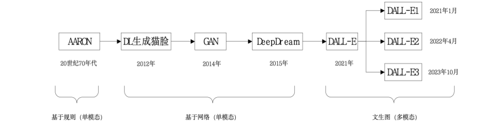

# 第一篇 基础入门篇
>列举发生在身边的人工智能例子  
>解释人工智能的起源、定义  
>列举人工智能的三大学派和技术类型  
>列举人工智能发展的三次浪潮重要性事件，分析两次低谷的原因  
>判断人工智能的能与不能  
>分析人工智能伦理安全、幸存者偏差现象、道德困境与伦理冲突以及如何应对  
## 一、初识人工智能
### 人工智能的新时代
### 人工智能的起源和定义
>解释人工智能的起源、定义  

**起源**：

* 1955年8月提案 
  * 约翰·麦卡锡
  * 马文·明斯基
  * 克劳德·香农
  * 纳撒尼尔·罗切斯特
  * 洛克菲勒基金会
* 1956 达特茅斯会议
  * 首次提出人工智能，现代人工智能元年

**人工智能定义（1）**：以机器为载体，用人工方法和技术模拟实现的人的智能  

* 强人工智能
  * 类人的人工智能-机器的思考和推理就像人的一样
  * 非类人的人工智能
  * 又指与人类一样或超越人类智慧的人工智能，又叫人工智能调增
* 弱人工智能
  * 通过计算机替代一部分人类的智能化能力或一部分智能的增强/机器模拟人的部分智能

### 人工智能的主流学派

>列举人工智能的三大学派和技术类型  

* 符号主义学派（逻辑主义学派）
    人类认知和思维的基本单元是符号，认知过程是建立在符号表示基础上的一种符号运算
* 行为主义
    * 构建一个类人或机器智能体，并关注智能体在环境中的行为。行为主义学派强调模拟人的行为，与外界环境交互决策行动，研究类人机器或机器人  
    * 1.强化学习（deepseek、alphago）2.Q-learning和策略梯度方法  
    * 游戏ai、机器人控制、自动驾驶  
* 联结主义学派（仿生学派、生理学派）
    * 理解认知过程的理论框架，目标是实现模拟人脑的结构、人脑的思维，让机器人模拟人脑能够感知、识别、判断  
    * 深度学习。神经元（m-p）模型、神经网络感知器、卷积神经网络、反向传播算法、神经网络  
    * 人脸识别、gpt、sora、机器翻译、图像分类  

### 人工智能的发展浪潮  

>列举人工智能发展的三次浪潮重要性事件，分析两次低谷的原因  

* 第一次浪潮：达特茅斯会议，神经网络感知器
* 第一次低谷：由于算力不足，政府投资的削减
* 第二次浪潮：专家系统，BP神经网络算法
* 第二次低谷：由于PC发展迅猛，政人工智能计算机DARPA失败，府投资削减
* 第三次浪潮：杰弗里·辛顿提出了深度学习的神经网络，AlphaGo，Transformer

### 人工智能的伦理安全

>分析人工智能伦理安全、幸存者偏差现象、道德困境与伦理冲突以及如何应对  

**幸存者偏差：**忽略筛选条件，把经过筛选的结果当成随机结果。  


### 为什么要学

---

## 二、人工智能的系统数据基础
>能够解释人工智能系统概念及应用技术架构  
>能够列举人工智能系统三个要素及能够分析三者之间的关系  
>能够列举计算机系统组成及分析其工作原理  
>能够列举人工智能系统的算力基础设施资源  
>能够辨识人工智能数据的结构和模态  
>能够分析人工智能系统中各种数据的表示方法  
>能够列举人工智能的各种算法并辨识典型人工智能应用的算法  

### 认识人工智能系统
>能够解释人工智能系统概念及应用技术架构  
三层  

* **基础设施层**包括**计算和数据基础设施**。  
    硬件资源、数据资源、算力资源  
* **智能技术层**由**基础框架、算法模型和通用技术**组成。
    分布式存储、计算和深度学习框架
* **智能应用层**展示人工智能的**实际应用**，涵盖传统AI、智能化应用、智慧化应用和大模型化应用。

>能够列举人工智能系统三个要素及能够分析三者之间的关系  

**人工智能系统的核心三要素**：数据、算法、算力  
* 算法也是实现人工智能的灵魂，是人工智能之所以“智能”的基础
* 高效精准的模型离不开高质量的数据
* 实时性和效率，也离不开强大的算力保障。

### 人工智能系统基础
图灵机不是具体的计算机，而是一种抽象的计算模型。图灵机模型理论是计算学科最核心的理论。  
>能够列举计算机系统组成及分析其工作原理   

* 计算机有五个组成部分：**输入设备、存储器、处理器（分为运算器和控制器）和输出设备。**  
* 二进制  
* 计算机硬件由处理器、存储器、输入/输出三个子系统构成。

* CPU
  * 从逻辑上，可分为5个部分，包括运算器、控制电路、地址电路和数据寄存器与指令代码寄存器
  * 功能上，运算器和控制器的集合
  * 性能指标：主频，CPU数量、内核数量，字长：处理器一次能够处理的最大二进制的位数，协作处理器：不单独工作、在CPU的协调下完成任务，内部高速缓存器（Cache，介于CPU和内存之间）
* 存储器系统
  * RAM-数据断电丢失
    * DPAM、SPAM
  * ROM-断电后存储的数据不会丢失
    * PROM、EPROM、EEPROM
  * 磁盘（Disk）
  * 固态存储器（SSD）存储介质是闪存（Flash Memory）
  * 光盘（CD/DVD）
  * 硬盘（Hard Disk）
* 输入输出系统
  * 显示器、打印机...
  * 端口（接口）
    * USB、TypeC
    * 端口和注记的数据传输模式：并行或串行
* 操作系统
  * 功能：CPU调度（进程管理）、内存调度（管理）、设备管理、文件管理

### 人工智能数据基础
>能够分析人工智能系统中各种数据的表示方法  

* 数的表示：原码、反码、补码
* 浮点数的表示：$N=±d×2^{±p}$
* 字符的表示：ASCII
* 汉字的表示：区位码、国标码、机内码
* 图像的表示：BMP、GIF、JPEG/JPG
* 声音的表示：wav, mp3, aac，cda，quicktime，RealAudio
* 视频的表示

```
（24期末选择）彩色图像每一个像素用多大内存表示（）  
A.1bit B.1Byte C.3bit D.3Byte  
D
```
---

## 三、人工智能的应用开发基础
>能够使用Python语言进行基础编程  
>能够列举和使用常用人工智能算法库  
>能够列举和使用人工智能深度学习框架  

### 案例：手写数字应用
>能够使用Python语言进行基础编程  

### 集成开发环境
### Python入门
学python去吧☝️🤓  
### 算法库和开发包
>能够列举和使用常用人工智能算法库  

* 数据分析和处理 Pandas
* 数值计算和科学计算 Numpy、SciPy
* 可视化工具 Matplotlib、Seaborn、Tensorboard
* 自然语言处理工具 NLTK、spaCy、Transformers
* 图形用户界面开发工具 PyQt、Tkinter 
* AI算法库 Scikit-learn（简称Sklearn）

### 深度学习框架
>能够列举和使用人工智能深度学习框架  
深度学习框架：Pytorch、TensorFlow、PaddlePaddle、MindSpore  

---

# 第二篇 机器学习篇
## 四、从问题求解到机器学习
>列举装箱、水壶倒水等经典问题求解方法  
>解释人类智能和人工智能问题求解的含义  
>列举通用问题求解常用的算法方法  
>列举早期人工智能问题求解搜索典型方法  
>解释机器学习的概念定义和列举机器学习的类型  
>分析机器学习求解问题的一般工作过程  
>分析机器学习的三个要素及关系  
>列举scikit-learn提供的算法类型  

### 问题求解理论基础
>列举装箱、水壶倒水等经典问题求解方法  

**装箱问题**：已知有N个物品（每个物品重量小于S）和一组箱子（箱子容量是S），要求寻找一种方法用最小个数的箱子把所有物品装完。  

* 首次适应算法（First Fit, FF）
  * 思路：将每个物品按顺序放入第一个能放下它的箱子中；若没有合适的箱子，就新开一个。
  * 时间复杂度：O(n²) 或 O(n log n)（配合优先队列优化）
  * 不保证是最优解
```python
def first_fit(items, bin_capacity):
    bins = []  # 记录每个箱子的剩余容量
    for item in items:
        # 尝试将物品放入已有箱子
        for i in range(len(bins)):
            if bins[i] >= item:
                bins[i] -= item
                break
        else:  # 未找到合适箱子，创建新箱子
            bins.append(bin_capacity - item)
    return len(bins)

# 示例用法
items = [2, 5, 4, 7, 1, 3, 8]
bin_capacity = 10
print("所需箱子数量:", first_fit(items, bin_capacity))  # 输出: 4
```

**水壶倒水问题**：给定两个容量分别为x升和y升的水壶，以及一个目标z升的水量，我们需要找到一系列倒水操作，使得最终其中一个水壶中的水量恰好为z升，或者两个水壶中的水量之和为z升。
>ppt上没有，gpt的一个做法   

* BFS（广度优先搜索）
  * 核心思想：将每种可能的水壶状态看作图中的一个节点，从初始状态开始向所有可达状态扩展，直到找到目标状态。
  * 状态表示：每种水壶的水量，比如 (x, y) 表示两个壶中水量分别是 x 和 y。
  * 状态转移操作：
    * 倒满一个壶
    * 倒空一个壶
    * 一个壶往另一个壶倒水，直到满或倒完
```python
from collections import deque

def bfs(a_cap, b_cap, target):
    visited = set()
    queue = deque()
    queue.append((0, 0))  # 初始状态，两个壶都空
    visited.add((0, 0))

    while queue:
        x, y = queue.popleft()
        if x == target or y == target:
            return True  # 找到解

        # 所有可能的倒水操作
        next_states = [
            (a_cap, y),  # A 倒满
            (x, b_cap),  # B 倒满
            (0, y),      # A 倒空
            (x, 0),      # B 倒空
            # A -> B
            (max(0, x - (b_cap - y)), min(b_cap, x + y)),
            # B -> A
            (min(a_cap, x + y), max(0, y - (a_cap - x)))
        ]

        for nx, ny in next_states:
            if (nx, ny) not in visited:
                visited.add((nx, ny))
                queue.append((nx, ny))

    return False
```

>解释人类智能和人工智能问题求解的含义  

**人类智能的问题求解**：就是设法消除“某个给定智能活动的当前状态与智能主体所要达到的目标状态之间的差距的行为”，是人类日常生活中普遍存在的智能活动，如饿了（问题），找东西吃（求解）；渴了（问题），倒水喝（求解）  

**人工智能的问题求解**：就是计算机或机器实现人类的问题求解的模拟，是研究如何用计算机（机器）“计算”的方法技术去求解人类智能问题的学科。问题求解不仅是人工智能的核心领域之一，并且在人工智能和计算机科学中占据重要位置。  


### 问题求解与算法方法学
>列举通用问题求解常用的算法方法  

问题求解的核心就是寻找解决方案并实现算法设计  

* 贪心法
  * 从小的方案推广到大的解决方法。分阶段工作，**在每一个阶段选择最好的方案**，而不考虑其后的结果如何。
  * 局部最优，不能确定最后解是最优的
* 分治法
  * 分而治之，将一个较大规模的问题**分解为若干个较小规模的子问题**，找出子问题的解，**然后把各个子问题的解合并成整个问题的解**。
* 回溯法（穷尽搜索法、暴力搜索法）
  * 基本思想：在分步解决问题的过程中，若通过尝试发现现有的分步方向不能得到正确解，就**取消上一步甚至上几步的计算（回溯）**，再通过其他可能的分步方向再次尝试寻找问题的答案。通常使用递归实现。
  * 本质就是**穷举**
* 动态规划
  * 基本思路：如果一个较大问题可以被分解为若干个子问题，且子问题具有重叠，可以**将每个子问题的解存放到一个表中**，这样就可以**通过查表解决问题**。
  * 核心思想是以空间换时间

### 问题求解与搜索算法
>列举早期人工智能问题求解搜索典型方法  

  

* 八数据与状态搜索空间法
  * **状态空间问题**：如果一个问题可以被定义为状态空间中的一个初始状态，通过一系列操作或动作转换直到到达目标状态
  * 状态空间问题四要素：初始状态、目标状态、操作、路径
  * 八数码：在一个3*3的网格中随机放置了1-8八个数码。其中有一个网格是空着的。这个空网格可以跟上下左右四个方向的任何一个临近的数码交换。但不能跟斜方向上的数码交换。
* 走迷宫与启发式搜索
  * 相对于暴力搜索无脑地一个一个方向遍历，**启发式搜索**往往有一个评价函数来决定下一步优先往哪个方向前进。
* 旅行推销员与遗传算法
  * 遗传算法是一种模拟自然选择的优化技术，它们使用生物进化的概念，如变异、交叉和选择来解决问题。
  * 旅行推销员问题（TSP）要求找到最短的路径，访问一系列城市并返回原点。使用遗传算法，可以随机生成多个“种群”，每个种群是一种可能的路径。
  * 通过**交叉和变异产生新的路径**，并使用适应度函数（在这个例子中是总距离）来选择最佳路径，随着时间的推移，这个过程可能会找到一个非常接近最短可能路径的解决方案。
* 拼图与模拟退火
  * 模拟退火是一种概率性的技术，灵感来源于金属退火过程。它在搜**索过程中引入随机性**，允许算法在早期阶段进行“坏”的移动，以**避免陷入局部最优解**。
* 数独与约束满足问题求解
  * 约束满足问题（CSP）是一种问题，其中变量需要满足一定的约束条件。CSP求解器的目的是找到满足所有约束的变量的赋值。

### 机器学习求解方法
>解释机器学习的概念定义和列举机器学习的类型  

**机器学习**是AI的核心领域之一，是一种基于数据统计建模的问题求解方法。机器学习求解问题的方法是利用统计学、数据分析和计算机科学的方法，从数据中发现模式规律，并利用这些模式规律进行推断和决策的方法。  

**类型**：  

* 有监督学习
    所有X都有Y对应
* 无监督学习
    没有Y，学习X内部的知识
* 半监督学习
    一部分X有Y

>分析机器学习求解问题的一般工作过程  


机器学习的一般过程**五个要素：数据、模型、训练、预测和评估**  

机器学习过程的定义：  

* 已知 X 是输入空间，Y 是输出空间，Y与X存在某种对应关系，Y称为X的标签。
* 机器学习的目标是构建一个映射函数 f:X → Y，使得该函数在未知输入上能够尽可能准确地预测输出。
* 举例——已知父母亲的身高，预测子女身高。 X =( x1, x2 )分别表示父亲身高和母亲身高，Y ={ 子女身高,性别 }。学习一个函数Y = f ( X )，预测子女身高。

**机器学习过程**：  

* 训练
* 预测
* 评估
>分析机器学习的三个要素及关系  

* **数据**：结构化的（如表格数据）或非结构化的（如文本、图像、音频）
* **模型**：用于进行预测或分类的数学表示，模型通过从数据中学习并调整其参数来提高性能。
* **算法**：机器学习建模就是个算法

* 机器学习的实现方法
  * 回归分类方法、神经网络方法

### 机器学习算法库scikit-learn
>列举scikit-learn提供的算法类型  

机器学习sklearn库的算法主要有四类：**分类，回归，聚类，降维**  

**数据预处理方法**：  

* 数据标准化
  * 将数据**映射到一个小的浮点数范围内**，减少数据的大幅波动，以便模型能快速收敛。

* 数据二值化
  * 使用阈值过滤器将数值型数据转化为分类数据（布尔值或0/1）
  * 使用Binarizer对象实现数据的二值化 ```from skearn.preprocessing import Binarizer```
* 标签编码
  * 使用 LabelEncoder 将不连续的数值或文本变量转化为有序的数值型变量。```from sklearn.preprocessing import LabelEncoder```
* 独热编码
  * 对于无序的离散型特征，其数值大小并没有意义，可进行one-hot编码，将其特征的m个可能值转化为m个二值化（0/1）特征。```from sklearn.preprocessing import OneHotEncoder```

---

## 五、回归和分类模型
>识别身边的回归与分类模型应用案例  
>理解回归和分类这两大核心任务的本质  
>掌握监督学习的基本原理和关键技术  

### 监督学习方法
**监督学习方法核心**：从数据中发现规律，并将这些规律应用于新的、未知的数据  

>识别身边的回归与分类模型应用案例  

**监督学习的类型**：  

* **回归问题**-**连续值**预判
  * 二氧化碳浓度预测
  * 股票价格预测
* **分类问题**-**离散**标签预测
  * 垃圾分类
  * 图片分类

**混淆矩阵**  


TP（True Positive）：实际是正，预测也是正  
TN（True Negative）：实际是负，预测也是负  
FP（False Positive）：实际是负，但预测为正（假阳性）  
FN（False Negative）：实际是正，但预测为负（假阴性）  
精确率：重视准确预测正例
召回率：重视将所有正例样本检测出来
F1：2*（精*召）/(精+召)
面临的问题:数据质量、可解释性、计算资源、过拟合  

如何消除过拟合-提升泛化能力  

* 交叉验证：将数据集划分为多个子集，将模型训练和测试分别在不同子集上进行，从而减少过拟合和提高模型性能
* dropout：动态随机切断神经元的🔗
* 正则化，优化损失函数
  * L1范式（LASSO回归），L2范式（岭回归）
* 不过度训练
* 特征选择
* 集成学习
* **数据质量与预处理技术**

>理解回归和分类这两大核心任务的本质  
>掌握监督学习的基本原理和关键技术  

### 回归模型
回归模型是一种统计学模型，用于研究变量之间的定量关系，特别是一个或多个输入自变量（也称为特征或预测变量）对输出因变量（也称为目标变量或响应变量）的影响。**回归分析本质是预测连续数值 （因变量） 的任务，并在任务中找出自变量和因变量之间的数学函数关系**。  

* 线性回归
  * $Y = \beta_0 + \beta_1 X + \beta_2 X^2 + \cdots + \beta_n X^n + \varepsilon$
  * 最小二乘法：$\min_{\boldsymbol{\beta}} \sum_{i=1}^{n} \left( y_i - \beta_0 - \beta_1 x_{i1} - \cdots - \beta_p x_{ip} \right)^2$
  * 评价指标：**回归损失函数**：均方误差、均方根误差、平均绝对误差

* Logistic回归（逻辑回归）：解决分类问题的回归
  * 广义线性回归，用于解决**二分类问题**，即数据划分两个类别(比如是/否成功/失败、患病/健康等)。Logistic回归分析的因变量Y属于分类数据。
  * **本质**：假设数据服从特定分布，使用极大似然估计做参数的估计。
  * 逻辑回归**不要求自变量和因变量是线性关系（没有线性假设）**

### 分类模型

**分类模型的类型**：  
**根据类别的数量**  

* 二分类模型-垃圾邮件检测（垃圾/非垃圾），医疗诊断（患病/健康）
  * 逻辑回归
  * 支持向量机
* 多分类类型-手写数字识别、动物识别
  * 决策树
  * 随机森林
  * 多类SVM

**根据数据实例可属于的类别标签数量**  

* 单标签分类-新闻文章分类
  * 每个实例只属于一个类别
* 多标签分类-电影标签分类
  * 每个实例可以同时属于多个类别

**根据类别之间的关系**    

* 平坦分类
  * 所有类别处于同一层级
* 层次分类
  * 类别之间存在层次关系

**线性分类器**：核心思想：在输入特征向量的特征空间中找到一个线性决策边界，将不同类别的数据点分开  

**决策树分类模型**：类似于一棵倒置的树，从根节点开始，通过一系列的判断，最终到达叶节点得出结论。 
    构建步骤：特征选择->决策树生成（递归过程）->决策树剪枝（解决过拟合）

其他分类问题：SVM（支持向量机）、决策树、随机森林、朴素贝叶斯、K最近邻、深度学习

---

## 六、数据聚类和降维
>解释无监督学习方法和列举其类型  
>分析聚类技术的核心思想和列举常用方法  
>分析使用Kp-means算法实现聚类  
>分析降维技术的重要性和使用主成分分析算法  

### 无监督学习方法
>解释无监督学习方法和列举其类型  

**无监督学习**是机器学习的一种方法，旨在从没有标签的数据中识别潜在的模式或结构。与监督学习不同，无监督学习不依赖于已知的输出标签。  

* **聚类**：目标是将相似的数据点分组在一起，形成簇（cluster）
* **降维**：降维将高维数据转换为低维表示，减少数据的复杂度，同时巧妙地保留了原始数据中最重要的信息

### 聚类分析技术

**定义**:聚类是一种无监督学习技术，旨在将数据集分成若干组，使得同组内的样本相似度高，而不同组间的样本相似度低.

>分析使用Kp-means算法实现聚类  

**K-means**是最常用的聚类算法之一，
主要步骤为  
1. 随机初始化若干个中心点，周围散布着未分类的数据点；
2. 将每个数据点分配给最近的中心，形成初步的簇；
3. 重新计算每个簇的中心点。  
应用：图像分割，用户画像

### 数据降维技术
>分析降维技术的重要性和使用主成分分析算法  

**定义**：降维是将高维数据转换为低维表示的过程，以简化数据集并降低计算复杂性。  

**主成分分析(Principal Component Analysis，PCA)** 是最常用的降维技术之一。  
通过建立一个新的坐标系，将多个维度的数据投影到该坐标系，实现数据的降维这个坐标系的轴方向就是主成分  
主要步骤  
1. 数据中心化
2. 计算协方差矩阵
3. 计算特征向量和特征值
4. 选择主成分  

ppt上的一个讨论题：下列哪些属于无监督学习：顾客分群、异常检测、房价预测、手写数字识别、图像分类、情感分析  
A：顾客分群、异常检测  

### 强化学习
一种机器学习方法，通过与环境的交互学习最优策略，以最大化累积奖励。  
强化学习的核心思想：智能体（Agent）在环境（Environment）中采取行动（Action），根据环境反馈（Reward）调整其行为，以改善未来的决策。  

强化学习与监督学习的区别  

* 强化学习的最显著特点是其交互性
* 强化学习通常涉及延迟反馈
* 探索与利用的平衡
* 在监督学习中，我们通常致力于**最小化预测误差**，例如在回归问题中最小化均方误差。而强化学习的目标是**最大化长期累积奖励**。这意味着智能体不仅要考虑即时的结果，还要考虑其行为对未来可能产
生的影响。

强化学习的算法  

* Q-learning
* 策略梯度算法

应用  

* 游戏ai、机器人控制、自动驾驶

```
10（24期末选择）、 20x5000的矩阵变成 20x50的矩阵 需要的变换矩阵是什么  
5000x50
```

---

# 第三篇 深度学习篇
## 七、深度网络基本构建
>详细阐述深度学习三要素  
>解释神经元的“全或无”特性  
>列举不同的损失函数使用条件  
>比较不同优化器的优缺点  
>比较不同激活函数的优缺点  
>对一元二次方程进行梯度下降法计算  
>详细阐述BP 算法的基本过程、特点和局限性  
>阅读并理解Scikit-learn 编写的感知机模型代码并给出注释  
### 深度学习三要素
从机器学习到深度学习：  

* 机器学习：把大量数据归纳到少量参数中（参数估计）
* 机器学习到深度学习：从简单到复杂，从线性到非线性。从可解释到不可解释
* 最小二乘法是机器学习最基础的模型

>详细阐述深度学习三要素  

三个要素：**算法、数据、算力**  

>解释神经元的“全或无”特性 

只有当外来刺激有足够大的强度，才能引起神经元细胞的兴奋并产生动作电位，但再增加刺激强度并不会导致动作电位的幅度发生变化。神经元细胞产生的动作电位沿着细胞膜向周围传播，传播的范围和距离也不会随刺激强度的不同而不同。  

```
2（24期末选择）、选出符合“全或无”的概念解释
```

**深度学习（Deep Learning，DL）是机器学习的一个子集**，它使用**多层人工神经网络**来精准完成诸如物体检测、语音识别、语言翻译等任务。网络的深层结构是“深度”学习名称的来源。  

```
1、（24期末）机器学习是深度学习的子集。  
F ,反了  

1.（24期末多选）下列哪些是深度学习模型（）  
A.CNN B.RNN C.扩散模型 D.transformer  
ABCD  

```
**基本思想：**通过**构建多层网络**，对目标进行多层表示，以期通过**多层的高维特征**来表示数据的**抽象语义信息**，从而获得更好的**特征鲁棒性**。  

**特征**：多层网络结构、自动特征提取、非线性激活函数、大规模数据处理能力  

### 从机器图像识别到感知机模型
#### 感知机模型、M-P模型
感知机（感知器）可以被视为一种**最简单形式的前馈式人工神经网络**，是一种二元线性分类器。（前馈是指神经元的控制信号会传播给下一个）  

最早对神经元建立数学模型的是沃伦·麦卡洛克和沃尔特·皮茨提出的**简易数学模型（M-P 模型）。**  

* 神经元M-P模型  

1. 完成信息输入并与连接系数做内积运算
   每个输入连接有对应的权重 $w_{ij}$，神经元的**内部状态（净输入）** 为：$\text{net}n = \sum_j w{ij} x_j$
2. 将内积运算结果通过传递函数T
3. 由阈值函数判决，若输出值大于阈值门限，则该神经元被激活，否则处于抑制状态。阈值函数课描述为二值函数（阶跃函数）：

* 感知机模型  
感知机模型用激活函数代替了最初的传递函数功能  

ppt上的题  
$y = f(0.7x_1 + 0.6x_2 + 1.4x_3 + b)$

感知机模型可以实现所有的线性分类和线性回归问题。  

```
（24期末计算）感知机，单层的，给了W X 以及偏置阿尔法 求输出  

```

>比较不同激活函数的优缺点  

**解决感知机局限的方法：激活函数**：  

* 激活函数的作用：通过非线性变换，是的神经网络具备非线性特征，以解决一些非线性任务
* **Sigmoid**：$\sigma(x) = \frac{1}{1 + e^{-x}}$
  * 非线性
  * 在-3与3之间，优化比较明显
  * 在-3与3之外，优化不明显
  * 值域在0~1之间，是非对称算法，这意味着下一个神经元只能接受正值的输入
* Softmax：$\mathrm{softmax}(x_i) = \frac{e^{x_i}}{\sum_j e^{x_j}}$
* ReLU: $\mathrm{ReLU}(x) = \max(0, x)$
  * 非线性
  * 不会同时激活所有神经元
  * 计算速度快
  * 有趋于0的梯度
  * **ReLU是目前隐含层中最为常用的损失函数**
* ELU: $f(x) = \begin{cases} x, & x > 0 \\ \alpha (e^x - 1), & x \leq 0 \end{cases}$
  * 非线性
  * 计算速度快（特指收敛速度快）
  * 参数可调，可控制负数部分的表现
  * 与ReLU相比，没有死亡神经元
  * 缺点：负数部分计算较慢

```
3（24期末）、激活函数是非线性的。  
T  

4（24期末）、根据“天下没有免费的午餐“”定理，relu是最好的激活函数，被默认使用。  
F，relu是最广泛的，但不是“最好的”。不同问题可能需要不同的激活函数  

3（24期末选择）给出一个图像，问是哪个激活函数（给的sigmoid的，甚至答案都印出来了）

12（24期末选择）softmax采用原因 （ ） D 结果代表分布概率  

3（24期末多选）感知机可以应用在（）  
A.二分类问题 B.线性回归 C.异或问题 D.多分类问题  
ABD  

4（24期末多选）下列哪些激活函数生成的输出在0-1之间（）  
A.relu B.softmax C.sigmoid D.高斯滤波  
BC  

（24期末计算）计算softmax ，值给出了  
```

### 浅层人工神经网络模型
**多层感知机：深度学习的雏形**：**多层神经网络**解决了感知器模型只能处理线性可分问题的缺陷，使神经网络真正成为强大的建模工具。

#### 多层感知机（MLP）
一个多层感知器至少包含三层：一个**输入层**，一个**隐藏层**和一个**输出层**。数据通过输入层进入网络，乘以连接的权重入后输入到隐藏层节点。隐藏层节点将这些加权后的输入求和并经过一个非线性变换（称为激活函数）后送往输出层。    

只有一个隐含层的叫浅层学习网络，隐藏层大于一层的叫深度学习网络（深度学习一词的起源）  

```
2（24期末）、所有的多层感知机都是深度学习模型。  
F，只有隐藏层>=2才是深度学习模型  

1（24期末选择）、数多层感知机的权重数量  
。

2、 MLP有哪几个层（）  
A.输入层 B.池化层 C.输出层 D.隐藏层  
ACD,池化层是CNN的  

（24期末问答）二、 给出了经典用MLP对mnist实现手写数字识别的代码  
a 问了一句代码段的作用，X, y = mtData.data / 255.0, mtData.target  
b 问最后一层的激活函数是什么  
c 询问了loss函数 有binary 和 Category（多类别相关）  
d 询问了隐藏层数 并且询问某一层的神经元  

```

>列举不同的损失函数使用条件

#### 常用损失函数
**回归损失函数**  

* 均方误差（MSE）预测值与真实值误差的平方，取平均
$$
\mathrm{MSE} = \frac{1}{n} \sum_{i=1}^{n} (y_i - \hat{y}_i)^2
$$
* 平均绝对误差（MAE）误差的绝对值平均值，更不易受极端值影响。
$$
\mathrm{MAE} = \frac{1}{n} \sum_{i=1}^{n} |y_i - \hat{y}_i|
$$
* 平均绝对百分比误差（MAPE）相对误差的平均值，常用于评估预测精度的百分比表现。
$$
\mathrm{MAPE} = \frac{100\%}{n} \sum_{i=1}^{n} \left| \frac{y_i - \hat{y}_i}{y_i} \right|
$$
* 均方根对数误差（RMSLE）对数差值的均方根，常用于数据具有指数增长特征时。
$$
\mathrm{RMSLE} = \sqrt{ \frac{1}{n} \sum_{i=1}^{n} \left( \log(1 + \hat{y}_i) - \log(1 + y_i) \right)^2 }
$$

**分类损失函数**  

* 二进制交叉熵
  * 用于二分类问题，对应的激活函数是sigmoid
$$
\mathcal{L}_{\text{BCE}} = -\frac{1}{n} \sum_{i=1}^{n} \left[ y_i \log(\hat{y}_i) + (1 - y_i) \log(1 - \hat{y}_i) \right]
$$
* 多分类交叉熵
  * 用于分类问题，对应的激活函数是softmax
$$
\mathcal{L}_{\text{CCE}} = -\frac{1}{n} \sum_{i=1}^{n} \sum_{j=1}^{C} y_{ij} \log(\hat{y}_{ij})
$$

#### 误差反向传播算法（BP算法）
>详细阐述BP 算法的基本过程、特点和局限性  

**反向传播算法**是一种常见的**人工神经网络学习**算法，特别适用于**多层前馈神经网络的训练**。该算法由学习过程中的信号正向传播与误差的反向传播两个过程组成。


* 优势：自适应、自主学习，较强的非线性映射能力，严谨的推导过程，较强的泛化能力
* 局限性：易陷入局部最小值，收敛速度慢，隐节点选取缺乏理论指导，学习新样本时可能遗忘旧样本

```
5（24期末）、在反向传播中，权重的更新是由实际值与网络计算值的误差自动调整。  
T  

5(24期末多选)BP局限性（）
A.局部最优 B.学习新样本会遗忘旧样本 C.不严谨 D.隐函数缺乏理论指导  
ABD 
```

#### 梯度下降法
以最快的速度找到函数局部最小值的优化算法  

>对一元二次方程进行梯度下降法计算  

* 最小值寻找过程：
  1. 方向的选择-梯度 
  2. 前进的步长-学习率
  3. 何时终止 - 梯度≈0
$x_{n+1} = x_n - \alpha \cdot \nabla f(x_n)$
* $\alpha$：学习率（step size）
* $\nabla f(x_n)$：梯度，表示函数在当前点 $x_n$的最陡上升方向
  * 在一元函数中，梯度就是导数 f’(x)
  * 在多元函数中，梯度是偏导数组成的向量：$\nabla f(x) = \left( \frac{\partial f}{\partial x_1}, \frac{\partial f}{\partial x_2}, \dots, \frac{\partial f}{\partial x_n} \right)$


#### 梯度下降的优化过程和优化器的选择
优化器作用：不断调整模型参数，以最小化（或最大化）目标函数（通常是损失函数）。  

* **随机梯度下降法**Stochastic Gradient Descent, SGD
  * 一次计算全部样本的误差之和->一次只计算一个（批）样本
  * 优点:高效,可并行计算,可适应新数据变化（预训练思想萌芽）,有机会全局最优
  * 局限：不稳定,没有解决学习率选择问题,随机最优解,模型不可控
  * 改进：小批量梯度下降法（Mini-batch SGD）,动量梯度下降法（Momentum SGD）
* **自适应梯度算法** Adaptive Gradient,AdaGrad
  * 根据权重的梯度自适应调整学习率
  * 优点：自动化调整学习率，自适应，所有权重“步调一致”
  * 局限：梯度消失（训练次数作为分母），训练速度慢
  * 改进：自适应平方根梯度法（RMSProp），自适应矩估计法（Adam）目前最常用

* MNIST数据集是学习深度学习最常用的数据集

>阅读并理解Scikit-learn 编写的感知机模型代码并给出注释  
作业

### 拓展阅读

---

## 八、卷积神经网络（CNN）
>卷积的基本数学公式  
>卷积神经网络的特性、优点和缺点  
>掌握卷积的过程，对于不同卷积网络的参数，可以计算输出后的shape  
>能够自己完成简单的代码实现  

### 多隐含层MLP
### 卷积运算基础
>卷积的基本数学公式  

* f 与 g 的卷积（连续函数的卷积表示）
$h(x) = (f \cdot g)(x) = \int_{-\infty}^{\infty} f(\tau) g(x -\tau)d\tau$
函数f的自变量与g的自变量相加为x  
* 离散函数的卷积表示
$h(n) = (f \cdot g)(n) = \sum_{m = -\infty}^{\infty} f(m) g(n - m)$
f的自变量与g的自变量相加为n  


* 感受野：物体在视网膜处投射出影像后，在视觉信号向大脑传导的过程中，并不采用所有神经元全连接的方式，而是首先进行局部处理，经过多个层次的局部处理提取出特征值，再逐层传递。这个局部的大小范围就是“感受野”。因此，基于卷积算法思想和感受野概念构成的神经网络就被命名为“卷积”神经网络

**卷积运算**：卷积运算就是通过设计一系列大小适中的卷积核（感受野），对数字图像的各个通道分量（二维矩阵）进行卷积，提取特征值的过程。常用的卷积核大小为3×3、5×5、7×7。  

### 卷积神经网络及实现方法
>掌握卷积的过程，对于不同卷积网络的参数，可以计算输出后的shape  

卷积运算的三个主要参数：
* 卷积核形状（核的大小）
* 步长：决定运算的速度
* 卷积核数量：决定每一层能提取的特征数

输出形状的计算公式：  
* 输入尺寸：$H_{\text{in}} \times W_{\text{in}}$
* 卷积核大小：$K_H \times K_W$
* 步长（stride）：$S_H$, $S_W$
* 填充（padding）：$P_H$, $P_W$
* 那么输出尺寸为：
  * $H_{\text{out}} = \left\lfloor \frac{H_{\text{in}} + 2P_H - K_H}{S_H} \right\rfloor + 1$
  * $W_{\text{out}} = \left\lfloor \frac{W_{\text{in}} + 2P_W - K_W}{S_W} \right\rfloor + 1$

```
6（24期末）、在卷积神经网络中获取更多特征可以通过增大卷积核来完成。  
？，增大卷积核尺寸 确实可以提取更大感受野（捕捉更大范围的信息），但这并不意味着一定“获取更多特征”，甚至有时会适得其反。在卷积神经网络中，获取更多特征通常通过增加卷积核数量（输出通道数）来完成

5.（24期末选择）给定12x12的cnn，kernel是5x5，步长是2，填充是1，求output矩阵的size  
[12+2*1-5]/2+1=5,5x5 

（24期末计算）计算卷积，具体而言就是给了2x2的卷积核，步长为1，要你生成输出矩阵  
```

### CNN的应用
**CNN拓扑结构**  

* 三要素
  * **卷积**
  * **池化**：缩小特征图的尺寸，减少计算量
    * 最小池化、最大池化、平均池化
  * **展平**

**CNN的本质**：层次特征学习  

通过层次性处理逐渐提取抽象特征

**应用**：  

* 图像分类
* 物体检测
* 分隔
* 回归问题

```
7（24期末）池化的原理是可以使用图像子块的统计信息  
T，池化（Pooling）层 的核心原理之一就是：对图像（或特征图）的子区域（子块）进行统计操作，从而降低空间维度，提取更加鲁棒的特征。

11（24期末选择）6x6 cnn 池化是 2x2 步长2 问输出大小  
[6-2]/2+1=3,3x3

```

---

## 九、循环神经网络
>了解循环神经网络（RNN）的结构、特点  
>了解LSTM的内部结构及变种  
>用循环神经网络或LSTM实现简单的应用  
### 经典RNN模型

* **循环神经网络（Recurrent Neural Network，RNN）**：是一种特殊类型的反馈神经网络，专门用于**处理序列数据**，我们通常致力于最小化预测误差，例如在
回归问题中最小化均方误差。
而强化学习的目标是最大化长期累积奖励。这意味着智能
体不仅要考虑即时的结果，还要考虑其行为对未来可能产
生的影响。。
* **核心思想**：循环结构，网络能捕捉和利用序列中的顺序依赖性信息。
* 基本单元：一个**具有循环连接的神经网络层**——允许网络在处理每个时间步的数据时，能利用之前时间步信息。RNN在每个时间步都会**接收一个输入，并产生一个输出**，同时其内部状态（隐藏状态）会被更新并传递到下一个时间步。


* h 和 f 是激活函数
* W 是输入层到隐含层的权重矩阵
* V 是隐含层到输出层的权重矩阵
* H 是隐含层上一次的值作为这一次的输入的权重
* α, β 是偏置值

**RNN结构分类**：  

* 一对一：图像去噪、数据加密
* 一对多：关键词->写作拼写纠正
* 多对一：语句情感分类、垃圾邮件识别、股票跌涨判断、关键词提取
* 同步多对多：命名实体识别、词性标注
* 异步多对多：语句预测、机器翻译、文本摘要、聊天机器人、语音识别、股票走势预测

```
13（24期末选择） 哪种任务适合RNN （ ）B文本生成
```

### LSTM
>了解LSTM的内部结构及变种  

**RNN的问题：无法学习太长的序列，“很快忘记前面说过的话”**  

**长短期记忆网络（Long Short-Term Memory， LSTM ）**：专门设计用于解决长期依赖的问题


LSTM使用领域：机器翻译，文本生成，情感分析，聊天机器人，语音识别，时间序列预测，推荐系统，异常检测，音乐生成，动作识别  

LSTM局限：  

* 计算复杂
* 顺序处理，无法进行并行化计算
* 计算慢，实时响应难

### 其他循环神经网络
### 案例：股票走势预测

---

## 十、人工智能应用开发方法
数据准备、模型设计、模型训练、模型评估  

---

# 第四篇 大语言模型

## 十一、自然语言处理模型
> 了解自然语言处理的发展历程、任务类型和常用技术
掌握语言转化为向量的过程  
>学习一些常见的NLP架构或模型（Word2Vec、Seq2Seq、Transformer...）  
>编写程序完成最基础的NLP步骤（分词、构建词向量、计算相似度等）  

### NLP概述
> 了解自然语言处理的发展历程、任务类型和常用技术
掌握语言转化为向量的过程  

**NLP任务分类**:  

* 文本转换
* 文本生成
* 语音识别
* 文本分析

NLP技术演变：基于规则->统计模型->生成模型->预训练-微调  

统计语言模型  

* 生成式模型
* 区分式模型 判别式模型

### NLP技术基础
#### 分词

**Token：令牌**，可以是一个字，也可以是一个词，或者是一个字母，甚至是一个字节，要看具体的情况。本质上，一个“Token”就是通过分词技术（工具）将一句话分割成的最小单位，**是一个特定的自然语言处理模型能处理的最基本元素**。  

```
6.（24期末选择）“大马高人骑人高马大”，词汇表几个token，句子几个token  
9,5  

6(24q期末多选)天行健君（X）自强不息 生成X会用到（）  
A 天 B 自 C 君 D 不  
AC，用前面的词  

```

#### 词向量和词嵌入：  
**词向量**就是词的特征分布，是NLP模型层与层之间进行信息传递的数据形式。**词向量和词嵌入**是指的同一个东西，区别在于词向量是指数字编码技术，词嵌入是指NLP网络之间的数据存在形式  

#### 文本相似度
**余弦相似度**  
$\cos(\theta) = \frac{\vec{A} \cdot \vec{B}}{\|\vec{A}\| \, \|\vec{B}\|} = \frac{\sum_{i=1}^{n} A_i B_i}{\sqrt{\sum_{i=1}^{n} A_i^2} \, \sqrt{\sum_{i=1}^{n} B_i^2}}$  

**曼哈顿距离**  
即“城市街区距离”，向量在各维度的绝对距离之和：$D_{\text{Manhattan}}(\vec{A}, \vec{B}) = \sum_{i=1}^{n} |A_i - B_i|$  
距离越短，则两个文本越相似  

**欧氏距离**：
两个向量间的几何距离：$D_{\text{Euclidean}}(\vec{A}, \vec{B}) = \sqrt{ \sum_{i=1}^{n} (A_i - B_i)^2 }$  
距离越短，则两个文本越相似  

**Jaccard相似度**：  
狭义定义：$J(A, B) = \frac{|A \cap B|}{|A \cup B|}$  
$EJ(A, B) = \frac{A \cdot B}{\|A\|^2 + \|B\|^2 - A \cdot B}$  
值越大，越相似  


```
19（24期末）欧式距离越短，标明两个越相似  
T  

7（24期末）、余弦相似度（）  
A.范围在0-1之间 B.结果0，说明两个向量相同 C.结果为1，说明两个向量完全相同 D.同c，改为完全不同  
C  

（24期末问答）一、给了一段算余弦相似度的代码   
a 问import math作用  
b 问def 一个算相似度的函数 的作用  
c 问调用这个函数部分的作用  
d 问输出（就是会算狭义余弦相似度）  

```

>学习一些常见的NLP架构或模型（Word2Vec、Seq2Seq、Transformer...）  

### 经典模型
#### 词袋模型
词袋模型（Bag of Words，简称BoW）是自然语言处理和信息检索中的一种常用文本表示方法。它将文本表示为一个词的集合，忽略词语的上下文关系，只计算词语的出现频率和其他统计值。  

构建过程  
* 分词
* 构建词表：每个词语对应着一个唯一的索引
* 计算词频：统计每个词在文本中出现的频次
* 向量化：文本表示为向量

**问题**：不考虑词的次序，比如GAI=AGI  

#### Word2Vec  
向量矩阵降维、CBOW模型、Skip-Gram模型

```
8（24期末）、CBOW中，通过周边词来计算中心词的向量值  
T,CBOW 是 Word2Vec 模型的两种架构之一（另一种是 Skip-gram）。它的基本思想是：通过上下文（周边词）来预测中心词，也就是学习中心词的向量。
```

#### SeqSeq
其核心思想是使用一个编码器网络将输入序列（如源语言句子） 编码为一个固定维度的向量或一系列隐状态，然后使用一个解码器网络从这个向量或隐状态出发，逐词生成目标序列 （如目标语言句子）。整个过程无须人工设计复杂的语言规则，而是让神经网络自行学习如何进行有效的序列转换。  

### Transformer框架
**Transformer**是一种**基于注意力机制**的序列模型，仅使用自注意力机制（self-attention）来处理输入序列和输出序列，可以并行计算，极大地提高了计算效率  

Transformer两个技术特点：
* 序列到序列的编码器-解码器，自回归语言生成技术
* 注意力机制

* 总体架构
* 编码器--输入向量
* 编码器
* 编码器-逐位置前馈网络
* 解码器--数据预处理
* 解码器--微调大模型
* 自注意力机制
* 多头自注意力机制

**经典应用**  

* **BERT**：仅采用编码器结构而无解码器，google 2018年提出
  * 强项：语义的理解能力，通过注意力机制，可同时考虑单词的上下文信息，多任务训练方式
  * 弱项：自然语言生成能力，因此需要搭配其他语言模型或进行微调
  * 应用：阅读理解、完形填空、命名实体识别、QA、机器翻译、情感分类等
* **GPT**：仅采用解码器结构而无编码器，OpenAI  2018年提出
  * 强项：自然语言生成能力，通过自回归技术生成对话
  * 弱项：语义的理解能力，因此需要搭配其他语言模型或进行微调
  * 应用：内容生成、问答系统、机器翻译、代码补全
* **编码-解码模型**Google T5系列
  * 强项：将NLP任务统一到一个框架（序列到序列）下进行训练，能力比较平衡
  * 弱项：参数规模小，模型结构复杂，计算资源需求高，特定任务表现差
  * 应用：翻译、摘要、问答

```
9（24期末）、transformer中，编码器通过词嵌入进入数据传递，同时要保证向量形状相同  
T  

10（24期末）、以transformer架构设计模型，必须同时具有编码器和解码器  
F  

18（24期末） transformer中，进入编码层，应对输入编码，可以是独热编码，也可以是word2Vec模型训练好的编码  
T  

8（24期末选择）自回归生成“恰似一江春水向东流”，进行了几次推理  
9，一个 token 接一个 token 地预测下一个 → 就是 自回归 Transformer  

7（24期末多选）transformer结构包括（）  
A 编码层 B 解码层 C 注意力机制 D 跨层和归一化  
ABCD  


```

---

## 十二、大语言模型与生成式人智能
>常见名词辨析：AIGC、LLM、GAI、AGI、GPT、ChatGPT
简述预训练和微调的不同目标  
>阐述AI造假的原因、危害和预防措施  
>使用国内大语言模型平台解决学习和工作上的问题  

### 大语言模型概述
>常见名词辨析：AIGC、LLM、GAI、AGI、GPT、ChatGPT
简述预训练和微调的不同目标  

* **AIGC**（Artificial Intelligence Generated Content，人工智能生成内容），是指利用人工智能技术，使计算机自动生成各种形式的内容，如文章、音乐、图片、视频等。AIGC与以前的搜索引擎技术不同，搜索引擎只能获取已经存在的内容或者知识，如某个网页、数据库中的某段文字。而AIGC则可以根据输入或提示，模拟生成相应的新内容。
  * AIGC的原创性：作为原有内容的一种排列组合，难以实现原创性。
  * AIGC的可解释性：基于概率来预测新的内容 （自回归算法），缺乏可解释性。
* **LLM**（Large Language Model，大语言模型），是专门用于执行 NLP 任务的语言模型
  * 训练数据大
  * 参数规模大
  * 耗资巨大
**涌现能力：**当一种系统在复杂性增加到某一临界点时，会出现其子系统或较小规模版本中未曾存在的行为或特性  

```
11（24期末）AIGC的原理是通过数据库搜索最相近的答案  
F，是生成，不是搜索  

13（24期末）、当一种系统在复杂性增加临界点，会出现子系统或小规模版本中未存在的行为或特性，这种能力称为“涌现”  
T

15（24期末）给大模型足够多的训练语料，可以保证每次生成的内容相同  
F  

8（24期末多选）LLM的大包括（）  

```

* **GAI**（Generative Artificial Intelligence，生成式人工智能），是特指能生成全新内容的AI，其生成的内容就是前面所提的AIGC，AIGC侧重内容生成的来源，而GAI侧重AI系统的功能特点。  
  * 自回归生成技术，带有随机性
  * 不是搜索引擎
* **AGI**（Artificial General Intelligence，通用人工智能），是指机器能够完成人类能够完成的任何智力任务的能力。它旨在实现一般的认知能力，能够适应任何情况或目标，是人工智能研究的最终目标之一。AGI能够执行各种复杂的任务，包括学习、计划、解决问题、抽象思维、理解复杂理念等。
  * 领域无关
  * 任务无关
  * AGI的设计目标是超越人类的个体能力，目前仍是理论上的概念

```
12（24期末）、 GAI相关内容，忘了。。  

9（24期末多选） AGI要求  
A 任务无关 B 领域无关 C 训练必须使用GPU D 使用监督学习  
AB  
```

* **GPT**（Generative Pre-trained Transformer，生成式预训练变换器），是一种基于Transformer结构的预训练模型。其系列模型包括GPT2，GPT3，GPT3.5，GPT4等
* **ChatGPT**（Chat Generative Pre-trained Transformer），是OpenAI推出的采用GPT架构的聊天机器人

* **预训练**（海量，无监督，目标是通用能力）：不针对特定任务，而是用大规模的数据训练模型，使其具备各方面的基础能力，类似于我们人类的通识教育。
  * **LLM的预训练**：大语言模型的预训练是通过在大规模未标注文本数据上，利用**无监督学习**（如预测下一个词或掩码词）来捕捉文本中的规律，最终生成一个能够理解并生成语言的通用模型。
* **微调**（小量，有监督，目标是任务适配）：利用预训练模型已经学到的通用特征表示，针对特定任务微调使模型能够更好地适应某个任务。
  * 对预训练的所有模型参数进行调整
  * 保持预训练模型的参数不变，而增加一个小型网络
  * 冻结预训练模型的大部分参数，只训练其中的少部分参数

>阐述AI造假的原因、危害和预防措施  

造价的原因：不可预知、隐蔽、难以辨别  

### 公开数据集  
HuggingFace  

### 大语言模型平台

---

## 十三、预训练与多模态模型
>绘图说明扩散模型的训练过程  
>绘图说明CLIP模型的实现过程  
>列举AI绘画的发展三阶段及代表模型  
>根据需求设计一个MLLM结构  
>阅读并理解基于预训练大模型实现的聊天机器人的代码并注释  
>阅读并理解个性化助手微调预训练模型的代码并注释  

### 私人助手定制
微调模式分类：  
全微调、部分微调、高效参数微调（PEFT）、提示词微调、RLHF

### 多模态大语言模型
常见的多模态模型：AI绘画  
* 发展历史
  

* **CLIP**模型
  * 文本信息通过文本编码器进行编码，图像信息通过图像编码器进行编码，二者的编码信息存入多模态的隐空间中。所谓的隐空间就是数据的一种表示和存储方式，即将现实世界的实体（如本文中的图像、文本）编码为计算机算法可运算的数据格式。文本编码器和图像编码器的参数经过模型训练获得最优值，以实现文本与图像的匹配。
  * 工具：Midjourney、Stable DIffusion
* **扩散模型**
  * 能够让AI生成以假乱真的图片、视频和音乐。它们的名字来源于自然界的扩散现象，就像水里的墨水慢慢散开一样。扩散模型通过逆转扩散过程来生成新数据，也就是说，它通过在数据中添加随机噪声，然后再逆转这个过程，从而从噪声数据中恢复原始数据分布，这样就能创造出新的数据。
  * **前向过程**（扩散过程）
  * **反向过程**（去噪过程）

```
16(24期末)扩散模型的过程，通过带参模型U-net一步步加入 ，经过N步，最终生成一副不再扩散的图像  
T？，扩散模型先将图像逐步加入噪声形成扩散过程；训练完成后，利用带参数的 U-Net 模型，从随机噪声开始，经过 N 步逐步去噪，最终生成一幅清晰的图像。  
```

#### 多模态大语言模型MLLM
多模态大型语言模型（Multi-Modal Large Language Model, MLLM）是可以同时处理文本、图像、视频、语音等多种模态数据的模型，也是当前人工智能发展的重要方向之一。 
* 核心能力
  * 模态编码器（Modality Encoder）
  * 预训练的大型语言模型（LLM）
  * 连接不同模态的模态接口
  * 支持多种输入输出形式：图像和视频的编码与处理、类似人类的眼睛信号处理、类似人类的耳朵对声音信号处理、LLM理解并推理，类似人类的大脑
* 常见多模态任务
  * 图文跨模态检索
  * 视觉问答
  * 文生图
  * 图像描述及指称表达

```
17（24期末）多模态是通过AGI的必由之路  
T  

9（24期末）哪个模型是多模态的（）  
A DALL-E B AAROW C GAN DDeepDream   
A  

14（24期末选择）、 开源大模型需要快速使用，应该进行什么处理（） A.专业知识数据微调训练  

10（24期末多选）多模态模型可以训练（）  
A 视频 B 声音 C 文本 D 气味   
ABCD  
```