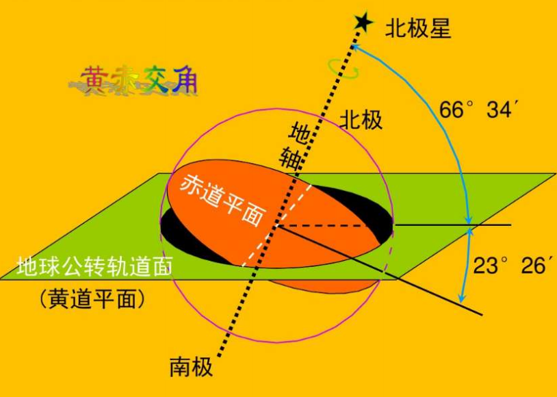
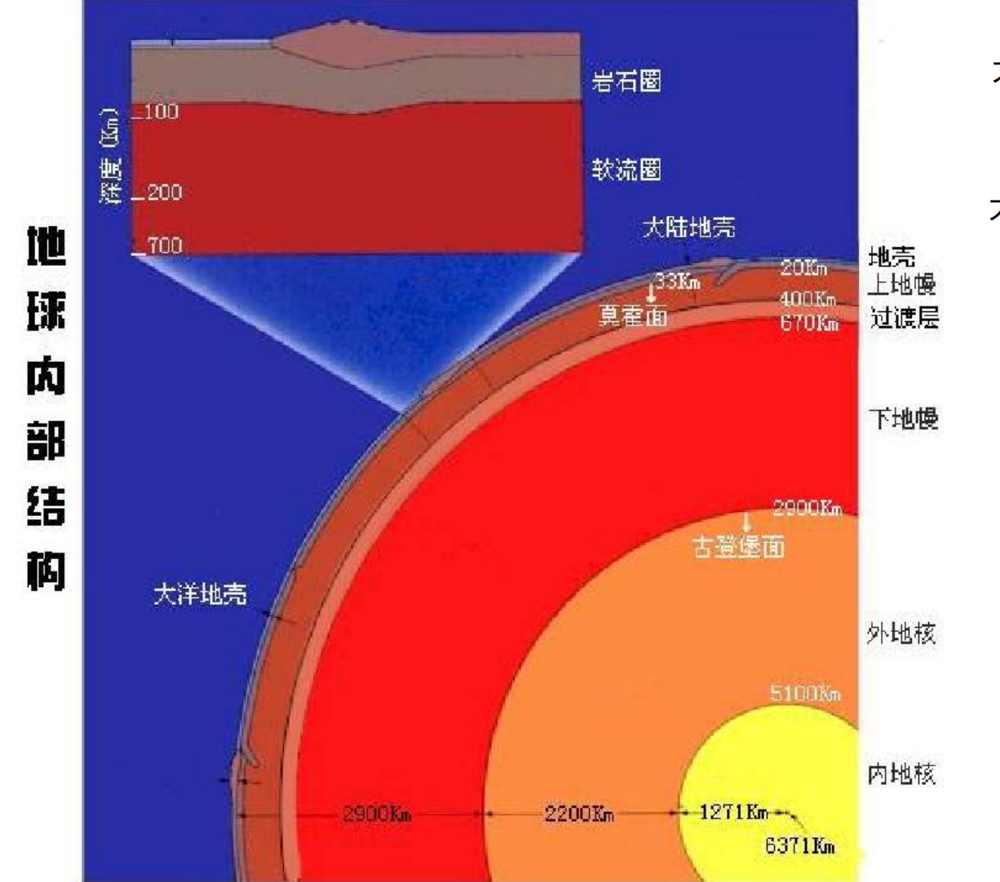

# 第一章 地球 地球环境 地球表层系统
>划重点
>✅地球表层系统的物质组成；✅地球表层系统的功能，结构，各圈层的功能（简要）;✅地球表层的基本特征;✅人类和地球表层环境的相互作用和影响；✅白道面，黄道面;✅近日点和远日点,✅一轴两面三角度;✅地球大小，形状，自转，✅公转的地理意义;✅科里奥利力;✅地球的圈层构造（简要）;✅地球表面的形态特征
## 地球在宇宙中的位置及其环境效益
### 太阳系中的地球及其环境效益
* 太阳对地球的贡献
  * **太阳能辐射**
  * 太阳粒子流（太阳风、磁暴、太阳黑子）
  * 太阳引力
  * **地球公转**
  * 公转轨道偏心率的变化
  * 岁差
* 地球的公转
  * 近日点：1.3左右
  * 远日点：7.4
* 地球的公转
  * ==一轴（地轴）两面（黄道面、赤道平面）三角度（66度34分、23度26分）==
  * 
  * ==地球公转的地理意义==
    * 正午太阳高度角的变化
    * 昼夜长短的变化
    * 四季和五带的形成
### 地月系中的地球及其环境效益
* 椭圆形，自西向东，==白道面==与黄道面的交角约为5度
* 周期为一个月
  * 朔望月：地心-日心连线，29日12时44分3秒
  * 恒星月：同一恒星方向，27日7时43分11.4秒
## 宇宙中的地球
### 日地距离、形状、大小及其环境效应
* 日地平均距离1.496 × 10⁸ 千米
==地球大小==
* 平均半径 6370km
* 总质量 5.98 × 10^27 g
### 地球的自转及其环境效应
15度/h
* ==地球自转的物理意义==
  * 昼夜更替、地表过程的昼夜节奏
  * 地方时不同，东早西晚
  * 产生自传偏向力-科氏力
  * 潮汐波
  * 地球局部运动的影响
* ==自转偏向力/科里奥利力==
  * D = 2vωsinA （v物体速度，ω地球自传加速度，A纬度）
  * 北半球偏右，南半球偏左
  * 影响：大气运动、洋流、热量和水分的全球平衡
### 地球的圈层结构
* 地球的内部圈层

大陆上地壳平均厚度：35km（上花岗岩类硅铝层，下部玄武岩类硅镁层）  
大洋上地壳平均厚度：8km（玄武岩类硅镁层）
* 地球的外部圈层
  * 大气圈
  * 水圈
  * 生物圈
### 地球表面的基本形态和特征
* 海陆分布
* ==地球的表面形态==
  * 地球表面起伏不平
  * 最高点珠穆朗玛峰8848.13m，最低点马里亚纳海沟11034m，地表最大垂直起伏约20km
  * 陆地平均高度875m，海洋平均深度3792m
  * 地表有二级面积较大、起伏较小的台阶，其一是海洋中深4000-5000m的大洋盆地，占地球总面积的22.6%，其二是大路上低于1000m的平原丘陵低山
  * 陆地可分为山地、平原、丘陵、高原、盆地
  * 海底可分为大陆边缘、大洋盆地、大洋中脊

## 地球表层系统
* 地球表层系统的三大界：人文界、有机界、无机界
* 地球表层系统的三态物质组成
* 地球表层环境的圈层结构、地球表层环境的自然地理系统
  * **岩石地形复合体**是自然地理系统的基本组成部分。（下界）
  * **大气**是自然地理系统的活跃部分。（上届）
    * C、H、O、N的物质循环
    * 物质和能量的载体
  * **水分**是自然地理系统其联系作用的组成部分
  * **土壤**是无机界与有机界物质和能量转化的关键环节
  * 自然地理系统的核心-**生物** 
* 地球表层环境的结构特征
  * 垂直分层
    * 从地核、地幔、地壳到水圈、大气圈等，大气圈又可分为对流层、中间层、暖层和散逸层
  * 水平分异
  * 立体交叉
    * 岩石圈、水圈等不是绝然分开，而是相互交叉、相互渗透，在空间上构成了一个立体交叉的结构
  * 多级嵌套
* 地球表层环境的功能
  * 物质传输、能量流动、信息传递；自我调节；支持生命；生命
* ==人类和地球表层环境的相互作用和影响==
  * 地球表层对人类：
    * 地球表层环境的演化与人类的诞生
    * 地球表层环境的区域分异与三大人种的形成
    * 地球表层环境对人口分布的影响
    * 地球表层元素组成与人体健康
    * 自然灾害对人类的影响
    * 地球表层环境对社会发展的影响
  * 人类对地球表层环境的作用与影响
    * 改变了地表物质循环
    * 改变了地表环境能量平衡
    * 对环境的污染与破坏
    * 改变了地表环境演化的方向和速率
    * 改变了地表环境的结构
    * 对自然资源的消耗
* ==地球表层环境的基本特征==
  * 太阳辐射集中分布于地表，太阳能的转化亦主要在地表进行
  * 固态、液态、气态物质同时并存于地表，使海洋表面成为液-气界面，海底成为液-固界面，使沿岸地带成为三相界面
  * 地球表面具有其特有的，由其本身发展形成的物质和现象，如生物、风化壳、土壤层等
  * 相互渗透的地表各圈层之间，进行着复杂的物质、能量交换和循环，并且在交换和循环中伴随着信息的传输
  * 地球表面存在着复杂的内部分异
  * 地球表面是人类社会发生、发展的环境，是人类活动的基本场所