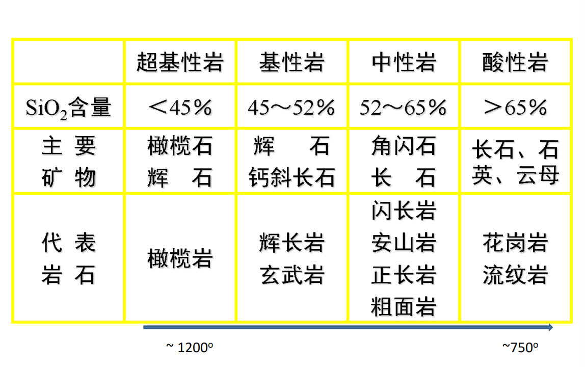
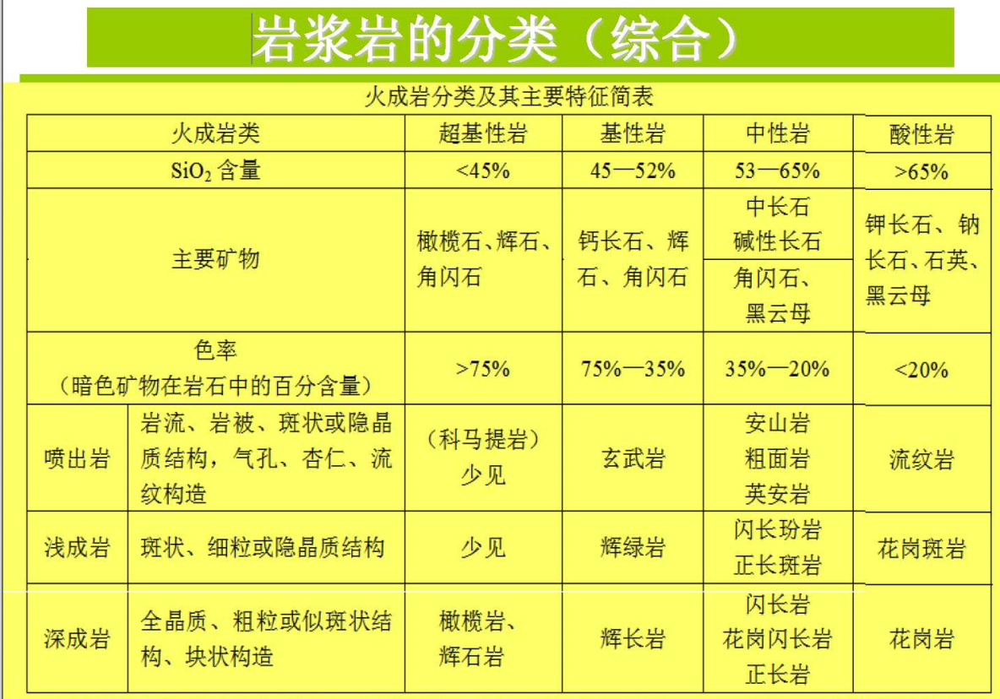
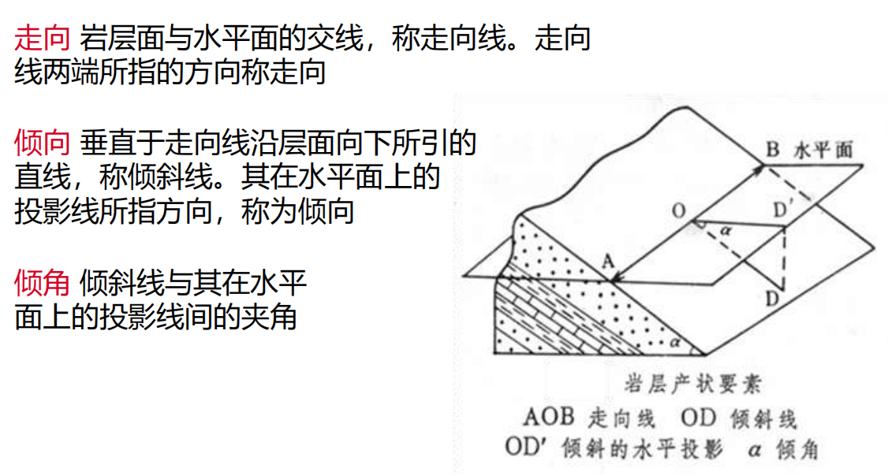
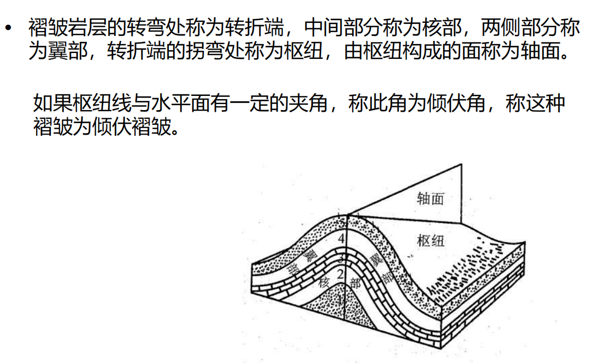
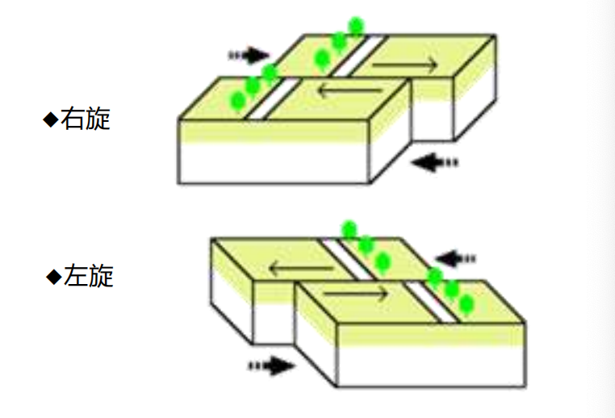
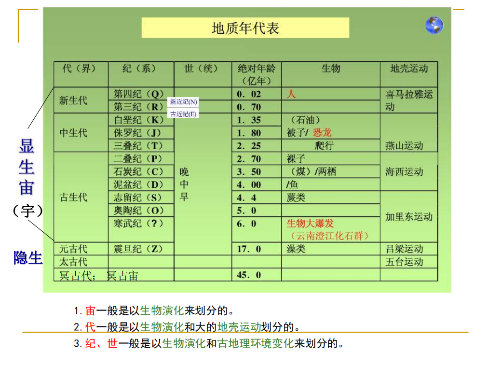
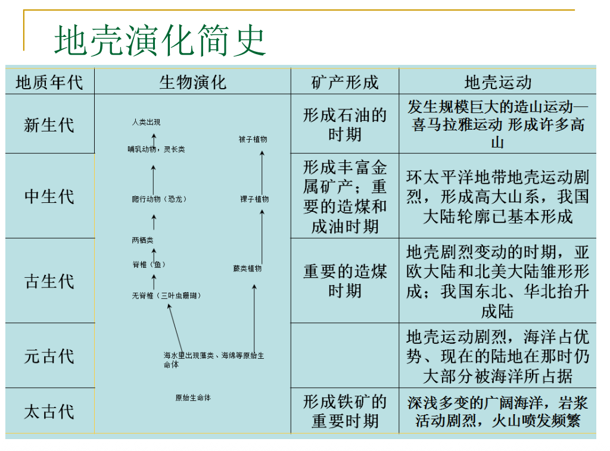

# 第二章 地壳
> ✅矿物和岩石的概念；✅解理和断口；岩浆岩，沉积岩，变质岩;✅岩浆岩的分类，岩浆作用;✅岩浆岩的结构和构造;✅沉积岩的类型;✅变质作用;✅构造运动的基本方式;✅岩相和地层接触关系;✅海侵层位，海退层位，沉积旋回;主要地质构造类型。✅应力类型。;✅岩层产状要素;✅单斜,背斜，向斜，褶皱;✅节理，层面和断裂;✅断层类型及判断;✅板块构造学说，详述板块边界类型;✅威尔逊旋回;✅世界地震带分布;✅绝对年代和相对年代;✅地质年代表
## 地壳的组成部分
地壳-岩石圈主要有富含硅和铝的硅酸盐类岩石所组成
### 矿物
* ==矿物==：天然形成的单质或化合物，具有一定的化学成分和内部结构（固体），具有一定的物理、化学性质及外部形态。是组成岩石的基本单元。
* 矿物的形成方式：升华、结晶、凝固、重结晶
* 矿物的形态
  * 单体形态：
    * 一向：柱状、针状
    * 二向延伸：板状、片状
    * 三向等长：立方体，八面体
  * 集合体形态
* 矿物的光学性质
  * 颜色：取决于矿物的化学成分及其结构
    * 本色、外色、假色
  * 条痕：矿物新鲜粉末的颜色
  * 光泽：矿物表面对光线的反射性质而成。金属、半金属、非金属光泽、
  * 透明度：光线透过矿物多少的程度，分透明和不透明
* 矿物的力学性质
  * 硬度：指矿物抵抗外力刻划、压入、研磨的能力
  * ==解理与断口==
    * 解理：矿物手外力作用沿一定方向破裂并产生解理面的性质叫解理
    * 断口：矿物手外力作用不规则破裂并产生凹凸不平的形状叫断口
  * 韧性：矿物抵抗切割、锤击、弯曲、拉引等外力作用的能力
* 七种主要造岩矿物：钾长石、角闪石、斜长石、辉石、石英、橄榄石、韵母（都属于硅酸盐矿物）
  
### 岩石
* ==岩石==：由矿物颗粒与粒间充填物组成。
* 岩石的结构和构造
  * 结构：指岩石中矿物的结晶程度、颗粒大小、晶体形态、自形程度以及它们之间的相互关系（**微观层面**）
  * 构造：指岩石中不同矿物集合体之间或矿物集合体与其他组成部分之间的排列和充填方式等（**宏观层面**）
#### 岩浆岩（火成岩）
* ==岩浆岩==是由高温熔融的岩浆在地表或地下冷凝所形成的岩石，也称火成岩
* ==岩浆作用==：来自上地幔的岩浆岩岩石圈破裂带上升，经过冷凝、结晶而形成的岩石称为岩浆岩或火成岩
  * 侵入作用
  * 喷出作用（又称火山作用）
* ==岩浆岩的分类==
  * 按矿物组成分类
    
  * 按岩浆冷凝环境分类
    * 侵入岩
      * 深成岩：在地壳深处冷凝结晶而成
      * 浅成岩：在接近地表处冷凝结晶成
    * 喷出岩：喷出地表冷凝而成
* 岩浆岩的结构
  * 显晶质构造、隐晶质构造（主要根据颗粒直径的大小区分）
  * 花岗岩-中粒结构；花岗伟晶岩-巨晶结构；细晶岩-细晶结构
* 花岗岩的构造
  * 侵入岩：块状构造、带状构造、斑杂构造、球状构造、晶洞构造
  * 气孔构造、杏仁构造、枕状构造、绳状构造、流纹构造/假流纹构造、柱状节理构造、珍珠构造
* 

#### 沉积岩
* ==沉积岩==：沉积作用是地球表层地貌发育和与生命过程的产物，在相宜环境条件下的堆积过程。堆积物质的积累并经过一定的物理变化与化学变化之后称为坚硬的岩石，即沉积岩。
* 压固作用、胶结作用、重结晶作用、新矿物的生长
* 层状
* 沉积岩结构：
  * 碎屑结构：由岩石碎屑、矿物碎屑、火山碎屑、生物碎屑等构成，包括砾（>2mm）、砂（2-0.05mm）、粉砂（0.05-0.005mm）、泥（<0.005mm）
  * 非碎屑构造：化学沉积物和生物化学沉积物不具碎屑结构而分别具有岩浆岩的晶质结构以及生物挂价结构（ 生物架构结构？？？）
* ==沉积岩的主要类型==
  * 碎屑岩类
    * 砾岩和角砾岩
    * 砂岩
  * 粘土岩类
    * 泥岩、页岩
  * 生物化学岩类
    * 硅质岩、石灰岩、白云岩

#### 变质岩
* ==变质作用==因素
  * 温度：最主要、最活跃，使岩浆重结晶，产生新的高温变质矿物
  * 压力：包括静压力（上覆岩石荷重造成）和定向压力（构造运动或岩浆活动），高压使岩石中的矿物定向排列，产生片理构造，并形成比重大的新矿物
  * 化学性质活跃的气体和溶液
* ==变质作用==类型
  * 动力变质作用（构造运动所致）
    * 在地壳运动所产生的定向压力作用下，岩石发生变形、破碎乃至产生动力变质矿物。这种作用一方面可以产生片理化，另一方面将岩石压碎形成碎裂岩石
    * 构造角砾岩、碎裂岩、糜棱岩
  * 接触热变质作用（岩浆热力）
    * 以热力（温度）作用为主，岩浆侵入围岩时所散发的热能，使接触带附近围岩中的矿物发生重结晶、重组合，以及引起岩石结构、构造改变的一种作用
    * 斑点板岩、角岩、大理岩、石灰岩
  * 接触交代变质作用（和热变质作用相比多了物质交换）
    * 除受温度影响外，同时还有岩浆所析离出挥发分及热液对围岩发生交代的作用，使接触带附近的侵入体和围岩，在化学成分、矿物成分、结构和构造等方面都发生变化，称为接触交代变质作用
    * 矽卡岩
  * 区域变质作用（构造运动+岩浆活动）
    * 综合因素引起，变质程度深，多余地史上强烈的地壳运动和岩浆活动有密切关系
    * 板岩、千枚岩、片岩、片麻岩
  * 混合岩化作用或超变质作用
    * 在区域变质基础上，由于地壳内部热流升高，产生深部热液和局部重熔熔浆的渗进、交代、贯入与变质岩中形成混合岩
    * 混合花岗岩

## 构造运动与地质构造
* 构造运动：地球内部动力作用所引起的地壳结构改变和地壳内部物质变位的运动
* ==构造运动的基本方式==：
  * 水平运动（造山运动）
    * 指地壳物质大致平行于地球表面，沿着大地水准球面切线方向进行
  * 垂直运动（造陆运动）
    * 地壳物质沿着地球半径方向进行的缓慢升降运动
* 地质年代与构造运动
  
* 构造运动的岩相和地层接触关系
  * 岩相
    * 岩相：反映沉积环境的岩性、结构、化石及其组合特征叫岩相。沉积岩的岩相分为海相陆相过渡相
    * 岩相的变化一定程度上反映了沉积环境的变化，通过沉积环境的变化，在一定程度上可以反映构造运动的特征与性质
  * ==海侵层位和海退层位==
    * 海侵层位：地壳下降时，海水侵漫陆地。在垂直剖面上，自下而上沉积物颗粒由粗变细，由于海洋面积扩大，新形成的岩层分布面积大于老岩层面积，形成超覆盖
    >随着海水上涨，沉积环境从近岸高能（如滨海、河口） → 较远低能（如浅海、深水）逐渐推进。 
    * 海退层位：地壳上升，陆地面积扩大，海洋面积减少。垂直剖面，自下而上沉积物由细变粗，退覆现象
    * 沉积旋回：一套海侵层位和一套海退层位，即地壳经历一次下降和上升
  * ==地层的接触关系==
    * 整合接触：在地壳相对稳定的条件下，岩层沉积连续，且下老上新，没有岩层缺失
    * 不整合接触：地壳运动使沉积中断，形成时代不连续的岩层。
      * 平行不整合，角度不整合
    * 侵入接触
    * 侵入体的沉积接触

### 地质构造
* 地质构造：构造运动所造成的岩层的变形和变位
* ==应力类型==：挤压应力、拉张应力、剪切应力
* ==主要地质构造类型==
  * 水平构造
    * 总以厚层坚硬的岩石层作为顶盖或次级平台的台面，四周则被流水切割呈锯齿或花边状
  * 倾斜构造
    * ==产状==以走向、倾向、倾角来确定
    * 
    * 单斜岩层：倾斜方向一致、倾角相当的一系列岩层
  * ==褶皱构造==
    * 岩层在侧向应力作用下发生弯曲的现象。褶皱构造的基本单位是褶曲。褶曲是岩层的一个弯曲，两个过两个以上褶曲的组合称为褶皱
    * 代表塑性、韧性或流动变形，而不是弹性或断裂变形。在地壳深度高温高压条件下，应力作用缓慢
    * 背斜向斜
    * 褶曲的形态要素
      * 
    * 褶曲的分类
      * 按轴面产状
        * 直立褶皱（对称褶皱）
        * 倾斜褶皱（不对称褶皱）
        * 倒转褶皱
        * 平卧褶皱（横卧褶皱）
      * 按枢纽产状
        * 水平褶曲
        * 颠覆褶曲
  * ==节理和断裂==
    * ==断裂==：岩石因所受应力强度而发生破裂，使岩层连续性遭到破坏的现象称为断裂
    * 节理：虽破裂但破裂面两侧岩块未发生明显滑动者称为节理
    * 破裂又发生明显位移为断层
    * 是脆性变形，施加于岩石的力较快
  * ==断层的类型==
    * 正断层：上盘向下运动
    * 逆断层：上盘向上运动
      * 逆冲（掩）断层，断层面倾角小于45°
    * 走向滑动断层：断层两盘沿断层走向发生水平运动
      * 左旋（对面一盘向左）
      * 右旋（对面一盘向右）
      * 
    * 地垒地堑
## 大地构造学说
## 地壳的演变
不是哥们后面的ppt呢  

==板块构造学说，详述板块边界类型==：
**板块构造学说**：  
* 大陆漂移学说  
  * 古生代至中生代期间全球大陆曾经是一个超级大陆，这个大陆叫泛大陆。200Ma前， Pangaea大陆裂解成一个个小的块体，并漂移到现在的位置。
  * 证据：
    * 两个大陆在地理上的契合
    * 如果对某些大陆进行重建，可以找到年代相近的山地带
    * 化石、古生物学证据
    * 非洲和美洲的岩石可以很好地匹配
    * 冰川沉积
* 海底扩张说
  * 地幔物质对流迫使地球深部的物质沿洋中脊轴部涌出，并越过海底向外扩张，最后消失在大陆边缘的海沟中。
  * 证据
    * 海岭，大洋中脊，裂谷
    * 海沟，俯冲带
    * 底玄武岩及沉积物年龄
    * 海底存在着磁异常条带
    * 转换断层的发现
* 板块构造学说
  * 认为地球的岩石圈不是整体一块，而是被地壳的生长边界海岭和转换断层，以及地壳的消亡边界海沟和造山带、地缝合线等一些构造带，分割成许多构造单元，这些构造单元叫做板块。全球的岩石圈分为亚欧板块、非洲板块、美洲板块、太平洋板块、印度洋板块和南极洲板块，共六大板块。
  * 动力：地幔对流的驱动

**板块边界类型**：
1. 离散型板块边界：大西洋的海底扩张 太平洋的海底扩张 大陆裂谷
2. 汇聚型板块边界：洋壳-陆壳碰撞（秘鲁–智利海沟） 洋壳-洋壳碰撞（日本海沟） 陆壳-陆壳碰撞（阿尔卑斯-喜马拉雅造山带）
3. 转换断层型边界：转换断层——洋中脊错断（圣安德烈斯断层）

==威尔逊旋回==：  
胚胎期 幼年期 成年期 衰退期 结束期 遗迹期  
东非裂谷 红海 大西洋 太平洋 地中海 喜马拉雅   

==世界地震带分布==：  
环太平洋、地中海-喜马拉雅、大陆裂谷（海岭）  

火山：环太平洋、地中海、东非、大西洋海底隆起火山带  

### 一、地质年代的确定
地质年代——指地质体形成或者地质事件发生的时代  
1. ==相对年代==——根据生物的演化顺序和岩石的新老关系,确定地质体形成或地质事件发生的先后顺序。岩层
确定方法：  
* 地层层序律
  * 叠置原理（下老上新）
  * 原始水平原理：沉积岩层在沉积时呈水平状或近水平状
  * 原始侧向连续原理（沿水平方向逐渐消失或过渡到其他成份）
* 生物层序律
  * 化石
* 切割律
  * 不同时代的岩层或岩体常被侵入岩侵入穿插，就侵入岩与围岩相比，侵入者时代新，悲侵入者时代老  

2. ==绝对年代==——依据同位素年龄测定地质体形成或地质事件发生时距今多少年。
确定方法：放射性同位素  

### 二、==地质年代表==

### 三、地球演化简史
