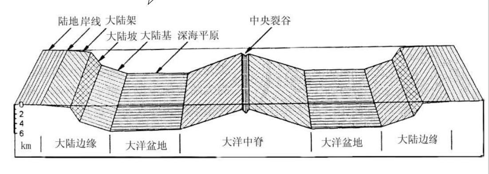
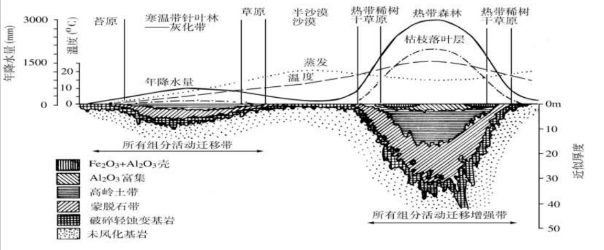
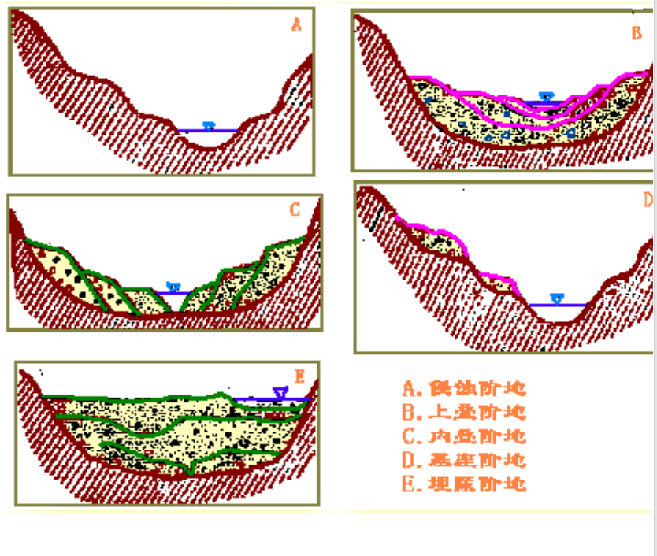

# 第五章 地貌
>✅地貌类型的划分;✅风化作用及其类型;🤡✅风化壳剖面的垂直分带。✅影响风化壳发育的因素;🤗✅块体运动包括哪些？;✅崩塌，滑坡，蠕动的特征和形成条件（理解）;✅地表流水的类型;✅流水作用的类型;✅侵蚀作用的类型;✅河流侵蚀基准面，河流均衡剖面;✅泥石流的特征和形成条件（理解）;✅河谷的形成和发展;🤗✅弯曲环流的侧向侵蚀及其形成的河床地貌;🤗✅牛轭湖的成因;✅河漫滩的二元相沉积结构;✅三角洲的形成条件;✅详述河流阶地的类型及其特征和形成过程;✅倒石堆、✅坡积裙、✅洪积扇、✅冲积扇、三角洲的特征及其形成条件（理解）;✅河流袭夺;✅戴维斯地貌旋回（或循环）学说（简要）;✅喀斯特作用;✅岩溶地貌发育条件;✅冰川，雪线;✅冰川运动的原因，特征;✅冰川的侵蚀作用和主要冰川侵蚀地貌;✅主要冰川堆积地貌;✅冰川对地理环境的影响;✅冻土的概念和分类（理解）;✅风蚀作用和风的搬运作用;✅新月型沙丘的形成;✅主要海蚀地貌和海积地貌;❌流水地貌、冰川地貌和风成地貌的特征及其形成的动力特点;❌地形对气候、植物和土壤的影响作用（理解）

🤡🤡🤡夷平面是什么
## 地貌成因和地貌类型
### 地貌成因
* 构造运动与地貌发育
* 地貌形成的气候因素
* 岩性对地貌形成的影响
* 生物对地貌形成的影响
* 人类活动对地貌的影响

### ==地貌类型的划分==

### 地貌在地理环境中的作用
* 导致地表热量的重新分配和温度分布状况复杂化
* 改变降水量分布格局
* 地貌对生物界的影响
* 地貌对自然界地域分异的影响
* 地貌对土地类型分化的影响

## 构造地貌
### 地壳变动的原因
* 内动力地质作用：由地球内部能量（放射能、化学能、地球旋转能、重力能等）引起的地质过程，称为内动力地质作用。包括：岩浆活动、变质作用、地震和地壳运动等
* 地壳均衡

### 构造地貌的类型
* 按尺度大小
  * 形体构造地貌(大陆与海洋)
  * 大地构造地貌
  * 局地构造地貌

### 一、大陆与海洋
* 陆壳与洋壳的差异
  * 陆壳25-70km（35km）Si、Al花岗岩层
  * 洋壳5-15km（8km）Si、Mg玄武岩层
* 海陆分异的原因
  * 固体地球的圈层结构
  * 陆壳与洋壳的差异
  * 地壳均衡

### 二、大地构造地貌
* 海洋巨地貌
  * 大洋中脊
  * 大洋盆地与海底火山
  * 沟—弧地貌
* 大陆边缘巨地貌
  * 沟-弧-盆大陆边缘
  * 安第斯山型大陆边缘
  * 不活动大陆边缘
* 陆地巨地貌
  * 平原与高原
  * 构造山系
  * 大陆裂谷
  * 陆地转换断层
* 陆地巨地貌

### 海底地形特征

* 大陆边缘
  * 大陆架：海与陆地接壤的浅海平台。由海岸线向外海延伸至海底坡度显著增大的转折处。大陆架部分的海底坡度平缓，一般<0.3度，平均约0.1度，水深<200m，最深可达550m，平均为130m。
  * 大陆坡：大陆架外侧坡度明显变陡的部分。平均坡度4.3度，最大坡度可达20度以上；水深一般200-2000m；平均宽度为20-40km；大陆坡上常发育有海底峡谷，峡谷的下切深度可以达数百米乃至千米以上，两壁陡峭，有些海底峡谷可切过整个大陆架与现代大河河口相接
  * 大陆基：大陆坡与大洋盆地之间的缓倾斜坡地。坡度5-35分，水深2000-4000m，展布宽度可达1000km。大陆基主要分布于大西洋和印度洋边缘，在海沟发育的太平洋边缘不发育。
  * 岛弧与海沟：岛弧是大洋边缘延伸距离很长、呈弧形展布的岛群；海沟是大洋边缘的巨型带状深渊，其长度常达1000km以上，宽度近100km，深度多在6000m以上。

### 两类大陆边缘巨地貌
* 活动大陆边缘（板块边界、强烈构造活动）
  * 沟-弧-盆（东亚型）大陆边缘
  * 安第斯山型大陆边缘
* 不活动大陆边缘（非板块边界）

### 三、局地构造地貌
* 褶曲地貌
* 断层地貌
  * 断层崖
  * 断层梯形面与断层三角面
  * 断层线崖
  * 断层谷
  * 断块山地与断陷谷（盆地）
* 火山地貌
* 岩性构造地貌

## 坡地地貌/风化作用与坡地重力地貌
### 风化作用
* ==风化作用==
  * 风化指十分接近地表的或直接暴露于地面的岩石，处于新的地球表层岩石圈与大气圈、水圈、生物圈发生物质与能量交换的环境，所发生的种种物理和化学变化
  * 物理风化：岩石与矿物的体积增大、机械破裂与酥松崩解等物理变化
    * 接近或暴露地面的岩石，减荷破裂（减荷节理）
    * 内侧进行球状风化
  * 化学风化：一系列的化学反应，某些成分的丢失与新生物质成分的产生的化学变化
  * 生物风化：生物物理、生物化学
* 风化速度
#### 风化作用的产物
* ==风化壳==：岩石在长期的风化过程中，一些不稳定的矿物遭到分解，其中可溶性部分被水流失，难溶部分残留在原地，这些残留在原地的物质即是风化壳或称残积物。由于残积物未经过搬运，残积物中碎屑棱角明显，大小不一，也无层理。由地表向下粒度逐渐变粗而过渡为基岩。**风化壳**常分布在分水岭上火缓坡上，构成一个不连续的薄壳
  * 基本特征
    * 空间分布上呈不连续性，厚度差异大
    * 组成物质以粘土和碎屑为主
    * 结构疏松，表层分散性强，分解程度高，底层反之
    * 风化壳可分强度分化，中度分化和微分化三个层带
  * 面状、线状、囊状、复合型风化壳；微风化层-弱风化层-强分化层-全分化层
  * 
  * ==垂直分带==（学长的）
    * 发育和保存均较好的风化壳，可以划分强度风化、中度风化和微风化三个层带。
    * 以红色风化壳为例：强度风化带氧化作用强，代表性稳定矿物为铁铝氧化物，黏土矿物主要是高岭土，颜色棕红、有新生块体和铁质化现象。中度风化带位于强度风化带之下，水呈垂直运动，氧化及淋滤作用较弱，但水解作用强，为高岭土及过渡性黏土矿物组成的夹碎屑黏土层。微风化带接近母岩并为潜水层，水化和淋滤作用强，黏土矿物以水云母、绿泥石为主，本质上仍属疏松岩石。
  * ==影响风化壳发育的因素==
    * 气候条件
      * 极地和高山寒冷地区：岩屑型风化壳
      * 温带半干旱和沙漠地带：硅铝-氯化物-硫酸盐型风化壳
      * 温带草原气候：硅铝-碳酸盐型风化壳
      * 温带森林气候：硅铝-粘土型风化壳
      * 热带、亚热带湿热气候：砖红壤风化壳
    * 地貌条件
      * 地表起伏较大、新构造运动较强烈的山区及地势低洼的地方均不利于风化壳的发育。只有在准平原上、分水岭的俺不以及较平坦的地区才有可能发育成巨厚的残积型风化壳。高大山区会形成风化壳类型的垂直分带性。
    * 岩性和时间
      * 母岩的成分影响风化壳的发育 石灰岩>玄武岩>花岗岩>砂岩页岩
    * 风化壳的意义
      * 阐明地壳运动
      * 恢复古地理环境
      * 风化壳对找矿具有重要意义
      * 研究风化壳对工程建设也有重要
      * 对农业生产非常重要

#### 影响风化作用的因素
>没有

### 重力地貌
坡地上的风化碎屑或不稳定的岩体、土体，主要再重力作用下所形成的各种地貌形体  
#### ==崩塌==
* 形成条件
  * 地貌条件：在陡峻的斜坡地段
  * 地质条件：片理、劈理、岩层倾向和坡向相一致的变质岩在它们的倾向和坡向一直的情况下容易发生崩塌；垂直节理发育的黄土；构造运动强烈、地层挤压破碎、地震频繁的区域也容易发生崩塌
  * 气候条件：降水或地下水；物理风化
  * 触发因素：崩塌的发生往往与暴雨、地震、人工过分开发等事件有关
  * 发生崩塌的条件首先是斜坡过陡，超过坡地物质的自然休止角，并导致大岩块的张裂。
* 特征
  * 速度快
  * 规模差异大
  * 崩塌下落后，崩塌体各部分相对位置完全打乱，大小混杂，形成较大石块翻滚较远的倒石堆
* ==倒石堆==：崩塌的岩块碎屑在坡麓部位构成的堆积体称为倒石堆
  * 大小不一、棱角分明的碎石
  * 组成物质没有明显的排列层序
#### ==滑坡==
由岩石，土体或碎屑堆积物构成的山坡体在重力作用下沿软弱面发生整体滑落的过程
* 发生条件：重力引起的下滑力超过软弱面的抗滑力
* 发生因素：
  * 内在因素：地层岩性，地质构造，坡体结构和有效临空面等
  * 诱发因素：降水强度、地下水、地震、地表径流对坡麓的冲淘、坡面加积作用，以及人为的在坡地上蓄水灌溉、建房筑路时破坏坡地稳定性等
* 发生发展阶段：
  * 蠕动变形阶段
  * 剧烈滑动阶段
  * 停息阶段
#### ==蠕动==
坡面岩屑、土屑在重力作用下以极缓慢的速度移动
* 特征：
  * 速度慢
  * 产生蠕动的倾角一般小于该坡地物质的自然休止角，15~30最宜
* 原因：土层温度升降尤其是冻融交替、干湿变化

#### ==块体运动==
崩塌、滑坡、蠕动

## 流水地貌
### 流水作用
* ==地表流水的类型==
  * 坡面流水（暂时性）
  * 沟谷流水（暂时性）
  * 河流流水（经常性）
* ==流水作用的类型==
  * 侵蚀、搬运、沉积
* ==侵蚀作用==
  * 化学溶蚀
  * 机械侵蚀
    * 线状侵蚀
      * 下蚀：线状水流对河谷或沟谷底部进行的侵蚀，结果使河谷（沟谷）加深；下蚀在上游及山地区最强烈；
      * 侧蚀：水流对河谷或沟谷两坡进行的侵蚀，结果使河谷（沟谷）拓宽；侧蚀主要发生在河（沟）床凹岸
      * 溯源侵蚀：由于下蚀作用而使河流向源头方向不断加长。是引起河床纵剖面调整与变化的主要过程
    * 片状侵蚀
      * 片蚀
* ==河流均衡剖面==：河流处于平衡条件下的纵剖面。河流平衡是由河流溯源侵蚀作用实现的
* ==侵蚀基准面==：河流下切到某一水平面以后，逐步失去侵蚀能力，不能侵蚀到该面以下
  * 局部（地方性）侵蚀基准面
  * 终极侵蚀基准面：海平面
* ==河流袭夺==：相邻的两条河流水面比降与流速、流量有明显差别，有一条河的深切与溯源侵蚀强于另一调
* 搬运作用：流水将侵蚀下来的物质向下游搬移的过程。推移、跃移、悬移、溶解质搬运。
* 堆积作用：由于流水搬运能力下降而造成泥沙堆积

### 坡面流水和沟谷流水地貌

#### 片流和片流地貌
片流（暂时性水流）  
片流携带的松散物质会在平缓低地或坡麓地带堆积下来，形成的松散堆积物，称为坡积物（talus）。围绕坡麓分布的一系列坡积物貌似衣裙，称为==坡积裙==（talus fan）。  

#### 沟谷流水地貌
沟谷水流的特点  
* 流量变化极大，暴涨暴落
* 水流湍急，侵蚀力很强
* 含沙量大，可能形成泥石流
沟谷的发育与形态：细沟->切沟->冲沟->坳沟

#### ==扇形地==
沟谷暴流速大，挟带有大量碎屑物质，到了山前沟口，坡降骤减，流速降低，搬运能力降低，且暴流无地形约束，形成放射状散流，携带的碎屑物质便堆积下来，首先是粗大的物质堆积在扇顶，随之较细的物质堆积在扇缘，形成扇形地。
* ==冲积扇==：扇形面积较小，坡度较大，形态隆起似半椎体
* ==洪积扇==：扇形面积较大，坡度小，形态较扁平

#### ==泥石流==
含有大量泥沙石块等固体物质，突然爆发，历时短暂，来势凶猛，具有强大破坏力的特殊洪流  
* 形成条件
  * 突发性水流：暴雨、融雪或冰湖溃决
  * 大量碎屑物：崩塌、滑坡、断层破碎带的存在，提供碎屑物
  * 陡峭的地形：泥石流形成的沟谷比降为10-30%。
  * 人类活动

### 河流地貌
#### 河谷
由河流作用塑造而成的长条状凹地  
==形成和发展==：V型谷->河漫滩河谷->成型河谷  
#### 河床（==弯曲环流的侧向侵蚀及其形成的河床地貌==）
河谷中平水期水流所占据的谷底部分称为河床  
深槽：河床中水深较大的河槽部分；在弯曲流河床中分布于凹岸。  
浅滩：浅滩是深槽与深槽之间槽底较浅的部分，铺有沙质堆积  
边滩：凸岸的堆积  
心滩：展宽段河床中的堆积  
* 侧向侵蚀与河床地貌  
* ==牛轭湖的成因==
  在平原地区流淌的河流，河流弯曲的情况下，流水不断冲刷并侵蚀弯曲的河面，河流便会越来越弯曲，最后导致河流自然截弯取直，河水由取直部位径直流过，原来弯曲的河道慢慢废弃，形成的形似牛轭状的湖泊称为牛轭湖。

#### 河漫滩
指洪水期被淹没而平水期出露水面的谷底滩地。广阔的大型河漫滩被称为“泛滥平原”  
形成条件：河流的横向迁移和洪水漫堤的沉积作用  
发育：滨河床浅滩→雏形河漫滩→河漫滩  
==河漫滩的二元相沉积结构==：河漫滩的上部由洪水泛滥时沉积下来的细粒物质组成，下部由河床侧向移动过程中沉积下来的粗粒物质组成  

#### 河流阶地
是河谷中沿河分布的、由河流的侵蚀和堆积作用形成的、不再被洪水淹没的阶梯状台地  
==形成过程==：地壳上升、气候变化或者基准面的变化  
地壳升降运动：当地壳相对稳定或下降时，河流以侧向侵蚀作用为主，此时塑造出河漫滩；然后地壳上升，河床纵比降增加，水流转而下切，于是原来的河漫滩成了河谷两侧阶地。如果地壳多次间歇性上升，则可形成几级阶地。  
* 河流阶地的形体要素
  * 按地形单元划分为：阶地面、阶地陡坎、阶地前缘和阶地后缘
  * 阶地高度从河床水面起算
  * 阶地宽度指阶地前缘到阶地后缘间的距离
  * 阶地指数从下往上依次排列
* ==阶地的类型==
  * 
  * 侵蚀阶地：完全由基岩组成的阶地
  * 堆积阶地：完全由河流沉积物组成
    * 上迭阶地
    * 内迭阶地
    * 埋藏阶地
  * 基座阶地：下部为基岩上部为河流沉积物

#### 三角洲
河流注入海洋或湖泊而在河口区形成的堆积平原称为三角洲。
* 三角洲沉积分布
  * 三角洲平原相：陆上部分，河流作用为主，沉积物具有陆向特征。其中由浅滩相、心滩相、河漫滩相、河床相和沼泽相等。沉积物下粗上细，粉砂为主
  * 三角洲前缘相：水下斜坡部分，河海作用相当的环境下堆积的，颗粒稍粗
  * 前三角洲项：波基面以下，海相沉积物为主，沉积物最细，主要是粘土及淤泥，富含有机质淤泥及海相生物化石，具有水平层理
* ==三角洲形成条件==
  * 河流作用减弱
  * 丰富的沉积物来源
  * 海洋作用力弱
  * 构造稳定或稍有下沉的宽浅海滨区
  * 河口区的堆积作用超过侵蚀作用而形成
* 类型
  * 河流型
  * 波浪型
  * 潮汐型

#### ==戴维斯：地貌循环（旋回）学说==
地貌发育过程（时间）可以分为幼年期、壮年期与老年期等几个地貌发育阶段。每一轮回即从构造抬升到再次达到老年晚期，全区呈现和缓波起伏准平原状态，大约需要几百万年到几千万年之久。
## 岩溶地貌
* ==喀斯特作用==：
  * 地表水和地下水对可溶性岩石的破坏和改造作用称为喀斯特作用，即水对可溶性岩石的溶蚀、冲蚀、堆积，以及重力崩塌的总称。以化学溶蚀作用为主，机械侵蚀作用为辅
* ==喀斯特作用的条件==
  * 岩石因素
    * 岩石的可溶性-碳酸盐类、硫酸盐类、卤盐类
    * 岩石的透水性
  * 水动力条件
  * 气候因素
    * 降水量
    * 温度-温度越高水中二氧化碳越少，但温度能加速水分子的解离度，促使水中氢离子增多，溶蚀力增大
    * 气压-气压越高水中二氧化碳含量越高

## 冰川地貌
==冰川==：在重力和压力的影响下由雪源地向外缓慢移动着的冰体  
==雪线==：冰川累积区和消融区的界线  
### 冰川的形成、运动和类型
#### 冰川运动=可塑带的流动+底部的滑动
* ==原因==：重力和压力
  * 冰体在压力下呈塑性，高山冰川主要靠重力往下流，两级冰川主要靠压力，往外流
  * 速度：缓慢而不均匀的运动速度，为层流。

### 冰川作用及冰川地貌
#### ==冰川侵蚀作用及侵蚀地貌==
* 挖掘作用：压力及冰劈作用，，，地科导好像叫拔蚀
* 磨蚀作用：岩屑与底床的挫磨
* 冰川侵蚀地貌
  * 冰斗、刃脊、角峰
  * 冰川谷
    * 冰蚀谷（U形谷）
    * 串珠湖
    * 悬谷
  * 冰川磨光面和冰川擦痕
  * 羊背石-指示冰川运动的方向

#### 冰川的搬运作用
* 冰川搬运的特征
  * 均为碎屑物
  * 为层流
  * 搬运过程中不磨圆
* 冰川搬运物-运动冰碛

#### 冰川的堆积作用
* 搬运作用的原因：融化、被搬运物增加
* 冰川堆积物（冰碛物）的特征
  * 皆为碎屑物
  * 大小混杂，明显缺乏分选
  * 无定向排列
  * 无层理
  * 无磨圆
  * 表面磨光面和擦痕
  * 具漂砾
* ==冰川堆积地貌==
  * 冰碛丘陵
  * 侧碛堤
  * 终碛堤
  * 鼓丘-由基岩核心和冰砾泥组成的一种小丘

### 冰水堆积地貌
* 冰前沉积
  * 冰水扇和冰水冲积平原
    * 冰水扇：冰下河流携带大量泥沙从冰舌末端排出，在哦ing院上展开为辫状水系而形成的坡度较大的扇形地，称为冰水扇，在山谷中则形成冰水河谷沉积平原。
  * 冰湖沉积
* 冰川接触沉积
  * 冰阜阶地
    * 冰川两侧靠岩壁因吸热融化而冰面比较低，汇集冰融水而成为冰面边侧的河，并汇集部分冰碛物，在冰川融化后沉落于冰川谷底的边侧成为冰砾阜阶地。
    * 
    * 锅穴是冰水平原上由于埋藏死冰块的融而产生的地面塌陷。
  * 蛇形丘
    * 冰川下部的冰融隧道中的流水沉积体，狭长曲折的高低，由砾石、粗砂构成，有一定的分选性和交错层理
> 侧碛堤和冰阜阶地有何区别？
> 侧碛堤是冰川沿山谷两侧推移或堆积形成的冰川堆积物堤状地貌，主要由冰川直接堆积的碎屑构成。侧碛堤是冰川沿山谷两侧推移或堆积形成的冰川堆积物堤状地貌，主要由冰川直接堆积的碎屑构成。

* ==冰川对地理环境的影响==
  * 冰川的侵蚀与堆积
  * 水系的改造
  * 大量湖泊的形成
  * 海平面下降
  * 岩石圈的等静压调整
  * 动植物种群的迁移与选择性灭绝

### 冰面地貌
冰川表面因受这周、断裂、冰床坡度变化、差别消融、流水侵蚀等影响而形成的地貌形态。主要有冰瀑、冰裂隙、冰川弧拱、冰面河、冰面湖、冰蘑菇、冰塔林等几类

### 冰缘地貌（冻土地貌）
* 冰缘作用：发生在冰缘环境下的侵蚀、搬运和堆积作用
* ==冻土==：处于0摄氏度以下含有冰的土层或岩石
  * 季节冻土和多年冻土（三年或三年以上）
  * 冻土的土层可分为上下两层，表层位夏融冬冻的活动层，下层位多年冻结层
  * 地下冰的存在是冻土最基本的特征
    * 埋藏冰（原生地表地下冰）：由地表冰埋藏形成
    * 洞脉冰（后生图中冰、次生冰）：地表水充填于冻土中的洞穴和裂隙后冻结形成
      * 脉冰为多边形脉冰
* 影响冻土发育的因素
  * 高度和维度
  * 气候
  * 植被和雪盖
  * 地形
  * 岩性
* 冻土地貌
  * 石河和石海
    * 石河及寒冻崩裂的大量岩块碎屑汇集于沟谷中，又在自身重力作用下，在下垫的细碎屑层或多年冰界面上顺沟整体运动
    * 石海：很冷风化作用下，岩石遭受崩解破坏，形成大片巨石角砾，就地堆积在平坦的地面上
  * 构造土：在冻土层表面，常出现碎石按几何图案做规则排列的现象，具有这种现象的冻土称为冰冻结构土
    * 形成：冰冻搅动所产生的分选结果-融冻分选：垂直分选和水平分选
      * 垂直分选实质是冻结提升作用
      * 水平分选的发生是由土体中物质粗细和含水量的差异引起
    * 石多边形：细粒土围的外围砾石，再低表上常排列成为多边形。最后趋向于形成石环
  * 冻胀丘和冰锥
    * 地下水受冻结地面和下部多年冻土层的遏阻，在薄弱地带冻结膨胀，使地表变形隆起，称为冻胀丘。冰锥是在寒冷季节流出封冻地表和冰面的地下水或河水冻结后形成的丘状隆起的冰体
  * 土溜阶坎
    * 融冻泥流在向下蠕动过程中产生的台阶状堆积地貌，阶地面平缓，略向下倾斜
  * 热融地貌
    * 永冻层上部的地下冰因融化引起地面塌陷而产生各种地貌
  * 

## 风沙与黄土地貌
### 风沙作用
风沙地貌在风力对地表物质的侵蚀、搬运和堆积过程中所形成的地貌  
风沙作用：风对地表细粒物质的作用  
#### ==风蚀作用==
* 吹蚀
* 磨蚀
风蚀地貌  
* 风棱石与石窝
* 风蚀柱与风蚀蘑菇
* 风蚀洼地与风蚀盆地
* 风蚀残丘与雅丹地貌

#### ==搬运作用==
悬移、跃移、蠕移
#### 风积作用
风积物的特点  
1. 碎屑性（<2mm）;
2. 分选良好（0.2~2mm之间，尤其在0.01~0.5mm）；
3. 很细的粉砂也具有较高的圆度，特别是0.5~1mm；
4. 以石英为主，含较多的铁、锰质和其他不稳定矿物；
5. 具有规模较大的层理；
6. 颜色多样，以红色调占优势；
7. 颗粒表面有许多凹坑，石英颗粒呈毛玻璃状。

风积地貌
* 横向沙丘-新月形沙丘-它是在风向较固定的风力作用下形成，形似新月，两翼顺主风向延伸，迎风坡凸且缓，背风坡位于两翼间，凹而陡。

==新月形沙丘的形成==：
1. 沙堆使近地面风速发生变化
2. 迎风坡受到风沙的冲击，并因上面风速增大而产生上举分力，背风坡产生涡流
3. 沙丘增高的同时，背风坡马蹄形洼地也增大
4. 形成典型的新月形沙丘

* 纵向沙丘
* 多风向沙丘

### 黄土地貌
黄土是由风力搬运堆积的一种灰黄色或棕黄色的特殊的土状堆积物
* 黄土剖面：
  * 质地均一、以粉沙为主
  * 结构松散，空隙比较发育，空隙度一般在40-55%之间
  * 富含碳酸钙，碳酸钙含量一般在10-16%
  * 无沉积层理，垂直层理发育
  * 具有湿陷性
* 黄土地貌
  * 沟谷地貌
  * 沟间地貌

## 海岸地貌
* ==海积地貌==
  * 毗岸地貌如海滩（包括泥滩）；
  * 接岸地貌如各种沙嘴等；
  * 封岸地貌如拦湾坝，连岛坝等；
  * 离岸地貌如离岸坝等。
* 海岸类型
  * 基岩海岸或岩石海岸
  * 沙质海岸
  * 淤泥质海岸

==主要海蚀地貌和海积地貌==：
1. 海蚀地貌：海水对于海岸的侵蚀作用叫做海岸侵蚀作用。  
* 海蚀地貌主要包括：海蚀崖；海蚀穴；海蚀平台；海蚀阶地；海蚀柱（海蚀崖后退过程中，一些岩石残留并突兀于海蚀平台之上，像一个岩柱，故称为海蚀柱）；海蚀拱桥（是波浪从两侧侵蚀岬角，在两侧都形成海蚀穴或海蚀洞，海蚀穴或海蚀洞贯通，便形成海蚀拱桥）。
2. 海积地貌：海积地貌：海积地貌是指主要由于堆积作用形成的海岸地貌。  
* 海积地貌主要包括泥沙横向运动形成的海积地貌和泥沙纵向运动形成的海积地貌。