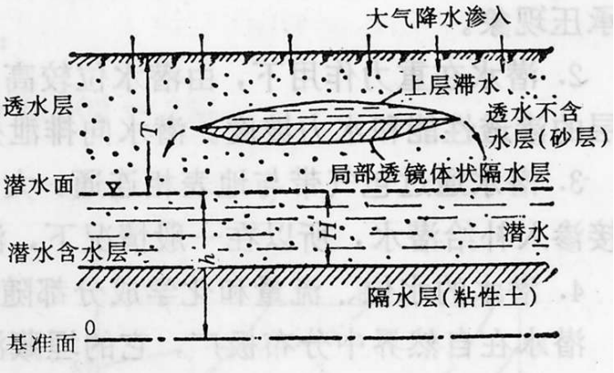

# 第四章 海洋与陆地水
>✅潮汐的成因;✅波基面，波浪的折射;✅洋流，风海流;✅洋流模式和世界洋流分布特点（简要）;✅水系和流域的概念;✅径流;✅河川径流形成阶段（理解）;✅河流根据其地理地质特点常分为五段，试述各段的特点;❌✅河流与自然地理环境之间的相互作用;✅湖泊：正温层，逆温层和同温层;✅夏季和冬季湖泊水体温度的垂直分布状况;✅沼泽形成的两种情况;✅地下水的基本类型及其名词解释;✅等水位线的解读;冰川对地理环境的影响;

## 地球水循环与水量平衡

### 水循环
* 定义：地球表面的水体在太阳辐射的作用下被蒸发上升至空中，被气流带动输送到各地，水汽在上升和输送过程中，遇冷凝结以降雨的形式回到地面或水体上，再以河流或地下水的形式汇入海洋
* 动力（外因）：太阳辐射和地球引力
* 内因：水的物理性质（三态变化） 重力
* 意义：对于地球水分和热量的再分配意义重大
* 四个阶段：蒸发、水汽输送、降水、径流

### 水量平衡
* 通式：I-Q=ds/dt
    收入项I，支出项Q 蓄水s
* 全球水量平衡方程
    * 海洋多年平均：P海+R=E海
    * 陆地多年平均：P陆-R=E陆
    * 全球：E陆=E海
    * 特征
        * 海陆降水量之和等于海陆蒸发量之和，说明全球水量保持平衡，基本上长期不变
        * 海洋蒸发量提供了海洋降水量的85%和陆地降水的89%，海洋是大气水分和陆地水的主要来源
        * 陆地降水量中只有11%来自陆地蒸发，说明大陆气团对陆地降水的作用远远不及海洋气团的作用
        * 海洋蒸发量大于降水量，陆地蒸发量小于降水量，海洋和陆地水最后通过径流达到平衡

## 海洋

### 海水的理化性质

* 海水的化学成分
    水96.5%，其他物质占3.5%
* 海水的盐度和氯度
    盐度：全部溶解固体/海水重量，每千克几克
* 海水的温度
  * 取决于热量收支状况（太阳辐射、地球内部热能释放、海面蒸发）明显的季节变化和日变化
  * 温度分布特征：
    * 垂直分布：从海面向海底呈不均匀递减，千米深度以下递减缓慢
    * 陆地
* 密度
* 颜色与透明度：取决于海水对阳光的吸收和反射状况

### 海水的运动
1. 潮汐和潮流
* ==潮汐==：月球和太阳的引力引起的海面周期性升降现象
* ==潮汐的成因==
  * 内因：海洋水体
  * 外因：天体引潮力（月球是太阳的2.17倍）
* 潮流：海水受月球和太阳引力而发生潮位升降的同时，还发生周期性的流动，就是潮流。也分为半日潮流、混合潮流和全日潮流三种。  潮流在一个周期内出现两次最大流速和最小流速。地形越狭窄，最大和最小流速的差值越大
2. 波浪
* 定义：海洋中的波浪是指海水质点以其原有平衡位置汐中心，在垂直方向上作周期性圆周运动的现象。
* 波浪包括波峰、波谷、波长、波高四个要素。
* ==波基面== ——1/2波长看成波浪作用的下限，该深度即为波（浪）基面
> 波基面是指波浪在水下所能影响的最大深度。它是根据波浪传播时的能量衰减规律定义的一个重要沉积学概念。
* 波浪剖面上的变形
* ==波浪的折射==
  * 由于波浪受海底摩擦力影响大小不一，使波向发生转折，最终波峰线基本与海岸线平行；当入射波浪不垂直海岸时，便可造成水体沿海岸流动，形成沿岸流
  * 岬角波能辐聚导致侵蚀，海湾波能辐散导致堆积
3. 洋流和水团运动
* 定义：==洋流==是指海洋中具有相对稳定的流速和流向的海水，从一个海区水平地或垂直地向另一个海区大规模的非周期性运动
* 动力：风力，地转偏向力，密度差异，地形，温度、
* 洋流的成因和分类
  * 按照成因分
    * 摩擦流（==风海流==）-盛行风长期作用于海面所形成的稳定的洋流
     Ekman螺旋：
    当风吹掠洋面时，风对海面就施加了一股顺风向的风应力，造成表层海水流动；  
    海水流动时产生科氏力，因此流向会偏向风向之右侧；  
    上层水流动时又会拖曳下方流体运动，而下层流向又再稍偏右；  
    如此一层牵引一层，水流流向由水面向下呈现螺线型态之旋转构造。  
    * 密度流-由于海水密度差异而引起的洋流，又称梯度流
    * 补充流-可以水平流动也可以垂直流
  * 根据温度的高低
    * 暖流
    * 寒流
* ==洋流模式和主要洋流==

  1. 基本状态：反气旋大洋环流，气旋型大洋环流，赤道环流，绕级环流，疾风漂流
  * 以南北回归线的副热带高压为中心形成的反气旋型大型洋流
  * 以北半球中高纬海上低压区为中心形成的气旋型大型洋流
  * 围绕赤道低压系统，南北半球的洋面流分别呈顺时针和反时针方向，形成两个赤道环流。
  * 南半球中高纬度为西风漂流。
  * 在南极大陆形成绕极环流。
  * 北印度洋形成季风环流。冬季北印度洋盛行东北季风，形成反时针方向的东北季风漂流;夏季，北印度洋盛行西南季风，形成顺时针方向的西南季风漂流。
  1. 西边界流
  * 特点：海水温暖、分布狭窄、快速强劲、沿着、大洋西岸
     * 湾流
     * 阿拉斯加暖流
     * 黑潮-沿台湾东岸向日本流动
  1. 东边界流-海水寒冷、分布广阔、速度柔弱、沿赤道向极地
  2. 环南极洋流
* 洋流对地理环境的影响
  * 调节全球热量平衡。全球的大洋环流，对高低维度间的热量输送和交换，调节全球的热量分布，有重要的意义
  * 洋流对气候的影响
    * 暖流：增温增湿
    * 寒流：降温减湿
  * 对海洋生物的影响
    * 寒暖流交汇北海、北海道、纽芬兰
    * 上升：秘鲁
  * 对海洋环境
    * 利：加速净化
    * 不利：扩大污染范围
  * 对航海：顺行快、逆行慢

### 海平面变动
* 七万年来的海平面变化：75-11kaBP的末次冰期海平面波动下降趋势明显，海平面最低位于-100~135m，是一次全球性海退
* 近百年的海平面变化：升高

### 海洋资源利用
* 海洋资源：与海洋本身有直接关系的物质和能量
* 海洋的地理环境意义
  * 海洋的星球，自然地理环境的基本要素
  * 生命的摇篮，海洋生态系统
  * 太阳能的接受者和储蓄者
  * 气温的调节者
  * 洋流对地理环境的影响

## 河流

### 河流、水系和流域
* 河流：地表水汇集、流动的谷地。经常性水流，有比较固定的流路
  * 河流等级：从河源算起为1级，1级汇入2级
  * 河流纵断面：指沿河流轴线的河底高程或水面高程的变化。
  * ==河流分段==-五段：河源、上游、中游、下游、河口
    * 河源：分水岭附近高山带，大河主河源冰川补给
    * 上游（V、比降大流速大、下切）：山区河流、山高谷深、比降大、流速快、水流暴涨暴落、河流势能主导、下切侵蚀强烈、河流泥沙主要生产与输出区
    * 中游（宽U、中中、侧蚀）：进入山前平原区，以一系列盆地、湖泊为特征，水能势能基本转换为动能、水量丰沛
    * 下游（宽浅U小小、堆积）：无大量支流汇入、虽然流量达到最大，但流速减缓，河流以预计作用为主，形成广阔中下游冲积平原
    * 河口：三角洲？
* ==水系==：河流的支流、干流组成的有序的河流网络系统
  * 水系类型：山区汇聚式，平原网格式
* ==流域==：每条河流和每一个水系从一定的陆地面积上获得补给，这部分陆地面积就是河流和水系的流域，也就是河流和水系在地面的集水区
  * 流域特征对河流的影响
    * 流域面积、流域形状、流域高度你、流域流向、河网密度

### 水情要素
* 水位
* 流速
* 流量
* 河流泥沙
* 水温与冰情

### 河川径流
* ==径流==：指大气降水到达陆地后，除了蒸发而余存在地表和地下，从高处向低处流动的水流。径流可分为地表径流和地下径流。/径流是在水文循环过程中，沿流域的不同路径向河流、湖泊、沼泽和海洋汇集的水流
* ==河川径流的形成阶段==
  * 流域蓄渗阶段（产流）：降水开始之后，地表径流产生之前的降水损失过程
    * 植物节流、下渗、填洼
  * 坡地漫流阶段（汇流）：降水产流后，水在重力作用下沿着坡地流动的过程（坡地汇流）
    * 片流、沟流、壤中流
  * 河网汇流阶段（汇流）：指坡地漫流到达河网后，沿着河网向下游干流出口断面汇集的过程（最终环节）
* 径流特征值
  * 径流量
  * 径流总量
  * 径流深度
  * 径流模数
* 径流的变化
  * 年内变化-汛期、枯水期、平水期
  * 年际变化
* 特征径流
  * 洪水
  * 枯水

### 河流的补给
* 雨水补给
* 季节性积雪融水补给
* 永久性积雪和冰川融水补给
* 湖泊水补给
* 地下水补给

### 河流的分类
原则：水源/径流量季节变化/河槽的稳定性/综合
==河流和地理环境的相互影响==
>妈的ppt上没有啊当作业了但是作业是不是也没讲哈哈哈哈还给我那么低的分哈哈呜呜呜呜呜呜呜呜
（学长的）  
（1）自然地理环境对河流：  
河流是所在流域内自然地理环境背景下的产物。  
河流的地理分布受气候的严格控制。河流是气候的镜子。  
除气候外，流域海拔高度、坡度和切割密度直接影响着径流汇聚条件，地表物质组成决定着径流下渗状况，植被则通过对降水的截留影响径流。  
（2）河流对自然地理环境：  
河流对地理环境也有显著的影响。  
河流是地球水分循环的一个重要的、不可或缺的环节。  
河流对流域气温具有调节作用。  
河流既是山地景观的创造者，又是大小冲积平原的奠基者，还是内陆和海洋盆地中盐类的积累者。  
荒漠地区大多数绿洲的形成与河流有密切的联系。  
河流对于人类社会的的发展也具有重要意义。  

## 湖泊和沼泽

### 湖泊
* 湖泊：湖盆、湖水、水中物质组合成的自然综合体。仅次于冰川的陆地表面第二水体
* 湖泊分类
  * 成因：构造湖、火口湖、堰塞湖、河成湖、风成湖、冰成湖、海成湖、溶蚀湖
  * 湖水补排情况：吞吐胡、闭口湖
  * 湖水与海洋沟通情况：外流湖、内陆湖
  * 矿化度：淡水湖、微咸水湖、咸水湖、盐水湖
  * 湖水营养物：贫营养湖、中营养湖、富营养湖
  * 存在时间：间歇湖、常年湖
#### 湖水的性质
* 温度
  * 热量平衡
    * 收入：太阳辐射热、水汽凝结热、有机物分解产生热、地表传导热
    * 支出：长波辐射、蒸发
  * 湖温的垂直分布
  * 
==湖泊：正温层、逆温层、同温层==：  

|类型|温度分布|出现季节|水体对流|特点|
|-------|--------|-------|---------|--------|
|正温层|上热下冷|夏季|局部对流，跃层阻隔|分层明显，底层易缺氧|
|逆温层|上冷下暖|冬季|几乎无对流|冰封，底层最稳定|
|同温层|温度一致|春秋|全湖混合|氧气与养分循环良好|

### 沼泽
==沼泽==：地表土壤层水分过饱和的地段  
* 特征：
  * 地表经常过湿或者有薄层积水
  * 其上生长湿生植物或沼生植物
  * 有或无泥炭积累，但有潜育层的存在
* ==沼泽的形成==
  * 条件：地势低平、排水不畅、蒸发量笑语降水量、地表组成物质粘重不易渗透。冷温、湿温
  * 形成原因
    * 水体沼泽化：海滨、湖泊、河流
      * 湖泊：湖水较浅湖泊、湖岸平缓、湖底由岸边向湖中心渐渐倾斜。随着湖水深度的不同而生长着不同的植物群；各植物带的植物死亡之后，其遗体得不到彻底分解而在湖底沉积下来，逐年累积，使湖泊变浅；加上机械沉积等作用，植物带也相应地向湖心侵移，植被带扩大，水体不断缩小，原为水生生态系统的区域为湿地植物所占据而湿地化；陆化的进一步发展，原来的湖面全部被沼泽植物所覆盖而形成沼泽湿地
      * 河流：常发生在水浅、流速小的河段，水生植物从岸边生长，形成泥炭堆积，最终导致河流沿岸沼泽化
    * 陆地沼泽化：森林、草甸、冻土
      * 森林：林区地势平坦、低洼、地下水位高、排水不良、水分汇聚的地方 ，地表过湿或积水，引起了湿生植物的不断侵入 ；由于土壤长期处于多水嫌气条件，死亡的植物残体难以分解，逐渐形成泥炭；泥炭保水，又增加了土壤的湿度，通气性差，使树木生长发育不良，并逐渐减少，森林则逐渐演替为沼泽。
      * 草甸：由于地势低洼，地表经常过湿，土壤孔隙度长被水填充，造成嫌气环境，并引起土层严重潜育化，死亡的植物残体，分解非常缓慢；这样在水分增加，养分减少的情况下，为植物的自然演替创造了有利条件，使一些草甸植物逐渐减少，喜湿植物，逐渐增多；这些植物死亡以后，在嫌气条件下，得不到彻底分解，逐渐形成泥炭，最后草甸演替成沼泽。
      * 冻土：在高纬和高山地区，冬季漫长且严寒，夏季短促且冷凉，广泛发育冻土 ；夏季气温回升，表层冻土融化，而下部多年冻土层却依然存在，形成良好的隔水层。同时受夏季大气降水，地表径流补给。地表水因受冻土层阻隔，不能垂向渗入地下，使地表长期积水或过湿导致沼泽湿地的形成和发育；同时，冻土区地温较低，有机残体分解缓慢，促进了沼泽化过程。另外，由于冻土的冻融作用在局部地区形成热融沉陷，为湿地形成提供了负地貌条件，这也是一种湿地的形成过程，如三江平原的许多洼地沼泽，就是在热融沉陷基础上所形成
  * 沼泽的水文特征
    * 水体流动非常缓慢
    * 径流极小。沼泽径流包括沼泽表面漫流和地下径流
    * 蒸发是沼泽水的主要损耗方式
  * 沼泽的分类
    * 高地沼泽
    * 过渡型沼泽
    * 低地沼泽
    * 近海沼泽
## 地下水
* 地壳从上到下分为变温带、常温带、增温带
* 矿化度：地下水中的离子、分子和微粒（不包括气体）的总韩都，表示水中含盐量的多少，以g/L表示
* 硬度：表示地下水中钙离子、镁离子含量的指标
  * 总硬度
  * 暂时硬度-沸腾后形成沉淀失去的
  * 永久硬度-沸腾后仍留在水中的
* 岩石的水理性质
  * 容水性：岩石容纳水的能力
  * 持水性：岩石保持水的能力（主要是不受重力支配的结合水和毛管水）
    * 岩石颗粒越小，总的表面积越大，持水度越大
  * 给水性：饱和岩石在重力作用下能自由排除一定水量的性能
    * 颗粒越粗，给水度越大
  * 透水性：岩石透过水的能力
* 地下水的赋存
* ==地下水的基本类型==（根据地下水的埋藏条件划分）
  * 
  * 
  * **包气带水**：潜水面以上未饱和的地下水。该带内存在大量气体，地表水经包气带向下渗透
    * 包括气态水、结合水、毛细管水、过路重力水、上层滞水
    * 上层滞水：指包气带中局部隔水层之上具有自由水面的重力水
      * 形成条件：包气带中有局部的隔水层；岩层的倾角不宜太大，分布范围不能太小
    * 特点：直接依靠大气降水和地表水的补给，受季节性变化；矿化度低，水质容易受到污染
  * **潜水**：位于第一个稳定隔水层以上具有自由表面的地下水，受重力作用，潜水发生横向流动/地面以下第一个稳定隔水层以上的饱和水，具有自由的表面，称为潜水面
    * 表示方法：剖面图、==等水位线图法==
    * 基本特点
      * 潜水面上一般无稳定隔水层，具有自由表面，有时有局部隔水层
      * 重力作用下潜水由水位高处流向水位低处
      * 潜水通过包气带与地表相通，潜水分布区与补给区一直
      * 水位、流量、化学成分随地区和时间的变化而变化
    * 潜水等水位线图：是由同一时间潜水位相同的各点连线而成
  * **承压水**：两个稳定隔水层之间的地下水，在承压区能打出自流井
    * 充满于上
    * 下两个稳定隔水层之间的含水层中的地下水，具有静水压力
    * 特点
      * 具有稳定隔水顶板和底板，没有自由水面，水体承受静水压力
      * 与外界联系较差，受气候因素影响小
      * 具有补给区、承压区、排泄区
    * 形成条件
      * 不透水层覆盖在透水性好的岩层上，并且透水层的下部有稳定的隔水底板
      * **地下书体充满整个含水层，否则是潜水**
      * 最适合的两种地质构造：承压向斜蓄水构造、承压单斜蓄水构造
  * 地下水的动态和运动
    * 动态
      * 地下水的循环、地下水均衡
      * 影响地下水动态的因素：气候、水文、地质、土壤和生物、人为因素
    * 运动
      * 重力水在岩土空隙中的运动，称为渗透或渗流，它的运动形式，常岁水流速度不同而分为层流运动和紊流运动
      * 地下水运动的基本规律
        * 直线渗透定律——达西Darcy定律
        * 非直线渗透定律

==等水位线的解读==：  
* 潜水等水位线图：是由同一时间潜水位相同的各点连线而成。
* 潜水与地表水相互关系的求取：
  * 决定流向
  * 计算水力坡度
  * 埋深
  * 取水位置（取水点在地下水流汇集的地方）
  * 推断含水层的岩性或厚度变化（透水性越好，等水位线越密；含水层厚度越大，等水位线越疏）
  * 确定地表水与地下水的补给关系
  * 确定泉水出漏点和沼泽化的范围（出现在潜水位和地形等高线相等处）
## 冰川
放在第五章地貌里面了。